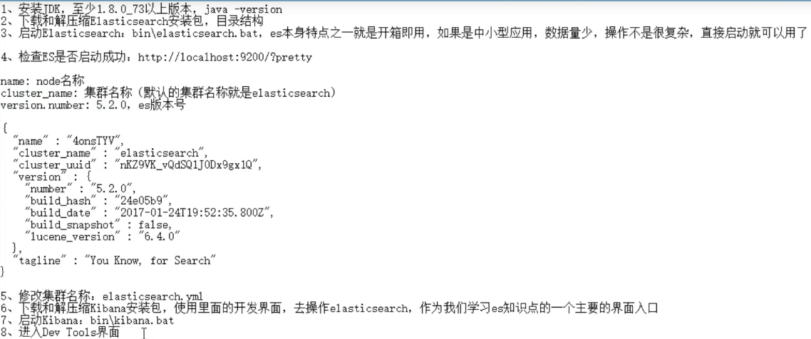

### 什么是 ElasticSearch?

分布式, 高性能, HA, scalable 的搜索和分析系统

**什么是搜索:**

1. 互联网站, 各种app里面的搜索.

2. IT系统的搜索, OA软件, 办公软件, 日程管理, 后台系统之类的搜索. 

**使用数据库搜索:**

1. 会遍历全部记录, 然后抓出来匹配. 

2. 文字匹配规则简单(like %xx%), 搜索不出同义的结果.

**什么是全文检索和Lucene:**

1. **倒排索引:**

   ```java
   1. 把每个记录拆成关键词list
   2. 把关键词拿出来, 组建索引, 索引的item指向包含关键词记录, 组成倒排索引. 搜索关键词就可以找到句子了, 不用去搜句子解析句子了.
   ```

2. **全文检索:**

   搜索关键词, 关键词是之前分析记录的倒排索引, 就是全文检索. 

3. **[Lucene](https://lucene.apache.org/):**

   是组建倒排索引和搜索的依赖框架. apache的

**EalsticSearch是什么:**

如果单台服务器不能管理的太多数据, ES就是一个封装了多台机器Lucene存储的框架. 保证了数据分发和副本.

1. 自动维护数据的分布和多个节点的索引, 还有请求的分发.
2. 维护数据副本
3. 提供了一些高级搜索的功能(聚合分析, 地理位置检索...)


### 03. ElasticSearch 介绍

**功能:**

1. 分布式: 将数据分散到Node上存储和检索. **近实时搜索.**
2. 搜索: 全文检索, 结构化搜索(比如商品分类搜索)
3. 数据分析: (例:分析每个商品分类下有多少相关商品)

**使用场景:**

1. 百科, GitHub, 代码搜索
2. 新闻网站, 论坛, 电商
3. 日志数据分析, ELK, 价格监控, BI商业分析系统. Kibana做数据可视化.

**ES特点:**

1. scalable: 可以大型分布式, 也可以单机
2. 技术整合: 圈粉检索, 数据分析, 分布式.
3. 开箱即用: 
4. 相对数据库, 搜索功能更多. 对于不需要事物(数据库强项)的, ES也挺好.


### 04. ElasticSearch 核心概念

**Lucene和ElasticSearch的前世今生:**

Lucene是现金功能强大的搜索库, 但API复杂开发难. 

ES基于lucene, 提供简单易用的API. 

**ES的核心概念:**

1. near realtime(NRT): 近实时, 有秒级的延迟. 

2. cluster: 集群, 多个节点

3. Node: 集群中一个节点, 随机分配名字. 直接启动一堆节点, 会组成一个elasticsearch集群, 新启动的节点也会去加入elasticsearch的集群.

4. document: 文档, es中最小的数据单元. 可以是一条任何的数据, 通常json格式. 每个index下的type可以存储多个ducoment.

5. index: 索引, 包含一堆相似结构的document, 比如: 有一个客户索引, 商品分类索引, 订单索引...

   索引有一个名字, 然后包含很多document. 

6. Type: 类型, 是索引的逻辑数据分类, 每个索引里可以有一个/n个type. 一个type下的documents, 有相同的field. ES8消失了.

7. shard: ES把一个索引中的数据切分成多个shard. 更容易横向扩展和更多的数据, 可以分发查询.

   有**primaryShard和replicaShard**, 分别做主从副本.  

**和数据库对比:**

document	行

type	表

index	库


### 05. 安装启动ES




### 06. 商品管理(1)

1. **document数据格式:** 

   面向document的搜索分析引擎. 

   ```java
   1. 应用系统的数据结构都是面向对象的;
   2. 对象结构存储在DB种, 拆分成扁平的多张表, 取出来放在对象里需要涉及多层嵌套. 
   3. ES面向document, document存储的json数据结构, 于面向对象的数据结构是一致的;
   ```

2. **商品管理案例背景:** 

   

3. **集群管理:** 

   ```java
   1. 快速检查集群健康, 通过catAPI.
       `/_cat/health?v`
   2. 状态颜色:
   	green: 每个索引的primaryShard和replicaShard都是active状态.
       yellow: 每个索引的primaryShard是active的, replicaShard不是active的.
       red: 不是所有的primaryShard都是active的. 部分索引有数据丢失. 
   3. 单台计算机的shard是yellow的:
   	一个ES进程是一个node, 默认的kibana内置的index存储, 分配5个primaryShard和5个replicaShard, 对应的shard不能放在同一个机器上. 所以只有一个primaryShard, 没有第二台放replicaShard. 只要启动第二个es进程添加一个node, 那个replicaShard就会存储到里面.
   
   4. 查询集群的索引: `/_cat/indexs?v`
   ```

   

4. **CRUD操作:** 

   **新增:** ES自动建立index和type, 默认对document每个field建里倒排索引.

   ```json
   # PUT /index/type/id
   {
       "name": "aaa",
       "desc": "a",
       "price": 100,
       "producer": "xxxx",
       "tags": ["a", "aa"]
   }    
   ```

   **查询:**

   ```json
   # GET /Index/type/id
   ```

   **修改:**

   ```json
   # PUT /index/type/id 替换, 需要把所有的field都带上.
   # POST /index/type/id/_update 更新文档, 只需要修改的field
   
   ```

   

### 07. 商品管理: 多种搜索方式

1. Query String Search:

   ```txt
   // 搜索全部商品: 
   GET /index/type/_search?field1=name:xxx&sort=yyy:desc
   Response:
   {
   	"took": 耗时,
   	timed_out: 是否超时.
   	_shards: 搜索请求, 会发送到所有的Shard(primary或者replicaShard)
   	hits.total: 命中的documents.
   	hits.max_score: 命中的document分数最高的一个. 越相关, 分数越高.
   	hits.hits: 匹配到的documents的详细数据. 
   }
   ```

   

2. query DSL: (DSL: Domain Specified Language 特定领域的语言)

   ```txt
   把查询的条件构成json, 放在http body里面. 
   1. 查询所有的商品:
   GET /index/type/_search
   {
   	"query":{
   		"match_all":{}
   	}
   }
   2. 查询名称包含xxx的商品按照yyy字段倒序:
   GET /index/type/_search
   {
   	"query":{
   		"match":{
   			"name":"xxx"
   		}
   	},
   	"sort": {
   		{"yyy": "desc"}
   	}
   }
   3. 分页查询
   GET /index/type/_search
   {
   	"query": {"match_all":{}},
   	"from": 1,
   	"size": 1
   }
   4. 指定查询的字段, 只查询xxx和yyy字段
   {
   	"query":{
   		"match_all":{}
   	},
   	"_source":["xxx", "yyy"]
   }
   ```

   

3. query filter: 过滤数据, bool字段封装多个查询条件

   ```txt
   1. 查询, name是xxx的, 价格字段大于25的document
   GET /index/type/_search
   {
   	"query":{
   		"bool":{
   			"must":{
   				"match":{
   					"name":"xxx"
   				}
   			},
   			"filter":{
   				"range": {
   					"price":{"gt", 25}
   				}
   			}
   		}
   	}
   }
   ```

   

4. full-text search: 全文检索.

   ```txt
   1. 全文搜索:
   name字段应该会被拆解成词, 然后建立倒排索引. 
   GET /index/type/_search
   {
   	"query": {
   		"match":{
   			"name": "xxx yyy"
   		}
   	}
   }
   ```

   

5. phrase search:短语搜索

   ```txt
   GET /index/type/_search
   {
   	"query": {
   		"match_phrase":{
   			"name": "xxx yyy" # 查询结果必须包含"xxx yyy"短语.
   		}
   	}
   }
   ```

   

6. highlight search:

   ```txt
   GET /index/type/_search
   {
   	"query": {
   		"match":{
   			"name": "xxx yyy"
   		}
   	},
   	"highlight": {
   		"fields": {
   			"name":{} # 把name字段都加亮
   		}
   	}
   }
   ```

   

### 08. 商品管理: _group by_ +  _avg_ + _sort_ 等聚合分析

```txt
// 1. 计算每个tag下面的商品数量.
GET /index/type/_search
{
	"aggs": {
		# 自己启一个agg的名字
		"group_by_tags":{
			"terms":{
				"field": "tags"
			}
		}
	}
}

// 2. 对搜索出来的商品聚合分析
GET /index/type/_search
{
	"query": {
		"match":{
			"name": "xxx"
		}
	},
	"aggs": {
		# 自己启一个agg的名字
		"group_by_tags":{
			"terms":{
				"field": "tags"
			}
		}
	}
}

// 3. 先分组, 再算每组的平均值, 计算每个tag下的商品平均线价格
GET /index/type/_search
{
	"size": 0,
	"aggs" {
		"group_by_tags": {
			"terms": {"field": "tags"},
			"aggs": {
				# 上面agg里面的agg.叫"avg_price", 使用"avg"方法
    			"avg_price": {
					"avg": {"field":"price"}
				}
			}
		}
	}
}

// 4. 在3基础上, 再加上按照平均价格进行倒序排序.
GET /index/type/_search
{
	"aggs":{
		"group_by_tags":{
			"terms":{
				"feild": "tags",
				"order": {"acg_price":"desc"}
			}, 
			"aggs": {
				# 这个agg叫平均价格, 做avg
				"acg_price": {
					"avg": {"field": "price"}
				}
			}
		}
	}
}

// 5. 按照指定的价格区间进行分组, 然后在组内按照tag进行分组, 最后计算每组的平均价格.
GET /index/type/_search
{
	"aggs"{
		"group_by_price" {
			"range": {
				"field": "price",
				"ranges": [
					{"from":0, "to": 20},
					{"from":20, "to": 40},
					{"from":40, "to": 60}
				]
			},
			"aggs": {
				"group_by_tags": {
					"terms":{"field": "tags"},
					"aggs":{
						"avg_price": {
							"feild":"price"
						}
					}
				}
			}
		}
	}
}
```


### 09. Elasticsearch 的基础分布式架构

1. ES 对复杂分布式机制的透明隐藏特性

   分布式机制: 

   1. 分片机制
   2. cluster discovery
   3. shard负载均衡
   4. shard副本
   5. 请求路由
   6. 集群扩容
   7. shard重分配

2. ES的垂直和水平扩容

   垂直扩容: 每台服务器扩容.

   水平扩容: 加服务器.

3. 节点调整时候的rebalance.

   尽量每次节点调整时候让shard平均分布.

4. master节点:

   管理es集群的元数据:索引创建和删除,...... 不成姐所有请求. 

5. 节点平等的分布式架构:

   1. 每个节点都可以接受请求
   2. 接受请求的节点, 把请求转发到存有对应shard的节点
   3. 接受请求的节点, 负责把最终的操作结果, 返回给客户端.

   

### 10. shard&replica机制树立, 单个node里面如何创建index

1. Shard&Repilica


