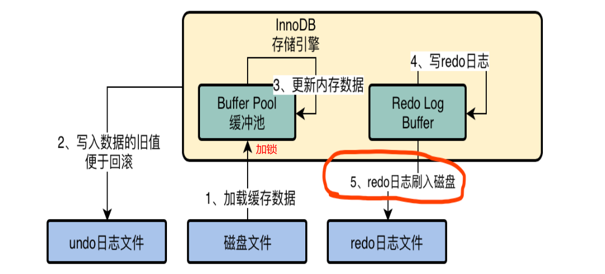
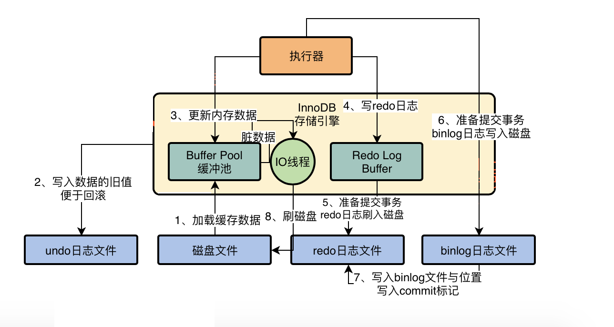

# MySQL 

> 新的篇章, 9月干完这个. 

## Week1: MySQL工作原理

### 1. 系统是怎么和MySQL打交道的

> 1. 程序使用连接池和MySQL驱动创建和维持数据库连接和MySQL交互.

> 2.  MySQL使用连接池维持和多个client的连接. 连接中也要做认证和权限校验.

### 2. MySQL的结构设计

1. 网络连接必须让线程来处理, 每个SQL请求在MySQL中的流程:

   **SQL接口负责同连接池里接受处理SQL -> Parser解析SQL -> Optimizer选择最好的执行条件生成执行计划 -> 执行器负责和存储引擎交互, 执行执行计划.** 

   

2. 思考题: 

   > 你怎么设计存储引擎分别涉及哪些情景? 
   >
   > 1. 按照存储地点: 磁盘, RAM, 分布式, 来分别保证可用性, 性能和数据可靠性.
   > 2. 处理请求的特点: 同步 和 异步来保证数据可靠性和性能.
   > 3. 管理数据的算法不同: index和tree这两种(想不太出其他的. 
   >
   > **不同的存储引擎有什么区别:** 
   >
   > 答: 主要区别是**数据的存储和管理方式不同**

### 03. 一条Update语句: InnoDB存储引擎设计

存储引擎在接口中介收到MySQL提交的执行计划之后: 就开始运行自己的内部了:

1. **BufferPool:** 

   update, 如果缓存里没有, 把磁盘中的数据拿到缓存里, 加上锁.  更新好, 然后变成脏数据, 会有IO线程随机刷到磁盘里的.

2. **undoLog: 事务内回滚:**

   **把update修改的记录的旧值存储到undo日志里**

3. **redoLogBuffer: ** 记录redoLog

   **事务提交刷磁盘策略: `innodb_flush_log_at_trx_commit`** 

   **0:不刷. 1: 每次都刷到磁盘. 2: 提交刷到OS Cache里.**

2. 思考题

   > 三种redo log刷盘策略应该选哪种?
   >
   > 1, 每次都刷. 事务一定要可靠啊.

### 04. 一条Update语句: binLog 是什么

1. **binLog和redoLog区别**
   - **redo log: 物理的重做日志: 记录数据页的操作. InnoDB特有的日志**
   - **binlog: 逻辑归档日志: 类似于sql记录(有三种). MySQL的日志文件**

2. **binLog的刷盘策略:`sync_binlog`**

   - 0: 默认: 事务提交写入OS Cache. 
   - 1: 强制刷入磁盘. 事务保证

3. **binLog + redoLog 完成更好的事务保证**

   存储引擎提交好redoLog之后, 执行器开始提交binlog写入磁盘. 

   **binlog写入好后, 把binlog文件地址写入redolog文件中. 然后redolog标记commit.**

   

4. **redolog中的commit标记的意义**

   **保证redolog和binlog一致.** 当即之后按照redolog进行恢复, 

   - 如果有commit标记说明执行器也执行完了事务, 完全一致. 
   - **没有标记位说明事务没有提交成功(mysql没有处理完, 只有引擎处理完了)**

5. **后台IO线程负责刷回buffer pool中脏数据(随机)**

   事务提交好了, 但此时磁盘里的脏数据由IO线程刷新. 

6. 总结InnoDB的运行原理:

   InnoDB主要包含: buffer pool, redologBuffer等缓存区域, 还有事务内的undolog, 还有自己的redoLog+MySQL系统binlog的事务保证日志. 

7. 思考:

   > **为什么事务内不修改数据到磁盘?**
   >
   > 因为缓存里面有了, 修改了数据. 然后日志里有了, 保证了DR. 如果再刷到磁盘里那就更耗费IO了. 
   >
   > **为什么不直接修改磁盘数据? 要引入buffer pool和redolog和undolog和脏数据概念?**
   >
   > 每个概念都有用. 合起来: buffer确保性能, log确保事务完整.

