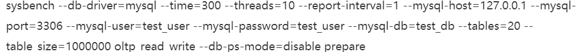

## Week2: 5-10: 生产经验

### 05. 真实环境的数据库配置

1. 数据库规划:

   了解了MySQL数据库工作原理, 还需要规划自己的数据库.  然后再压测, 然后部署监控, 然后再用.

2. **JAVA应用抗多少并发**

   一般是4C8G. 并行处理的线程100个一下吧. 看请求的处理速度. 一般1-10k.

3. **DB的机器配置**

   8C16G以上. 因为高性能的消耗CPU, RAM, 磁盘.

   8C16G: 一般1, 2K的并发请求没问题.

   16C32G: 2-4K并发请求没问题. 

   用SSD

4. **思考**

   > 4C8G上的Java引用, 每个请求10ms, 可以抗上千请求么? 上W呢?
   >
   > 上千没问题, 十几个线程同时就可以. 上W困难.
   >
   > 别人的: 理论上，通过增加线程数，内存读写，抗几千并发，甚至上万并发都是可以的。 但是，线程数越来越多之后，切换上下文很费CPU，QPS会下降，CPU负载也会变高，当请求源源不断进来的时候会导致挤压，进一步拖垮系统。


### 06. DB性能测试

1. 申请了机器要心中有数, DBA部署, 但自己也要知道数据库的性能,

2. **安装MySQL之后要压测**

3. **QPS和TPS区别**

   QPS: 数据库每秒处理请求数, 可以理解每秒处理多少SQL

   TPS: 每秒处理的事务量. 

4. **IO相关的压测指标**
   - **IOPS:** 随机IO并发处理能力. IO线程刷脏数据的时候依赖.
   - **吞吐量:** 磁盘每秒读写数据量. 普通磁盘每秒上百MB.
   - **Latency:** 写入磁盘一条数据的延迟. 执行SQL语句和提交事务的时候都需要顺序写redoLog磁盘文件. 写日志到磁盘里的延迟.

5. **其他性能指标:**
   - CPU负载
   - 网络负载
   - 内存负载.

6. **思考题**

   > QPS和TPS之前是怎么理解的? 现在怎么理解的?
   >
   > **如果负责一个交易系统, 涉及多个服务, 对于单个服务来说每秒处理请求是TPS还是QPS? 对于交易系统呢?**
   >
   > 谜底就在谜面上. 


### 07. 对数据库进行压测

> 1.  每个服务接受的并发请求是QPS还是TPS呢? 
>
>    是QPS: 每秒的并发请求是QPS. 
>
> 2. 对于多个服务组成的大型交易系统: QPS还是TPS?
>
>    这个是TPS的概念. 多个服务共同完成才算是十五完成. 

1. **数据库压测工具: sysbench**

   可以初始化DB数据, 然后模拟并发请求. 

2. 安装sysbench:

   使用curl和yum安装

3. **测试用例:**

   建立好测试库, 创建测试账号, 使用sysbench创建测试表(20个), 每个表100w数据, 10个并发线程模拟访问, 300s.

4. **基于sysbench构造测试表和测试数据**

   

   构建了数据库, 和测试的数据. 

5. **使用sysbench进行全方位测试:**

   1. 修改上面结尾的prepare为run就是运行`oltp_read_write`综合的读写性能
   2. 修改为`oltp_read_only`测试只读性能
   3. 修改为`oltp_delete`测试删除性能
   4. `oltp_update_index`测试更新索引字段的性能
   5. `oltp_update_non_index`测试非索引字段性能.
   6. `oltp_insert`插入性能
   7. `oltp_write_only`写入性能
   8. 把最后的`run` 修改成 `cleanup`, 清楚测试数据

6. **压测结果分析:**

   设置的internal是1s, 每秒都会输出测试性能.

   ```shell
   [22s] thds:10 #压测线程数 
   tps:380.99 #每秒TPS
   qps:7312.66 (r/w/o:5132.99/1155.86/1321.35) # 每秒QPS, 其中read/write和其他请求各占多少
   lat(ms,95%):21.33 # 95%的请求的延迟都在21.33ms内
   err/s:0.00 # 没有失败请求
   reconn/s:0.00 # 重连次数为0
   
   ```

   **压测完了还会显示一个总的压测报告**

7. 作业

   > 准备mysql服务器和sysbench工具, 压测一下.


### 08. 观察压测中的机器性能

除了QPS和TPS之类的请求处理参数指标, 还要观察机器性能. 在性能占用低的时候, 可以增加并发线程数, 榨干性能. 

1. 为什么性能监控很重要:

   如果达到xxxQPS后机器性能快爆表了, 说明这个指标在生产上靠不住.

2. **使用top命令监控CPU负载**

   ```shell
   top - 18:59:00 up 1:00:32, 1 user, load average: 0.12, 0.55, 0.01
   #       时间        启动时间, user数,  CPU在 1, 5, 15min内的负载情况.
   CPU负载如果达到1说明1个核心满负载可以处理当前任务. 
   ```

3. **使用top命令监控内存负载**

   top命令里有内存的占用情况. 

4. **使用dstat命令监控磁盘IO负载**

   ```shell
   -dsk/total-
   read writ
   103k 211k
   0    11k
   # 读IOPS和写的IOPS, 一般磁盘的IO极限每秒百MB吧.
   ```

5. **使用`dstat -n`命令监控网卡负载**

   ```shell
   -net/total-
   recv	send
   16k		17k
   # 网卡每秒接受发送的数据量. 千兆网卡的极限就是128MB嘛. 
   ```

6. **总结: 在合理的负载范围内, QPS提升到最大, 就是DB的合理最大QPS** 

7. **作业:**

   >  使用dstat和top监控压测时候的CPU内存和磁盘网关负载.


### 09. 数据库部署监控系统-Prometheus

1. **没有监控就是在裸奔**

   压测只能知道极限的性能, 如果不监控就不知道什么时候处于临界.

2. **Prometheus+Grafana**

   Prometheus是监控数据采集和存储的系统: 使用DB采集组件(mysql_exporter)采集监控数据. 放到时序数据库里.

   Grafana: 监控数据的可视化展示. 

3. **安装和启动Prometheus**

   安装MySQL, 安装下载[Prometheus ](http://cactifans.hi-www.com/prometheus/)安装包, 安装node_exporter来采集机器的运行数据. 

   还可以安装`mysqld_exporter`来采集MySQL数据库的metrics.

   配置好exporter的监控文件之后, 就可以启动Prometheus了.

   `prometheus --storage.tsdb.retention=30d &` 保留30天数据

4. 运行安装好了之后就可以访问9090端口看Prometheus的主页了.

### 10.  监控Metrics的可视化报表系统-Grafana

1. 部署Grafana

   下载包之后, 运行就好了. 默认端口是3000, admin-admin

   - 添加datasource: localhost:9090
   - 安装Grafana的仪表盘组件. 

2. 添加VM和MySQL的Metric exporter

   解压和启动node_exporter, mysqld_exporter. 然后编辑Prometheus的配置文件, 采集两个exporter的数据.

3. **作业:**

   安装两个.


