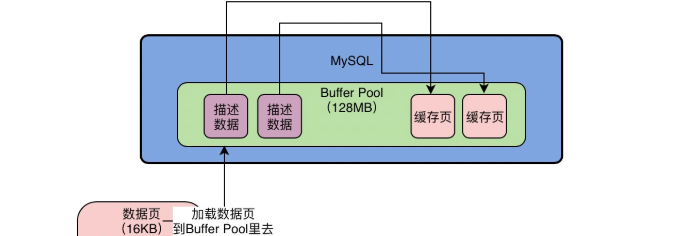
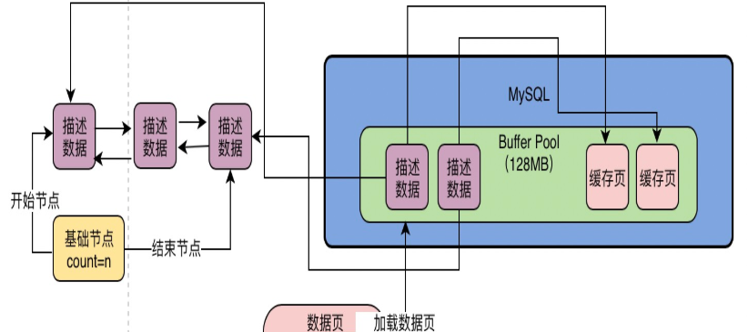
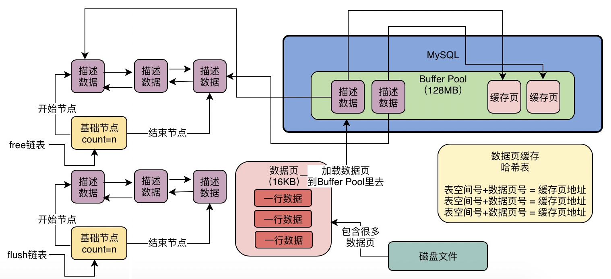
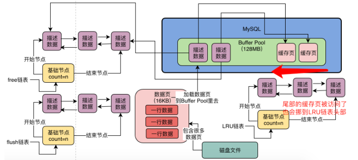
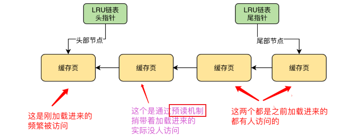
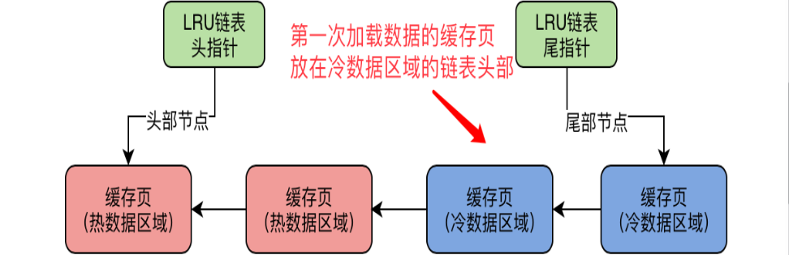
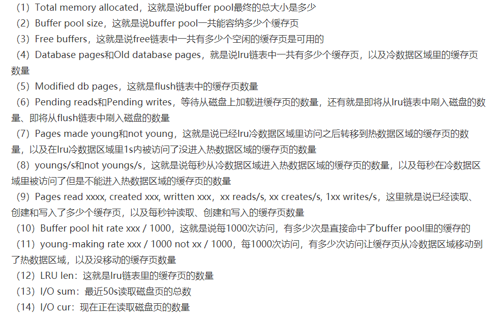

## Week3: Buffer Pool 讲解

DB肯定从插入数据开始. 然后CRUD. 在准备好压测过的, 有完整监控的DB之后开始.

### 11. 从增删改: 看Buffer Pool在数据库中的地位

1. Buffer Pool是什么

   **数据库执行CUD, 主要是对BufferPool里面的真实数据操作的**.  配合了之后的redoLog, 刷磁盘...

   

### 12. Buffer Pool 内存的数据结构

1. 配置Buffer Pool大小

   Buffer Pool是数据库的内存组件, **可以理解成一片内存数据结构**. 默认128MB. 偏小了, 32GB的机器可以分配2GB.  `[server] innodb_buffer_pool_size=2147483648` .

2. **数据页: MySQL中的数据单位**

   数据库的核心数据模型是`表-字段-行`的概念, MySQL的存储把数据抽象**数据页**概念, 存着多行数据. (大小16KB)

   - 如果要更新, DB会找到数据所在的数据页, 从磁盘里把数据页直接加载到Buffer Pool里

     

3. **磁盘上的数据页 对应到 Buffer Pool的缓存页**

   Buffer Pool中的数据页叫做缓存页, 缓存页和磁盘上的数据页对应, 16KB. 

4. **缓存页的描述信息**

   **每个缓存页, 都有一个描述信息**. 包括: 数据页所属的表空间, 数据页编号, 缓存页在bufferPool中的地址等等.  buffer Pool中设置128, 实际会超出一些(因为描述数据)

   每个缓存页的描述数据放在buffer Pool前面. 大概相当于缓存页的5%(800bytes左右)

   

5. **思考题:**

   > 如果Buffer pool用尽了, 那么Buffer pool有内存碎片么? 如何减少内存碎片?
   >
   > 答: 因为描述数据里面放着指针, 肯定会有一些缓存失效的成为碎片. 但是缓存页都是16KB, 也很好解决, 尽量分成16kb一块的数据就好了...感觉

### 13. Free链表: 数据页被读取到Buffer Pool

1. 数据库启动时候, **Buffer Pool的初始化**

   启动时候, **会按照Buffer Pool配置的内存大小申请内存区域, 然后按照默认的缓存页16KB, 描述数据800bytes, 在Buffer Pool中划分出一个个缓存页和对应的描述数据空间.**

2. **如何找到空闲的缓存页**

   **DB为Buffer Pool设计出Free双向链表存放空闲的描述数据块的地址**. Buffer Pool初始化之后描述数据块就都会放在Free链表里.

   

3. Free链表大小

   free链表本身就是buffer pool的描述数据块组成的. 可以认为描述数据块有两个指针, free_pre和free_next. 所以**free链表**不占太多空间(只是**占了一连串小指针**, 还有**基础节点(存放头尾节点地址还有一些基本信息)**).

4. **磁盘中的数据页怎样读到Buffer Pool的缓存页**
   - 从free链表拿一个描述数据块
   - 把数据也放到缓存页里, 补充好描述数据
   - 移除free链表里被占用的描述数据块

5. **如何判断一个数据页有没有对应的缓存页**

   数据库有一个Hash表结构, 表空间号+数据页号作为key, 缓存页的地址作为value. 只要查一下就可以看到有没有缓存

   

6. **思考题**

   > 取一个数据, 必先把把所在的数据页取出来, 数据也属于一个表空间内的. 我们写SQL是表+行, MySQL内部操作是表空间+数据页. 两者的区别和联系是什么?
   >
   > 答: 表和表空间都是指的一张表嘛, 空间更专注存储. 数据页是一个package, 行粒度最小.
   >
   > > **一个是逻辑关系, 一个是物理关系.** 

### 14. Flush链表: 更新Buffer Pool数据

1. 脏数据页理解

2. 哪些缓存页是脏数据页? flush链表

   引入了flush链表.  类似于free链表, 利用描述数据中两个指针组成双向链表. **所有的修改过的缓存页的描述数据块都会被加入到flush链表中**

   

### 15. LRU算法: Buffer Pool的缓存页不足, 淘汰部分页

1. **缓存命中率**

   多个缓存页, 多次查询用的上的缓存页 命中率高. 

2. LRU链表排序命中率低的缓存页

   **Least Recently Used.**

   - **每次从磁盘数据页加载到缓存页的时候, 就把缓存页的描述数据块放在LRU链表头部, 可以知道最近最少使用的缓存页在链表尾部.** 

   - **每次访问缓存页, 都把它挪在链表头部**

     

### 16. 简单LRU可能造成的的问题

1. MySQL的预读机制: 在从磁盘加载一个数据页, 会把邻近的数据页也加载到缓存页里. 

   此时这两个被迫加载的缓存页也在LRU链表前面. 

2. 什么情况触发预读机制:

   - (主要)`innodb_read_ahead_threshold` 默认56, 如果顺序的读了一个区里的n个数据页, 就会触发, 把下一个相邻区的所有数据页加载到缓存里
   - `innodb_random_read_ahead`如果buffer pool里缓存了一个区的13个连续的数据页, 且比较频繁访问, 就会触发, 把区里其他的数据页加载缓存页.

3. 另一种可能导致频繁被访问的缓存页被淘汰的场景

   **全表扫描:** select * from... 把表里所有的数据也都加载到缓存页里. 

4. 总结: 

   **如果不做处理, 简单实用LRU, 会因为预读机制和全表扫描失效.** 

   

5. 思考题

   > 1. MySQL为什么设计预读机制? 为什么要把相邻数据页加载到缓存? 什么样的场景遇到?
   >
   > 答: 我觉得用到的数据是热点数据, 旁边数据页里的数据是有可能用到的. 
   >
   > 应该还有锁的原因? 不过我不清楚. ---- 没有锁的原因

### 17. LRU算法优化: 冷热数据分离

1. **基于冷热数据分离思想设计的LRU链表**

   不是所有的缓存页都混在一个LRU链表里, 链表尾部是冷数据.  `innodb_old_blocks_pct`控制冷热比例(默认冷37%)

2. **数据页第一次被加载的时候**

   **数据页会的描述信息块被放在冷数据链表的头部**

   

3. **新加载的冷数据的缓存页`innodb_old_blocks_time`时间后被访问会被挪到热数据的头部.**

   (默认1000ms)

4. **思考题:** 

   > 数据也第一次被加载到缓存页里, 缓存页放在LRU链表的冷数据区头部. 那么冷热数据隔离的方案, LRU链表的冷数据区域放的都是什么样的缓存页?
   >
   > 都是不常用的啊?

### 18: 冷热分离后的LRU: 解决了预读机制带来的问题

1. 预读和全表扫的垃圾缓存页: 都放在了冷数据区.

   

2. **垃圾缓存页能进热数据区域么?**

   能啊. 1s之后再访问就进去了.

3. **free链表不够了, 从LRU的尾部清除淘汰缓存页**

4. **思考题:**

   > **对于缓存中同时放冷热数据的情况, 例如Redis中存放, 可能会有什么问题?**  如何在自己的缓存设计中使用冷热分离的思想?
   >
   > 答: 没有区分冷热数据. 我觉得现在只能用过期时间来防止冷数据过多的情况. 
   >
   >  todo?
   >
   > > 尽量让Redis里放的都是热数据, 可以统计商品的访问量, 然后定时任务预加载热门商品数据.

### 19. MySQL如何优化LRU链表的使用性能

1. LRU链表的热数据区域优化: 

   **热数据的前1/4的缓存页被访问, 不会挪动到链表头部**, 避免太频繁的移动

2. 思考题: 

   > 如果冷数据区尾巴上的缓存页(已经超过1s), 被访问了, 会放到冷数据区域链表的头部么?
   >
   > > 不是, 放到热数据区域头部.

### 20 如何淘汰LRU链表中尾部的缓存页, 刷入磁盘的?

在缓存页满的时候, 要把缓存页刷回磁盘腾空地方. 

1. **定时任务把LRU尾部缓存页刷回磁盘:**

2. **定时任务把flush链表中的缓存页刷回磁盘:**

   对频繁更改的缓存页, 要依赖flush链表刷回磁盘, 在MySQL负载不高的时候就会刷会flush链表, 然后从LRU链表中移除, free链表就多了一个. 

3. **缓存页还是不够怎么办?**

   free空了, flush满了, LRU也满了. 如果要**加载一个数据页, 就会在LRU最尾部, 刷回磁盘然后清空.** 

4. 思考题

   > 1. 在Buffer Pool满了之后, 同时有大量CURD要执行, 难道每次都先把一个缓存页刷回磁盘腾空一个缓存页, 然后再执行Sql? 
   >
   >    答: 应该会把大量的缓存页都刷回磁盘吧?
   >
   >    > 一边使用, 一边后台线程定时释放. 所以关键就是buffer pool大小. 大一些就会减轻压力. 
   >
   > 2. MySQL内核参数应该如何优化才能避免上面的先刷回一个缓存页到磁盘, 然后读出一个数据页?
   >
   >    我觉得应该把buffer pool弄大点, 然后把平时刷回的io频率增加一些.

### 21. 生产经验: 通过多个 Buffer Pool 优化并发性能

1. Buffer Pool 多线程访问时候需要加锁

2. 加锁后的性能, 因为是内存访问, 不会太受影响.

3. **优化经验: 为MySQL设置多个Buffer Pool优化并发性能.** 

   MySQL默认: buffer pool分配的内存小于1G, 最多只有1个buffer pool. 如果很大可指定多个buffer pool. 

   `innodb_buffer_pool_size=8589934592` , `innodb_buffer_pool_instances=4`. 8G4个. 

4. 每个buffer pool管理一部分缓存页, 有自己独立的free, flush, LRU等链表. 

   不同的buffer pool存放的是不同的数据页.

>  ? 线程怎么知道数据页在哪个buffer pool里?

### 22. chunk: buffer pool动态调整

buffer pool在运行期间不能动态调整大小.

1. 基于chunk机制把 buffer pool 拆小

   buffer pool 由多个chunk组成, 由`innodb_buffer_pool_chunk_size`指定(默认128m). 如果8G4个buffer pool, 每个buffer pool有16个chunk.

   每个buffer pool的多个chunk共享free, flush, lru链表.

   

2. **基于chunk在运行期间动态调整buffer pool大小.**

   buffer pool 调整的话就是增减一个chunk. 申请一个chunk大小, 然后加到buffer pool里. 就不需要整个buffer pool的拷贝了. 

   知道buffer pool使用chunk机制可以做到动态调整就好. 

### 23. 生产经验: 基于机器配置设置buffer pool

1. 生产环境里 buffer pool 大小

   buffer pool设置为机器内存的50~60%.  既给其他的一些, 也尽量的大些.

2. **buffer pool 总大小 = (chunk大小 * buffer_pool数量) * n 计算buffer pool的数量设置. n倍数.**

3. 总结:

   设置合理的buffer pool大小, 然后是buffer pool的数量. 才能尽可能提高并发能力.

4. `show engine innodb status`

   查看innodb的配置情况. 

   

5. 思考题

   > 1. 使用show engine innodb status命令查看buffer pool使用情况. 重点关注free, lru, flush链表数量, 冷热数据迁移情况?
   > 2. 重点: buffer pool的前次访问缓存命中率, 磁盘IO(io高性能差)
   >
   > 

