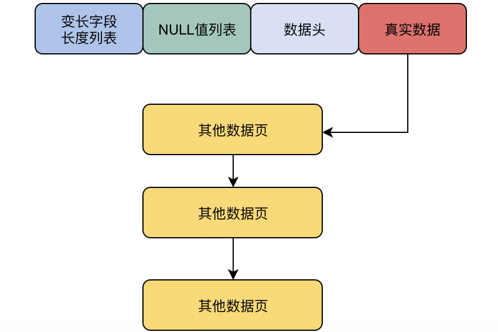

## MySQL物理数据模型 

上一篇讲了, MySQL是如何把数据页加载到缓存页里的. 本节讲undoLog和redoLog和事务机制之前的数据缓存机制和内存数据更新机制.

### 24. MySQL如何在磁盘里存储一行数据

表,行,字段是逻辑概念, **表空间, 数据区和数据页是物理存储概念.** 

1. MySQL为什么引入数据页概念.

   组成一个块, 让更新效率更高.

2. **一行数据在磁盘上是如何存储的**

   行格式: 行存储的格式. 可以指定. `create table t1(columns..) ROW_FORMAT=COMPACT`. 

   COMPACT格式: 每行数据存储格式: [变长字段的长度列表, null值列表, 数据头, column1的值, column2的值...]

   \\\

### 25. VARCHAR变长字段的存储

本小节讲每行数据的额外信息里放的什么

1. **变长字段在磁盘中怎么存储的**

   大坨数据堆在一起存储: Varchar(10), char(1), char(1) : hello a b

2. **变长字段的长度列表, 解决一行数据的读取**

   每行数据加上附加信息:  "0x05 null值列表 数据头 hello a b"

3. 多个变长字段的长度列表: 

   逆序的. 如果一行是varchar(10) varchar(5) varchar(20) ,,,. 它的**变长字段长度列表是逆序的**

4. 思考题:

   > 为什么要把每行数据紧挨在一起存放. 如果存成对象反序列化会不会更好?
   >
   > 答: 主要是节省空间吧. 


### 26. 每行数据的多个null字段如何存储

1. **null不能直接存储, Null值用bit位存储: 不通过字符串存储,** 

3. **栗子:** 

   table的列: c1 varchar(10) not null, c2 varchar(20), c3 char(1), c4 varchar(30), c5 varchar(50).

   如果c2-c5都是null.  用8个起步的byte位(8n) 不足8个的高位补0. null的column就是1

   ```text
   # 磁盘存储格式应该是
   [变长字段长度列表] [null值列表] [头信息] [column1=value1 column2=value2 column3=value3 column4=value4 column5=value5]]
   # 如果变长字段是null, 就不用在[变长字段长度列表]里存放长度了. 只有c1是not null的
   [0x05] [000 01111] [头信息] [column1=value1 ...]
   ```

   

4. 读取一行数据:

   知道了哪一位为null, 也知道了varchar的字段长度, 就可以顺序的从数据页里面读取一行数据了.

5. 思考题:

   > 直接使用NULL字符串存储, 和使用bit位运算存储, 有多爱好存储空间的差距呢?
   >
   > 答: null字符串, 每个null要占用2字节. 使用bit两个字节可以标记16个column的表.  差距太大.


### 27. 数据头40个bit位(5字节)

```text
# 每行数据的存储.
[变长字段长度列表] [null值bit存储] [头信息] [value1value2value3value4]
```

头信息占用40bit. 

- **前两个bit预留无意义**

- delete_mate bit: 标记行是否删除.

- min_rec_mask: B+树每层的非叶子节点最小值都有这个标记

- 4bit: n_owned: 记录数. 后续讲

- 13bit: heap_no: 标记本行在记录堆里的位置. 后面讲

- 3bit: record_type: 数据类型: 0(普通类型), 1(B+树非叶子节点), 2(最小值数据), 3(最大值数据)

- 16bit: next_record: 指向下一条数据的指针.

  上面几个在索引时候讲.


### 28. 磁盘实际存储行

```text
[变长字段长度列表] [null值bit存储] [头信息] [value1value2value3value4]
# 应该存储
0x09 0x04 00000011 000000000000040个0000 value1 value2 value3
16进制, 倒序.
# 编码后
0x09 0x04 00000011 000000000000040个0000 423151 32412 43124
```

在实际存储一行数据, 会在最后的**真实数据部分, 加入一些隐藏字段. 比如 **

- DB_ROW_ID字段标记行

- DB_TRX_ID: 事务ID

- DB_ROLL_PTR: 回滚指针(事务回滚)

  

  


### 29. 行溢出是什么

行数据存放在数据页里面, 每个数据页16KB, 如果行数据大小超过了16kb: varchar(65532). 

会在**一页上存储行数据**, 同时包含**20字节指针指向其他数据页(链表穿起来)** 存放.



对于一些变长字段varchar, text, blob等, 都可能出现行溢出. 


### 30. 数据页在磁盘怎么存放的

数据页16kb, 拆分了多个部分

```java
[[文件头] [数据页头] [最大最小记录] [多个数据行] [空闲区域] [数据页目录] [文件尾部]]
[[38bytes] [56bytes] [26bytes]     []         []        []      [8bytes]]
# 如果刚开始, 就没有数据行, 空闲区域就比较多. 
```


### 31. 表空间 和 数据区(划分多个数据页)

1. **表空间**

   创建的表, 都有表空间的概念, 对应磁盘`表名.ibd`的数据文件. 

   数据文件里有很多数据页. 

   - 所以引入了**extent(数据区)的概念, 每个extent 1MB, 包含64个连续的数据页**. 
   - **256个数据区分为一组**
   - **表空间里第一组数据区的第一个数据区的前三个数据页是固定的, 存放描述数据.**
     - FSP_HDR数据页: 存放表空间和本数据区组的属性
     - IBUF_BITMAP: 本数据区组的所有insert buffer的信息
     - INODE: 特殊信息...
   - **表空间第二个开始的数据区组, 第一个数据区的前两个数据页固定**, 存放特殊信息.

2. 总结:

   **表空间[ 数据区组1[ 256个数据区[ 64个数据页[ ], ...], ...], ...]**

   在执行SQL操作就从表空间的数据文件里, 加载对应数据页到Buffer Pool的缓存页操作.


### 32. 总结初步的 MySQL 存储模型 和 数据读写机制

借助数据行, 数据页, 数据区和数据区组里的附加信息, 可以在磁盘文件里实现B+树索引, 事务等机制.

> 假设插入一条数据, 是如何选择磁盘文件ibd里的那个数据页加载到内存里呢?
>
> 找到一个extent组, 找到extent, 找到一个数据页. 然后把它加载到Buffer Pool里.

**在读取一个数据页, 可以通过随机读取. 把数据页读出来才做好, IO线程会按照读出来的位置, 刷回去.**


