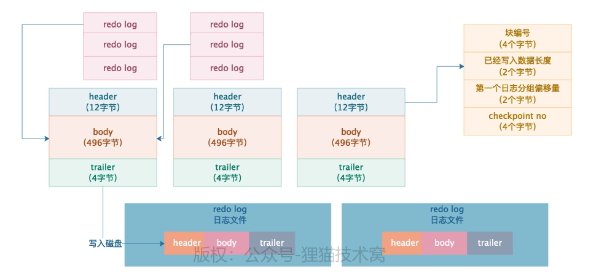

### Week6: Redo&Undo Log 原理解析

> 了解了MySQL运行的基本原理和物理存储和运行流程之后, 又了解了点调整. 接下俩接着了解MySQL的原理: 每次更新buffer pool之后要记录的**Redo Log. 保证事务提交之后的数据安全.** 
>
> **Undo Log: 用于事务的回滚**
>
> 数据只有在事务提交了之后才能完全保证安全哦

### 40. 重新回顾redo log对于提交的事务的数据安全保证

**在buffer pool里修改了数据之后, 事务提交时候强制刷回redo log(顺序写) 取代刷回buffer pool(随机写) , 提升性能.** 

写redoLog: 是物理信息: 记录表空间号, 数据页号, 磁盘文件偏移量, 更新值... 数据量小

刷回buffer poll: 缓存页刷新~ 数据量大. 还有是数据页在随机位置. 


### 41. Redo Log日志内容

**简单的修改记录**的内容是 **`表空间号+数据页号+偏移量+修改几个字节的值+具体的值`**

修改了几个字节的值: 是区分redo log的类型, MLOG_1BYTE....直到修改了太多MLOG_WRITE_STRING, 

> **记录的结构**: 修改类型(就是类似MLOG_1BYTE之类的), 表空间ID, 数据页号, 数据页中的偏移量, 具体修改的数据
>
> 修改类型是MLOG_WRITE_STRING, 要多一个修改数据长度: MLOG_WRITE_STRING, 表空间ID, 数据页号, 数据页中的偏移量, 修改数据长度, 具体修改的数据. 

### 42. Redo Log Block

redo log并不是每条产生后直接写入磁盘, 而是由 **redo log block数据块来存放多个单行日志**

```text
{[header-12byte] [body-496byte] [tailer-4byte]}
```

1. `header`: 12byte: 
   - 4byte的block_no: block的唯一编码
   - 2byte的data_length: block的body里有多少字节的数据
   - 2byte的first_record_group(偏移量): 每个事务都由多个redo_log组成redo_log_group. 第一组redoLogGroup的偏移量. 
   - 4byte的checkpoint no:


### 43-44. Redo Log Buffer. 及刷入磁盘时机

redo log buffer是MySQL在启动的时候, **InnoDB引擎申请的连续内存空间 划分出N个空redo log block**.

1. `innodb_log_buffer`设置大小, 默认16MB, 足够大小了.
2. redo_log每条写入block, block存放在buffer里. buffer写满了会强制刷入磁盘.
3. 事务内的多个SQL, 有多条redoLog, 组成group, 事务提交后, group一起写入block里. 一个放不下放两个. 一个block也可能放两个goup.

4. redo log buffer 刷入磁盘时机
   - redo log buffer已经写了50%的日志了, 就会刷入磁盘文件. 不太常见因为2就刷了. 
   - 事务提交后, 必须把redo log所在的block刷入磁盘. (先进入OS Cache, 根据参数是否强行刷入磁盘)
   - 后台线程定时刷新(1s)
   - MySQL关闭时.

5. 磁盘中的redo log文件

   `innodb_log_file_size`限制每个redoLog的文件大小(默认48M)

   `innodb_log_files_in_group`:限制文件数量(默认2个) 写完第二个, 覆盖掉第一个文件.

   只保留96MB的redo log(可以存储百万+的redo log).




## Undo Log

### 45. undo log 原理

**undo log记录逻辑日志, 是CUD语句的相反语句.**

[日志介绍博客](https://www.cnblogs.com/f-ck-need-u/archive/2018/05/08/9010872.html)

### 46. undo log 日志内容

- 日志开始位置
- 主键和各列长度和值
- 表id
- undo log日志编号
- undo log日志类型: TRX_UNDO_INSERT_REC, ...
- 日志的结束位置.

1. insert语句执行后, 生成一条undolog
2. 在回滚时候, 根据undoLog定位到表, 数据页, 从里面删除掉数据. 


