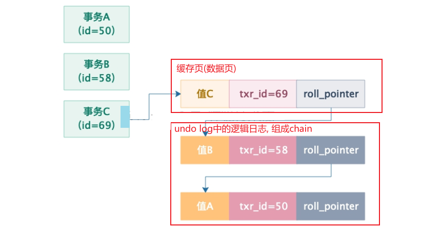
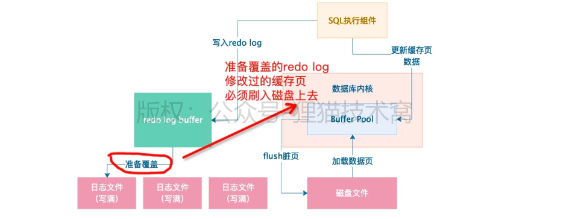

## Week8: MVCC(Multi-Version Concurrent Control)


### 53. undo log version-chain: 基于隐藏字段和undo-log

MVCC的基础建立在undo log 的version chain上.

1. **数据的隐藏字段:** 
   - **trx_id:** 最近一次更新的事务ID
   - **roll_pointer:** 只想事务的undo log(里面记录了之前的值).

2. **undo log chain**: 

   


### 54. ReadView mechanism: Base on undo log version chain

每执行一个事务的时候, 生成ReadView. 包含:

- m_ids: 当前没有提交的事务ids
- min_trx_id: 当前未提交事务里最小ID
- max_trx_id: MySQL下一个事务的ID(当前还未生成)
- creator_trx_id: 本事务ID

1. 事务开启, 生成ReadView
2. 开始查询: 
   - **数据行里的trx_id, 如果在自己的m_ids里面, 说明更新这条数据的事务和自己是并发的**, 不应该用它的value, **要到chain里面去找**. 
   - **如果没在m_ids**
     - 对比max_creator的id.找到自己应该读的.


### 55. Read Committed: 基于ReadView 做到.

使用ReadView+undoLog的versionChain.

**因为是读提交. 所以每次查询生成一个ReadView, 就可以读到当时已经提交的事务的值了.**


### 56. Read Repeatable: 基于ReadView做到

**因为是可重复读. 所以事务开启的时候生成一个ReadView, 之后每次用它.**


### 57. 多事务并发运行的隔离机制 总结

1. 多个事务并发运行的时候, 会出现脏写, 脏读, 不可重复读, 幻读.
2. 针对这些问题, 有了RU, RC, RR, Serialize 四个隔离级别
3. MySQL基于undo-log version-chain+ReadView实现MVCC机制. 默认的RR隔离机制. 避免了四种并发问题.


## 锁机制🔒


### 58. 多事务并发, 如何加锁避免脏写

脏写是绝不允许的, 靠锁, 让多个事务更新一条数据的时候串行化(悲观锁). 

- 数据和加在数据上的锁都是在内存里.
- 锁里面包括自己的trx_id, 还有等待状态(flag).
- 所释放的时候, 会唤醒等待的锁, 继续执行. 


### 59. MySQL锁机制: 共享锁和独占锁 (行锁)

- 上面介绍的悲观锁是X锁, Exclude独占锁, 写锁. : **行锁**

  ```sql
  # 查询时候对查出来的数据加一个互斥锁: for update
  select * from table_name lock for update
  ```

- 但是读取其实不用加悲观锁. 加共享锁, S锁. 

  ```sql
  # 使用共享锁: lock in share mode
  select * from table_name lock in share mode
```
  
- **S, X两个锁互斥**

- **S锁之间不互斥.** : **一般不加共享锁... 反而基于分布式锁控制不可写.**

2. **行锁**

   在多个事务并发更新数据的时候，都是要在行级别加独占锁.

   **事务去读取其他的事务正在更新的数据:**

   - **基于MVCC进行事务隔离, 读取快照版本.**
   - **查询的时候添加X/S锁.** 

   > 不建议使用数据库里面的行锁实现业务锁. 而是使用分布式锁. 


### 60.61. MySQL: 什么操作是表锁, 表锁行锁关系和互斥规则

1. 有的人认为CUD默认加行锁, DDL语句默认表锁. 不是的, 这里的DDL是MySQL的元数据里锁`MetadataLocks`, 不是InnoDB的表锁.

2. **表锁分两种**

   - 表锁: 

     ```sql
     Lock TABLES table_name READ; # S锁
     Lock TABLES table_name WRITE; # 独占锁
     ```

   - **表级的意向锁:** `不与行级锁冲突`

     - 事务在表里执行CUD操作, 会在行级添加独占锁, **在表级加意向独占锁**. 
     - 事务在表里执行Read操作, **会在表记加意向共享锁.**

     **意向锁是引擎自己维护的, 两个意向锁不会互斥, 可以看成透明的. 似乎是多余.** 

   


3. 总结:

   对同一行的更新操作都是行级的独占锁, 和读不互斥.

   读锁和表锁(非意向)都要手动.

4. **[意向锁作用](https://juejin.im/post/6844903666332368909):** 

   


## 62.63. 案例: DB不确定性的性能抖动

**现象**: DB时不时来一次性能抖动. 这种肯定不是充放电问题. 

1. 是**因为查询数据太多**, buffer pool里面容不下, 需要刷回一些缓存页. 

2. 磁盘的redo日志文件是交替的写两个file, 在**第二个文件写满之后, 会触发一次脏页的刷新.**

   如果第一个文件里的一些redoLog对应的缓存页在之后从没有刷回磁盘, 就必须要把它刷回去.

   

   这种情况下日志文件里很多, 可能直接会把数据库打死. 

**优化:** 

1. 减少缓存页flush到磁盘的频率: 很难, 因为系统正常使用, 除非增大buffer pool. 填满时间长一些
2. 增加缓存页flush到磁盘的速度.
   - SSD: 随机IO高
   - `innodb_io_capacity`: flush缓存页的io速率限制. 可以**使用fio测试磁盘最大随机IO**, 然后设置. 实际flush的时候会按照这个参数*`innodb_max_dirty_pages_pct`来控制.
   - `innodb_flush_neighbors`: flush缓存页的时候可以把缓存页邻近的缓存页刷回去. 设置成0, 减少flush的缓存页数量.


