# 数据结构与对象

1. SDS: 简单动态字符串, simple dynamic string
2. 链表
3. 字典
4. 跳跃表
5. 整数集合
6. 压缩列表
7. 对象


## 简单动态字符串

### 一. 定义

Redis构建了SDS的抽象类型, 而不用C字符串.

```c
struct sdshdr {
    int len; /* used, SDS字符串长度 */
    int free; /* 未使用的字节数 */
    char buf[]; // 最后的空字符'\0'也属于已使用的~
};
```

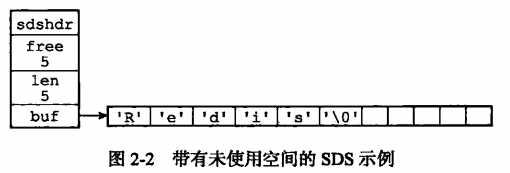

### 二. SDS 与 C 字符串的区别

C使用长度为n+1的字符数组表示长度n的字符串, 数组最后一个元素总是空字符'\0'.

1. **取字符串长度:** C不记录自身长度信息, 获取长度需要遍历整个字符串.

2. **缓存区溢出:** C不记录自身长度, 在拷贝字符串时假设为目标字符串分配了足够的内存, 但如果没有就会造成缓冲区溢出.

3. **减少修改字符串时的内存重新分配:** C字符串再增加字符串长度时, 需要考虑是否重分配扩充内存空间大小. 缩短字符串时需要考虑是否重新分配防止内存泄漏.SDS通过未使用空间完成了内存空间预分配和惰性空间释放.

4. **二进制安全:** C字符串中字符除了末尾不能出现空字符, 且必须符合一种编码, 所以只能保存文本数据不能保存图片/视频等二进制数据. SDS使用len破解哦~

5. **兼容部分C字符串函数:** SDS兼容C

   

### 三. SDS API

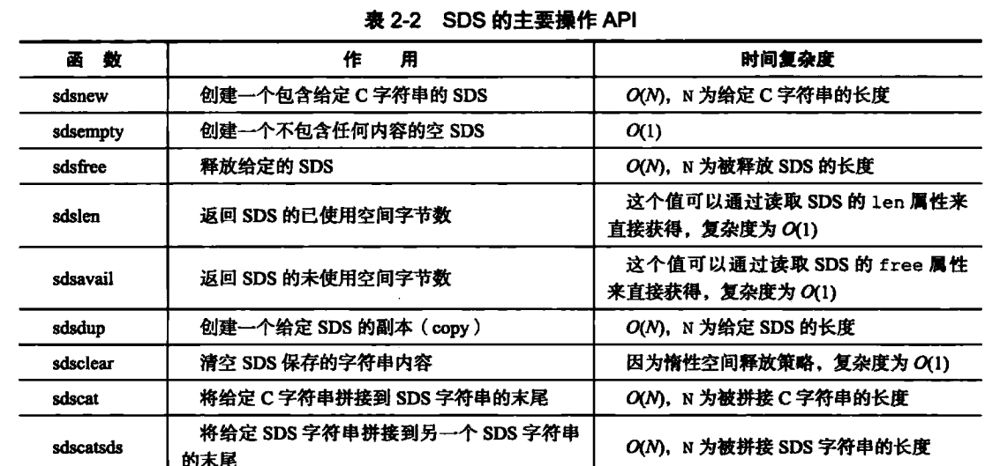


## 链表

链表提供了**节点重拍**能力和**顺序的节点访问**

### 一. 实现

Redis的语言 C没有内置, 所以自己构建的链表实现.

```c
// 节点元素
typedef struct listNode {
    struct listNode * prev; // 前面的节点
    struct listNode * next; // 后面的节点
    void * value;           // 节点值
} listNode;
// 链表(节点持有者)
typedef struct list {
    listNode *head; 
    listNode *tail;
    unsigned long len; // 节点数
    void *(*dup)(void *ptr); // 节点值复制函数
    void (*free)(void *ptr); // 节点值释放函数
    int (*match)(void *ptr, void *key); // 节点值对比函数
} list;
```

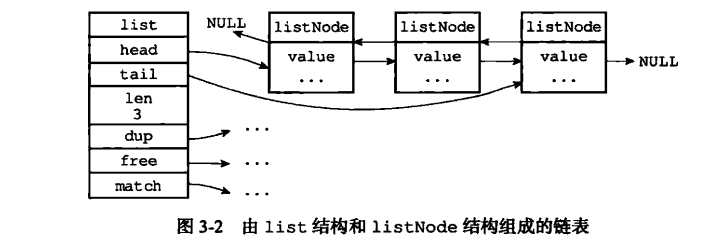

### 二. API

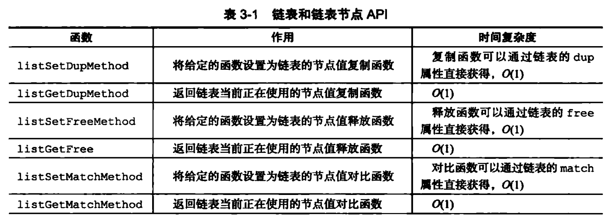


## 字典

字典, 可以理解成**map映射**的抽象数据结构, **用于保存键值对**

在数据库中设置一个set一个key-value, 就是放在了数据库的字典里面. 

### 一. 实现

使用哈希表作为底层实现. 

#### 1. 哈希表和哈希节点

```c
typedef struct dictht {
    dictEntry **table; // 哈希表数组
    unsigned long size; // 哈希表大小
    unsigned long sizemask; // 哈希表大小掩码, 计算索引值, = size-1
    unsigned long used; // 哈希表已有节点的数量
} dictht;
typedef struct dictEntry {
    void *key; // 键
    union {    // 值
        void *val;
        uint64_t u64;
        int64_t s64;
        double d;
    } v;
    struct dictEntry *next; //下一个哈希节点, 形成链表, 解决键冲突💥
} dictEntry;
```

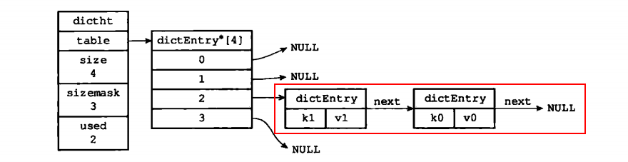

#### 3. 字典

```c
typedef struct dict {
    dictType *type; // 类型特定函数, 可创建多态字典
    void *privdata; // 私有数据
    dictht ht[2];   // 字典有两个哈希表, 用于扩容哦~, 只使用ht[0], ht[1]用于rehash
    long rehashidx; /* 如果rehashidx=-1, 那么说明重哈希不再进行中 */
    unsigned long iterators; /* number of iterators currently running */
} dict;
```

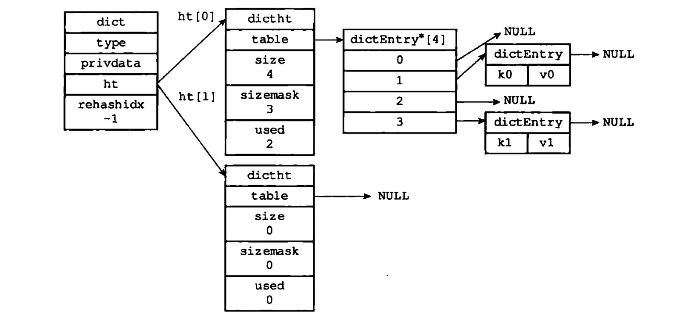

### 二. 哈希算法

根据键值对的键计算出哈希值和索引值. 然后再放入哈希表数组中. 

```c
# 使用字典设置的哈希函数, 计算键key的哈希值
hash = dict -> type -> hashFunction(key);
# 根据哈希表的sizemask和哈希值, 计算出索引
index = hash $ dict -> ht[0/1].sizemask;
```

### 三. rehash

哈希表的键值对会有增减, 为了让哈希表的负载因子保持在合理范围, 需要对哈希表进行扩展/收缩.

**hash表的扩展/收缩 执行rehash(重新散列) 操作完成.** 

1. 为字典ht[1]哈希表分配空间, 取决于ht[0].used值.

   扩展, ht[1] 大小就是used*2 的 2^n次方. 收缩就是used 的2^n次方.

2. 将ht[0]所有键值对rehash到ht[1]上, rehash是重新计算键的hash值和index.

3. 释放ht[0], 把ht[1] 放在ht[0] 位子上. 

**扩展收缩(rehash)时机:**

1. 服务器没有执行BGSAVE/BGREWRITEAOF命令, 负载因子大于等于1, rehash.
2. 正在执行命令, 负载因子大于等于5, rehash.
3. 负载因子小于0.1, rehash


### 四. 渐进式rehash

如果hash表很大, **rehash时间太长了, 需要多次,渐进式完成.**

1. 分配ht[1]空间, 字典同时持有ht[1], ht[0]
2. 把字典的rehashidx设置为0, 表示rehash开始
3. rehash期间, 字典的增删改, 在ht[0], ht[1]上都做一遍. 查操作如果在ht[0]没有查到, 在ht[1]再查.
4. rehash完成后, ht[1]代替ht[0], rehashidx=-1.


## 跳跃表skiplist

跳跃表是有序数据结构, **在每个节点中维持多个值向其他节点的指针**, 达到快速访问节点.


**zskiplist:** level 记录跳跃表内层数最大的节点的层数, 也就是o3的l5层. length记录跳跃表的长度.

**zskiplistNode:** 层(level):每个层有两个属性, 前进指针和跨度.  BW(后退指针): 当前节点的前一个node. 分值: 跳跃表中节点按照分值大小排序,跨度也是分支. 对象:o1,o2都是节点保存的成员对象.

#### 1. zskiplistNode

```c
typedef struct zskiplistNode {
	struct zskiplistLevel {
        struct zskiplistNode *forward;
        unsigned int span; // 跨度
    } level[]; // 层, 层数组的大小按照幂等定律随机生成1-32之间的层数.
    struct zskiplistNode *backward;
    double score;
    robj *obj;
} zskiplistNode; 
```

#### 2. zskiplist

```c
typedef struct zskiplist {
    struct skiplistNode *header, *tail;
    unsigned long length; // 节点数
    int level; // 层数最大的节点的层数
}
```

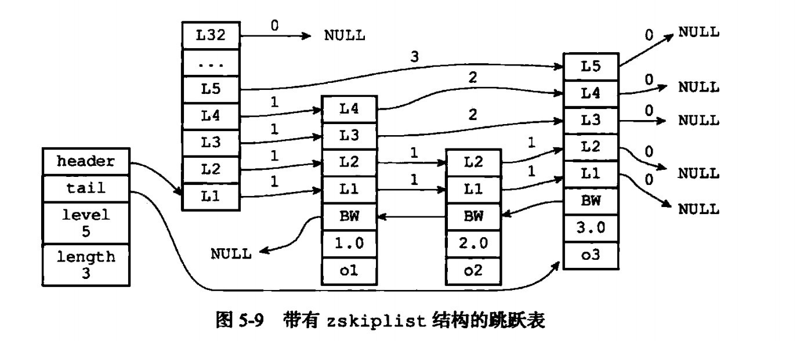


## 整数集合

**一个集合中只包含整数值, 且集合元素不多, 就用整数集合作为集合键的底层实现.**

```redis
127.0.0.1:6379> sadd numbers 1 2 3 4 2 82
(integer) 5
127.0.0.1:6379> object encoding numbers
"intset"
```

### 一. 实现

```c
typedef struct intset {
    uint32_t encoding; // 编码方式
    uint32_t length;   // 集合元素个数
    int8_t contents[]; // 保存集合元素的数组, 从小到大排列哦!!!!!
} intset;
```

contents数组**类型取决于encoding属性的值**.    encoding=INTSET_ENC_INT16, contents是int16_t类型的数组, 每项是int16_t类型的整数. 两个字节[-32768,32768], 诸如此类到INTSET_ENC_INT64

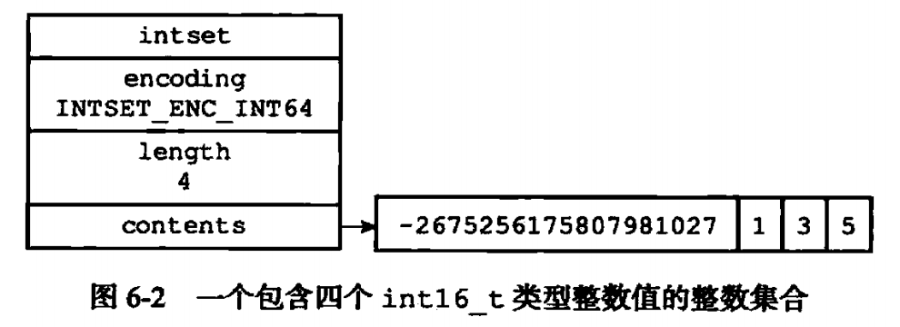


### 二. 升级

把一个新元素添加到整数集合里, 如果新元素类型比原来长, 整数集合要升级类型.

1. 根据新元素的类型, 扩展整数集合底层数组的空间大小, 分配空间
2. 把原来的元素都转成新类型, 按照顺序放在位子上, 从小到大
3. 把新元素添加到里面

**升级好处:**

1. 灵活, 自动升级数组适应新元素.
2. 节约内存

### 三. 降级

**整数集合不支持降级~**

### 四. API


## 压缩列表

压缩列表ziplist是**列表键**和**哈希键**的底层实现之一, 如果列表键只包含少量列表项, 并且列表项是小整数型/短字符串, 那么redis就用压缩列表做列表键的底层实现. 

```shell
127.0.0.1:6379> hmset profile "name" "jack" "age" 23 "job" "programmer"
OK
127.0.0.1:6379> object encoding profile
"ziplist"
```


### 一. 压缩列表的构成

压缩列表由一系列特殊编码的连续内存块组成的顺序性(sequential)数据结构. 一个压缩列表可以包括任意多节点(entry), 每个节点保存一个字节数组/整数值.

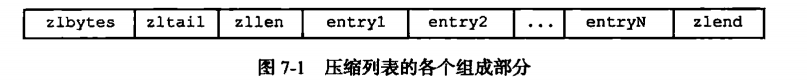


### 二. 压缩列表节点的购成

每个压缩咧表节点可以保存一个字节数组/整数值.

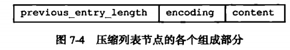

**previous_entry_length:**  前一个结点的长度, 可以是1字节/5字节记录.

**encoding:** content保存的类型和长度.

**content:** 保存节点值, 可以是字节数组/整数.


### 三. 连锁更新

每个节点都记录了前一个节点的长度.  如果新增一个前面的节点, 本节点的previous_entry_length无法用1字节记录下长度, 那么就要扩充成5字节.

如果引发连锁更新, 那么最坏的复杂度是O(N^2);


## quickList


## 对象

上面的几个数据结构: SDS, 链表, 字典, 压缩列表, 整数集合, 跳跃表等, Redis没有直接使用这些数据结构来实现键值对数据库, 而是组成了对象系统, **包括字符串对象, 列表对象, 哈希对象, 集合对象, 有序对象五种.** 每种对象至少用到了一种数据结构. 

**对象的好处:** 可以针对不同使用场景为对象设置优化. 可以用基于引用计数技术的内存回收. 可以增加一些自定义的属性(访问时间记录等)


### 一. 对象的类型和编码

在数据库里新建一个键值对, 至少会**创建两个对象, 键对象, 值对象**

```c
typedef struct redisObject {
	unsigned type:4;     // 类型
    unsigned encoding:4; // 编码
    encod *ptr;           // 指向底层实现数据结构的指针
    // ... 其他的东东
}
```

#### 1. type 类型

| 类型常量     | 对象的名称   |
| ------------ | ------------ |
| REDIS_STRING | 字符串对象   |
| REDIS_LIST   | 列表对象     |
| REDIS_HASH   | 哈希对象     |
| REDIS_SET    | 集合对象     |
| REDIS_ZSET   | 有序集合对象 |

键对象总是字符串对象, 值对象可以是任一种.

```c
127.0.0.1:6379> type profile   // type+key, 可以看值对象是什么
hash
```

#### 2. 编码和底层实现

对象的encoding决定了ptr指针指向的底层实现数据结构类型.

| 编码                      | 编码对应的底层数据结构 |
| ------------------------- | ---------------------- |
| REDIS_ENCODING_INT        | long类型的整数         |
| REDIS_ENCODING_EMBSTR     | embstr编码的SDS        |
| REDIS_ENCODING_RAW        | SDS                    |
| REDIS_ENCODING_HT         | 字典                   |
| REDIS_ENCODING_LINKEDLIST | 链表                   |
| REDIS_ENCODING_ZIPLIST    | 压缩列表               |
| REDIS_ENCODING_INTSET     | 整数集合               |
| REDIS_ENCODING_SKIPLIST   | 跳跃表和字典           |

**每种类型的对象至少使用了两种编码**

| 对象类型     | 编码                      | 对象                    |
| ------------ | ------------------------- | ----------------------- |
| REDIS_STRING | REDIS_ENCODING_INT        | 整数值实现的字符串对象  |
| REDIS_STRING | REDIS_ENCODING_EMBSTR     | 使用embstr编码的SDS实现 |
| REDIS_STRING | REDIS_ENCODING_RAW        | 使用SDS实现的字符串对象 |
| REDIS_LIST   | REDIS_ENCODING_ZIPLIST    | ...                     |
| REDIS_LIST   | REDIS_ENCODING_LINKEDLIST |                         |
| REDIS_HASH   | REDIS_ENCODING_ZIPLIST    |                         |
| REDIS_HASH   | REDIS_ENCODING_HT         |                         |
| REDIS_SET    | REDIS_ENCODING_INTSET     |                         |
| REDIS_SET    | REDIS_ENCODING_HT         |                         |
| REDIS_ZSET   | REDIS_ENCODING_ZIPLIST    |                         |
| REDIS_ZSET   | REDIS_ENCODING_SKIPLIST   |                         |

```c
OBJECT ENDOCING key // 可以看value对象的编码
```


### 二. 字符串对象

字符串对象的编码可以是: int, raw, embstr.

```java
127.0.0.1:6379> set intStr 32
OK
127.0.0.1:6379> object encoding intStr
"int"
```

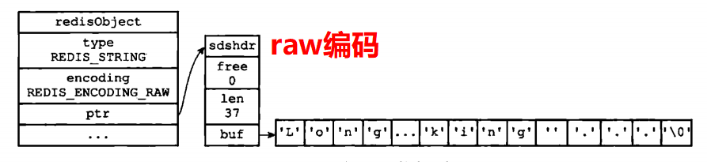

embstr编码是专门保存短字符串的优化编码, 和raw编码一样, 但raw编码会调用两次内存分配创建出redisObject结构和sdshdr结构, **embstr编码通过一次内存分配函数来分配连续空间, 包含两个结构**


**long, double类型标识的浮点数在redis中作为字符串值来保存.**

```c
127.0.0.1:6379> set pi 3.1415
OK
127.0.0.1:6379> object encoding pi
"embstr"
```

#### 1. 编码的转换

int编码的字符串, 如果**添加了字母啊什么的,会转成raw编码**. 不会转成embstr编码, 因为**embstr字符串对象只读.** embstr字符串修改后也会转成raw编码

#### 2. 字符串命令的实现

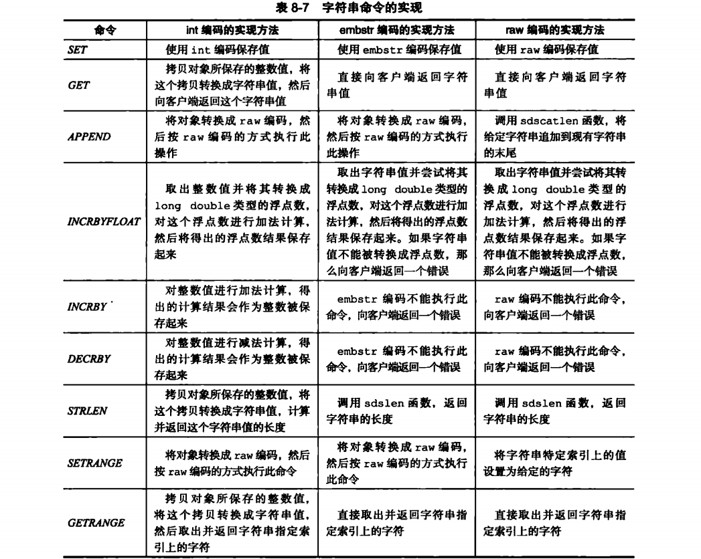


### 三. 列表对象

列表对象的编码可以是ziplist, linkedlist.

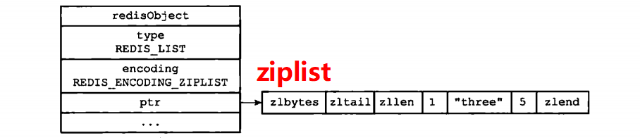


**字符串对象是唯一一个可以被嵌套在其他四种类型对象里面的对象哦~**

#### 1. 编码转换

**列表对象使用ziplist的条件**: 所有字符串元素的长度小于64字节,且 元素个数小于512个.

(可以通过配置文件修改)

不满足两个条件的同linkedlist编码.

#### 2. 列表命令的实现


### 四. 哈希对象

哈希对象的编码可以是ziplist 或者 hashtable.

**ziplist编码实现:** 新的键值对加入到哈希对象时, 先把键对象的压缩列表节点推入列表表尾, 再将保存了值对象的压缩列表节点推入表尾. 所以键节点在前, 值节点在后. 


**hashtable编码实现:** 使用字典作为哈希对象的底层实现, 哈希对象的每个键值对都用字典键值对保存. 字典的键,值都是字符串对象


#### 1. 编码转换

**哈希对象用ziplis编码的条件**: 所有键值对的键和值字符串长度都小于64字节, 且总键值对少于512个. 

可以通过配置文件修改

#### 2. 哈希命令的实现

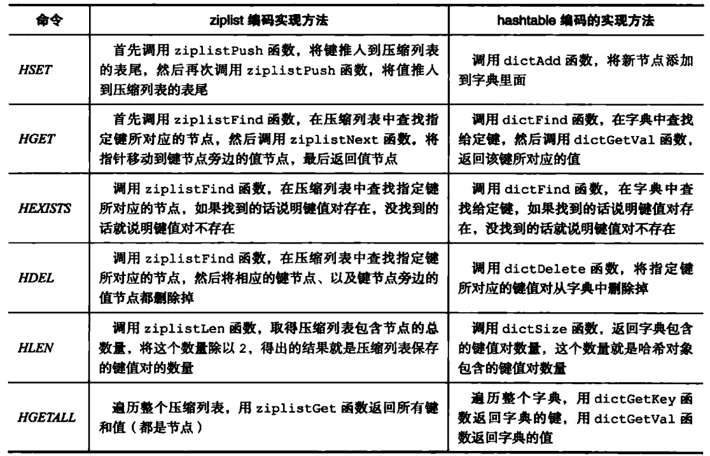


### 五. 集合对象

集合对象的编码是intset和hashtable.

**intset编码:** 集合对象使用整数集合作为底层实现, 

```c
127.0.0.1:6379> sadd nums 1 3 92 81 42
(integer) 5
127.0.0.1:6379> object encoding nums
"intset"
```

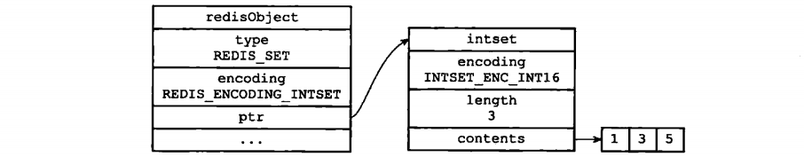

**hashtable编码:** 使用字典作为底层实现, 每个键都是一个字符串对象, 包含了一个集合元素. 字典的值为null.


#### 1. 编码转换

使用intset要满足两个条件: 集合所有元素都是整数值, 且不超过512个.

限制可修改.

#### 2. 集合命令的实现

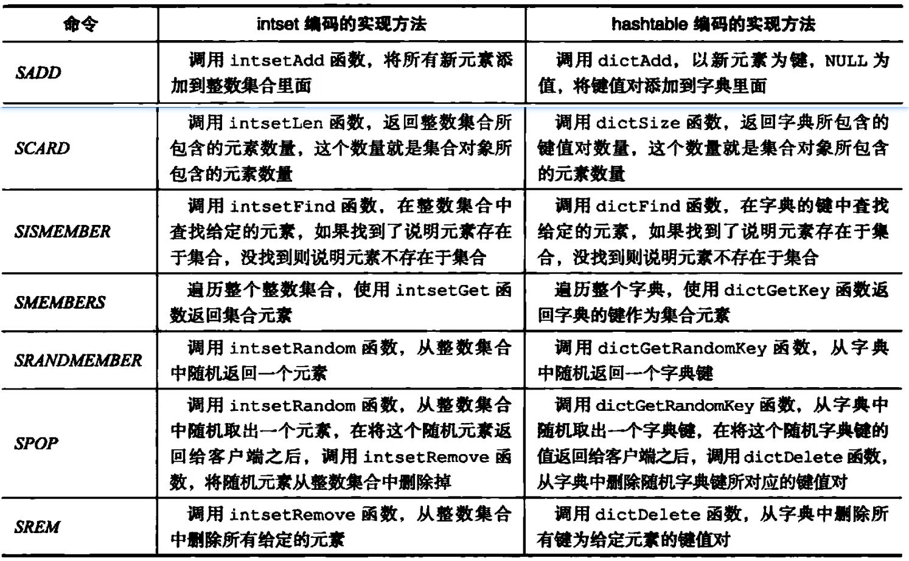


### 六. 有序集合对象

有序集合对像的编码可以是ziplist, skiplist. skiplist包括字典和跳跃表

**ziplist编码实现:** 每个集合元素使用两个挨在一起的压缩列表节点保存, 第一个节点保存元素的值, 第二个保存元素的分值(score).  压缩列表内的元素从小到大从头往后排列.


**skiplist编码实现:** 节点的score保存元素的分值,object属性保存元素的值. 

**字典编码实现:** 字典的键值对保存一个元素, 键保存值, 值保存元素的分值.

**有序集合zset同时使用跳跃表和字典保存元素.** 通过指针共享元素的值(字符串对象), 分值(double浮点数).


#### 1. 编码的转换

**使用ziplist编码的条件: ** 元素的值长度小于64, 元素个数少于128个.

上线也可以通过配置文件修改.

#### 2. 有序集合命令的实现

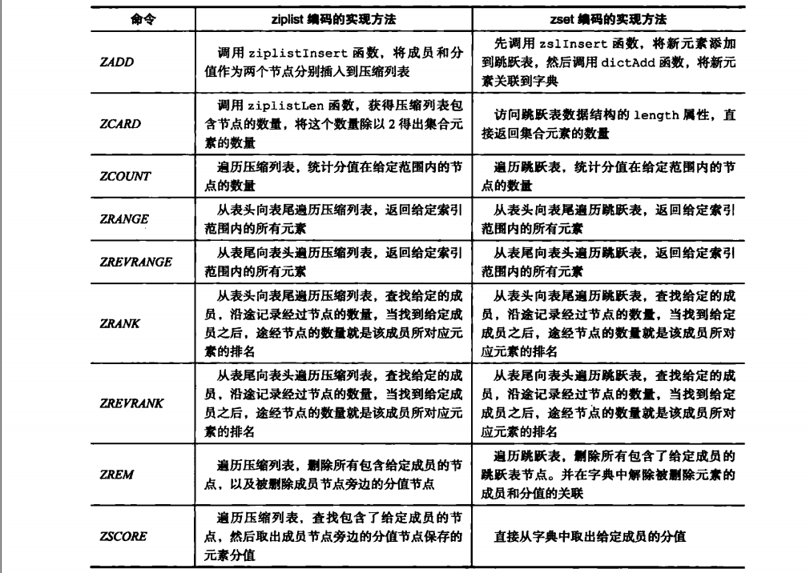


### 七. 类型检查与命令多态

redis用于操作键的命令可以分为两种

1. 对任何类型的键执行: DEL, EXPIRE, RENAME, TYPE, OBJECT

2. 只对特定类型的键执行:

   | 字符串键   | set, get, append, strlen   |
   | ---------- | -------------------------- |
   | 哈希键     | hdel, hset, hget, hlen     |
   | 列表键     | rpush, lpop, linset, llen  |
   | 集合键     | sadd, spop, sinset, scard  |
   | 有序集合键 | zadd, zcard, zrank, zscore |

#### 1. 类型检查的实现

为了确保只有指定类型的键可以执行特定的命令, 所以先要进行类型检查. **通过redisObject的type属性来实现.**

#### 2. 多态命令的实现

redis在判断完对象的类型后, 还要**判断值对象的编码方式, 选择正确的命令实现 取执行命令**

因为每个对象都有至少两种编码方式, 所以, 我们可以认为命令都是多态的. 根据编码方式实现多态.

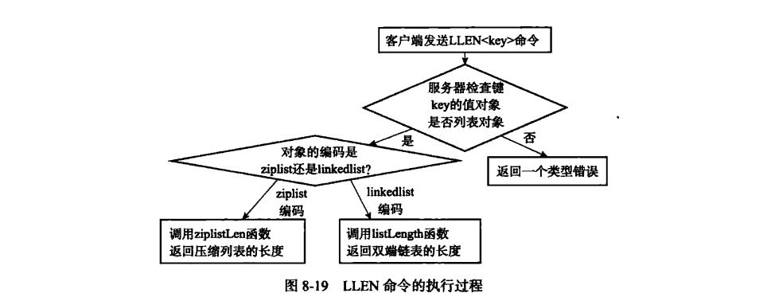


### 八. 内存回收

C没有GC, Redis在自己的对象系统中构建了引用计数(reference counting)技术实现的内存回收机制. 

```c
typedef struct redisObject {
    // ...
    int refcount; // 引用计数
    // ...
}
```

1. 在创建新对象时, refcount=1;

2. 对象被新程序使用, +1;

3. 对象不再被一个程序使用, -1;

4. refcount=0时, 对象占用的内存被释放.

   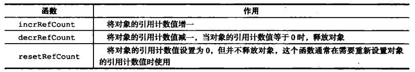


### 九. 对象共享

**对象的引用计数属性还有对象共享的作用.** refcount>1说明在共享~

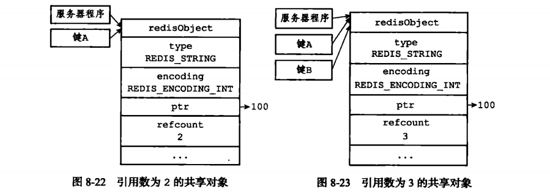


### 十. 对象的空转时长

redisObject还有一个属性叫lru, 记录对象最后一次被命令程序访问的时间.

```c
typedef struct redisObject {
    // ...
    unsigned lru:22; // 最后一次被命令程序访问的时间
    // ...
}
127.0.0.1:6379> object idletime nums
(integer) 4633 //秒
```

object idletime 命令可以打印出键的空转时长, 当前时间减去lru这个时间.

可以开启maxmemory选项, 服务器用于回收内存的算法为volatile-lru, 那么内存空转时间超过时长就释放内存. 


