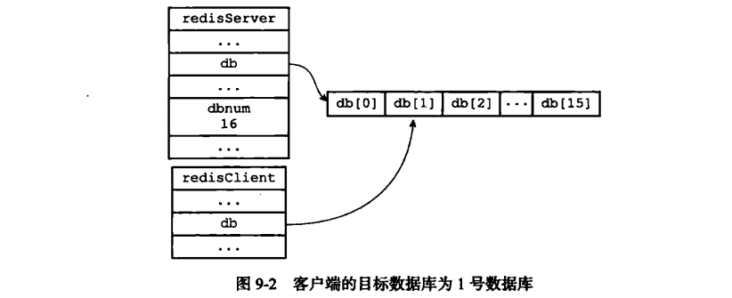
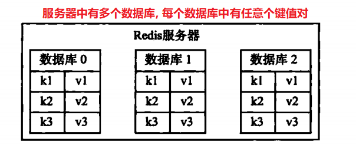
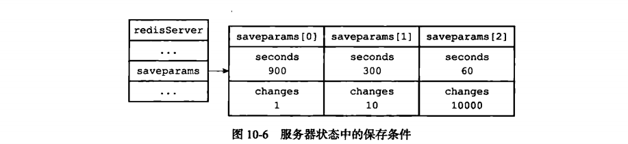
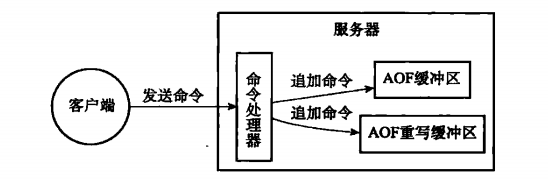
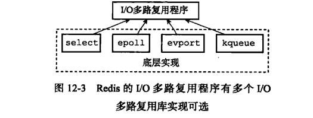
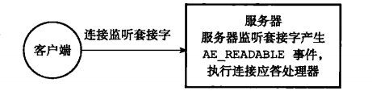
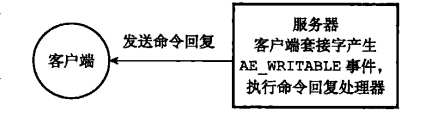
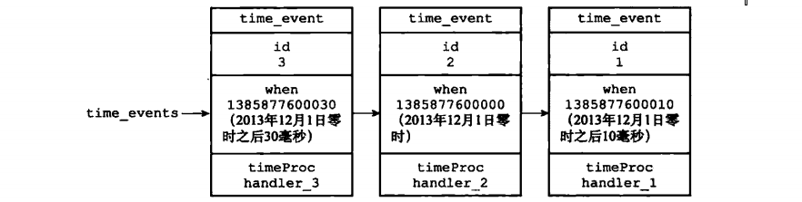
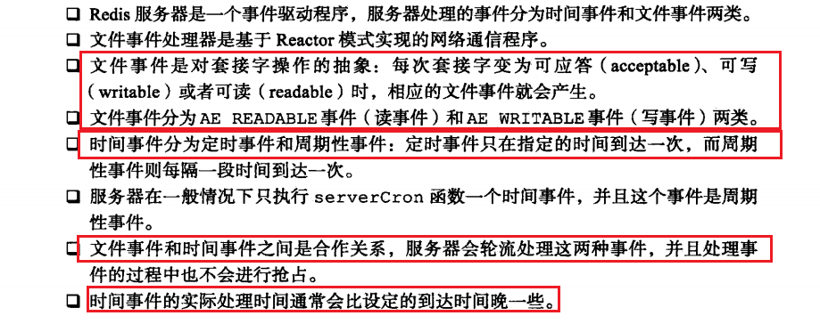
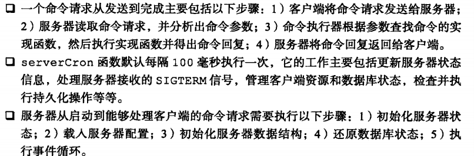

# 单机数据库的实现


## 第九章 - 数据库

本章对redis服务器的数据库实现讲解.

### 一. 服务器中的数据库

redis服务器把所有数据库保存在服务器状态redis.h/redisServer 结构的db数组中, db数组每一项都是redis.h/redisDb结构. 一个redisDb结构代表一个数据库.

```c
struct redisServer {
	redisDb *db; // 一个数组, 保存着服务器中所有数据库
    int dbnum; // 初始化服务器时创建的数据库个数, 默认16.
}
```


### 二. 切换数据库

  默认, 客户端的目标数据库是0号数据库, 可以用select命令切换目标数据库.

服务器中的redisClient结构的db属性记录了客户端当前的目标数据库

```c
typedef struct redisClient {
	redisDb *db; // 记录客户端当前使用的数据库.
}
```



### 三. 数据库键空间

Redis是键值对(key-value pair) 数据库服务器, 服务器中每个数据库都由redisDb结构表示, redisDb结构的dic字典保存了数据库中所有的键值对, 这个字典叫**键空间(key space)**

```c
typedef struct redisDb {
    // ...
    dict *dict; // 数据库键空间, 保存着数据库中所有的键值对.
    // ...
}
```

**键空间的键也是数据库的键, 每个键都是一个字符串对象**

**键空间的值也是数据库的值, 每个值可以是五个对象里的任一个.**


#### 1. 键操作(增删改)

实际上就是对键空间里的键对应的值对象进行增删改.

#### 2. 对键取值

对一个数据库键取值, 就是在键空间中取出值对象来. 多态取值. 不同对象类型, 取值方法也不同.

#### 3. 其他键空间操作

都是通过对键空间进行操作处理的. 比如flushdb命令清空整个数据库, dbsize命令查找键数....

#### 4. 读写键空间时候的维护操作

使用Redis命令对数据库进行读写时, 服务器需要额外做一些维护操作:

1. 读取一个键后, 根据键是否存在来更新服务器的键空间命中次数(hit) 或 键空间不命中次数(miss). 在INFO state命令的keyspace_hits属性和keyspace_misses属性中查看.
2. 读取一个键后, 服务器更新键的LRU(最后一次使用时间). 
3. 读取键发现键过期, 就删除这个过期键.
4. 客户端watch命令监控了某个键, 修改后服务器会把键标记成脏(dirty), 让事务程序注意到.
5. 服务器每修改一个键后, 都会对脏键(dirty)计数器的值加一, 会触发服务器的持久化以及复制操作.
6. 服务器开启数据库通知功能后, 对键修改了按照配置发送数据库通知.


### 四. 设置键的过期时间

**Expire, PEXPIRE**命令可以以秒/毫秒设置过期时间(Time to live, TTL).

#### 1. 设置过期时间

| EXPIRE key ttl                     | 设置生存时间ttl秒                 |
| ---------------------------------- | --------------------------------- |
| PEXPIRE key ttl                    | 设置生存时间ttl毫秒               |
| EXPIREAT key timestamp             | 设置过期时间为timestamp           |
| **PEXPIREAT key timestamp (原始)** | 设置过期时间为timestamp(毫秒格式) |

#### 2. 保存过期时间

redisDb结构的**expires字典保存了数据库中所有键的过期时间.**

过期字典的键时指针, 指向键空间的某个键对象, 过期字典的值是一个long 类型整数, 保存了过期时间. 

```c
typedef struct redisDb {
    // ...
    dict *expires;// 过期字典, 保存键的过期时间
    // ...
}
```


#### 3. 移除过期时间

PERSIST 移除 PEXPIREAT 命令的过期时间.

```c
127.0.0.1:6379> persist num
(integer) 1 // 1个过期时间已移除.
```

#### 4. 计算并返回剩余生存时间

TTL和PTTL命令, 查看剩余生存时间, 秒/毫秒


### 五. 过期键删除策略

#### 1. 过期删除策略

所有的过期键都保存在了过期字典中, **有三种删除策略:**

1. **定时删除:** 创建定时器, 在过期时间删除. 节省内存, 增加CPU压力. 定时器用到的时间事件使用的是无序链表, 查找时间复杂度为O(n), 有点麻烦.
2. **惰性删除:** 不管, 每次获取键时候看是否过期. CPU友好. 对内存最不好. 
3. **定期删除:** 每隔一段时间删除. 难点是执行频率和时长. 

#### 2. Redis的过期键删除策略

采用定期删除和惰性删除两种搭配. 

1. **惰性删除策略实现:** 由db.c/expireIfNeeded函数, 在读写命令之前会调用该函数对键检查.

   如果过期, 就删除.

   

2. **定期删除策略实现:** 由redis.c/activeExpireCycle函数实现, 在Redis周期性执行serverCron函数时候, 会调用. 在规定时间内, 分多次遍历每个数据库, 在expires字典中**随机检查一部分键**.


### 七. AOF, RDB 和 复制功能 对过期键的处理

**AOF持久化功能和复制功能是如何处理过期键的**

#### 1. 生成RDB文件

执行SAVE命令/BGSAVE命令创建一个新的RDB文件, 对所有键进行检查, 已经过期的键不会保存到新创建的RDB文件中.

所以过期键对**创建RDB文件不造成影响**, 过期检查出来删掉就好了

#### 2. 载入RDB文件

启动Redis服务器时, 服务器开启了RDB功能会对RDB文件载入:

**服务器以主服务器模式**进行, 载入RDB文件时, 程序对键检查, 忽略过期键. 所以没影响.

**服务器从服务器**, RDB文件中所有的键都会载入到数据库中, 但主从服务器主从同步的时候会删除.

#### 3. AOF 文件写入

服务器以AOF持久化模式运行, 在键删除之前, AOF正常把它固化, 在定期删除后, **Redis向AOF文件追加一条DEL命令.** 

#### 4. AOF 重写

执行AOF重写过程, 对数据库所有的键检查, 过期的键不在写入AOF文件.

#### 5. 复制

主从复制, **从服务器的过期键删除由主服务器控制.**

1. 主服务器删除一个过期键, **向所有从服务器发送一个DEL命令**
2. 从服务器执行读命令, 即使有过期键也不删除, 像未过期键一样. 接收到DEL才删除.


### 八. 数据库通知

客户端通过订阅频道/模式, **获知数据库中键的变化.**

```c
// 订阅
subscribe _keyevent@_ _:del // 订阅删除命令
```

#### 1. 发送通知

**notify.c/notifyKeyspaceEvent函数** void notifyKeyspaceEvent(int type, char *event, robj *key, int dbid); type: 发送的类型, event:事件名称, key:产生事件的键, dbid:数据库号码.


#### 2. 发送通知的实现

```python
// notifyKeyspaceEvent 伪代码
def notifyKeyspaceEvent(type, event, key, dbid){
    // 如果不是给定的通知类型,就返回
    if not (server.notify_keyspace_events & type)
    	return;
    // 发送键空间通知
    // 发送键事件通知
}
```


### 九. 重点回顾

**看目录.**


## 第十章 - RDB 持久化



RDB持久化可以手动执行, 也可以配置后定期执行. 生成RDB文件保存在硬盘里.

本章讲RDB文件的保存和载入, 和实际用到的小知识点.

### 一. RDB文件的创建和载入

**创建命令:** SAVE, 或 BGSAVE. save命令会阻塞redis服务器进程知道创建完毕. bgsave会创建子进程.

不能执行两个bgsave, 也不能执行bgsave和bgrewriteaof同时. 

```python
def SAVE() :
    rdbSave(); # 创建RDB文件
def BGSAVE() :
    pid = fork(); # 创建子进程
    if pid == 0 :
        rdbSave(); # 子进程创建文件
        signal_parent(); # 创建完通知父
    elif pid > 0 :
        handle_request_and_wait_signal(); # 父进程接着干活
    else:
        handle_fork_error();
```

**RDB文件载入在服务器启动自动进行. 阻塞** 

因为AOF更新频率高, 所以如果开启了AOF先使用AOF文件还原. AOF关闭采用RDB文件.


### 二. 自动间隔性保存

BGSAVE命令不会阻塞, 所以Redis允许设置每隔一段时间执行BGSAVE命令. 

```c
save 900 1; // 900秒内至少做了一次修改就执行bgsave;
```

#### 1. 设置保存条件

在redis服务器启动时, 可通过配置文件/传入启动参数实现. 

```c
struct redisServer {
    /// ...
    struct saveparam *saveparams; // 保存条件数组
    long long dirty; // 修改计数器, 上次保存后一共有多少次修改
    time_t lastsave; // 上次保存的时间
    /// ...
}
struct saveparams {
    time_t seconds;//秒数
    int changes; // 修改数
}
```



Redis周期函数**serverCron每100毫秒执行一次, 会检查save条件**.如果满足就执行BGSAVE命令!

### 三. RDB文件结构(二进制文件)


**REDIS:** 五个字节, 保存"REDIS"五个字符. 类似于魔数.

**db_version:** 长度四字节, 字符串表示的整数.

**EOF常量:** 1字节, 标志着RDB文件正文内容结束. 

**check_sum:** 8字节长的无符号数, 保存着一个校验和, 根据前四个部分计算得出.检查RDB文件是否损坏


#### 1. databases部分

databases部分可以保存任意多的非空数据库.


**SELECTDB常量:** 1字节, 标志者db_number前面;

**db_number:** 所在的数据库.

**key_value_pairs:** 键值对, 过期时间也保存着. 

1. 不带过期时间的键值对:

   

   type记录value类型, 有string,list,set,zset,ziolist,intset等等.

   key: 字符串对象. value:根据type来.

2. 带过期时间的键值对:

   

   EXPIRETIME_MS: 1字节, 告诉程序下面是毫秒的过期时间, ms:8字节, unix时间戳.

#### 2. value的编码

value保存值对象, 

1. 字符串对象: int编码字符串对象结构:[ENCODING:integer]

2. 列表对象:

3. 集合对象:

4. 哈希表对象:

   

5. 有序集合对象

   


## 第十一章 - AOF持久化

Redis还提供了**AOF(Append Only File) 持久化功能.** 通过**保存redis服务器所执行的写命令**来记录数据库状态. 

### 一. AOF持久化的实现

AOF持久化功能分为 追加(append), 文件写入, 文件同步(sync) 三步.

#### 1. 命令追加

AOF开启后, 每执行一个写命令, 都会把命令追加到服务器状态的aof_buf缓冲区的末尾:

```c
struct redisServer {
    // ...
	sds aof_buf; // AOF缓冲区
    // ...
}
```

#### 2. AOF文件的写入与同步

服务器进程是一个事件循环loop, 每次循环时候都会调用flushAppendOnlyFile()函数, **flushAppendOnlyFile()函数的行为由服务器的appendfsync选项来确定**

| appendfsync选项的值 | flushAPpendOnlyFile函数的行为              |
| ------------------- | ------------------------------------------ |
| always              | 将aof_buf缓冲区所有内容写入并同步到AOF文件 |
| everysec(默认)      | 超过一秒钟就同步一下, 由专门线程执行       |
| no                  | 不干涉同步时间, 由操作系统执行             |

### 二. AOF 文件的载入与数据还原

**redis读取AOF还原数据库状态:**

1. 创建一个不带网络连接的伪客户端(fake client), 因为redis命令在客户端中执行.
2. 从AOF文件中分析并读取出一条命令, 在伪客户端中执行. 不断重复.

### 三. AOF 重写

很久之后, 写命令越来越多, AOF记录越来越长, 还原的时间也越来越长. **通过AOF重写功能, 可以创建新的AOF文件代替原来的AOF.**

#### 1. AOF文件重写的实现

AOF文件重写不需要建立在现有的AOF文件基础上, **是在现在的数据库状态上实现的.**

```python
def aof_rewrite ( new_aof_file_name ):
    # 创建新的AOF文件
    f = create_file(new_aof_file_name);
    # 遍历数据库
    for db in redisServer.db:
        # 忽略空数据库
        if db.is_empty(): continue;
        # 写入select命令
        f.write_command("select" + db.id);
        # 遍历数据库中所有的键
        for key in db:
            # 忽略已过期的
            if key.is_expired(): continue;
            elif key.type == String:
                rewrite_string(key);
            ...
            # 键的有效期
            if key.have_expire_time():
                rewrite_expire_time(key);
    f.close();
```

新的AOF文件非常简练

#### 2. AOF 后台重写

aof_rewrite在数据库很大的时候, 会被长时间阻塞, 所以需要调用一个线程来处理. 

在子线程重写期间, 服务器也在处理命令, redis设置了AOF重写缓冲区, Redis服务器执行完写命令后把它发送到AOF缓冲区和AOF重写缓冲区.



AOF缓冲区是用来处理生成现有的AOF文件的. 

在子线程AOF重写完成后会处理: 1. 将AOF重写缓冲区中的文件写入到AOF文件中 2. 对新AOF文件改名, 覆盖原有的. 这两个过程会对服务器阻塞. 


> 注意: 即时用子线程+AOF重写缓冲区也没有说怎么解决脏数据的问题, 是用的写时复制方法. 在数据被更新时，主进程将修改的页面（每个页面4KB）复制一份出来，对这个复制出来的页面进行修改. 从[redis持久化-官网](https://redis.io/topics/persistence)看的


## 第十二章 - 事件

Redis服务器是事件驱动程序.服务器需要处理两类事件:

1. **文件事件(file event):**  服务器对与客户端连接的套接字操作的抽象, 通信会产生文件事件.
2. **时间事件(time event):** redis服务器中的一些操作需要在某个时间点上完成, 就是时间事件

### 一. 文件事件

Redis基于Reactor模式开发了网络事件处理器, 也是文件事件处理器(file event handler).

1. 文件事件处理器使用I/O多路复用程序来监听多个套接字, 并关联到不同事件处理器
2. 被监听的套接字准备好相应的accept,readwrite,close等, 文件事件发生, 文件事件处理器开始调用对应的事件处理器.

文件事件处理器以单线程方式进行, 通过I/O多路复用程序监听多个套接字. 

#### 1. 文件事件处理器的购成


多个文件事件的套接字同时发生应答操作时候, 会被放到一个队列里, 有序的向文件事件分派器传送套接字. 


#### 2. I/O 多路复用程序的实现

包装常见的select, epoll, evport, 和kqueue等多路复用函数库来实现的, 在redis中对应单独的文件:ae_select.c, ae_epoll.c, ae_kqueue.c 等. 



#### 3. 事件的类型

多路复用程序可监听多个套接字的ae.h/AE_READABLE事件和ae.h/AE_WRITABLE事件. 两个:

1. 套接字变得可读, 产生AE_READABLE事件(优先处理)
2. 套接字变得可写, 产生AE_WRITABLE事件.

#### 4. API

1. **ae.c/aeCreateFileEvent** 函数接收一个套接字描述符, 一个事件类型和事件处理器作为参数.将套接字的给定事件与事件处理器关联
2. **ae.c/aeDeleteFileEvent** 函数接收套接字描述符, 监听事件类型, 取消对某套接字的事件监听.
3. **ae.c/aeGetFileEvents** 函数接收套接字描述符, 返回套接字正在被监听的事件类型. 有ae_none, AE_READBLE,AE_WRITABLE和AE_READBLE|AE_WRITABLE
4. **ae.c/aeWait** 函数接收套接字描述符, 事件类型和毫秒等待数 在给定时间等待套接字的事件发生. 
5. **ae.c/aeApiPoll** 函数接收sys/time.h/struct timeval结构为参数, 在指定时间内阻塞并等待被aeCreateFileEvent函数设置成监听状态的套接字产生文件事件, 有一个事件产生/超时就返回.
6. **ae.c/aeProcessEvents** 是文件事件分派器
7. **ae.c/aeGetApiName** 返回I/O多路复用程序的多路复用函数库名称

#### 5. 文件事件的处理器

1. 连接应答处理器:

   

2. 命令请求处理器:

   

3. 命令回复处理器

   

4. 一次完整的客户端与服务器连接事件:

   


### 二. 时间事件

时间事件分为**定时事件和周期事件**

**时间事件组成部分有**: id(全局唯一Id), when(毫秒精度时间戳), timeProc(时间事件处理器, 处理事件的)

定时事件和周期事件的timeProc处理器返回值不同, 返回ae.h/AE_NOMORE 为定时事件, 到达一次被删除, 其他返回值为周期事件. 

#### 1. 实现

所有的时间事件都放在time_events无序链表(不按照when排序)中, 新的事件插入到表头, 所以按照ID逆序排序.



无序链表不影响处理性能, 因为正常模式下Redis服务器只使用serverCron一个时间事件.

#### 2. API

1. ae.c/aeCreateTimeEvent
2. ae.c/aeDeleteFileEvent

#### 3. 时间事件应用实例: serverCron 函数

持续进行的Redis服务器的定期操作都有redis.c/serverCron函数执行, 内容有:

1. 更新服务器的统计信息: 时间, 内存占用, 数据库占用等
2. 清除数据库中过期的键值对.
3. 关闭和清理链接失效的客户端.
4. 尝试进行AOF/RDB持久化操作
5. 主服务器对从服务器的定期同步
6. 集群的定期同步和连接测试.


### 三. 事件的调度和执行

事件的**调度和执行由ae.c/aeProcessEvents函数负责**

```python
def aeProcessEvents():
    # 获取到达时间最近的时间事件
    time_event = aeSearchNearestTimer();
    # 计算还有多久到达
    remaind_ms = time_event.when - unit_ts_now()
    # 如果时间已到, remaind_ms可能为负, 置零
    if remaind_ms < 0 :
        remaind_ms = 0;
    # 根据remaind_ms的值, 创建timeval结构
    timeval = create_timeval_with_ms(remaind_ms)
    # 阻塞并等待文件事件产生, 
    aeApiPoll(timeval);
    # 处理所有以产生的文件事件
    processFileEvents();
    # 处理已经到达的时间事件
    processTimeEvents();
# redis服务器主函数
def main():
    # 初始化服务器
    init_server()
    # 死循环处理事件直到服务器贯标
    while server_is_not_shutdown():
        aeProcessEvents();
    clean_server();
```




## 第十三章 - 客户端

redis服务器一对多, 多个客户端向服务器发送命令请求, 服务器使用I/O多路复用技术实现的文件处理器, 来单线程处理命令请求. 

对每个与服务器连接的客户端, 服务器都为客户端建立了相应的**redis.h/redisClient结构.**

1. 客户端套接字描述符
2. 客户端名字
3. 客户端标志值(flag)
4. 指向客户端正在使用的数据库的指针, 和该数据库的号码
5. 客户端当前要执行的命令, 参数, 实现函数的指针
6. 客户端输入缓冲区和输出缓冲区
7. ........

服务器的clients属性维护了客户端状态结构链表

```c
struct redisServer {
    list *clients; //链表, 多个客户端状态
}
```

### 一. 客户端属性

客户端属性分为两种, 通用属性, 和特定功能相关属性. 本章讲通用属性

```c
typedef struct redisClient {
    int fd; // 客户端不同, 可以-1(伪客户端)或者是大于-1的整数(普通客户端)
    robj *name; // 客户端名字
    int flags; // 标志:角色和状态
    sds querybuf; // s输入缓冲区, 保存客户端发送的命令请求.
    robj **argv; // 命令参数
    int argc; // 命令参数的个数
    struct redisCommand *cmd; //命令的实现参数
    char buf[REDIS_REPLY_CHUN_BYTES]; // 固定大小缓冲区, 默认16kb
    int bufpos;  //缓冲字符数组用了多少个字节
    list *reply; //可变大小缓冲区, 字符串对象
    int authenticated;// 记录客户端是否通过验证, 0未通过,1通过
    time_t ctime; // 客户端创建时间
    time_t lastinteraction; // 最后一次互动事件.
    time_t obuf_soft_limit_reached_time; //输出缓冲区第一次到达软性限制的时间.
}
```

#### 1. 套接字描述符

**伪客户端(fake client):** AOF文件/Lua脚本, 不需要套接字连接, 所以是-1

**普通客户端:** 客户端使用套接字来与服务器通信.

可用client list命令查看有多少个使用套接字连接的客户端

#### 2. 名字

默认情况下连接到服务器的客户端是没有名字的, 比如下面的clientName为空. 

```shell
127.0.0.1:6379> Client list
id=6 addr=127.0.0.1:37508 fd=8 name= age=10 idle=0 flags=N db=0 sub=0 psub=0 multi=-1 qbuf=26 qbuf-free=32742 obl=0 oll=0 omem=0 events=r cmd=client
127.0.0.1:6379> client setname 'Wang'
```

**可以使用client setname命令为客户端设置名字**

#### 3. 标志

客户端的标志**flags记录了客户端的角色和所处状态**

flags可以是单个标志, 可以可是多个标志的二进制或: flags = <flag>|<flag>|...

每个标志使用一个常量表示: 

**主从服务器复制操作**时, 主服务器成为从服务器的客户端, REDIS_MASTER标志表示客户端代表的是一个主服务器角色, REDIS_SLAVE标志代表的是从服务器角色.

**REDIS_PRE_PSYNC标志表示版本低于redis2.8**, 主服务器不能使用PSYNC命令同步

**REDIS_LUA_CLIENT标识客户端**时专本处理Lua脚本里包含的Redis命令的伪客户端.

REDIS_MONITOR:客户端正在执行Monitor

redis_unit_socket:客户端正在使用unix套接字连接

redis_blocked标志表示正在阻塞.

> PUBSUB命令和SCRIPT LOAD命令: 虽然没有更改数据库, 但向所有频道的订阅者都发送消息带有副作用, 所以服务器要用REDIS_FORCE_AOF标志将这个命令写入AOF文件. 这样载入AOF文件时候服务器会执行PUBSUB命令.  同理, SCRIPT LOAD修改了服务器状态也需要REDIS_FORCE_AOF命令.把当前执行的命令写入AOF文件.

#### 4. 输入缓冲区

sds querybuf; //保存客户端发送的命令请求, 最大不能超过1GB


#### 5. 命令与命令参数

```c
robj **argv; // 命令参数
int argc; // 命令参数的个数
```
argv是字符串对象的数组, 第一项是执行命令, 其他项是参数.

argc是argv数组的长度.


#### 6. 命令的实现函数

在协议内容分析出argv和argc后, 根据argv首项的参数命令, 在命令表中查找命令实现函数.

struct redisCommand *cmd; //命令的实现参数


#### 7. 输出缓冲区

**执行命令所得到的回复都会保存在客户端状态的输出缓冲区里面.**

客户端有两个输出缓冲区: 固定大小保存长度比较小的回复, 和可变大小的保存长度比较长的回复.


#### 8. 客户端验证

​    int authenticated;// 记录客户端是否通过验证, 0未通过,1通过

未通过验证的客户端只能发送auth命令, 其他命令会被服务器拒绝执行.

#### 9. 时间

```c
    time_t ctime; // 客户端创建时间
    time_t lastinteraction; // 最后一次互动事件.
    time_t obuf_soft_limit_reached_time; //输出缓冲区第一次到达软性限制的时间.
```


### 二. 客户端的创建和关闭

#### 1. 创建普通客户端

客户端使用conenct函数连接到服务器时候, 服务器会调用事件处理器, 创建客户端状态, 把clientServer添加到clients链表后面.


#### 2. 关闭普通客户端

客户端被关闭的原因有:

1. 客户端进程被杀死, 网络连接被关闭.
2. 客户端向服务器发送了错误的命令请求
3. 客户端成了CLIENT KILL命令的目标
4. 服务器设置了客户端的timeout.
5. 输入缓冲区超过了限制(默认1GB)
6. 输出缓冲区大小超过限制,由硬性限制:设置大小. 软性限制:

#### 3. Lua脚本的伪客户端

```c
struct redisServer{
    redisClient *lua_client; // 伪客户端在这里哦~在服务器生命周期中一直存在
}
```

只有服务器被关闭, 这个客户端才被关闭.

#### 4. AOF文件的伪客户端

载入AOF文件时, 创建执行AOF的伪客户端, 载入完成后关闭.


## 第十四章 - 服务器

服务器负责与多个客户端创建网络连接, 处理命令请求. 

本章讲服务器处理命令请求的过程, serverCron函数, 服务器启动过程.

### 一. 命令请求的执行过程

客户端发送"SET key value"命令道收到回复期间, 操作步骤如下:

1. 客户端向服务器发送命令请求 SET KEY VALUE
2. 服务器接收并处理命令请求, 产生结果OK
3. 服务器把ok发送给客户端, 客户端收到OK, 打印出来.

#### 1. 发送命令请求


#### 2. 读取命令请求

客户端与服务器的套接字连接因为客户端的写入变得可读, 服务器将调用命令请求处理器执行:

1. 读取套接字中的协议格式中的命令请求, 放入输入缓冲区中.queryBuf
2. 分析缓冲区中的命令, 形成客户端的argv和argc属性.
3. 调用命令执行器, 执行客户端发过来的命令哦~

#### 3. 命令执行器(1): 查找命令实现

命令执行第分析argv[0]参数, 在命令表中查找到命令的实现赋值给cmd属性.


命令表的查找算法与命令的大小写无关哦

#### 4. 命令执行器(2): 执行预备操作

找到命令实现后就执行预备操作, 保证命令的执行

1. 检查cmd指针是否为null
2. 根据cmd属性的redisComand结构的arity属性, 检查命令请求的参数时候正确
3. 客户端是否通过身份验证
4. 服务器打开了maxmemory功能后检查内存占用, 必要的话回收内存.
5. ......

#### 5. 命令执行器(3): 调用命令的实现函数

执行client->cmd->proc(client); client里面包含参数

#### 6. 命令执行器(4): 执行后续工作

1. 如果开启慢日志查询功能, 处理一下
2. 命令执行时长记录在millisecond属性, 把redisCommand结构的calls计数器增加一
3. AOF是否执行
4. 其他服务器复制本服务器, 把命令传过去.

#### 7. 把命令回复发送给客户端

回复发送完毕, 清空客户端状态的输出缓冲区.

#### 8. 客户端接收并打印回复


### 二. serverCron函数

serverCron函数默认每100毫秒执行一次. 

#### 1. 更新服务器时间缓存

redis服务器中有不少功能需要获取系统当前时间, 服务器状态中的unixtime属性和mstime属性被用作当前时间的缓存. 

```c
struct redisServer {
    time_t unixtime; // 保存了秒级的unix时间戳
    long long mstime; // 毫秒级的unix时间戳.  //每100毫秒更新一次哦~
    unsigned lruclock:22; // LRU时钟, 默认10秒更新, 计算键的空转时长.
    unsigned lru:22; // 保存对象最后一次被命令访问的时间
    //trackOperationsPerSecond函数维护的参数
    long long ops_sec_last_sample_time; // 上次抽样时间
    long long ops_seclast_sample_ops; //上次抽样时服务器已经执行的命令数
    long long ops_sec_samples[REDIS_OPS_SEC_SAMPLES]; //抽样结果
    int ops_sec_idx; // 每次抽样后自增1, 16时候重置为0
    
    size_t stat_peak_memory; // 已使用内存峰值
    
    int aof_rewrite_scheduled; // 1标识由BGREWRITEAOF命令被延迟了
}
```

#### 2. 更新LRU时钟

每个redis里的对象有一个lru属性, 记录对象最后一次被命令访问的时间. 计算对象的空转时间, 用服务器的lruclock减去对象的lru属性时间.

#### 3. 更新服务器每秒执行命令次数

trackOperationsPerSecond函数每100秒执行一次, 抽样计算, 估算出服务器最近1秒处理的命令请求数量.

#### 4. 更新服务器的内存峰值记录

查看当前内存, 是否需要更新内存峰值.

#### 5. 处理SIGTERM信号

启动服务器时, Redis会为服务器进程的SIGTERM信号关联处理器sigtermHandler函数, 打开服务器状态的shutdown_asap标识.

对标识检查, 是否关闭服务器.

#### 6. 管理客户端资源

serverCron函数调用clientCron函数, clientsCron函数对客户端进行检查:

1. 连接超时, 释放客户端
2. 上次请求的输入缓冲区超限, 那么会释放当前的客户端的输入缓冲区, 重建一个默认大小的输入缓冲区

#### 7. 管理数据库资源

执行databasesCron函数, 对部分数据库检查, 删除过期键等待操作.

#### 8. 执行被延迟的 BGREWRITEOF

 在执行BGSAVE期间, 客户端向服务器发送BGREWRITEAOF命令, 会被延迟到BGSAVE命令之后完成.

#### 9. 检查持久化操作的运行状态

检查rdb_child_pid和aof_child_pid属性的值, 分别记录执行BGSAVE和BGREWRITEAOF命令的子进程ID. 

查到进程id后, 会检查子进程的信号, 没有信号说明持久化没有完成. 


#### 10. 将AOF缓冲区中的内容写入AOF文件

#### 11. 关闭异步客户端

关闭输出缓冲区大小超限的客户端

#### 12. 增加cronloops计数器值


### 三. 初始化服务器

Redis服务器从启动到接收客户端命令, 要经过一系列的初始化和设置

#### 1. 初始化服务器状态结构

创建一个redisServer实例变量作为服务器状态.

```c
void initServerConfig(void){
    // 1.设置服务器运行id
    getRandomHexChars(server.runid, REDIS_RUN_IS_SIZE);
    // 2.设置服务器默认运行频率
    server.hz = REDIS_DEFAULT_HZ;
    // 3. 设置默认的配置文件路径
    server.configfile = null;
    // 4. 设置服务器运行架构
    // 5. 设置服务器默认端口号
    // 6. 设置默认RDB/AOF持久化条件
    // 初始化LRU时钟
    // 创建命令表
}
```

#### 2. 载入配置选项

启动服务器时候, 可以给定配置参数/配置文件修改默认配置, 那么设置redisServer的默认值后, 就需要**载入配置参数和配置文件了.** 

```c
$ redis-server redis.config // 指定配置文件启动
```

#### 3. 初始化服务器数据结构

在redisServer状态结构初始化后, 还需要其他的数据结构参数:

1. server.clients链表
2. server.db数组
3. server.pubsub_patterns链表
4. server.lua
5. server.slowlog属性

还会进行设置:

1. 设置进程信号处理器
2. 创建共享对象
3. 打开监听端口
4. 创建时间时间
5. AOF文件创建一个新的

#### 4. 还原数据库状态

设置好server变量后, 载入RDB/AOF文件

优先用AOF

#### 5. 执行事件循环

可以接收客户端的文件事件了.




