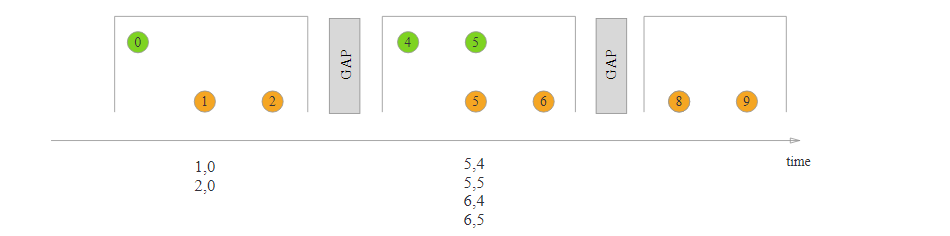
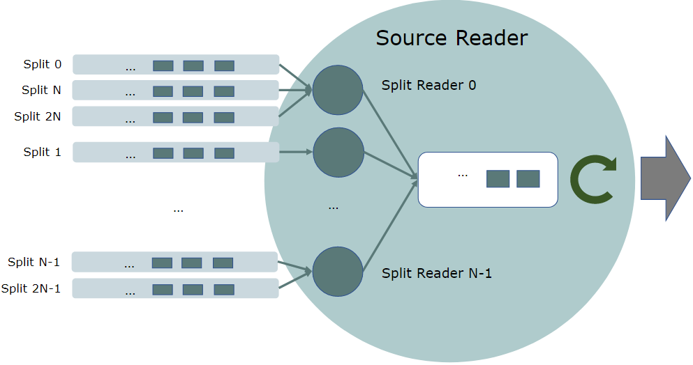

## Application Development 1 - DataStream API

## 五. DataStream 

>  Flink DataStream API 流处理编程

### Overview

#### 1 **DataSource**

实现SourceFunction. 有很多来源:

1. File-based
2. Socket-based
3. Collection-based
4. Custom....

#### 2 DataStream Transformation: 数据流的转换就看Operator

#### 3 **DataSinks**

自己去实现就好了

#### 4 **迭代 Iterations**

迭代流程序实现步进函数并将其嵌入到`IterativeStream`,  需要指定流的哪个部分反馈到迭代, 哪个部分使用`split`转换或转发到下游`filter`.

```java
// 首先, 我们定义一个IterativeStream
IterativeStream<Integer> iteration = input.iterate();
// 业务代码, 循环内执行的逻辑
DataStream<Integer> iterationBody = iteration.map(/* this is executed many times */);
// 关闭迭代并定义迭代尾部, closeWith(feedbackStream)
iteration.closeWith(iterationBody.filter(/* one part of the stream */));
DataStream<Integer> output = iterationBody.filter(/* some other part of the stream */);
```

#### 5 **执行参数 execution parameter**

environment里面又ExecutionConfig, 可提供runtime的配置 ExecutionConfiguration可以在执行管理(ManagingExecution)文档里面

#### 6 **容错**

State & Checkpoints

#### 7 **延迟控制(Controlling Latency)**

因为数据单元会被缓存集体传输, 所以可能会有延迟问题.

所以可以设置缓冲区来手动掌控: **env/operator**.setBufferTimeout(timeoutMillis)

#### 8 **调试Debugging**

Flink通过支持IDE内的本地调试

1. 本地运行环境

2. Collection DataSource: 

   Flink提供了特殊的数据源, 这些数据源由Java集合支持, 方便测试

3. IteratorDataSInk(sink)

   ```java
   DataStream<Tuple2<String, Integer>> myResult = ...
   Iterator<Tuple2<String, Integer>> myOutput = DataStreamUtils.collect(myResult)
   ```

### Event Time

#### 0. Overview

1. **三个时间概念**

   1. Processing time(处理时间): 算子计算record的时间

   2. Event time(时间事件):事件发生的时间

   3. Ingestion time(摄取时间): 再source的时候

   4. 设置时间特征

      数据流源的行为方式(例如, 它们是否将分配时间戳), 窗口 算子操作应该使用的时间概念

      ```java
      env.setStreamTimeCharacteristic(TimeCharacteristic.ProcessingTime);
      ```

      时间戳分配和watermark生成的指南在之后介绍

2. **EventTime 和 Watermark**

   Flink实现了Dataflow Model, event time 和 watermarks可以看下面的文章

   - [Streaming 101](https://www.oreilly.com/ideas/the-world-beyond-batch-streaming-101) by Tyler Akidau
   - The [Dataflow Model paper](https://research.google.com/pubs/archive/43864.pdf)

   **EventTime** : todo, 看不太懂现在.

   衡量事件时间进度的机制是**Watermark**, watermark是数据流的一部分, 带有时间戳*t.* 有点类似一个屏障, 意味着流里面, watermark的时间t之前的数据都存在了, 无序流里面用到, 在watermark到了之后operator可以把internalEventTimeClock调到watermark的时间.

   

3. **Watermark In Parallel Stream**

   watermark在sourceFunction之内/之后生成, 每一个source的并行流都独立的生成watermark. 这些watermarks定义了eventTime, 在watermark流过operator的时候, 它更新了operator的eventTime.然后这个operator为下流的operator生成新的watermark, 消费多个流的operator的eventTime就是接受到最小的watermark的time

   

   注意, kafkaSource支持按照partition分watermark, 后文有提.

4. **Late Elements**

   迟到的元素也需要容错处理, 后面会提到.

5. **Idling Source(闲置的source)**

   如果只有数据来的时候生成watermark, 那么间歇时候window operator就不会被triggered.所以需要periodic watermark assigner.`SourceFunction.SourceContext#markAsTemporarilyIdle`, 后面的Allowed Lateness会讲

6. **Debugging Watermarks**

   后文Debugging篇会有

7. **How operators are processing watermarks**

   windowOperator收到watermark之后会评估触发那些window, 在处理完数据之后才会发送下游的watermark. 具体的实现在:`OneInputStreamOperator#processWatermark`， `TwoInputStreamOperator#processWatermark1`和`TwoInputStreamOperator#processWatermark2`

#### 1. Generating Timestamps / Watermarks

本小节是和run在EventTime的程序相关的. 设置run on EventTime需要在env上面设置

```java
final StreamExecutionEnvironment env = StreamExecutionEnvironment.getExecutionEnvironment();
env.setStreamTimeCharacteristic(TimeCharacteristic.EventTime); // 设置eventTime
// TimeCharacteristic这个Eum里面的三个时间, Operations like windows group the elements based on that time. 懂就好.
```

1. **Assigning Timestamps**:

   按照eventTime处理, 每个流里面的record要有一个eventTimestamp assigned(毫秒单位), 一般就是element里面的某个filed.

   分配timestamp和生成watermark有两种方式

   1. **SourceFunction With Timestamps and Watermarks**

      Stream Source可以调用context方法分配timestamp到element上面, 然后再把它发给下流. 也可以发送watermarks. KafakSourceFunction它集成了TimestampAssigner, emmmm自己实现吧

      ```java
      @Override
      public void run(SourceContext<MyType> ctx) throws Exception {
      	while (/* condition */) {
      		MyType next = getNext();
              // 标记eventTime用collectWithTimestamp
      		ctx.collectWithTimestamp(next, next.getEventTimestamp());
      		if (next.hasWatermarkTime()) 
                  // 发送watermark用emitWatermark()
      			ctx.emitWatermark(new Watermark(next.getWatermarkTime()));
      	}
      }
      ```

   2. **Timestamp Assigners / Watermark Generators**

      Timestamp Assigner接收流, 标记好timestamp之后generate新的流, 会覆盖接收的流里面的watermark和timestamps. 一般放在source后面, 其他情况也有放在Map和Filter之后. 

      ```java
      // 拿到流了, 可以filter一下(也是拿到流), 使用assignTimestampsAndWatermarks方法把自己实现的assiger放进去, 生成新的流.
      DataStream<MyEvent> withTimestampsAndWatermarks = stream
              .filter( event -> event.severity() == WARNING )
              .assignTimestampsAndWatermarks(new MyTimestampsAndWatermarks());
      
      ```

      1. **With Periodic Watermarks**: `AssignerWithPeriodicWatermarks`  这个接口可以做周期的.
      2. **With Punctuated Watermarks**: `AssignerWithPunctuatedWatermarks` 这个接口可以修改element的timestamp

   3. **Timestamps per Kafka Partition**

      上面说的, kafkasource它自己实现的....

      Topic下每一个partition可能有自己的event time pattern, 可以使用 Kafka-partition-aware watermark generation, 然后watermarks在KafkaConsumer之内生成, 每一个partition的watermarks 被 merge.

      TODO 没看太明白, 说下一节会写.

#### 2. Builtin Watermark Generators (内置的watermark生成器)

上一节讲了可以通过实现接口去自定义assign给消息timestamps和自己定义提交watermarks. 但是为了更方面, flink带来了一些自己实现的timestamp assigners.本小节就介绍一下. 可以开箱即用, 也可以给自定义做借鉴.

1. **Monotonously Increasing Timestamps**(单调递增的timestamps)

   周期性watermark创建的最简单的例子就是 在records的timestamps是递增的. 当前的message的timestamp就可以当作watermark. 

   当然, 这种递增只需要在自己的并行度里面递增就好了. 比如说Kafka为源把, timestamp只需要在每个partition内是递增的就好了, 在stream做那种connect/union/merge/shuffle什么的时候, flink的watermark merging mechanism(机制) 会自己生成正确的watermark的.

2. **Fixed Amount of Lateness**(允许固定数量迟到msg的那种情况)

   周期性watermark 创建另一个例子就是watermark落后流过的最大timestamp一定的时间. 这种情况就是最大延迟了. 这种情况cover了流当中最大延迟的情况. 

   todo 后半段我看不懂了. 囫囵吞枣了, 用到自定义watermark的时候吧, 现在好像没有watermark之类的计算.

### State & Fault Tolerance (state和容错)

#### 0. Overview

本节主要介绍Flink提供的状态编程API, 状态流处理在Concepts里面介绍过

本节里面会讲:

1. 怎么使用state, 区分几种不同的state
2. 如何连接broadcastStream和non-broadcastStream, 并用state在其中交换信息
3. 怎么配置checkpoint用域容错
4. 怎么在runtime的时候从flink之外拿到state
5. 介绍state type怎么进化的
6. 讨论一下怎么实现自定义的序列化, 尤其是序列化的进化.

#### 1. Working with State

##### 1.1 **Keyed DataStream**

用KeyedState, 首先用.keyBy(keySelector)来指定datasource里面的一个key用来分类state(也分类recods themselves), 指定之后就变成了keyedDataStream, 然后就可以操作keyedState了

keySelector顾名思义啊, 就是用record自定义一个key.

Flink的数据模型不是建立在k-v对上面的, 所以我们不需要吧record编程key-value, 这里指定的key是虚拟的, 可以理解为建立在data上面的function.

- Tuple Keys 和 Expression keys

  这两种key是两个特殊key, 他们是用tupleFields索引, 和expression来指定field, 现在不被建议使用了. tuple就像一个wapper类, 包含着n多个file.

##### 1.2 **Using Keyed State**

keyedState 接口提供了对所有类型state的access在当前这个element的key存在的生命周期里, 者意味着keyedState只能在KeyedStream里面用.

现在, 我们先看不同类型的state有哪些, 然后在看怎么用它们.

1. ValueState<T>: 这个state就存一个value, 可以更新可以读取(它的scope是上面说的key的scope里).
2. ListState<T>: 存一个list的elements, 可以追加element, 也可以遍历.也可以更新
3. ReducingState<T>: 存着一个代表所有添加到这个state的value的聚合, 类似于listState, 但是add之后就把所有元素使用ReduceFunction来变成一个聚合了.
4. AggregatingState<IN, OUT>: 这个state存1个value, 这个value也是所有add进来的value的聚合, 但比ReducintState, 聚合类型可以于element的类型不同, 使用AggregateFunction执行聚合吧In转成OUT类型的聚合结果.
5. MapState<UK, UV>: 存a list of mapping, 往里面存kv, 也可以遍历, 就和Map的接口差不多的功能.

上面这五种state可以用clear()方法清除当前Key下面的state.(这个key是当前input进来的element的key)

> 感觉就是, 在KeyBy()之后生成的stream里面, 可以有五种state, state 存这存那, 也可以清除.都是key为维度(key的scope就是state的scope)的.

上面五种stateObj 是state的操作obj, 真正的state可以存在内存里, 也可以存在硬盘里/云上whereever. 然后第二个需要明白的是 state的value是按照element的key分的, 

要拿到一个state handle就要创建一个stateDescriptor(state描述符), 这个描述符holds state的name, 也hold state的value的type, 也可以用户自定义function, 比如ReduceFunction. 这个stateDescriptor有valueStateDescriptor/list/reducing/map

state可以通过RuntimeContext 拿到, 实现了RichFunction的function里就能拿到RuntimeContext.

- **State Time-To-Live(TTL)**

  每种state都可以设置过期时间, 时间到了之后 state就会被clean up on best effort basis(尽力清理掉)

  map和list的state可以设置每个entry的TTLs.

  需要build一个stateTtlConfig obj, 然后TTL可以通过stateDescriptor开启(把stateTtlConfig传进去)

  ```java
  StateTtlConfig ttlConfig = StateTtlConfig
      .newBuilder(Time.seconds(1))
      .setUpdateType(StateTtlConfig.UpdateType.OnCreateAndWrite)
      .setStateVisibility(StateTtlConfig.StateVisibility.NeverReturnExpired)
      .build();
      
  ValueStateDescriptor<String> stateDescriptor = new ValueStateDescriptor<>("text state", String.class);
  stateDescriptor.enableTimeToLive(ttlConfig);
  ```

  stateTtlConfig 可以设update的时间, 默认OnCreateAndWrite. 

  **notes:**

  1. state 需要存储上次修改的timestamp, 提高state的存储空间, 在Heap中的state附加一个Javaobj连接stateObj和timestam, RocksDB存储的state每个value需要多存8bytes
  2. TTL只支持以ProcessingTime为基准的.
  3. 如果使用支持TTL的stateDescriptor去恢复没有TTL的state会抛出兼容错误StateMigrationException
  4. TTL不属于Checkpoint/Savepoint, 知识当前flink运行的一个小功能.
  5. 只要valueSerializer能序列化null, 那么TTL的mapState就支持null做value. 不支持就用NullableSerializer包装一下null.

- **Cleanup of Expired State(过期state怎么清理)**

  默认情况下过期的value在read的时候清理, 比如ValueState#value, 也可以在StateTtlConfig配置周期的GC. 

  Heap state 依赖invremental 清理, RocksDB state backend 使用compactive filter(压缩过滤器)来后台清理

  **1. cleanup in full snapshot**: 在take full state snapshot的时候可以启动清理来减小size, 从snapshot恢复的时候localState不会清理, 但不会把过期的state也恢复. 也需要在StateTtlConfig里面配置: 但是不适用在RocksDB state的增量checkpoint.??? todo: 之后再了解snapshot和checkpoint的关系.

  ```java
  StateTtlConfig ttlConfig = StateTtlConfig
      .newBuilder(Time.seconds(1))
      .cleanupFullSnapshot() // 在做snapshot的时候会清理.
      .build();
  // 清理策略可以开启/关闭在flink job runtime的时候.
  ```

  **2. incremental cleanup:** 也可以trigger 一些不断增加的state entries的cleanup, 这个trigger可以在每次拿state的时候使用. 在某个state正在cleanup的时候, storageBackend是懒遍历的, 就是先让iterator开始, 然后在过程中cleanup.

  ```java
   StateTtlConfig ttlConfig = StateTtlConfig
      .newBuilder(Time.seconds(1))
      .cleanupIncrementally(10, true) // 每次trigger之后检查10个entry, true在每次record process的时候trigger一下cleanup.默认不是这样的, 默认不会每次process的时候cleanup.
      .build();
  ```

  1. **Note:**
  2. 也就是如果没有record process, 也没有 access to state, 那么就不会清理, 过期也就在那放着
  3. 开启incremental cleanup会增加latency哦
  4. intemental cleanup 只在Heap state backend的时候实现了这个功能, RocksDB没这个.
  5. 既是heap state又是正在同步snapshotting的时候, global iterator会留着所有key的copy(占内存哦), 因为state不支持并发修改. 异步的snapshot就没这个问题
  6. cleanup strategy(清理策略)可以热更新哦

  **3. Cleanup during RocksDB compaction(在RocksDB压缩的时候cleanup)**: 在RocksDB的时候, Flink自己的一个压缩filter会在后台运行, 目的就是cleanup. rocketDB定期的就会run一下异步的这种压缩来merge一下新的state, 然后也减少storage. 压缩filter用TTL来检查state entry的timestamp, filter out the expired values.

  ```java
  StateTtlConfig ttlConfig = StateTtlConfig
      .newBuilder(Time.seconds(1))
      .cleanupInRocksdbCompactFilter(1000) // 在process1000条stateEntry的时候就会query一下当前的timestamp, 用这个时间去后台的压缩filter
      .build();
  ```

  这种query timestamp在process state越频繁的时候也越频繁, 但query会用JNI 调用native code, 降低压缩效率.

  1. **Note:**
  2. TTL的压缩filter会降低压缩的速度, 它要检查每个state 每一个 entry的最后一次access的timestamp和过期时间.
  3. 如果state是长度不固定的byte数组, TTLfilter在每个state entry检查的时候需要使用JNI调用Flink的javaSerializer. 
  4. RocksDB state bakend的情况下, 这种清理策略也可以热更新

- **State in the Scala DataStream API**

  scala 有更简洁的API用在只维持一个ValueState 的 map()/flatMap() 之后的keyedStream. userFunction可以拿到valueState, 但必须返回一个新的value来更新state

  ```scala
  val counts: DataStream[(String, Int)] = stream
    .keyBy(_._1) // keyby之后就是keyedStream了, 就有keyed state了.
    // mapWithState就是那个简洁的api
    .mapWithState((in: (String, Int), count: Option[Int]) => 
      count match { // 啊, 我看不懂scala
        case Some(c) => ( (in._1, c), Some(c + in._2) )
        case None => ( (in._1, 0), Some(in._2) )
      })
  ```

##### 1.3 **Operator State(non-keyed state)**

Operator state绑定在每一个parallel的operator 上面. 如果有2个operator, parallel是5, 那就有10个state基准. KafkaConnector是一个Operator State的使用范例, 每一个并行度的KafkaCosumer都在state里面maintains一个map , 保存着topic partitions和offset.

Operator state的接口也支持在parallel变动的时候重新分配state, 这个重新分配有几种不同的实现方式.

Operator state是一个很特殊的state, 大多数情况下只用在Source/Sink的实现里面, 或者是其他没有一个key来做state的partition的时候才会用.

##### 1.4 **Broadcast State**

Broadcast state是特殊的**OperatorState**. 被用来把一个stream的state传播到下游的task里面. BroadcastState和普通的OperatorState不同的是:

1. 有map format
2. 只在有broadcastedStream 作为input的operator里面是available的
3. 可以有broadcastState的operator里面可以有好多个broadcast state

##### 1.5 **Using Operator State**

要使用operator state, stateful function可以通过实现CheckpointedFunction接口(这个接口里initializeState方法

- **CheckpointedFunction:** 这个接口提供了`non-keyed state`的access, 需要实现两个方法

  ```java
  void snapshotState(FunctionSnapshotContext context) throws Exception;
  void initializeState(FunctionInitializationContext context) throws Exception;
  ```

  在每次checkpoint的时候, 就调用snapshotState(), 对应的, initializeState是在每次user-defined function初始化的时候调用, 包括第一次初始化, 还有从checkpoint 恢复的时候.

  现在, 支持list-style的operator state. 这个state是一个list的可序列化obj, 互相之间没有关系. 因此在rescaling(重新调整大小)的时候才是可行的, 随便分配. 根据state access method的不同, 有几个重新分配的方案:

  1. **Even-split redistribution**(均分): 每一个operator都返回一个list的state elements. 这些elements均分给每个parallel的sublist. 每一个operator拿到一个子集.
  2. **Union redistribution(拿到所有):** 在restore/redistribution的时候, 每一个operator拿到完整的state elements. 如果有很多state的时候不要用. checkpoint元数据会存一个offset指向list entry, 挺占RPC framesize 和内存的.

  ```java
  // 这是一个例子, stateful sinkFunction使用checkpointedFunction来缓存element, 用的是even-split redistribution
  public class BufferingSink implements SinkFunction<Tuple2<String, Integer>>, CheckpointedFunction {
      private final int threshold;// 最多缓存的数量
      // operator state
      private transient ListState<Tuple2<String, Integer>> checkpointedState;
  	// 内存里的elements
      private List<Tuple2<String, Integer>> bufferedElements;
  	// 发送数据的sink方法
      @Override
      public void invoke(Tuple2<String, Integer> value, Context contex){
          // 1. 现在buffer里面存起来
          bufferedElements.add(value);
          // 2. 到了阈值之后就开始发送出去
          if (bufferedElements.size() == threshold) {    
              // send all bufferedElemets to the sink, then clean it.
              bufferedElements.clear();
          }
      }
      // 做snapshot的方法
      @Override
      public void snapshotState(FunctionSnapshotContext context) throws Exception {
          // 先把state里面清空, 然后把缓存里面的备份到里面
          checkpointedState.clear();
          for (Tuple2<String, Integer> element : bufferedElements) {
              checkpointedState.add(element);
          }
      }
      // 初始化/恢复state的时候
      @Override
   public void initializeState(FunctionInitializationContext context){
          // 创建Descriper, 然后从context里面拿state.
          ListStateDescriptor<Tuple2<String, Integer>> descriptor =
              new ListStateDescriptor<>(
                  "buffered-elements",
                  TypeInformation.of(new TypeHint<Tuple2<String, Integer>>() {}));
          checkpointedState = context.getOperatorStateStore().getListState(descriptor);// 默认拿到平分的state
  		// 如果是恢复的话, 就把state里面的放到缓存里.
          if (context.isRestored()) {
              for (Tuple2<String, Integer> element : checkpointedState.get()) {
                  bufferedElements.add(element);
              }
          }
      }
  }
  ```

  和keyedState相同, 使用Descriper去包装state的信息.

  下面还有一个Stateful Source Function的例子, 就不写在这里了, 太长了. 

  note: checkpoint完成之后发布事件到`CheckpointListener` 

#### 2. The Broadcast State Pattern(BroadcastState的模式)

>  本小节介绍怎么使用BroadcastState, 上一小节介绍了broadcastState, Concepts里面的StatefulStreamProcessing里面也介绍了stateful的流处理.

##### 2.1 Provided APIs(提供的API)

先从一个例子开始, 我们有一个流处理, 处理不同的颜色和shapes, 我们需要找到遵循一个特定pattern的相同颜色的objs, 比方说蓝色的方块.

```java
// 1. key item by color, 这样可以把相同颜色的element归类到一个物理机上去计算
KeyedStream<Item, Color> colorPartitionedStream = itemStream
                        .keyBy(new KeySelector<Item, Color>(){...});
// 2. 然后看要求, 按照color分类后的数据应该被broadcasted到下游所有的task里, 下游的task应该在本地保存, 来保证拿item去和所有的itesm对比.
// 所以需要:1.广播rules, 2.使用提供的MapStateDescriptor去创建broadcastState来存储rules.
// MapDescriptor存储rule, 名字做key
MapStateDescriptor<String, Rule> ruleStateDescriptor = new MapStateDescriptor<>(
			"RulesBroadcastState",
			BasicTypeInfo.STRING_TYPE_INFO,
			TypeInformation.of(new TypeHint<Rule>() {}));
// 把rule广播到下游
BroadcastStream<Rule> ruleBroadcastStream = ruleStream
                        .broadcast(ruleStateDescriptor);
// 3. 我们要把rule应用在colorPartitionedStream上面, 需要连接两个流, 指定我们的匹配检测逻辑
// 把broadcastStream connect到普通的stream上, 拿到一个broadcastConnectedStream, 这个流可以用CoProcessFunction做计算
DataStream<String> output = colorPartitionedStream.connect(ruleBroadcastStream)
                 .process(
                     // type arguments in our KeyedBroadcastProcessFunction represent: 
                     //   1. the key of the keyed stream
                     //   2. the type of elements in the non-broadcast side
                     //   3. the type of elements in the broadcast side
                     //   4. the type of the result, here a string
                     new KeyedBroadcastProcessFunction<Color, Item, Rule, String>() {
                         // my matching logic
                     }
                 );
```
##### 2.2 BroadcastProcessFunction and KeyedBroadcastProcessFunction

这两个是broadcastStream connect到普通的stream里面拿到的, 有两个方法要实现, 处理broadcastElement(在我们上面那个例子就是rule),
处理element的方法.

```java
public abstract class BroadcastProcessFunction<IN1, IN2, OUT> extends BaseBroadcastProcessFunction {
    public abstract void processElement(IN1 value, ReadOnlyContext ctx, Collector<OUT> out) throws Exception;
    public abstract void processBroadcastElement(IN2 value, Context ctx, Collector<OUT> out) throws Exception;
}
public abstract class KeyedBroadcastProcessFunction<KS, IN1, IN2, OUT> {
    public abstract void processElement(IN1 value, ReadOnlyContext ctx, Collector<OUT> out) throws Exception;
    public abstract void processBroadcastElement(IN2 value, Context ctx, Collector<OUT> out) throws Exception;
    public void onTimer(long timestamp, OnTimerContext ctx, Collector<OUT> out) throws Exception;
}
```
接口里面处理两个流的方法不同, 一个是ReadOnlyContext一个是普通的ctx, readOnly的不能修改broadcastState, 是因为flink没有跨task的通信.
所以修改只在broadCast一侧, 
...
本小结介绍broadcastState主要注意下面:

1. **没有跨任务的通信**, 也要确保对broadcaststate的修改必须是确定的, 比如来了一个elementA, 所有的task都一样的修改.
2. **BroadcastState里面放的东西的顺序在不同的task里面可能会不同.**  广播模式的stream只保证了所有的element可以流向下游, 但到了下游的顺序可能会不同, 所以state也会不同, 所以state不能依赖elements的顺序.
3. **每一个并行度的task 都需要checkpoints他们自己的broadcast state**: 虽然在checkpoint的时候, 所有的task的broadcastState里面放的都一样的东西, 所有的task需要存起来broadcastState 去避免task恢复的时候从同一个file里面读出现热点数据, 这增加了checkpoints的size为P倍(p=parallelism), flink保证没有重复和缺失数据. 恢复的时候, 每个task(一个并行度里面的)就读自己的, 如果并行度提高了, 就P_new-p_old的去读.
4. **不能用RocksDBStateBackentd**: 因为broadcastState需要保存在内存里实时更新, 所有的operatorState也都是保存在内存里的哦~~~

#### 3. CheckPointing

Flink里面所有的operator和function都可以是有状态的(可以看上上小结的workWithState), stateful的function在处理单个的element的时候把data存起来, 来为更多的操作提供buildingBlock.
为了让state可以容错, 需要checkpoint这些state, 然后就可以恢复state, 并且可以回复到流的处理位置上面.
##### 3.1. Prerequisites(前提条件)
Flink的checkpointing mechanism(机制) 要和durable storage(持久存储)交互来存储state.
1. 可以重发指定时间的数据的持久dataSource. 可以是MQ或者是FileSystem
2. state的持久存储, 一般是分布式文件存储系统(distributed filesystem, e.g., HDFS, ...)

##### 3.2. Checkpointing的开启和配置
checkpointing默认关闭, 可以调用env的enableCheckpointing(n)方法开启.参数n是checkpointing的间隔(毫秒)
还有一些配置参数:
1. exactly-once vs. at-least-once: 确保的级别, 一般用exactly-once就好
2. checkpoint timeout: 超时之后就会挺掉.
3. minimum time between checkpoints:
4. number of concurrent checkpoint: 默认不允许并行, 这个就是1.
5. externalized checkpoints: 定期的外存checkpoints, 外部checkpoints把元数据输出到永久存储, 在jobFail的时候不会自动清除, 如果jobFail的话就用它resume, 可以在Deployment&Operations大章里面介绍操作.
6. fail/continue task on checkpoint errors: 这个参数来判断一个task的checkpointing的时候如果报错, task是不是要fail .默认就是开启的, 如果关闭task就简单的拒绝checkpointCoordinator的checkpoint要求, 然后就接着run
7. prefer checkpoint for recovery: 失败重启的时候, job会选择latestcheckpoint, 也可以选择更远的.
8. unaligned checkpoints: 未对齐的checkpoints, 在背压大的时候可以开启unalignedCheckpoints来加快, 只能是exactly-once的确保级别. concurrent也只能是1
```java
StreamExecutionEnvironment env = StreamExecutionEnvironment.getExecutionEnvironment();
env.enableCheckpointing(1000);
// advanced options:
env.getCheckpointConfig().setCheckpointingMode(CheckpointingMode.EXACTLY_ONCE);
env.getCheckpointConfig().setMinPauseBetweenCheckpoints(500);
env.getCheckpointConfig().setCheckpointTimeout(60000);
env.getCheckpointConfig().setMaxConcurrentCheckpoints(1);
env.getCheckpointConfig().enableExternalizedCheckpoints(ExternalizedCheckpointCleanup.RETAIN_ON_CANCELLATION);
env.getCheckpointConfig().setPreferCheckpointForRecovery(true);
env.getCheckpointConfig.enableUnalignedCheckpoints();
```

###### Related Config Options:
其他更多的参数也可以通过 `conf/flink-conf.yaml` 配置, 可以看Configuration那一章
state.backend,  state.backend.async, ...

##### 3.3. 选择 State Backend:
Flink的checkpoint机制把所有timmer和statefulOperator里面的state的一致快照(consistent snapshots) 存起来, 包括connectors, windows, 还有所有的用户自定义state. stateBackend的配置就配置存在哪里(JobManagerMemory, fileSystem, database)
默认, state存在taskmanager的内存里, checkpoint存在JobManager的内存里. 为了存储更大的state, Flink支持多种存储, 可以通过env的setStateBackend()方法配置.
下面一个小节会介绍stateBackend.

##### 3.4. State Checkpoints In Iterative Jobs(迭代job中的状态检查点):
Flink现在只提供了非迭代job的计算保证, 在迭代工作里开启checkpointing会导致exception. 如果要强制checkpointing的话, 用户需要在开启checkpoints的时候设置一个特殊flag:
`env.enableCheckpointing(interval, CheckpointingMode.EXACTLY_ONCE, force = true)`
在故障的时候, 循环边缘正在处理的record和相关的state会丢失.
Please note that records in flight in the loop edges (and the state changes associated with them) will be lost during failure.

##### 3.5. 重启策略(Restart Strategies)
后面的ManagingExecution会有一章讲

#### 4. Queryable State Beta
> 这个是测试功能, 没有guarantee
> 这个功能简单的来说就是把Flink管理的 KeyedState暴露给外部, 允许用户查询. 查询state消除了分布情况下的操作/事务需求. 外部存储系统的操作或事务,常常成为实践中的瓶颈. 除此之外,这个功能还会用在debug上面.
> 注意, 在查stateObject的时候, 这个obj被多线程接触, 没有同步锁/拷贝什么的. 这是设计的, 为了不增加jobLatency.
> 使用JavaHeap的stateBackend(比如MemoryStateBackend/FsStateBackend)都不支持检索value的时候拷贝, 读-修改-写的模式不安全会导致queryableState server并发出错.
> RocksDBStatebackend 没有这种问题哦

##### 4.1. Architecture(架构)
使用QueryableState之前先介绍一下构成的entity, 这个功能包含:
1. QueryableStateClient: 提交user的queries
2. QueryableStateClientProxy: 在每一个TaskManager里, 负责接收client的query, 从负责的taskManager里拿到查询的state, 返回给client.
3. QueryableStateServer: 在每个TaskManager里面, 负责定位存储的state

流程就是, client连接到一个proxy, 然后发送指定key的request,(因为state是keyedState, keyedState在KeyGroups里面, 每一个taskManager都assigned了一些keyGroups). 想要发现keyedState属于的keyGroup所在的TaskManager, clientProxy先问JobManager. 拿到了答案之后, clientProxy查询taskManager运行的QueryableStateServer里面的state, 然后把结果返回给client.

##### 4.2 Activating Queryable State(激活QueryableState)

开启Flink集群里面的queryableState需要:

1. flink-queryable-state-runtime_2.11.jar包拷贝到flink的lib文件夹
2. 配置`queryable-state.enable`
3. 验证开启, 看日志里面有没有: `Started the Queryable State Proxy Server @ ...`

##### 4.3 Making State Queryable(让state变得可查询)

在flink集群里面开启了queryableState之后, 就可以使用了, 为了让state可以被外界看到, 要显式的:

1. QueryableStateStream可以看成一个方便的sink, 把输入的value变成queryable的state. 

   ```java
   // keyStream.asQueryableState(stateName, stateDescriptor)就可以拿到QueryableStateStream.
   // ValueState
   QueryableStateStream asQueryableState(
       String queryableStateName,
       ValueStateDescriptor stateDescriptor)
   stream.keyBy(0).asQueryableState("query-name")// 这个, 每一个元素都类似于调用valueState.update(value); 因为都是同一个key下面的嘛
   // 也有FoldingState, ReducingState
   ```

   拿到了QueryableStateStream之后就不能在transform了.

2. 调用`stateDescriptor.setQueryable(String queryableStateName)`方法, 把keyedstate变成可查询的. 

   ```java
   ValueStateDescriptor<Tuple2<Long, Long>> descriptor =
   new ValueStateDescriptor<>( "average", // the state name
   	// type information
   	TypeInformation.of(new TypeHint<Tuple2<Long, Long>>() {})); 
   // 设置 queryable state name, 可以设置所有类型的state哦~
   descriptor.setQueryable("query-name"); 
   ```

##### 4.4 Querying State (使用QueryState)

已经有了queryableState, 现在就可以查了. 使用QueryableStateClient的helperClass, 

1. 依赖

   ```xml
   <dependency>
     <groupId>org.apache.flink</groupId>
     <artifactId>flink-queryable-state-client-java</artifactId>
     <version>1.11.0</version>
   </dependency>
   ```

2. `QueryableStateClient`可以把我们的查询提交给内部的clientProxy, 它会代理我们的查询. 只能查不能改

   ```java
   // 指定一个taskManager, 这个client就去找那个taskManager里面的proxy了.
   QueryableStateClient client = new QueryableStateClient(tmHostname, proxyPort);
   // 创建好client就可以查询了, 返回的是一个Future, 会拿到stateValue,  descriptor里面就放着
   CompletableFuture<S> getKvState(
       JobID jobId,
       String queryableStateName,
       K key,
       TypeInformation<K> keyTypeInfo,
       StateDescriptor<S, V> stateDescriptor)
   ```

3. 例子:

   ```java
   // 1. operator的open里面安排一个keystate可以查询, sum就是那个state, descriptor就是暴露给外面的那个描述符.
   	@Override
       public void open(Configuration config) {
           ValueStateDescriptor<Tuple2<Long, Long>> descriptor =
                   new ValueStateDescriptor<>(
                           "average", // the state name
                           TypeInformation.of(new TypeHint<Tuple2<Long, Long>>() {})); // type information
           descriptor.setQueryable("query-name");
           sum = getRuntimeContext().getState(descriptor);
       }
   // 2. 就可以查了
   CompletableFuture<ValueState<Tuple2<Long, Long>>> resultFuture =
           client.getKvState(jobId, "query-name", key, BasicTypeInfo.LONG_TYPE_INFO, descriptor);
   // now handle the returned value
   resultFuture.thenAccept(response -> {
           try {
               Tuple2<Long, Long> res = response.get();
           } catch (Exception e) {
               e.printStackTrace();
           }
   });
   ```

##### 4.5 Configuration (配置)

QueryableStateOptions里面有配置参数, 来影响`state server` 和 `clientProxy`

1. **StateServer**

   用到再查就好了

   queryable-state.server.ports, queryable-state.server.network-threads, queryable-state.server.query-threads

2. **Proxy**

   .proxy.ports, .proxy.network-threads, .proxy.query-threads

##### 4.6 Limitations 不适用的地方

1. queryableState的生命周期绑定在job的生命周期, 之后的版本可能把两者解耦.
2. 拿到的future里面会告诉我们state, 在未来这个会改进, 在查询和确认更加的可靠
3. server和client在持续跟踪查询到的信息的统计数据, 默认关闭了, 如果有更好的查询支持通过MetricsSystem, 就应该开启这些查询统计数据.

#### 5. State Backends (state的存放)

Flink提供了不同的State Backends, 用于指定状态的存储方式和位置. 可以存在JVM 的Heap里, 也可以存在外面.  取决于stateBackend的设置.

Flink也能自己存这些state, 这说明Flink在memory里面能掌握大量的state(也可以输出到disk里面)

`flink-conf.yaml` 配置文件里可以配置参数.

```java
StreamExecutionEnvironment env = StreamExecutionEnvironment.getExecutionEnvironment();
env.setStateBackend(...);
```

#### 6. State Schema Evolution (state的schema进化)

Flink流程序被设计来处理长时间数据, 做长时间运行的server. 程序也需要update来适应变化的需求. data schema也是这样的, 需要随着application的变化来进化改变.

本小节向我们展示了怎么去进化我们的state的dataSchema. 现在的修改可以更改type也可以更改stateStructure(value/list/...);

本小节的这些信息在你需要用Flink自己的Serialization的stateSerializer的时候才会用到. 就是说, 在创建state的时候, stateDescriptor不要使用特殊的`TypeSerializer` or `TypeInformation`, 在这种情况下, Flink会推断stateType:

```java
ListStateDescriptor<MyPojoType> descriptor =
    new ListStateDescriptor<>("state-name", MyPojoType.class);
checkpointedState = getRuntimeContext().getListState(descriptor);
```

state的schema能不能evolved取决于持久化state的Serializer. 简单地说就是注册的state的schema可以修改当它的serializer支持的时候. schema的修改由Flink的类型序列化框架生成的serializer处理. (废话一堆)

##### 6.1 Evolving state schema

更改state的chema需要的步骤:

1. savepoint一下FlinkJob.
2. 修改state type的schema
3. 把job从savepoint上restore回来, 第一次拿state的时候,flink不管schema变没变都会把state migrate回来.

这个migrate自动的为每个state独立的转换, Flink内部运行, 第一步检查state是不是有不同的schema, 如果不同, 那么就用老的serializer把state读成obj, 然后用新的serializer在写成bytes.

更深的细节可以去看[Custom Serialization for Managed State](https://ci.apache.org/projects/flink/flink-docs-release-1.11/dev/stream/state/custom_serialization.html)

##### 6.2 Support data types for schema evolution (schema修改时候可选的datatype)

schema evolution is supported only for POJO and Avro types. 以后可能会支持更多.

1. **POJO types:**

   1. 可以删除field, 一旦删除了之前那个field就没有了
   2. 可以添加field, state的新的field就是java里面的默认值
   3. 已经存在的fields不能修改了. 
   4. POJO的类名不能修改, 包括class的namespace.

   新的schema只能在从savepoint restore的时候应用, flink要1.8以上.

2. **AVRO types:**

   flink完全支持avro的evolve, 只要schema的修改被Avro认为是兼容的就好.

   唯一限制的是namespace不能改.

   > 注意: keys的schema修改不支持. 比如RocksDBstate依赖objects的对比, 不是hashcode. 所以key变的话对比就会带来不确定因素.


#### 7. Custom Serialization for Managed State (自定义管理state时候的序列化)

本小节是给用户指导怎么去自己定制state的序列化, 包括怎么去提供自定义的stateSerializer, 并且 实现Serializer去 做schemaEvolution. 

##### 7.1 Using custom state serializers (自定义stateSerializer)

在注册managedOperator或者keyedState的时候, stateDescriptor需要指定state的名字, 和state的type. 这些type的信息被Flink的[typeSerializationFramework](https://ci.apache.org/projects/flink/flink-docs-release-1.11/dev/types_serialization.html)用来创建一个合适的serializer.

可以以让Flink来用我们自己的serializer来序列化state, 只需要在创建stateDescriptor的时候指定我们自己的`TypeSerializer`. 

```java
// 自己实现
public class CustomTypeSerializer extends TypeSerializer<Tuple2<String, Integer>> {...};
// 指定给stateDescriptor
ListStateDescriptor<Tuple2<String, Integer>> descriptor =
    new ListStateDescriptor<>("state-name", new CustomTypeSerializer());
// 拿到state的时候就会用我们的
checkpointedState = getRuntimeContext().getListState(descriptor);
```

##### 7.2 State Serializers and schema evolution (state Serializer的实现和schemaEvolution)

这一小小节介绍用户面对的state序列化和schema修改的抽象原理和内部实现细节.

从savepoint恢复的时候, Flink允许修改序列化去读写之前注册的state, 所以同一个state的上车吗也可以改(这不废话么上面都说了). 在state恢复了之后, 一个新的Serializer会注册到这个state上, 通过StateDescriptor.  新的serializer和之前的可能有不同的schema, 所以我们在实现serializer的时候要考虑到schema改变的情况, 

一般, schema修改的情况

1. schema 删减增加字段了.
2. 一般来说, dataSchema修改了之后, serializer也要修改.
3. serializer的版本修改.

为了在序列化的时候拿到state的schema信息, 来看看有没有变, 在执行state的savepoint的时候, serializer在写byte的时候也需要把自己的snapshot写上去. 下面是shapshot, 到时候要实现 然后写上去.:

```java
// 自己要实现, 这里面记载着serializer的信息, 这个snapshot是即时的, 代表用的schema.
public interface TypeSerializerSnapshot<T> {
    // snapshot是即时的, 他代表的schema也可能变, 所以这个snapshot是有版本的.
    // 在restore时候把snapshot从savepoint里读出来, 就看read能不能handle了.
    int getCurrentVersion();
    void writeSnapshot(DataOuputView out) throws IOException;
    void readSnapshot(int readVersion, DataInputView in, ClassLoader userCodeClassLoader) throws IOException;
    TypeSerializerSchemaCompatibility<T> resolveSchemaCompatibility(TypeSerializer<T> newSerializer);
    TypeSerializer<T> restoreSerializer();
}
// 到时候自己序列化的时候, 要拿到snapshotConfig然后写到savepoint里.
public abstract class TypeSerializer<T> {    
    // ...
    public abstract TypeSerializerSnapshot<T> snapshotConfiguration();
}
```

在restore的时候, 检测snapshot里的schema能不能被我们现在的serializer解析, 就通过resolveSchemaCompatibility方法, 

`TypeSerializerSnapshot`里有restoreSerializer方法, 可以把上一次的serializer实例化出来, 然后在schema兼容的时候工作, 把byte读成stateObj, 然后新的serializer再把obj序列化(上一小节说的).

TODO: 下面不会了, 遇到state序列化/schemaEvolution的时候再看吧.


### User-Defined Functions

本小节介绍用户怎么**指定自己写的function去做operations**, 也介绍一下可以窥探FlinkApplication内部的**Accumulator**.

#### 1. 指定自己的function

1. 实现接口:

   `MapFunction`, `JoinFunction`... 之类的原始接口. 可以做一些字面意思上的实现, 加上自己想要的功能.

   匿名内部类/Lambda表达式 也算是这个.

2. RichFunctions

   原始接口, 都有一层Rich包装, 可以实现这个, 就能拿到environment了, 方便简单.

   `RichJoinFunction`, `RichMapFunction`

#### 2. Accumulator & Counters

accumulator就是一个累加器, 在job结束的时候可以拿到.

counter就是最直接的累加器, 每次调用Accumulator.add()来加, 在job结束了之后, 会统计所有并行度里面的结果, 发给client的. 一般在debug的时候用.

Accumulator这个接口, Flink现在有几个内部的实现:

1. IntCounter, LongCounter 和 DoubleCounter.
2. Histogram: 直方图, 可以描述多个离散数据. 内部实现就是一个map, <Integer, Integer>.

```java
// demo
// 1. 在自己的function里, 用到的时候就加
private IntCounter numLines = new IntCounter();
void process(){
    this.numLines.add(1);
}
// 2. function里面, 拿到环境注册一下
getRuntimeContext().addAccumulator("num-lines", this.numLines);
// 3. 结果可以在job执行完后的result里面拿到
myJobExecutionResult.getAccumulatorResult("num-lines");
```

accumulators 是跨operator的, 在一个job里面可以随便用. 但是现在只能是最后job跑完才能拿到结果, 之后会改成迭代结果完之后就提供上一次迭代里的统计结果.

如果想拿到迭代里的结果, 可以用 [Aggregators](https://github.com/apache/flink/blob/master//flink-java/src/main/java/org/apache/flink/api/java/operators/IterativeDataSet.java#L98) 

### Operators

#### 1. Overview

Operator负责流的transform, 生成出新的dataStream, 可以自己用operator组织出自己想要的dataflow拓扑关系.  本小姐介绍基本的transformations, 以及深入Flink的内部看它如何有效的物理分区. 

##### 1.1 DataStream Transformations

| Transformation                            | Description                                                  |
| ----------------------------------------- | ------------------------------------------------------------ |
| **Map**(DataStream → DataStream)          | 属于对value简单的处理, 吃一个吐一个.                         |
| **FlatMap** DataStream → DataStream       | 也是对value的处理, 可以选择吐几个.                           |
| **Filter** DataStream → DataStream        | 还是对value的处理, 主要是过滤掉不合格的.                     |
| **KeyBy** DataStream → KeyedStream        | 对流进行分区. 同一个key的被分派到相同的partition. 默认是hash分区(e,g:dataStream.keyBy(0). |
| **Reduce** KeyedStream → DataStream       | 对keyedStream进行滚动压缩, 拿到一个element可以根据之前消费的value来生产新的value, 有点像kafka的key新版本的覆盖 |
| **Fold** KeyedStream → DataStream         | 感觉和reduce没区别.                                          |
| **Aggregations** KeyedStream → DataStream |                                                              |
| **Window** KeyedStream → WindowedStream   |                                                              |
| ......                                    | 还有好多, 到时候用到再看吧.                                  |


##### 1.2 Physical Partitioning

Flink可以允许我们实现一些底层的Function对transformation之后的流的分区做自己的控制.

| Transformation                                               | Description                                              |
| ------------------------------------------------------------ | -------------------------------------------------------- |
| **Custom partitioning** DataStream → DataStream              | 为流的每一个element选择一个分区(哪个并行度的task).       |
| **Random partitioning** DataStream → DataStream              | 把element均匀分发.                                       |
| **Rebalancing (Round-robin partitioning)** DataStream → DataStream | 轮询, 均等的发给每个partition. 存在数据不均的时候用      |
| **Rescaling** DataStream → DataStream                        | 这就是扩容的部分rescaling, 不会完全的Rebalance. 1:3, 2:6 |
| **Broadcasting** DataStream → DataStream                     | 把element发给每一个partition.                            |

##### 1.3 Task chaining and resource Groups

把多个transformation连起来(堪称一个transformation) 可以把它们放在同一个线程里执行. 

Flink默认的就会把能连在一起的连在一起. `StreamExecutionEnvironment.disableOperatorChaining()` 可以关闭. 可以自己手动的连接两个operation.

| Transformation               | Description                                                  |
| ---------------------------- | ------------------------------------------------------------ |
| 连接两个transformation       | `someStream.filter(...).map(...).startNewChain().map(...);`  |
| 把一个transformation单独起来 | `someStream.map(...).disableChaining();`                     |
| 设置Group共享Slot            | Flink会把一个sharingGroup里面的operations放在同一个slot里面. 其他的不会放在他们的slot里面. 这个可以隔绝slots. group里面的每个operator可以从inputOPerator里面继承(数据)过来. someStream.filter(...).slotSharingGroup("name"); 把一个slot放到一个group里面. |

#### 2. Windows

Windows是无限流里面的核心. windows把流断成一小段一小段的. 我们通过对每一个小段进行计算. 

本小节主要介绍Flink是怎么实现windows的, 程序员怎么最大限度利用windows.

Flink窗口编程的structure长的样子大概是下面代码块里那样: 

```java
# 1. keyed Windows
stream .keyBy(...) // 拿keyed Stream
       .window(...)              <-  required: "assigner"
      [.trigger(...)]            <-  optional: "trigger"
      [.evictor(...)]            <-  optional: "evictor"
      [.allowedLateness(...)]    <-  optional: "lateness"
      [.sideOutputLateData(...)] <-  optional: "output tag"
       .reduce/aggregate/fold/apply()      <-  required: "function"
      [.getSideOutput(...)]      <-  optional: "output tag"

# 1. NoKeyed Windows
stream
       .windowAll(...)           <-  required: "assigner"
      [.trigger(...)]            <-  optional: "trigger" 
      [.evictor(...)]            <-  optional: "evictor"
      [.allowedLateness(...)]    <-  optional: "lateness"
      [.sideOutputLateData(...)] <-  optional: "output tag"
       .reduce/aggregate/fold/apply()      <-  required: "function"
      [.getSideOutput(...)]      <-  optional: "output tag"
```

##### 2.1 Window Lifecycle

消费一个元素的时候, 它所属于的那个window其实就已经创建了, 在用户自定义的的失效时间后, window就完全移除了. Flink的guarantee仅移除time-basedWindow, 不移除其它类型的(比如global).  比方说**创建一个5分钟的window, 允许的lateness是1分钟, 那么[10:00, 10:05]是窗口, 第一个区间内的element进来的时候就创建了, 在watermark过了10:06的时候就会移除掉.**

此外, 每个window都有一个Triggers, 还有一个Function绑定在上面, Trigger指定了window什么时候可以被function消费. 比如说可以理解为"在window里面的element超过了4" 是一个trigger policy. trigger也可以指定什么时候清除Window内的elements(新element也会来).

除了上面之外, 还可以指定一个`Evictor`(驱逐者), 可以在window里面剔除一些element.

下面就开始单独介绍每一个components了

##### 2.2 Keyed vs Non-Keyed Windows

首先要明白我们的stream是不是keyed.

keyed-stream会把相同的key发到同一个并行度的task里面. 如果是no-keyed的就在并行度为1的window function上面处理了.

##### 2.3 Window Assigners

指定了流之后就要制定windowAssigners. 它来定义element怎么被归到哪个window里. 就在调用widow()方法里指定.

Assigner会负责把每个element发送到一个/n个window里面, Flink有一般常用的, tumblingWindows... (除了globalWindows) 都是根据时间来分配elements. 也可以继承`WindowAssigner`来定义. 

timeBasedWindows有开始结束时间规定了window的size. 也提供了一个maxTimestmp()方法来拿允许的最晚时间. 下面介绍几个内置的windowAssigner:

1. **TumblingWindows:** 固定的window size, 没有重叠.

   ```java
   // tumbling event-time windows
       keyedStream.window(TumblingEventTimeWindows.of(Time.seconds(5)))
   // tumbling processing-time windows
    keyedStream.window(TumblingProcessingTimeWindows.of(Time.seconds(5)))
   // daily tumbling event-time windows offset by -8 hours.时区
   keyedStream.window(TumblingEventTimeWindows.of(Time.days(1), 
                                                  Time.hours(-8)))
   ```

2. **Sliding Windows:** 固定间隔, 可以有重叠.

3. **Session Windows:** 按照一个session一个session, 没有overlap, 没有固定的时间gap, 断开一段时间就是另一个session了.

4. **Global Windows:** global嘛.

##### 2.4 Window Functions

上面拿到流了, 也分割好window了, 在`trigger`认为window可以被消费了, 那么Functions就开始处理elements了. 

window function有: ReduceFunction, AggregateFunction, FoldFunction和ProcessWindowFunction, 前两个因为聚合功能, 所以执行效率高一点. 最后一个拿到window里面的elementIterator还有window的metadata就开始工作了. 它比较慢, 因为Flink必须把所有的element都缓存下来, 才执行function. 可以多继承一下前面几个有reduce功能的function, 这样既聚合又有metadata. 

1. **ReduceFunction:** 

   reduce就是消费两个, 然后输出一个. 比如可以消费两个integer, 输出一个sum.

2. **AggregateFunction:** 

   也是个广义上的ReduceFunction, 有3个type: IN, AccumulatorType 还有OUT. 实现createAccumulator来自己创建accumulator. TODO: 没看太懂....

3. **FlodFunction:** 对每一个element处理. 然后接收其他的参数.

4. **ProcessWindowFunction:** 这个就是上面说的, 但是它功能比较全面.

5. **ProcessWindowFunction with IncrementAggregation:** 

   两者结合后, window关闭后, processWindowFunction会给一个聚合结果. 这样可以让processWindowFunction递增的计算窗口的element.

6. **在ProcessWindowFunction里面使用per-windowState:** 可以使用scope是window的state了. 还列举了windows的不同解释, 我觉得都是一样的啊...

7. **老版的WindowFunction:** 没有window-State, 和一些其他的高级功能. 

##### 2.5 Triggers

```java
onElement(); // window每进来一个都会调用
onEventTime; // 在注册event-time timer的时候
onProcessingTime;
// 上面三个, 决定了要不要开始行动: 返回值:
// CONTINUE: do nothing,
// FIRE: trigger the computation,
// PURGE: clear the elements in the window, and
// FIRE_AND_PURGE: trigger the computation and clear the elements in the window afterwards.
onMerge(); // merges the states of two triggers 
clear();     // removal of the corresponding(相应的) window
// 所有的方法都可以注册timmer.
```

1. **Fire and Purge:** fire就是开动的, purge就把前面的都干掉.可以多次开火.

2. **默认的Trigger of WindowAssigners:**  event-time windowAssigner有EventTimeTrigger做默认的trigger, 这些trigger一般在watermark过了window结束的时候就fire一下.

3. **Built-In triggers:** 有些内置的trigger: 

   ```java
   EventTimeTrigger;	// 默认的最后fire一下
   ProcessingTimeTrigger; // 也是
   CountTrigger;		// 在limit完成之后就fire一下
   PurgingTrigger;		// 做个一个参数, 来trigger清空
   ```

##### 2.6 Evictors(驱逐者)

window里面允许指定`Evictor`操作, 可以从window里面在trigger之后在process之前或之后都可以剔除一些Elements.

- evictBefore()

  在后面的function.process()之前

- evictAfter()

  在后面的function.process()之后

- 内置的Evictor:

  CountEvictor: 保留一定量的, 超过就把前面的剔除掉
  DeltaEvictor: 设定一个threshold, element的时间差超过就干掉
  TimeEvictor: 把第一个element之后interval时间外的都干掉

##### 2.7 Allowed Lateness(延迟)

默认, watermark过了之后就扔掉了.  可以为window_operators指定最大的lateness, 也依赖于Trigger, 一个迟到的但没有dropped-element可能会导致window 再fire一次.
为了迎合迟到的, window的state会保留. 也可以配置把side_output_late_data()

- 迟到element的考虑

  window需要保留content
  迟到的来了之后可能会引起late_firing. 
  在session_window里面还会引起window的merge.可能会把两个session连起来??
  需要考虑之后迟到的element的和原有数据的重复

##### 2.8 Work with window result

操作完了之后还是data_stream, 没有带着window 操作的元数据. 
如果想要留下来, 需要自己在result_element里面手动放.之后会介绍之后的时间怎么处理.

- watermarks和window的互相影响

  watermark到了window_operator之后, 会做两个事情:
  会启动所有结束的windows的计算
  然后把watermark发送给下游.

- 多个并行windowed 之后的操作

  在使用两个并行的的window操作之后向用来做点事情, 就把两个window调的一样了就行.

  ```java
  DataStream<Integer> resultsPerKey = input.keyBy(<key selector>)
  .window(TumblingEventTimeWindows.of(Time.seconds(5)))
  .reduce(new Summer());
  
  DataStream<Integer> globalResults = resultsPerKey.windowAll(TumblingEventTimeWindows.of(Time.seconds(5)))
  .process(new TopKWindowFunction());
  ```

- 2.9 state size的实用考虑

  window太大的时候会累积很多的state, 估算储存需求的建议:
  window里面每个element都会copy一份.
  ReduceFunction, AggregateFunction, and FoldFunction每个窗口只存一个值. 
  使用Evictor(剔除者)干掉一些

#### 3. Joining

##### 3.1 Window Join

在同一个window里面, 可以join两个stream里面的相同key的element.

```java
stream.join(otherStream)
    .where(<KeySelector>)
    .equalTo(<KeySelector>)
    .window(<WindowAssigner>)
    .apply(<JoinFunction>)
```

join有点像inner-join. 左边一个右边一个拿
join是窗内的.

- **Tumbling Window Join**

  平行的一块一块的join.

  

- **Sliding Window Join**

  

- **Session window join**

  

##### 3.2 Interval join(间隔join)

A&B, 相同的key下, A中的element1会joinB中在一个间隔内的的elements.

`b.timestamp ∈ [a.timestamp + lowerBound; a.timestamp + upperBound]`


#### 3. Process Function

##### 3.1 The ProcessFunction

ProcessFunction是底层的流处理opeation, 可以拿到构建流里面的: events, state, timer.

##### 3.2 Low-level Joins

CoProcessFunction和keyedCoProcessFunction可以把两个stream join.

```java
// 处理的方法里实现:
1. 为一个input创建state;
2. 在收到新的element的时候不断地更新state;
3. 在另一个处理方法里, 可以拿到state, 自己做join逻辑.
```

例子: 我们可以join 用户数据到交易数据, 可以在state里保存用户数据, 交易数据来了就使用用户信息自己做join逻辑. 可以用timer来提交join结果;

##### 3.3 例子:

KeyedProcessFunction: 每个key维持一个count, 每一分钟提交最新的<k, count>;

1. valueState里面存key, count, 还有late-modification-timestamp. 
2. 每次消费的时候都更新一下timestamp
3. 每一分钟运行统计一下: 检查当前的eventTime和state里面的timestamp, 如果一分钟都没有更新coutn就提交下coutn和timestamp.(可以用sessionWindow)

```java
public class CountWithTimeoutFunction extends KeyedProcessFunction {
	private ValueState<CountWithTimestamp> state;
    // open方法里注册state
    public void open(Configuration parameters) throws Exception {
        state = getRuntimeContext()
            .getState(new ValueStateDescriptor<>("myState", 
                                              CountWithTimestamp.class));
    }
    public void processElement(){
        // retrieve the current count
        CountWithTimestamp current = state.value();
        if (current == null) {
            current = new CountWithTimestamp();
            current.key = value.f0;
        }
        current.count++;
        current.lastModified = ctx.timestamp();
        state.update(current);

        // schedule the next timer 60 seconds from the current event time
        ctx.timerService()
            .registerEventTimeTimer(current.lastModified + 60000);
    }
    @Override
    public void onTimer(
            long timestamp, 
            OnTimerContext ctx, 
            Collector<Tuple2<String, Long>> out) throws Exception {

        // get the state for the key that scheduled the timer
        CountWithTimestamp result = state.value();

        // check if this is an outdated timer or the latest timer
        if (timestamp == result.lastModified + 60000) {
            // emit the state on timeout
            out.collect(new Tuple2<String, Long>(result.key, 
                                                 result.count));
        }
    }
}
```

##### 3.4 KeyedProcessFunction

扩展了processFunction, 在onTimer()方法里可以拿到当前的key;

##### 3.5 Timers

TimerService把所有的timer都入队执行; 会把同一个key的同一个定时timmer重复的干掉.

flink会把timer和processElement对state的操作锁住, 不会发生并发修改

**Fault Tolerance**

timer可以容错, 和state一起checkpoint.

恢复的时候过期的timer会马上执行.

**Timer 合并(Coalescing)**

```java
ctx.timerService().registerProcessingTimeTimer(coalescedTime);
ctx.timerService().deleteProcessingTimeTimer(timestampOfTimerToStop);
```


#### 4. 外部Data Access的异步IO

##### 4.1 异步IO很需要


##### 4.2 提前准备

需要连接数据库的client, 如果client不支持异步, 可以用线程池维护多个同步client.

##### 4.3 异步I/O API

异步IOAPI可以使用异步request到dataStream , 工作得很好.

1. 一个AsyncFunction来分发请求;
2. 一个callback在请求回来的时候调用.
3. 把这个异步operator放在dataStream里面做转换.

```java
// apply the async I/O transformation
DataStream<Tuple2<String, String>> resultStream =
    AsyncDataStream.unorderedWait(stream, new AsyncDatabaseRequest(), 1000, TimeUnit.MILLISECONDS, 100);
```

配置的参数里: 有timeout, 可以在AsyncFunction#timeout里面做处理. 默认的话抛异常, job重启.

**Order of Result**

有两个模式:

1. unorder: 异步一拿到就发给下游.
2. Ordered: 保留接收的stream里的顺序.AsyncDataStream.orderedWait(), 会把先回来的缓存.

**Event Time**

1. unorder: record会在watermark之间无序的发出, 
2. ordered: 本来就是有序的, 直接按照原来的顺序.

**Fault Tolerance Guarantees**

**Caveat(警告)**

TODO????


### DataSource

本文描述DataSourceAPI的概念和背后的架构, 如果想了解dataSource在Flink怎么工作 或者想实现一个dataSource.
##### 1. DataSource 概念:

**核心Components:** Splits, the SplitEnumerator, SourceReader
1. Split: 是一部分数据, 比如一个文件, 或者是一个log-partition. splits是原分配工作并行数据读取的粒度.

2. SourceReader: 是用来读Splits的, 读split所包含的文件. sourceReader运行在SourceOperator的每个并行度里面.

3. SplitEnumerator: 创建split, 并把它们绑定到SourceReaders上. 在JobManager上单独运行的, 负责维护pending的splits的balance.

  

**整合Streaming和Batch**
DataSource支持无界流和batch, in a unified way.
其实batch和Stream的区别不大, batch下 Enumerator生成固定的splits集合, 每个split的分割是有限的. stream下, 只能固定下splits或者它的size;

**例子:**  下面有一些简单的例子解释这几个component怎么交互:
	1. 有界的File源: 
	源有一个URL文件地址去读:
		1. 一个split就是一个file, 如果文件的格式可以分割, 那就是file的一部分.
		2. SplitEnumerator 会把所有文件列出俩, 把splits一个一个的assign到请求的reader上, 所有的split都分好了, 接下来的读请求就返回NoMoreSplits. 结束了.
	2. 无界的	File源:
	和有界的一样工作, 只是不会把split分配完. 也会周期性的去检查有没有新文件, 检查到了就生成新的splits等着分配.
	3. Unbounded Stream KafkaSource:
	从kafka上读:
		1. 一个KafkaPartition就是一个Split
		2. SplitEnumerator把所有topic的所有partition列出来. 也会检查有没有增加.
		3. SourceReader从分配到Splits(topicPartition), 使用Consumer读.
	4. Bounded Kafka Source:
	和无界的kafka一样, 除了, 每个split定一个了endOffset. 一旦SourceReader读到了Split的endOffset就关闭了.


##### 2. DataSource API:
**Source:**
SourceAPI是工厂模式, 创建四个component: SplitEnumerator, SourceReader, SplitSerializer, EnumeratorCheckpointSerializer.
除了上面四个, Source也提供了source的boundedness属性, 让Flink选择合适的mode来run这个job.
Source的实现应该实现Serializable接口, 因为Source实例在Flink运行的时候会被序列化和上传到Flink里.

**SplitEnumerator:**
SplitEnumerator是Source的心脏, 实现者应该实现功能:
	1. 处理SourceReader的注册
	2. 处理SourceReader的失败后调用的方法addSplitsBack(). 在回调的时候要实现coordination.
	3. 要实现split的discover和assignment.
SplitEnumerator实现上面三个功能可以借助SplitEnumeratorContext的帮助, context在SplitEnumerator创建/restore的时候提供(自己source实现), 它可以帮助Enumerator存必要的readers信息等. 
SplitEnumeratorContext有callAsync()方法, 可以handle一些splitEnumerator的维护readers信息刷新啊什么的工作.
(这里给了个刷新的代码)

**SourceReader: **
SourceReader在TaskManager上消费Split里面的数据. 提供了pull-based消费接口, Flink会不断地调用pollNext(ReaderOutput)从SourceReader里读. 返回的结果会有SourceReader的一些状态:
	1. MORE_AVALIABLE: 有可以立即拿到的records
	2. NOTHING_AVALIABLE: 还有数据, 但现在没有.
	3. END_OF_INPUT: reader读完了所有的数据, 该关闭了. 
调用一次pollNext, 可以在ReaderOutput放多个, 但尽量避免. 因为是loop调用的, 不能阻塞.
SourceReader的state应该在SourceSplits里面维系着, 在snapshotState()的时候会调用. 这样做可以让SourceSplits被assigned到其他的reader.
SourceReaderContext 也会在Reader创建的时候弄出来, Source应该把context传给Reader. sourceReader可以通过context发送SourceEvent给SplitEnumerator, Source的设计模式就是让SourceReader可以把本地的inxi报告给splitEnumber来统筹全局.
SourceReaderAPI是底层API, 允许我们手动的处理splits, 可以有自己的线程模型去featch处理数据. Flink提供了SourceReaderBase.class给我们更方便的处理, 不要从头写.

**怎么用Source:**
把source放到env里面就拿到DataSource了, env就会loop调用我们的pollNext();

##### 3. Split Reader API
SourceReader API是异步的, 需要手动异步的读取split. 但事实上, 大多数的Source会使用block的操作, 比如调用kafkaConsumer的poll()就会, 调用HDFS的IO操作也会阻塞. 为了和异步的SourceAPI兼容, 同步的操作应该用reader里的异步线程做.
SplitReader是high-leve的API, 集合了简单的同步reading/polling-based Source实现(fileReading, kafka...)
核心是上面提到的SourceReaderBased.class, 他给我们splitReader, 创建fetcher线程, 支持不同的消费线程模型.

**SplitReader**
只有三个方法: block的fetch方法, non-blocking的处理split变动的方法, 不阻塞的唤醒阻塞中的fetch操作.
splitReader只用关注怎么从外部的split里面读出数据来就好了.

**SourceReaderBase**
SourceReader的实现都会做几个事情, Base.class就把这些操作封装起来了. 
	1. 从split里面fetch数据需要的线程池.
	2. 解决fetching线程和其他的方法调用(pollNext)之间的同步.
	3. 处理split的watermark对齐.
	4. 处理split的state 用来checkpoint.

**SplitFetcherManager**
SourceReaderBase支持几个开箱即用的线程模型, 取决于SplitFetcherManager怎么做的. SplitFetcherManager创建维护一个splitFetcher的池子. 也要管理怎么把split assign到splitReader上面



(这里给了一个管理着固定的SplitFetcher的manager, 按照hashCode把split分给splitFetcher)
SourceReader会使用这个Manager来从split里面featch.


##### 4. Event Time 和 Watermarks
Source里面需要做一些Event Time assignment 和 Watermark Generation的工作, event stream给sourceReader eventTimestamp 并且包含watermark.
注意: 旧版的应用通过单独的一步来生成time stamps和watermark 通过stream.assignTimestampsAndWatermarks. 我们现在不能用这个方法了.

**API**
WatermarkStrategy 通过env.fromSOurce()方法加进去, 会创建TimestampAssigner和WatermarkGenerator.
这两个在ReaderOutput里面run, 所以source是先不用实现timestamp和watermark的逻辑

**Event Timestamps**
两步走:
	1. SourceReader 调用SOurceOutput.collect把sourceRecord的timestamp追加到event里, ()就可以. 一般用在record-based并且有timestamp的源(比如Kafka...).
		其他的source没有sourceRecord的timestamp.
	2. TimestampAssigner分配队中的timestamp, 它拿到原始的sourceRecordTimestamp和event, 可以用sourceRecord的时间戳, 或者拿到event里面保存的事件.
通过两部允许用户可以拿到两个时间戳. 如果不带源时间戳的source(比如说文件) 并且选择源record的时间戳作为最终的eventTimestamp, event会有一个默认的时间戳(LONG.MIN)
emmmm....没太理解

**Watermark Generation**
只有在stream执行的时候watermarkGenerator才会工作. batch处理停用water mark Generator. 
dataSource API 支持在每个split里面运行watermarkGenerator, 这个可以让Flink拿到每个split里面的处理进度. 然后可以更好的处理不同spliteventTime的偏差, 然后防止空闲的split会holding整个应用的eventtime进度.
(会出现这种情况么??, hold了延迟了一段时间不就过去了?还是watermark机制不太清)


使用SplitReaderAPI会自动地handle watermark. 开箱即用.
底层的SourceReaderAPI做实现的时候, 可以使用split-aware watermark generation, 必须把每个splits的event输出到不同的output: Split-local SourceOutputs. split-localOutput可以在输出的时候调用ReaderOutput.createOutputForSplit(splitID)创建, releaseOutputForSplit(splitId)发送.(看APIDoc)


​	
### Side Outputs
除了上个操作生成的mainStream, 我们也可以在操作里生产任意数量的侧输出流. 每个侧输出流里的类型也不用和主流一样.
每个侧输出流需要定一个`OutputTag`来标识.

提交数据给侧输出流可以通过很多function(operator), 输出到Context 里面
```java
ProcessFunction
KeyedProcessFunction
CoProcessFunction
KeyedCoProcessFunction
ProcessWindowFunction
ProcessAllWindowFunction
// 使用
ctx.output(outputTag, val);
```
用的时候可以从主流里面拿: `mainDataStream.getSideOutput(outputTag);`


### Handling Application Parameters
所有的Flink应用都需要依赖外部的配置参数, 用来指定Source和sink的地址信息, 系统并行度, 运行时参数, 还有其他乱七八糟的参数.
Flink给我们提供了简单基本的参数工具`ParameterTool.clas`, 不一定要直接用这个tool, 其他框架的也适用.

#### 1. 拿到配置参数放到ParameterTool里.
tool里存储的是kv map. 可以从文件, 地址, 流里面, 从命令行里, 从系统参数里拿到配置, 用, 就像map用就好了.
```java
    ParameterTool parameter = ParameterTool.fromPropertiesFile(propertiesFile);
    ParameterTool parameter = ParameterTool.fromArgs(args);
    ParameterTool parameter = ParameterTool.fromSystemProperties();
```

#### 2. 在环境里注册参数
`env.getConfig().setGlobalJobParameters(parameters);`, 到时候也从env里拿就好了.


### Testing
Flinke提供了集成的测试工具.
1. 测试userDefinedFunction, 就正常测就好了.
2. 测试Flink Job:
    Flink提供了MiniClusterWithClientResource做本地的测试集成集群.
    使用内置集群做集成测试的建议:
    1. 为了不用重写pipline代码, 把source和sink做成可插拔的, 测试时候可以复用.
    2. 本地测试时候也要把并行度开大, 发现问题.
    3. 创建Cluster在上面标注@Class, 让所有的共享.
    4. 如果pipline里面需要操作state, 可以开启checkpointing, 然后重启试试. 重启: 在function里面抛一个错就重启了.


### Experimental Features(实验室功能)

#### Reinterpreting a pre-partitioned data stream as keyed stream
将预先分区过的stream转义成KeyedStream, 来避免shuffling. 前提是, 重新转义的流必须是按照明确的规则预先分区好的, 就像keyBy();
应用场景可以 放在两个job之间做materialized(固定) shuffle. 第一个job执行keyBy的shuffle 然后固化每个output到一个partition里, 第二个job从里面取, 每个并行度的实例去取对应的一个.
emmmm....


### ScalaAPI/JavaAPI 的扩展
为了让公共的JavaAPI和ScalaAPI一致, 一些各自更好的处理的实现从标准API里单独出来了.

Scala扩展API使用了隐式转换实现了扩展. 下面是一些api列表.
Java引入了Lambda表达式.  这里的举例就是普通的使用了一下lambda


### Project Configuration


每个Flink应用都依赖一堆的FlinkLibraries, 下面就介绍Flink应用一般都使用什么lib

#### 1. Flink Core and Application Dependencies:
用户应用一般有两个大类的依赖:
- *Flink Core Dependencies:* Flink自己的, 比如coordination, networking, checkpoints, failover, APIs, operations(比如windowing), resourceManagement... 这些核心类都打包在了flink-dist.jar, 有点像JDK的rt.jar之类的. core了里面没有包括Connector为了避免有太多的不用的东西.
- *User Application Dependencies:* 是所有的connectors, formats或者其他的自己用的. 这些用户应用的依赖被打包到了`application.jar`.

#### 2. Setting up a Project: Basic Dependencies
每个应用都至少需要core. flink-streaming-java_2.11, scope是provided/ 如果不设置成provided, 那么轻则jar变大, 重则版本冲突.

#### 3. Adding Connector and Library Dependencies
大多数的应用都需要特定的conenctor/libraries来运行, 这些connector不是Flink的核心dependencies, 必须单独的添加. 比如添加kafka的connector依赖flink-connector-kafka.
建议: 把application 代码和它所有需要的依赖打进一个`jar-with-dependencies`里面, 我们称之为application.jar包. 这个jar包可以提交到Flinkcluster里面, 或者放在flink应用容器里.
哟西. 在下面通过骨架创建可以看一下标准的jar是怎么处理的.
重要: 想要被打倒包里面的依赖, 要把scope射程compile.

#### 4. Scala Versions
Scala 版本之间不兼容. 所以项目用多少版本的scala, 就用多少版本的flink. flink后面都有自己用的Scala版本. Java可以选任意Scala版本.

#### 5. Hadoop Dependencies
一般规定: 永远不要把hadoop依赖直接加到应用里. 唯一例外就是用Flink的hadoop兼容wrapper使用外部hadoop的输入输出格式.
使用hadoop最好用有hadoop依赖的flink, 而不要把hadoop放在自己应用的依赖里. 可以refer to HadoopSetupGuide
这么做的原因有两个:
- Flink内部里面也有Hadoop交互. 比如HDFSfor checkpoints.
- Flink做了版本统一.
如果本地测试需要Hadoop依赖, 把依赖设置成test

#### 6. Maven/Gradle Quickstart
...

#### 7. SBT
这里是做项目的设置了.


