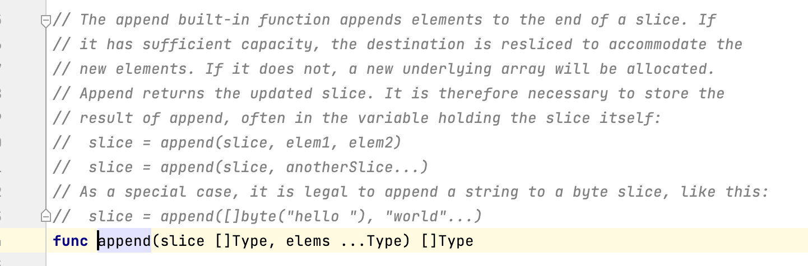

Go语言感受

**缺点**

1. 包为单位, 下面的只有函数+数据结构, 感觉好乱, 同一个包下的不同文件之间的函数随便用.

2. 这种包管理, 不面向对象的, 感觉好乱, 一个文件下的代码行数好多好多.

3. 命名比较乱, 用大小写代表可见行.

4. 创建命令感觉很乱, var要不要的都可以, 还有:=, 还有类型. 不如Java直接是int就好了.

5. *的概念很乱, 一方面表示是指针类型, 一方面可以取指针的对象. &则是取指针. 不如倒过来, &是取值, *代表指针, 而且取指针.
6. 没有三元运算符, 而且多个响应也没法作为值直接赋值给一个变量.


**优点:**

返回值列表很好, 可以比较好的处理error.

感觉Java的面向对象, 在数据和函数之上, 抽象出了一个实体, 同一个类, 可以有多个实体副本, 进而有一个容器的概念. 而Go的话, 只有数据和函数. 可以理解成只有一个实体.


Go和java一样是指传递, 只是普通的int, string, struct都是值类型. 像map, slice, chain是引用类型.


### Go和java感受不同的一点

1. 看jdk源码可以随便看, 点进去都有具体的实现. 直到native边界, 随便逛随便看.

2. 看Go的代码点进去找半天可能才找到实现, 而且很多关键字甚至是内置方法找不到具体的实现. 虽说Go是自举的, 但是自己能力的边界很模糊, 不可测量感觉, 不敢看.:

   比如append(), len方法, map数据结构.



- 可能是自己对Go还不熟悉, 感觉之前js学习的时候也他妈是这个感觉, 不知道jsdk怎么实现的


### 面向对象和非对象

面向对象里面的全部继承 Object 太方便了. 导致我完全不知道面对一个数据, 一个  function 该怎么做 才能拿到我想要的, 才能做出指定的动作.

比如, 我想拿到[]int64的地址, 对比两个数据是不是同一个数据地址? 我怎么拿? java里面直接print就是变量指向的地址.

```
// &int 可以拿到 int 的地址
// &struct, %[], %map 拿不到地址.
// "%p"  可以打印出来[], map 的地址.
```


