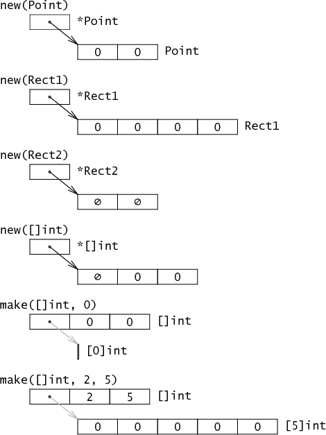

[基本技巧 · 深入解析Go (gitbooks.io)](https://tiancaiamao.gitbooks.io/go-internals/content/zh/01.3.html)

## 2. 基本数据结构


### int float, byte, [len] array

- int 默认4个byte, 32位.

  - int, int32, int64 是不同类型. 尽管内部布局int和int32不同

- float: 默认4个字节, 32位

- [len]: 只有指定了长度才是数组.


### 结构体和指针:

todo [从CPU角度理解Go中的结构体内存对齐](https://mp.weixin.qq.com/s/TDIM1tspIEWpQCH_SNGnog)

```go
type Point struct{
  X int,
  Y int,
}

p := Point{10, 20}  // 结构体
pp := &p						// 指针
```

- **指针和结构体(对象)的关系**


- **结构体的域在内存中紧密排列**


### 字符串

s := “hello”


*灰色的箭头表示已经实现的但不能直接可见的指针*

- **string**: 两个字长(int64), 不可变类型, 多个字符串用ptr指向一个数据是安全的.
  - ptr 指针指向存储的string数据
  - len 长度

- **切分操作**`str[i:j]`会得到一个新的2字长结构
  - ptr: 指向string数据的相对应位置
  - 长度数据: slice的capacity.
  - **字符串切分不涉及内存分配或复制操作, 效率等同于传递下标.**


### 2.2 slice: 数组的“部分引用”

内存中, slice是一个包含3个域的结构体:

1. ptr: 指针, 指向slice在数组中的起点.
2. len: 长度, 给slice的长度.
3. cap: 容量, 就是slice起点到数组end的总容量, slice自己不一定占.


#### slice 扩容/自动扩容

slice在go之前的C实现里, 就是一个动态数组:

```c
struct Slice 
{
  byte* array;	// actual data
  uintgo len;		// number of elemets
  uintgo cap;		// allocated number of elements
}
```

append时候会造成slice的自动扩容:

1. 新的len是当前大小的2倍以上, 扩容cap为新的len大小
2. 否则, 循环: 如果当前len小于1024, 每次2倍增长, 否则, 按照1/4 len增长, 直到增长的cap大于等于新的len.

#### 数据结构创建函数: make 和 new 

- new返回一个指针, 指向已清零的内存. 
- make返回一个复杂的结构, 有配制好的len, cap之类的
- 其实: new(Point) 约等于 make(*Point)




#### slice 和 unsafe.Pointer 互相交换

```go
s := make([]byte, 200)
ptr := unsafe.Pointer(&s[0])
var s1 = struct {
    addr uintptr
    len int
    cap int
}{ptr, length, length}
s := *(*[]byte)(unsafe.Pointer(&s1))
// s就是一个length元素的slice.
```


### 2.3 map的实现

```c
struct Hmap
{
    uint8   B;    				// 可以容纳2^B个项
    uint16  bucketsize;   // 每个桶的大小

    byte    *buckets;     // 2^B个Buckets的数组
    byte    *oldbuckets;  // 前一个buckets，只有当正在扩容时才不为空
};

// 具体的bucket结构
struct Bucket
{
    uint8  tophash[BUCKETSIZE]; // hash值的高8位....低位从bucket的array定位到bucket
    Bucket *overflow;           // 溢出桶链表，如果有
    byte   data[1];             // BUCKETSIZE keys followed by BUCKETSIZE values
};
```


xinjiade


