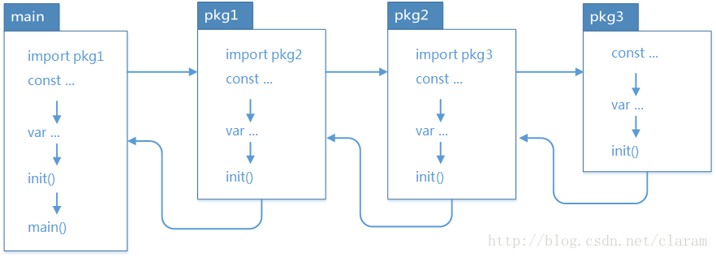

[(12条消息) go编程：浅析go程序初始化顺序_天将降大任于是人-CSDN博客_go 初始化顺序](https://blog.csdn.net/claram/article/details/77745665)

- 如果 package 存在依赖，调用顺序为最后被依赖的最先被初始化，例如：导入顺序 main –> A –> B –> C，则初始化顺序为 C –> B –> A –> main，一次执行对应的 init 方法。
- 在同一个文件中，常量、变量、init()、main() 依次进行初始化。

