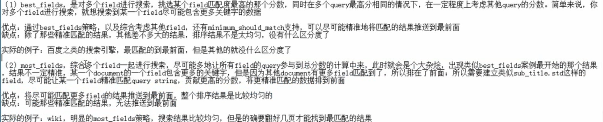

## 结构化搜索


### 1. IT技术论坛案例背景介绍

论坛的数据放在ES中, 创建索引, 利用这个论坛讲解 **搜索, 数据分析, 数据建模**


### 2. term filter 来不分词的搜索数据

- **准备一点数据:** 先设置4个字段, **ES的document是JSON, 后期可以随意加字段.**

```text
POST /artical/_bulk
{"index": {"_id":1}}
{"articleID": "XHDK-A-1293-#fJ3", "userID":1, "hidden":false, "postDate":"2020-01-01"}
{"index": {"_id":2}}
{"articleID": "KDKE-B-9947-#kL5", "userID":1, "hidden":false, "postDate":"2020-01-02"}
{"index": {"_id":3}}
{"articleID": "JODL-C-1293-#pV7", "userID":2, "hidden":false, "postDate":"2020-01-01"}
{"index": {"_id":4}}
{"articleID": "QQPX-D-1293-#aD8", "userID":2, "hidden":true, "postDate":"2020-01-02"}

# 创建出来的字段的mapping:
        "articleID" : { # text 类型的field会多加一个keyword来保存最多256个不分词的元数据.
          "type" : "text",
          "fields" : {
            "keyword" : {
              "type" : "keyword",
              "ignore_above" : 256
            }
          }
        }
# 测试一下这个不分词的字段 articleID.keyword
GET /forum/_analyze
{
  "field": "articleID.keyword",
  "text": ["fjdsk,fajkl-fnwke,csdoi&fjke"]
}
{
  "tokens" : [
    {
      "token" : "fjdsk,fajkl-fnwke,csdoi&fjke",
      "start_offset" : 0,
      "end_offset" : 28,
      "type" : "word",
      "position" : 0
    }
  ]
}
```


- **按照userID查询(不进行相关度分数分析)**

```json
GET /forum/_search
{
  "query": {
    "constant_score": {
      "filter": {
        "term": {
          "userID": "1"
        }
      },
      "boost": 1
    }
  }
}
```


- term不分词, filter不进行相关度分析.


- 使用term搜索`articleID`, 什么都没有搜到. 因为articleID的value已经被分词了. 变成了倒排索引里的word. 
  - 使用term搜索`articleID.keyword`, 这个是不分词建立的字段, 可以搜到~
  - 也可以重建索引, 把articleID字段设置成不分词的keyword类型. 


### 3. Filter执行原理(bitset和caching机制)

1. 在倒排索引里查找term的字段, **获取document list(一个bitset).**

   比如date这个字段查询'2020-01-02', 那么在date的倒排索引查出document-list, 

   date_term_bitset: [0 1 0 0 1 1], 匹配的都是1.

2. 遍历一个查询里所有的filter的bitset, 拿到都满足的最终document lsit

   比方对date和name都过滤了, 有两个bitset:

   name_bitset: [0 0 0 0 1]

   date_bitset:   [1 1 1 0 1]

   那就从稀疏的bitset开始, 过滤掉最多的document, 然后下一个就遍历的少了

3. **caching bitset:**

   对于最近的256个query里, 如果filter重复过了一定程度, 就会把filter的bitset缓存起来. 但是不会缓存小的segment的filter结果, 因为segment小遍历也不花时间, 然后还有可能被合并, 白缓存了.

   - 这个caching的bitset会自动更新的.

4. filter 在 query之前执行, 过滤掉更多的数据:

   query会计算相关度, 然后排序.


### 4. filter内用bool组合多个过滤操作


1. 查询: 可以是2020-01-01的, id也可以是'XHDK-A-1293-#fJ3'的, 但是不能是'JODL-C-1293-#pV7'的

   ```json
   GET /forum/_search
   {
     "query": {
       "constant_score": {
         "filter": {
           "bool": {
             "should":[
               {"term":{"postDate":"2020-01-01"}},
               {"term":{"articleID":"XHDK-A-1293-#fJ3"}}
               ],
               "must_not":{
                 "term": {"articleID.keyword": "JODL-C-1293-#pV7"}
               }
           }
         }
       }
     }
   }
   ```

2. bool可以嵌套. 


### 5. filter terms实现IN()效果

terms:{"filed1":["v1", "v2", "v3"...] }


### 6. filter range 实现between 效果

```json
GET /forum/_search # 搜索2020-01-01和那天一天前的数据.
{
  "query": {
    "constant_score": {
      "filter": {
        "range": {
          "postDate": {
            "gt": "2020-01-01||-1d"
          }
        }
      }
    }
  }
}
```


## 搜索技术

### 7. 手动控制全文检索的精准性(match语法, bool+should之类的)

```text
# 添加title字段
PUT /forum/_bulk
{"update":{"_id":1}}
{"doc":{"title":"this is java and es blog"}}
{"update":{"_id":2}}
{"doc":{"title":"this is java blog"}}
{"update":{"_id":3}}
{"doc":{"title":"this is es blog"}}
{"update":{"_id":4}}
{"doc":{"title":"this is blog"}}
```

1. **match query**全文检索字段

   ```json
   # and搜索多个关键词必须包含. (默认是or, 不用{}了)
   GET /forum/_search
   {
     "query": {
       "match": {
         "title": {
           "query": "java es",
           "operator": "and"
         }
       }
     }
   }
   # 最少包含xx比例的关键句
       "match": {
         "title": {
           "query": "java es",
           "minimum_should_match":  "75%"
         }
       }
   ```

2. **query内的must等查询组合, 然后可以用bool组合多个must/should等操作.****

   match/bool里面也有类似'minimum_should_match'的标签.


### 08. match语法会 转化成 term 查询

1. **普通的match query会转化成 term+should**

   ```json
   {
       "match":{
           "filed1": "value1 value2 value3..."
       }
   }
   # 转化为 term, 不分词去匹配: 这个说明term要比match快啊. 除了不用分词外, 还快在哪里呢??
   {
       "bool": {
           "should": {
               {"term": "value1"},{"term": "value2"}, {"term": "value3"} 
           }
       }
   }
   # match里面如果operator=and, 在query bool操作里就是must标签..
   # match里面如果加了'minimum_should_match', 在query bool里同样有对should匹配数量的限制.
   ```

   

### 09. 使用boost控制 搜索条件权重

在term的搜索条件里, 使用boot设置匹配的分数.

```json
GET /forum/_search
{
  "query": {
    "bool": {
      "should": [
        {
          "term": {
            "title": {
              "value": "es", 
              "boost": 2
            }
          }
        }
      ],
      "minimum_should_match": 1
    }
  }
}
```


### 10. 多shard下relevant score会不准确 的原因

1. 一个index下多个shard, 搜索结果可能会不准确

2. **是因为ES的TF/IDF算法的默认粒度是基于shard内的数据算的**

   - 基于term frequency, 算出term的关键词在document里出现的次数.
   - 基于inverse document frequency, 看一下有term的document的个数. - **在shard内部的数据**
   - 还会看document的大小, 越大分数越低

   上面的判断都是**基于shard内的数据, 不同shard内如果放的不一样, 肯定相关度分数也不同.**

3. 解决: 
   - 数据量很大, ES在shard间均匀路由数据, 所以分数概率应该是影响不大.
   - 数据量很小, 把shard设置成1
   - 测试下, 可以搜索附带`search_type=dfs_query_then_fetch`参数, 会将local IDF取出来计算global的IDF. 会有性能消耗.


### 11. 多字段搜索使用dis_max策略查找best fields 最高分

多字段搜索: 就可以用_search api里的bool+should逻辑, 使用多个term/match来匹配.

1. ```json
   GET /forum/_search
   {
     "query": {
       "bool": {
         "should": [
           {"term": {"title": {"value": "es"}}},
           {"term": {"content": {"value": "java"}}}
         ]
       }
     }
   }
   # 
   ```

2. **相关度分数计算:** 两个term搜索字段, 最终每个被搜索的doc在两个term条件都有分数

   最终分数= (所有term总分数) * 匹配term数量 / 总term数量

3. **问题:** 会导致命中term少的, 但是精准的 doc的分数下降.

4. **解决: best field策略** 避免精准匹配的field被分散. **使用最高分排序.**

   ```java
   GET /forum/_search
   {
     "query": {
       "dis_max": {
         "queries": [
           {"term": {"title": {"value": "es"}}},
           {"term": {"content": {"value": "java"}}}
          ]
       }
     }
   }
   ```

   

### 12. dis_max查询的tie_broker参数: 优化搜索效果

```java
{
  "query": {
    "dis_max": {
      "tie_breaker": 0.7,
      "boost": 1.2,
      "queries": [
        {"term": {"title": {"value": "es"}}},
        {"term": {"content": {"value": "java"}}}
       ]
    }
  }
}
```

1. tie_broker: 除了最高分, 还会把其它的分数乘以tie_broker最后加在一起算. 

   这样dis_max会考虑到其他字段的相关度分数.


### 13. 基于multi_match 实现 dis_max+tie_breaker

>  'minimum_should_match': 的作用就是"去长尾"

```json
GET /forum/_search
{
  "query": {
    "multi_match": {
      "query": "java",
      "type": "best_fields", 
      "fields": ["articleID", "content"],
      "tie_breaker": 0,
      "minimum_should_match": 1
    }
  }
}
```


### 14. 基于 multi_match + most fields 策略进行multi-field搜索

- best field策略: 选择有最匹配字段的doc

- most fields策略: 选择匹配字段最多的doc

  ```json
  GET /forum/_search
  {
    "query": {
      "multi_match": {
        "query": "java",
        "type": "most_fields", 
        "fields": ["articleID", "content"],
        "tie_breaker": 0,
        "minimum_should_match": 1
      }
    }
  }
  ```

- most_fields与best_fields的区别

  

- most_fields+子field, 可以使得一些字段被English分词后失去事态啊什么的, 导致的不能完全展示分数. sub_title里面加一个不分词的子字段std. 搜的时候可以用most_fields搜两个字段,  可以让更精准匹配的分数更好.

  


### 15. cross-fields search

**一个唯一坐标, 跨了多个field, 类似于Kafka的(topic, partition, offset). 就是cross-fields的搜索**

- 使用 most-fields模式进行cross-fields 的搜索.


- 问题

  - most_fields策略: 如果出现了一个field更精准, 那么会因为命中的field个数不够多而分数低(IF/IDF算法)

  - most_fields没有办法用minimum_should_match去掉长尾数据.

     


### 16. 使用copy_to定制组合field 解决使用most_fields进行cross-field搜索的问题

- copy_to: 把多个field拷贝到一个field中.
- 设置mapping里面字段的"copy_to"属性, 指向一个共同的字段. 就可以按照这个共同字段搜索了.


### 17. 原生的 cross-fields 搜索模式 的原理

```json
GET /forum/_search
{
  "query": {
    "multi_match": {
      "query": "java es",
      "type": "cross_fields",  
      "fields": ["articleID", "content"],
      "operator": "and"
    }
  }
}
```

cross_fields模式搜索原理:

- 要求每个term, 都必须在至少一个field中出现

  -  可以解决上面两个方式的其他字段的数据干扰.
  - 可以解决most_field没有minimum_should_match的限制的问题

- query字符串里的每个分词("java", "es"), 在多个fields中的查询分数, 取小的, 所以就会避免突高.

  

### 18. phrase matching 短语匹配


- match query: 搜索 "java es"的时候, 不会限制java和es两个分词的关系, 

  如果我们限制: java和es必须相邻等, match没有办法限制. 

- **需求:**

  - "java es"必须连, 作为短语
  - "java es"越相邻, 分数越高

- **phrase match: 短语匹配:** 

  将多个term作为短语搜索, 必须包含短语才会搜出来. 

  ```json
  GET /forum/_search
  {
    "query": {
      "match_phrase": {
        "content": "java and es"
      }
    }
  }
  ```
  - **term position**

    document的字段进行分词, ["w1", "w2", "w3", ...], 每个分词, 会记录自己在字段中的位置(0, 1, ...): **word1和word2的内容相同也会被分成两个token(分词), 各自记录自己的位置**

    ```json
    GET /_analyze
    {
      "text": ["hello world, this is my man."],
      "analyzer": "standard"
    }
        {
          "token" : "world",
          "start_offset" : 6,
          "end_offset" : 11,
          "type" : "<ALPHANUM>",
          "position" : 1
        },
    ```

  - phrase match原理:

    会把query进行分词, 然后去搜索, 找到所有的term都在的doc, 然后再拿着term的position去限制query的分词顺序, 必须和doc里面的分词顺序相同才会查出来.

- proximity match: 


### 19. phrase match中的slop参数

- **slop: phrase短语中的token, 经过几次移动(slop 溢出) 才能和document里面的字段内容匹配. 这个次数就是slop**

  比如: query内容是 "hello world", doc中的字段内容是 "hello this world", 那么slop是1. 

```json
GET /forum/_search
{
  "query": {
    "match_phrase": {
      "content": {
        "query":  "java es",
        "slop": 1 # 可以把"java and es"的查出来
      }
    }
  }
}
```

- slop内, 关键词离得越近,分数越高,


### 20. 混合使用match和phrase 实现召回率和精准度的平衡

- 召回率: recall

  总共的doc中有多少比例的phase 搜索到了.

- 精准度:  precision

  搜索phrase, 能不能尽量让phrase准确的doc排在最前


- phrase search/proximity search要求doc的字段必须包含所有term, 才能作为结果返回.

- 使用must+match强制限制doc字段内必须有的分词, 然后用should+phrase(slop)宽限制分词的间隔.

  - 效果: 离得越近的, 分数越高, 精准度更高

  - match: 保证召回率, 使得有的都拿到了.

    

  

### 21. 使用rescoring重打分优化近似搜索性能

因为phrase search在简单的match上面还要进行term匹配到的token的position判断. 所以性能低.

match_query 比 phrase_match/proximity_match要高10/20倍, 

- 优化proximity_match的性能: 减少proximity_match要分析的doc数量: 

  **使用match_query先过滤一下**, 然后用proximity_match来分析term命中的tocken的position. 

  **proximity_match只分析每个shard的分数前window_size个doc, 重新调整docs的分数, 这就是 rescoring.** 因为用户会分页查询, 不需要所有结果进行proximity_match.

```json
GET /forum/_search
{
  "query": {
    "match": {
      "content": "java es"
    }
  },
  "rescore": {
    "query": {
      "rescore_query": {
        "match_phrase": {
          "content": {
            "query" : "java es",
            "slop" : 50
          }
        }
      }
    },
    "window_size": 50
  }
}
```


### 22. 前缀, 通配符, 正则 搜索.

- 前缀搜索: 不计算相关度分数:

  **prefix_query和prefix_filter的区别是:filter会cache bitset.**

  前缀越短搜索到的doc越多, 性能越差.

  ```json
  GET /forum/_search
  {
    "query": {
      "prefix": {
        "content": {
          "value": "jav"
        }
      }
    }
  }
  ```

  - **前缀搜索性能差: 因为要搜索所有的token才能把所有prefix都找到.** term/match搜索, 只需要匹配到一个token就找到了所有的doc.

- 通配符搜索: 

  ```json
  GET /forum/_search
  {
    "query": {
      "wildcard": {
        "title": {
          "value": "this"
        }
      }
    }
  }
  ```

- 正则搜索:

  ```json
    "query": {
      "regexp": {
        "title": {
          "value": "this"
        }
      }
    }
  ```

  


### 23. 使用match_phrase_prefix实现search-time搜索推荐

**是phrase_match类似, 只不过query短语中最后一个单词term作为prefix去匹配.**

比如"hello w", 就会匹配"hello world".

最后一个term还是会扫描大量的doc.


### 24. 使用ngram分词器 实现 index-time 搜索推荐


- **ngram: 一个term分词, 可以拆分成多个长度的前缀的ngram(n个豆豆)**

  比如: hello, 再ngram_length=3的时候, 就可以拆分出3个长度的前缀: h, he, hel.

  ngram就是拆分前缀, length就是限制拆出多长的前缀来.

- **用途: 前缀搜索推荐功能, 替代前缀搜索.**
- **使用:** 


