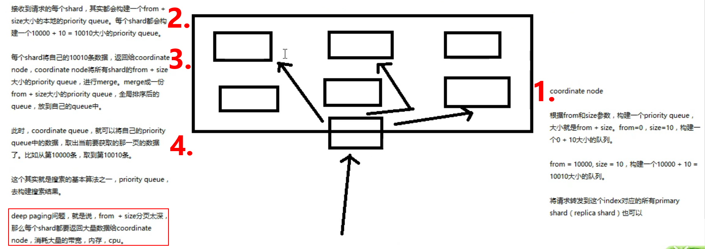

### 29. document 分布路由

1. **新创建的document该放在index里的哪个shard里面呢?**

   `shard =  hash(routing) % number_of_primary_shards`. 

   每次document的CRUD操作都会带着一个routing number(默认就是document的_id), 用这个routing去计算shard.

2. **routing number:**

   默认的routing时_id, 也可以手动指定, `PUT /index/type/id?routing=user_define_id`. 可以把数据都路由到同一个shard上.

3. **primaryShard不能改:** 因为primaryShard是做分母的, 就像水平分表,不能瞎动.


### 30. document的增删改的流程

1. client 把请求发送到一个node里, 这个node就变成这次请求的`coordinate node(协调节点)`
2. coordinate node把请求转发到document存在的某一个node里的`primary shard`上. 
3. primary shard处理请求创建索引, 并把数据同步到自己的replica node里.
4. coordinate node接受到已经同步完的消息后, 就把请求的响应回去.


### 31. 写一致性原理 和 quorum

1. **consistency(写一致性)**: `one(only primary), all(all shards), quorum(default)` 有点像kafka的提交保证, 但它不是要求提交到其他的replica, 而是要求其他的replica是active可用状态. 因为必须要写到replica shard里面.

   请求时候可以添加写一致性的要求`PUT /index/type/id?consistency=one`

2. **quorum机制:** 大部分shard都还是可用的. 默认是 `int((primary + number_of_replicas) / 2 ) + 1` 个和以上的shard是可用的, 必须是有replica的时候

3. 如果shard数少于quorum数量, 无法执行写操作.

4. quorum不满足时候, wait 默认1min, 否则timeout. 请求也可以加一个timeout参数.


### 32. 查询 的 流程

1. client 把请求发送到一个node里, 这个node就变成这次请求的`coordinate node(协调节点)`
2. coordinate node把请求转发到document存在的某一个node里的`primary/replica shard`上. 采取`round-robin轮询`rute.
3. 查询完之后由coordinate node响应请求.
4. **可能:** 在document 还在创建索引的时候, 只在primary-shard上, 就会响应找不到.


### 33. bulk api奇特的json格式 和 底层性能优化 的 关系

[官方文档解释](https://www.elastic.co/guide/cn/elasticsearch/guide/current/bulk.html#_Dont_Repeat_Yourself)

1. bulk中每个操作都可能转发到不同的node里面的不同shard里执行
2. 如果采用普通好看的json数组格式: 需要解析到内存, 分割, 分发.
3. 如果用这种string, 就可以直接分发.


## 初始搜索引擎

### 34. search 结果

```json
GET [/xxxx]/_search?timeout=10ms
{
  "took" : 0, # 花费时间
  "timed_out" : false, # 是否超时(默认没有timeout), timeout时候把查到的东西返回
  "_shards" : { # 默认会转发到所有primaryShard
    "total" : 1,
    "successful" : 1,
    "skipped" : 0,
    "failed" : 0
  },
  "hits" : {  # 命中结果
    "total" : {
      "value" : 0,
      "relation" : "eq"
    },
    "max_score" : null,  # 结果中相关度最大的.
    "hits" : [ ] # 查询完整的document (默认前十条)
  }
}
```


### 35. multi-index & multi-type 搜索模式

可以一次搜索多个index/type下的数据

```json
GET /_search 所有index下的所有type下的所有数据
GET /index1/_search 
GET /index1, index2/search
GET /index1, index2/type1, type2/_search
```

**多个index的搜索会把请求发送到promaryShard(或者它的replicaShard)上面.**


### 36. 分页搜索 deep paging 性能

```json
# 分页
GET /index1/_search?size=1&from=4
size: 每页大小, from页码[从0开始]
```

**deep paging(尽量减少)**

搜索的深度特别深的搜索. 比如n个shard共n万条, 每页10条, 搜第x页.

请求发到一个node上(coordinate node), 转发到每个shard上, **每个node上, 取[1, (x+1)*10]条数据,** 发到coordinateNode上. 

coordinateNode就有了`n*(x+1)*10`条数据, 把这些排序, 取相关度最高的10条(也就是我们要的`[x*10, (x+1)*10]`条. 

**缺点** 要coordinateNode保存大量数据, CPU, Bandwidth, Memory.


### 37. `query string search` 和 `_all`的metadata

 queryString就是**搜索时候附加的过滤条件.** 

 ```json
# 按照filed筛选查询
GET /index1/_search?q=filed1:value1
GET /index1/_search?q=+filed1:value1 # 必须包含field1=value1条件(和不加一样)
GET /index1/_search?q=-filed1:value1 # 必须不包含field1=value1的条件.
 ```

**_all**

```json
# 按照filed里面的value过滤, 必须有一个field的value是某个值
GET /index1/_search?q=value1111
# 1. 并不是每个document的每个field都遍历一边. 而是根据document种的`_all`元数据
# 2. 插入document的时候, 会把所有field的value拼成字符串作为`_all`这个field的值, 所以没有指定field筛选, 就会对_all这个field筛选.
# "_all":"value1 value2 value3"
# 3. 会对_all field进行分词, 然后建立倒排索引.
# 4. 生产环境不使用
```


### 38. mapping 是什么

之前: 插入几条数据, 让ES自动为我们建立索引.

ES会自动建立mapping: `dynamic mapping`机制, 自动为我们的document建索引, 自动创建index, type和type对应的mapping. mapping种包含了每个field对应的数据类型和如何分词. 

自动建立的mapping, 可能会搜索出不符合预期的结果. 可以在**创建数据前, 手动创建index/type和type对应的mapping.**

```json
{
  "index1" : {
    "mappings" : {
      "properties" : {
        "field1" : {
          "type" : "text",
          "fields" : {
            "keyword" : {
              "type" : "keyword",
              "ignore_above" : 256
            }
          }
        },
        "field2" : {
          "type" : "text",
          "fields" : {
            "keyword" : {
              "type" : "keyword",
              "ignore_above" : 256
            }
          }
        }
      }
    }
  }
}

```


### 39. _精确匹配_ 和 _全文搜索_

1. _exact value_

   必须输入全文

2. _full text_

   1. 缩写: cn:China...
   2. 格式转换: like liked likes
   3. 大小写
   4. 同义词

   拆分此后进行缩写, 时态, 大小写之后的搜索. 


### 40. 倒排索引 原理

建立倒排索引的时候会执行`normalization(标准化)`操作, 进行时态/大小写/同义词转化. 建立正常词为index的的倒排索引. 否则, 匹配度低.


### 41. 分词器介绍

分词器: **用来切分词语, 然后normalization(正常化)转换.** 包含三个部分

1. character filter: 在文本分此前进行预处理. 比如过滤掉一些xx字符.

2. tokenizer: 分词. "how are you" -> ""how, are, you"

3. token filter: 它会在拆词后对词进行转换.

**[内置分词器](https://www.elastic.co/guide/en/elasticsearch/reference/current/analysis-analyzers.html):**

一句话: `Set the shape to semi-transparent by calling set_trans(5)`

1. standard analyzer(默认): `set, the, shape, to, semi, transparent, by, calling, set_trans, 5`
2. simple analyzer: `set, the, share, to, semi, tranparent, by, calling, set, trans`
3. whitespace analyzer: `Set, the, shape, to, semi-transparent, by, calling, set_trans(5)`
4. language analyzer(特定语言的分词器, English/Chinese): `set, shape, semi, tranparent, call, set_trans(5)` 把没有意义的干掉.


### 42. `_query string`的分词和`mapping`介绍的遗留问题

我们用`_search?q=field:xxx`去搜索field的时候, **会使用field建立倒排索引的分词器对我们的查询条件进行分词和normalization**. 

不同类型的field的搜索会有可能是`full text / exact value`


上面_all field的搜索结果不符合我们的预期: 是因为 _all field把document**所有的字段的value都拼起来了, 然后进行分词**

eg: _all: 2017-01-02 my second article this is my second article in this website 11400

可能会分词成`2017, 01, 02, my, second, article, ....`, 然后建立倒排索引

如果按照`2017-01-02`去搜索, 按照相同的分词器去搜索, 分成`2017, 01, 02`, 可以把2017词的,01词的和02词的都搜出来. 大法了.

如果是`按照filed搜索, 分词器field使用的exact_value分词器去分词`, 那么搜索没有问题了.

```json
# 看一下分词器怎么把我们的词分开并normalization的
GET /_analyze
{
  "analyzer": "english",
  "text": ["this is the first dogs"]
}
{
  "tokens" : [ # english 分词器把我们的辅助词都干掉了. 然后复数也规整了
    {
      "token" : "first",
      "start_offset" : 12,
      "end_offset" : 17,
      "type" : "<ALPHANUM>",
      "position" : 3
    },
    {
      "token" : "dog",
      "start_offset" : 18,
      "end_offset" : 22,
      "type" : "<ALPHANUM>",
      "position" : 4
    }
  ]
}
```


### 43. Mapping 再理解

1. ES自动对插入的数据建立索引, 并建立type 和 对应的mapping
2. **mapping种自动定义每个field的数据类型**, 不同类型(text/data/...), 会有不同的搜索类型: `exact_value`或者`full_text`
3. `exact_value` 在建立倒排索引时候, 分词会将整个词作为倒排索引种的索引. `full_text`是经过不同的split分词处理, 然后还有normalization转换才建立倒排索引.
4. 每个field的分词器就确定了这个field是按照`exact_value/full_text`来搜索的. 每次搜索也要经过分词器. 
5. es的dynamicMapping会自动建立mapping, 包括自动设置字段类型. 也可以提前手动建立index和type里的mapping, 自己设置字段类型, 分词器.


### 44. mapping的核心数据类型 和 dynamicMapping

```json
# 核心数据类型
1. string
2. byte, short, integer, long
3. float, double
4. boolean
5. date
# dynamic mapping
true/false -> boolean # 自动推断
123	-> long
123.45	->	double
2020-08-22	->	date
"csfsagf"	->	string/text
# 查看mapping: 每个字段的type
GET /index1/_mapping
{
  "index1" : {
    "mappings" : {
      "properties" : {
        "field1" : {
          "type" : "text",
          "fields" : {
            "keyword" : {
              "type" : "keyword",
              "ignore_above" : 256
            }
          }
        }
      }
    }
  }
}  
```


### 45. [手动建立和修改 mapping](https://www.elastic.co/guide/en/elasticsearch/reference/current/indices-put-mapping.html), 定制String类型数据分词

```json
# 7.8 废除了type这个概念了好像, 或者强制每个index只能由一个type.
# Create the two indices
PUT /my-index-000001
PUT /my-index-000002

# Update both mappings
PUT /my-index-000001,my-index-000002/_mapping
{
  "properties": {
    "user": {
      "properties": {
        "name": {
          "type": "keyword"
        }
      }
    }
  }
}
# 只可以新增filed, 不可以修改field的type.
```


### 46. mapping的复杂数据类型, object类型数据结构

建立索引时候与string是一样的. 数据类型不能混.

1. **multivalue field:** `{"tags": ["tag1", "tag2"]}` 感觉像枚举 todo: 还不会用

2. **empty field:** null, [], [null] 这种.

3. **object field:** 

   ```json
   # 测试
   POST /company/_doc/1
   {
     "owner": "lili",
     "sub_company":{
       "owner": "xiaohong",
       "site": "sh"
     }
   }
   # dynamic mapping会自动创建mapping
   {
     "company" : {
       "mappings" : {
         "properties" : {
           "owner" : {
             "type" : "text",
             "fields" : {
               "keyword" : {
                 "type" : "keyword",
                 "ignore_above" : 256
               } } },
           "sub_company" : { # 这就是一个object 的mapping了
             "properties" : {
               "owner" : {
                 "type" : "text",
                 "fields" : {
                   "keyword" : {
                     "type" : "keyword",
                     "ignore_above" : 256
                   } } },
               "site" : {
                 "type" : "text",
                 "fields" : {
                   "keyword" : {
                     "type" : "keyword",
                     "ignore_above" : 256
                   } } } } } } } } }
   ```

   底层会用.穿起来

   ```json
   {
       "owner": [jack],
       "sub_company.ower": [xiaohong],
       "sub_company.site": [sh]
   }
   ```

   

   

### 47. `_search`API的语法

1. 基本语法:

   ```json
   # × GET /index1, index2/_search == GET /index1/_mapping 现在变了不能搜多个index了~ 
   # GET /index1/_search 这样才能查里面的值. 返回10条
   
   # GET /index1/_search?size=1&from=1 分页搜索
   ```

2. http协议中get方法不能放在body里面. 但是**ES里面的GET可以在body里面放置查询条件.**

   ```json
   如果不支持request把参数放在body里面, 也可以POST请求去search
   POST /index1/_search
   {
     "from": 0,
     "size": 1
   }
   ```

   

### 48. Query DSL(Domain Specific Language) 搜索语法

query DSL: 在search里面可以添加搜索的条件. based on JSON to **define queries**

```json
# 小栗子
POST /index1/_search
{
  "query": {
    "match": { # 按照field去查
      "filed1": "value1"
    }
  }
}
{
  "query": {
    "match_all": { # 查询所有的
        "boost": 6 # 匹配出来的结果的score设定为6
    } 
  }
}
```


2. 组合多个搜索条件:

   ```json
   GET /index1/_search
   {
     "query": {
       "bool": { # bool 查询
         "must": [  # 必须满足
           {
             "match": {
               "field1": "value1"
             }
           }
         ],
         "should": [ # 可以满足
           {
             "match": {
               "field2": "value2"
             }
           }
         ]
       }
     }
   }
   ```

   

### 49 另一种查询 `_filter`对比 `_query`

 ```json
GET /company/_search
# query, post_filter 语法都类似
{
  "query/post_filter": { 
    "bool": { # bool 搜
      "must": [
        {
          "match": {
            "jone_date": "2020-03-23"
          }
        }
      ]
    }
  }
}
{ 
  "query/post_filter": {
    "range": { # range搜
      "age": {
        "gte": 10,
        "lte": 43
      }
    }
  }
}
 ```


**不同之处:**

1. **filter只是将过滤数据, 不计算相关度分数.**
2. **query: 计算每个document和搜索条件的相关度, 并按照相关度排序.** 
3. 可以放在一起. 需要计算相关度的放在query里面, 只是过滤的放在post_filter里面


### 50. query的各种语法

1. `match_all`, 搜索有的, 可以把结果指定分数

2. `match`: 按照field搜索. **会分词**

   ```json
     "query": {
       "match": {
         # 会把field里面内容分词, "li hong", "xiao dong" "tim" 都给查出来了
         "name": "li xiao tim" 
       }
     }
   ```

   

3. `multi_match`: 可以查多个field里面

   ```json
     "query": {
       "multi_match": {
         "query": "uk",
         "fields": ["name", "address.country"]
       }
     }
   ```

4. `range` 语法.

5. `term` 和match一样按照field去查, **不会分词**

   ```json
     "query": {
       "term": {
         "name": {
           # 会查"li xiao"这个string是不是倒排索引. 如果查"li"可以把"li hong" 查出来.
           "value": "li",
           "boost": 7 # 对查出来的基础指定score.可以增加. 
         }
       }
     }
   ```

6. `terms` 查多个value

   ```json
     "query": {
       "terms": {
         "name": [ # 把name索引为li或者dong的都查出来.
           "li",
           "dong"
         ]
       }
     }
   ```

   

### 51. 多搜索条件组合查询.

bool : 可以放 must should must_not, filter.


### 52. 定位 不合法搜索和原因

```json
# GET /{{index}}/_validate/query?explain 
{ # 可以用_validate api判断我们的搜索语句是否合法
    "xxxxx": "xxxxxxx"
}

# response:
{
  "_shards" : {
    "total" : 1,
    "successful" : 1,
    "failed" : 0
  },
  "valid" : true,
  "explanations" : [
    {
      "index" : "company",
      "valid" : true,
      "explanation" : "*:*"
    }
  ]
}
```


### 53. 修改搜索结果的排序规则

1. query结果sort

   ```json
   {
     "query": {
       "match_all": {}
     },
     "sort": [ # 按照字段排序
       {
         "age": {
           "order": "asc"
         }
       }
     ]
   }
   ```

   

### 54. 字符串排序问题: 将field索引两次

如果对一个**string filed进行排序, 因为这个field已经被分词了**, 那么我们搜索结果里面的排序就不能得到正确的结果.

```json
现在好像不能排序text和string了.
老师演示的是添加text字段, 字段会被分词, 排序时候会按照分的词排序. 可能会有问题.
解决办法是: 对字段, 添加一个raw 的fielddata, 里面记录着完整的text, 排序的时候就按照raw排序, 就没有分词的问题了.
```


### 55. 相关度评分 TF&IDF 算法

1. 算法介绍: 

   - relevance score算法: 计算出索引中的文本与搜索的文本相似度.

   - ES中使用的是: `term frequency/inverse document frequency(检索词频率, 逆文档频率)` 

   - `term frequency`: 搜索文本拆分各个词条 在 被搜索的field文本里出现了多少次, 出现的次数越高分数越高.

     ```text
     搜索: `hello world`
     doc1: hello liming, what is your favorate world.
     doc2: hi world, how are you.
     解析: 搜索文本词条在doc1中出现的次数更多, doc1更相关.
     ```

     

   - `inverse document frequency`: 搜索文本的各个词条在整个索引文档中出现了多次, 次数越多, 越不相关.

     ```txt
     搜索: `hello world`
     doc...
     比如: index中有1w条document, hello在所有document里出现1k次, world总共出现100次, 那么hellow相关度更低.
     ```

   - `field-length norm`: field长度越长, 相关度越弱

     ```text
     搜索: `hello world`
     doc1: "hello world, balabalabkfasdkljfelkwjrkwlejrqwlekrjl"
     doc2: "hello world, bala"
     解析: doc2更短, doc2分数更高.
     ```

2. **[解释一下匹配算法](https://www.elastic.co/guide/en/elasticsearch/reference/current/search-explain.html)**

   ```json
   GET /website/_search
   {
     "query" : {
       "match": { # 按照字段查
         "title": "doc one"
       }
     },
     "explain": true # 给我们解释一下算法分析过程
   }
   
   GET /website/_explain/1 # 解析一下这个id是怎么匹配上的
   {
     "query": {
       "match":{
         "content": "doc"
       }
     }
   }
   ```

   

### 56. 搜索引擎: doc value 讲解

搜索时候依赖倒排索引. **排序, 聚合, 过滤, 的时候以来正排索引. 其实就是doc value**. 建立索引的时候两者都会创建. doc value 保存在磁盘上, 可以缓存在ram里.

```text
## 倒排索引
# 初始doc
doc1: hello, liming, how are you.
doc2: hi, are you liming?
# 建立索引:
		doc1	doc2
hello	√	
liming	√		√
how		√
are		√		√
you		√		√
hi				√
....
## 正排索引: 倒排索引对于排序之类的不方便
doc1->	{field1:"hello liming how are..", field2: "xxxx", ....}
doc2->	{fiedl1: "hi are you	liming", field2: "xxxx"...}	
```


### 57. 搜索引擎: query phase(阶段)

1. `query phase:` 构建`priority queue`

   

2. 为什么增加replica shard可以提升搜索吞吐量:

   可以承接更多并发时候的内存消耗.


### 58. 搜索引擎: fetch phase(阶段)

1. 上面queryPhase构建出来的priorityQueue, 是包含doc_id和doc的队列, 

   coordinate想要取想要的值, 就去`mget`请求去对应的shard上拿.

   拿到了之后, 将结果集合返回给client

2. 一般搜索没有分页, 默认拿前十条, 按照_score排序.


### 59. 搜索引擎: 参数梳理 和 bouncing result问题 

1. `preference`: 哪些shard会被用来执行搜索: _primary, _primary_first....

   ```json
   GET /website/_search?preference=xyzabc123
   ```

2. timeout参数, 将timeout时间内查到的先返回.

3. routing: 可以指定routing, _id routing, 也可以指定routing=user_id, 自定义routing规则.

4. `bouncing result`问题: 如果两个document排序, field值相同, 轮询到不同shard上搜索, 不同的shard上可能排序不同. 会出现跳跃的结果.

   **解决:** **指定preference一个字符串, 同一个字符串的请求会到同一个shard上面执行**. 这样同一个client的相同preference请求, 不会出现这个问题.


### 60. 搜索引擎: scoll 滚动搜索 大量数据

如果一次性查10w条数据, 可以使用scoll进行滚动分批次查询. 

进行**scoll搜索, 在第一次搜索的时候, 保存一个视图快照**. 之后的批次只会基于该快照提供搜索, 新的变更不会搜出来. 

1. 开始scoll 搜索:

   ```json
   # 开启时候, scoll指定一个时间范围.
   # GET /website/_search?scroll=1m
   {
     "query": {
       "match_all": {}
     },
     "sort": [
       {
         "_doc": {
           "order": "desc"
         }
       }
     ],
     "size": 1
   }
   # response, 回来带一个scollID. 之后再请求就带着它
   POST /_search/scroll 
   {
       "scroll" : "1m", 
       "scroll_id" : "FGluY2x1ZGVfY29udGV4dF91dWlkDXF1ZXJ5QW5kRmV0Y2gBFFpYRlpHblFCYmtCdW00ZjlRdVVIAAAAAAAAHNYWWms4Nk1nVC1TbjJOVFo0QXd3dlVRQQ==" 
   }
   ```

2. **scroll和分页**

   分页是一页一页搜索, 给用户看的.

   scroll适合一批一批拉, 给系统处理的.


