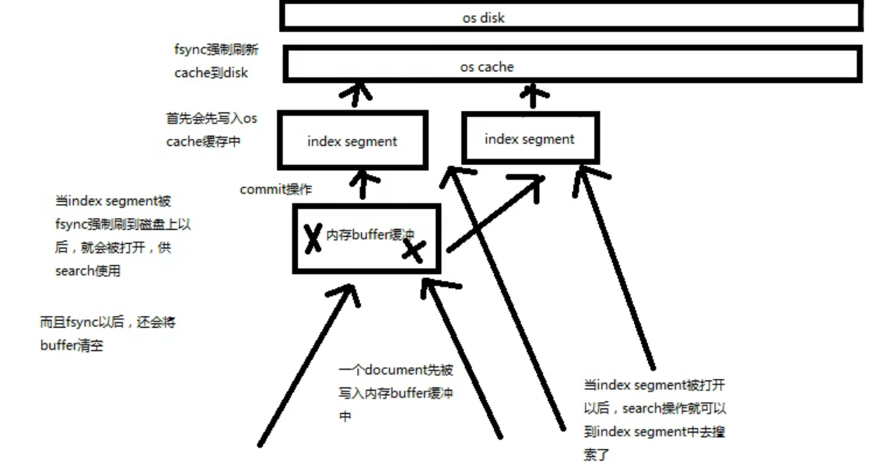
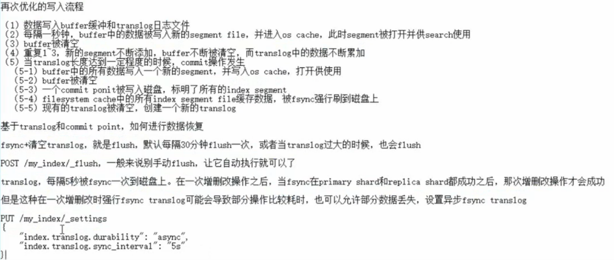

## 索引管理


### 61. 索引的 C, U, D 

1. 为什么要手动创建索引:

2. 创建索引语法:

   ```json
   PUT /index4
   {
     # 设置index的shard
     "settings": { 
       "number_of_shards": 1,
       "number_of_replicas": 0
     },
     # 设置index的mapping
     "mappings": {
       "properties": {
         "filed1": {
           "type": "text"
         },
         "id_f" : {
           "type": "long"
         }
       }
     }
   }
   ```

3. **修改索引:**

   ```json
   PUT /index4/_settings
   {
       "number_of_replicas": 1
   }
   ```

4. **删除索引**

   ```json
   DELETE /index4
   DELETE /index5, index4
   DELETE /_all # 可以在es配置文件里#action.destructive_requires_name: true禁用删除全部.
   ```

   

### 62. 修改分词器 和 定制分词器

1. **默认分词器** 

   ```text
   standard:
   1. standard tokenizer, 以单词边界进行切分.
   2. standard token filter: 什么都不做
   3. lowercase token filter: 将所有字母转换为小写
   4. stop token filter: 移除没有用的小词汇, 比如 a is it the...
   ```

2. **修改分词器的设置**

   启用english 的`stop token filter`

   ```json
   # 先要把index给_stop掉
   # 1. PUT /index4/_settings
   {
       "analysis": {
         "analyzer": {
           "en_std": { # 设置一个名字叫en_std的分词器
             "type": "standard",
             "stopwords": "_english_"
           }
         }
       }
   }
   # 2. 测试一下这个分词器
   GET /index4/_analyze
   {
     "analyzer": "en_std",
     "text": ["this is a walking dog"]
   }
   # 返回来分析的tokens就只剩下"walking"和 "dog"了.
   ```

3. **[定制自己的分词器](https://www.elastic.co/guide/en/elasticsearch/reference/current/analysis-custom-analyzer.html)**

   ```json
   # 在index这里面定制自己的分词器
   PUT /index4/_settings
   {
     "analysis": {
       "char_filter": {
         "&_to_and": {
           "type": "mapping",
           "mappings": ["&=> and"]
         }
       },
       "filter": {
         "my_stopwords": {
           "type": "stop",
           "stopwords": ["the", "a"]
         }
       },
       "analyzer": {
         "my_analyzer": {
           "type": "custom",
           "char_filter": ["html_strip", "&_to_and"],
           "tokenizer": "standard",
           "filter": ["lowercase", "my_stopwords"]
         }
       }
     }
   }
   ```

4. **测试**自己的分词器:

   ```json
   GET /index4/_analyze
   {
     "text": ["hi, this quick & brown fox"],
     "analyzer": "my_analyzer"
   }
   ```

5. **使用自己的分词器**

   ```json
   # 把analyzer应用到field上
   PUT /index4/_mapping
   {
     "properties": {
       "content": {
         "type": "text",
         "analyzer": "my_analyzer"
       }
     }
   }
   ```

   

### 63. type的数据结构

- type是index中用来区分类似数据的, 类似的数据, 有不同的fields和属性来控制索引的建立

- field的value, 在lucene建立索引的时候, 全部是 `opaque bytes`格式 不区分类型.

- lucene没有type概念, 在document, 将type作为一个document的field. 即"_type", es通过这个字段来判断type.

- 现在的es一个index下面不能有多个type了, 之前的多个type也是放在一起存储的. 

> **不同的type, 只是field set的一个名字, 不同的type的doc, 在底层存储的时候, 都是属于index的, 每个field都是属于index的, 所以每个document都有index下所有的field**, 只不过没有的就变成null. 我想这也是为什么现在一个index下不能有多个type的原因. 


### 64. _mapping root object 理解

1. 什么是`root object`:

   每个type对应的mapping json, 包含了`properties`(相当于schema), `metadata`(_id, _source, _type), `settings`(analyzer...)

2. `properties`

   type是类型, index:要不要分词, analyzer: 分词器

3. `_source`

   ```mark
   _最原始的json数据_
   1. 在查询的时候可以直接拿到完整的document, 不用先拿document_id, 然后去拿.
   2. partial update: 部分修改, 基于_source实现的
   3. reindex: 也是基于_source实现的
   4. 可以基于_source定制返回field
   5. debug query更容易. 
   _可以把source字段给禁用掉_
   PUT /index2  # 修改
   {
     "mappings": {
       "type2": {
         "_source": false
       } 
     }
   }
   ```

4. `_all` 所有的field连在一起, 建立索引. 没有指定field搜索时候就搜_all 字段. 也可以关闭

5. 标识性的`metadata`: 


### 65. 定制dynamic_mapping 策略

1. 定制dynamic策略:

   ```text
   1. true: 遇到陌生字段进行dynamic mapping
   PUT /index5 # 如果由不是properties里面的字段就自动
   {
     "mappings": {
       "dynamic": "strict",
       "properties": {
         "title": {
           "type": "text"
         },
         "address": {
           "type": "object",
           "dynamic":"true"
         }
       }
     }
   }
   false: 遇到陌生字段忽略
   strict: 遇到陌生字段报错.
   ```

2. 定制`dynamic mapping`策略

   1. `date_detection`: 指定格式识别date. 以第一次识别的格式确定下来. 
   
      ```json
      # 要这样指着_mapping修改
      PUT /index5/_mapping
      {
        "date_detection": false
      }
      # 这样直接PUT, 其实是POST, 不可行
      PUT /index5
      {
        "mappings": {
          "date_detection": false 
        }
      }
      ```
   
   2. 定制[dynamic mapping template ](https://www.elastic.co/guide/en/elasticsearch/reference/current/dynamic-templates.html)(type level的, 其实也是index level的)
   
      ```json
      PUT /index7-dynamic-template
      {
        "mappings": {
            # 就这样拦截下来 对应的字段, 然后用map
            "dynamic_templates": [
              {
                "my_template_name": { 
                  ...  match conditions ... 
                  "mapping": { ... } 
                }
              },
              ...
            ]
        }
      }
      ```


### 66. 索引管理: 基于`scoll`(滚动搜索)和`alias`(别名) 实现 `zero downtime reindex` 

1. **重建索引**

   field的设置不能改, 只能重建一个index, 把数据拷贝过去. **用scoll滚动搜索, bulk批量写入. 每次scoll一个阶段的数据, 交给线程池bulk就好了**.

   场景; 比如创建时候没有指定类型, dynamic Mapping的filed不是我们想要的. 那么就需要重建索引了. 

2. **如果旧的索引名字是i1, 重建索引叫i2, 那么先给i1一个别名叫ii, 然后用这个ii, 数据迁移完了之后, 再把ii指向i2.**

3. **别名添加/移除**

   ```json
   POST /_aliases
   {
       "actions": [
           {"remove":{"index":"index1", "alias":"our_index"}},
           {"add":{"index":"index2", "alias":"our_index"}}
       ]
   }
   ```


## 内核原理

### 67. 内核原理: 倒排索引结构, 和 索引不可变原因

1. **倒排索引结构, 包含:** 
   - 关键词的 documentlist
   - 关键词所有document的数量, `IDF算法: inverse document frequency`
   - 关键词再每个documnet中出现的次数: `TF算法: term frequency`
   - 关键词在document中的次序: 在这个document的关键词里算老几
   - 每个document的长度, `length norm 长度法则算法`
   - 所有document的平均长度

2. **倒排索引不可变好处**

   update一个document就是把doc标记为删除, 然后新增一个. 每个document创建了就不可更改了.

   - 不需要锁, 并发高
   - 数据不变, 保存在cache里面就好了, filter cache也可以一直放在内存里当然这个要变一变的.... 我觉得标记删除了还能不变么?
   - 可以压缩, 节省CPU和I/O

3. **坏处:**  每次修改都要重新构建.


### 68. 内核原理: document 写入原理(buffer, segment, commit)

lucene底层的index需要分多个segment存储.

**新增步骤:**

1. 首先document put到内存buffer里面

2. buffer满了/什么, 可以commit到 磁盘里的index segment里面

3. index segment之后, 就同步到 os cache里面

4. oscache 有fsync命令强制刷新到磁盘里. 

5. index segment就被打开了, 可以接收search操作

6. 新的数据会写到新的index segment里

   

**删除操作:**

1. 每次dommit的时候, 生成.del文件, 表明delete信息, 被delete的document所在的index和id.
2. 之后search的时候, 就会匹配一下差的有没有delete信息, 有就过滤掉噢
3. 如果search到了一个document的多个版本, 那么只有最新的可能不是被删除的.


### 70. 优化写入流程, 实现NRT(nearly real time) (filesystem cache, refresh)

> 问题: 每次必须要等到 fsync把index segment刷入磁盘, 才能把segment打开. 那么整个流程可能很差, delay很久. 

**需要改进**

1. 数据写入buffer
2. buffer写满之后, 刷入index segment文件里. index先写入OS cache中, **每秒刷新**
3. 写入OS cache里就把index segment打开. **先不执行commit**

可以手动 POST /index3/_refresh刷新.


### 71. 继续优化写入流程, 实现durability的存储

把数据从buffer刷入indexSegement然后写入OSCache里就把segment打开 是不安全的. 



**优化:**  引入了**translog日志文件**

1. 每次提交document的时候, 写入到translog和buffer里面
2. 上面的, buffer每秒刷入indexSegment里面, 然后清空buffer, translog里面逐渐累积.
3. indexSegment里面的数据刷入OSCache里面, 就打开了. translog里面如常.
4. translog在足够多的时候(默认5s), 会执行commit, 把记录的所有的document写入新的segment, 写入oscache, 然提交commit point(记录已经同步好的所有index segment), 然后强行fsync到磁盘里. 
5. translog做好之后又重新开始了

**异步translog commitPoint:** 可能会丢失一个阶段的数据.


### 72. 最后优化 写入流程 实现磁盘文件合并(segment merge, optimize)

每秒一个segment file, 文件过多, 每次search都要搜素多个segment. 

默认在后台有`segment merge`操作, 在merge的时候, delete的document会永远删除.

**merge 操作流程**

1. 选择大小相近的segment, merge成一个大的segment
2. 将新的segment flush到磁盘上去
3. 写一个新的commit point, 包括新的segment, 排除旧的segment
4. 将新的segment打开, 删除旧的segment

可以手动merge: POST /index3/_optimize?max_number_segments=1


## Java API

### 73. Java API 初步使用


