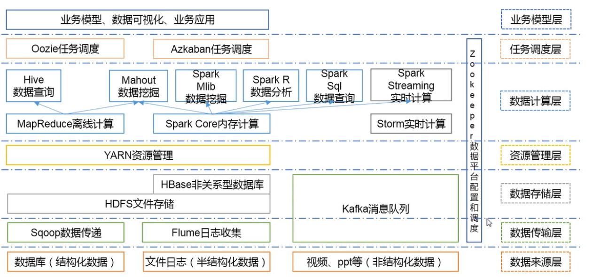

Hadoop 解决的是海量数据的**存储**和**处理**


### **历史:**

1. [博客介绍](https://www.cnblogs.com/xuanku/p/hadoop_history.html)
特点:
1. HA: 多份数据副本.
2. scalable: 8
3. efficiency.

### **Hadoop1.x和2.x的区别:**

1. **1.x由三层common辅助工具+HDFS存储+MapReduce做计算和资源调用**
2. 2.x中MapReduce抽离出YARN做资源调度.

### **HDFS的组成部分:**

1. NameNode: 存储文件的元数据(name,目录结构, 属性), 文件的块列表和块所在的DataNode.

2. DataNode: 存储文件

3. SecondaryNameNode: 监控HDFS状态的辅助后台程序.

### **YARN资源分配结构:**

a. ResourceManager: 
```java
1. 处理客户端请求
2. 监控NodeManager
3. 启动或监控ApplicationMaster
4. 资源的分配和调度
```

b. NodeManager:

```java
1. 管理自己Node上的资源
2. 接收ResourceManager的命令
3. 接收ApplicationMasger的命令.
```

c. ApplicationMaster:
```java
1. 负责数据的切分
2. 为application申请资源并分配给内部任务
3. 任务的监控和容错
```

d. Container: YARN中资源抽象, 封装了内存/CPU/磁盘/网络.

### **MapReduce结构:**


### 大数据生态体系



**推荐系统的项目框架图**


