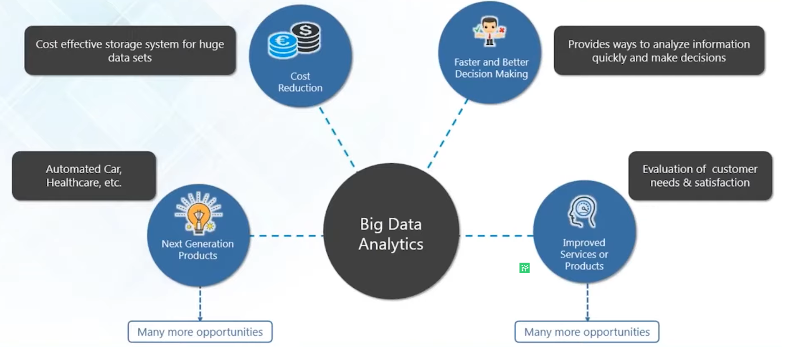

### BigData 是什么

大数据是指**数据量非常大和复杂的数据集**, 很难用现有的数据库系统或者是数据处理

应用去处理.

**第二个问题: 我们怎么判断一个data是不是bigData**

1. 数据量(volume)非常大.
2. 种类(variety)复杂, different kinds of data from various sources.
3. 速度(velocity)快, 产生速度非常块.
4. Value: 能从这些数据里面拿到有价值的东西
5. 准确性(veracity): 数据有一些是不确定和不一致的.

### Use BigData as an Opportunity

#### IBM BigData Analytics
.
