# 多机数据库的实现

## 第十五章 - 复制

执行*SLAVEOF*命令可以复制另一个服务器. 

### 一. 旧版复制功能的实现

**redis复制功能分为同步(sync)和命令传播(command propagate)**两个操作:

1. 同步操作负责将从服务器的数据库状态更新到主服务器当前的数据库状态属性.
2. 命令传播用于主服务器上的数据库状态修改后, 从服务器保持一致

#### 1. 同步

客户端向服务器发出*SLAVEOF*命令, 请求复制主服务器, **从服务器先要把自己的数据库状态同步给主服务器.**

从服务器向主服务器发出*SYNC*命令来完成同步操作:

1. 从向主发送SYNC命令
2. 主服务器执行BGSAVE命令, 备份RDB
3. 主服务器备份完成, 将BGSAVE生成的RDB文件发送给从服务器, 从服务器载入RDB文件, 到达主服务器刚才的数据库状态
4. 主服务器将刚才这一小会执行的放在缓冲区里面的写命令发送给从服务器, 从服务器执行写命令到达master现在的状态.


#### 2. 命令传播

同步操作执行完后, 主从服务器需要保持同步, **主服务器对从服务器执行命令传播操作**, 将自己执行的写命令, 发送slave.

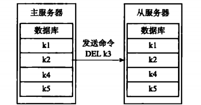

### 二. 旧版复制功能的缺陷

Redis中, slave对master的复制分为两种情况:

1. **初次复制:** slave从没有复制过其他的master, 或者slave当前要复制的不是之前的master
2. **断线后重新复制:** 命令正传播着呢, 网络断了, 重新复制. **这个时候, 再整那些RDB啊什么的就特别麻烦**

> *SYNC*命令非常占资源: 1.要生成RDB, 2. 要发送RDB占网络, 3. slave载入RDB是阻塞的.

### 三. 新版复制功能的实现

断线重连的问题, 可以用2.8版之后的PSYNC命令. 

*PSYNC* 命令具有 *完整重同步(full resynchronization)* 和 *部分重同步(partial resynchronization)*两种模式

1. **完整重同步**: 初次复制, 和SYNC命令基本一样.

2. **部分重同步**: 处理断线后重复制的情况, 断线后重连master, master将断开期间的写命令发送给slave就好

   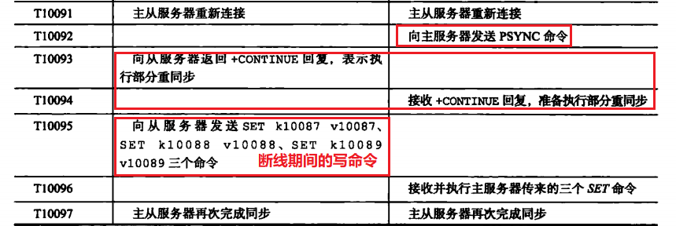

### 四. 部分重同步的实现

1. master的*复制偏移量(replication offset)*和slave的复制偏移量
2. 主服务器的*复制挤压缓冲区(replication backlog)*
3. 服务器的*运行ID(run ID)*

#### 1. 复制偏移量(replication offset)

master和slave都会维护一个复制偏移量: master传播N字节数据时, 偏移量加上N, slave接收M字节数据, 自己的偏移量加上M.


断线后重连, PSYNC报告自己的复制偏移量. master补上刚才没有发送成功的数据, 在复制积压缓冲区中

#### 2. 复制积压缓冲区(replication backlog)

master维护的固定长度(fixed-size)FIFO队列, 默认1MB. 

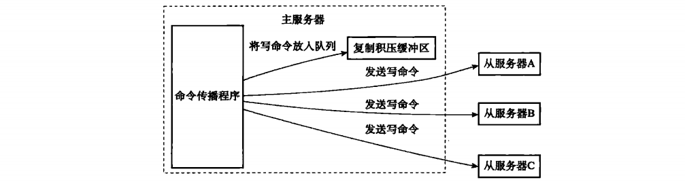


PSYNC将自己的偏移量发送给master , 如果slave的偏移量在缓冲区里面就进行部分重同步, 如果没有在里面就完整重同步.

> 复制积压缓冲区可以调整, 最小大小可以设置为second*write_size_per_second来估算. 

#### 3. 服务器运行ID

部分同步还用到服务器运行ID(run id);

1. 每个redis服务器, 都有自己的运行ID
2. 运行ID在启动时自动生成, 40哥随机16进制字符, slave初次复制, 保存好mater 的 runId
3. slave断线重连master时候, 把之前的masterId传过去, master根据是否是当前的masterId判断是否要完整同步.

#### 五. *PSYNC* 命令的实现

```shell
# slave的请求
PSYNC ? -1   #主动请求master进行完整重同步
PSYNC <runid> <offset>  #断线重连
# master回复
+FULLRESYNC <runid> <offset> # master将执行完整同步
+CONTINUE  # 主服务器将进行部分重同步
-ERR #主服务器版本低于2.8,不支持PSYNC
```

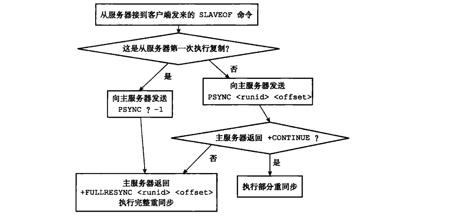

### 六. 复制的实现

准备成为slave的服务器向Master发送*SLAVEOF*可以变成它的slave

```c
SLAVEOF <master_ip> <master_port>
```

#### 1. 设置主服务器的端口和地址

slave首先将master的IP和端口保存在slave服务器的服务器状态masterhost和masterport属性中

```c
struct redisServer {
    char *masterhost;
    int masterport;
}
```

#### 2. 建立套接字连接


#### 3. 发送PING命令

slave成为master的客户端后, 第一件事情就是向master发送一个PING命令. 

可以检查套接字连接的读写是否正常, 主服务器是否正常处理命令请求

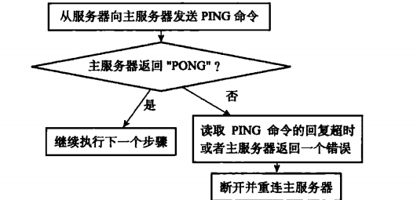

#### 4. 身份验证

master返回PONG回复后, slave要进行身份校验

**如果slave设置了masterauth选项, 就进行身份校验**


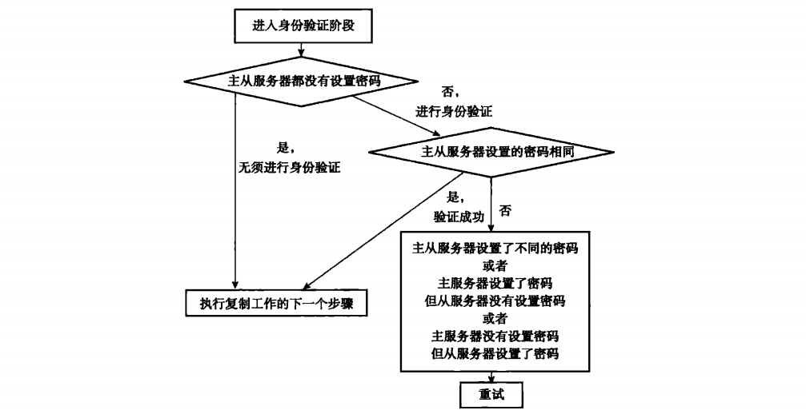

#### 5. 发送端口信息

验证后, **slave执行命令REPLCONF listening-port <port-number>发送slave的监听端口号**

master接收到命令会记录在客户端状态的slave_listening_port属性.

#### 6. 同步

slave向master发送PSYNC命令, 先同步操作把自己的状态给master记录在redisClient里面

之后master也是slave的客户端.

#### 7. 命令传播

这个时候, master作为客户端, 把自己的写命令发送给slave, 两人维护自己的复制偏移量

### 七. 心跳检测💓

完成同步后的命令传播阶段, master把自己的命令给slave, slave要确保自己活着.

slave默认每秒向master发送:

```redis
REPLICONF ACK <replication_offset> # 检测主从网络连接, 辅助实现min-slave, 检测命令丢失
```

#### 1. 检测主从服务器连接

主从服务器可以通过收发REPLCONF ACK命令检测连接是否成功, master超过一分钟没有收到slave的REPLCONF ACK命令, 那么slave出问题了.

#### 2. 辅助实现min-slaves配置选项

redis的min-slaves-to-write和min-slaves-max-lag可以防止master在不安全情况下执行写命令.

```c
min-slaves-to-write 3 // slave少于3个
min-slaves-max-lag 10 // 或者三个slave的延迟(lag)大于等于10秒, master拒绝执行写命令.
```

#### 3. 检测命令丢失

发送REPLCONF ACK命令可以把从服务器中偏移量少的部分从复制积压缓冲区中发送给slave

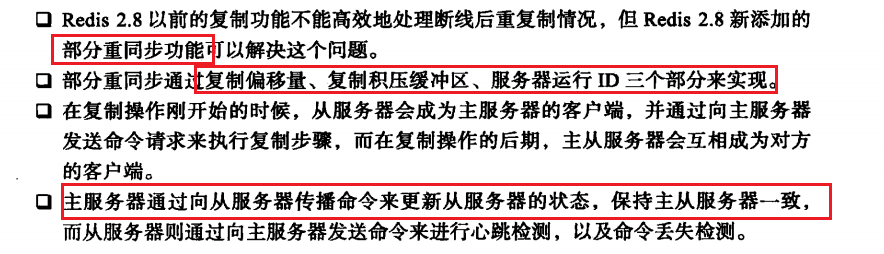


## 第十六章 - Sentinel 哨兵

Sentinel是高可用的解决方案: **由1或n个sentinel实例组成的烧饼系统, 监视任意多个主从服务器. 在master下线后将一个slave升级成master.**

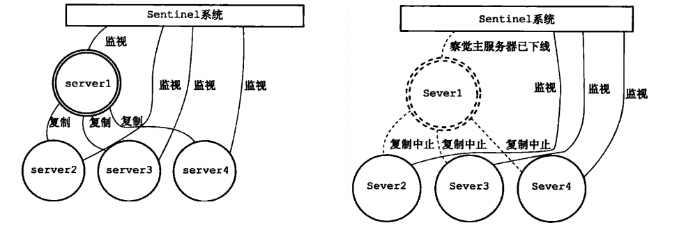

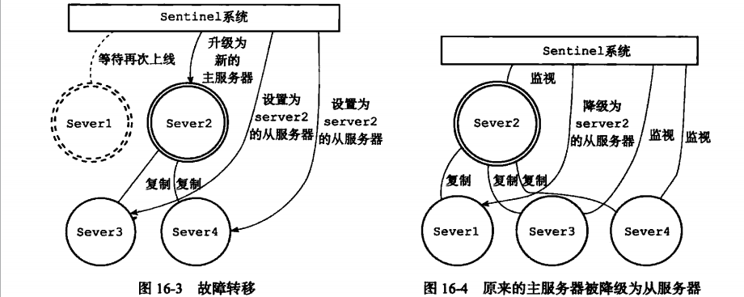

### 一. 启动并初始化Sentinel

```shell
$ redis-sentinel /path/to/your/sentinel.conf  # 启动一个sentinel
```

sentinel启动的步骤:

1. 初始化服务器
2. 将Redis服务器使用的代码替换成Sentinel代码
3. 初始化Sentinel状态
4. 根据配置文件, 初始化sentinel的监视主服务器列表
5. 创建连接master的网络连接

#### 1. 初始化服务器

sentinel是一个特殊模式的redis服务器. 所以初始化sentinel就是初始化redis服务器, 之前讲过. 

不过sentinel服务器不需要载入RDB/AOF文件

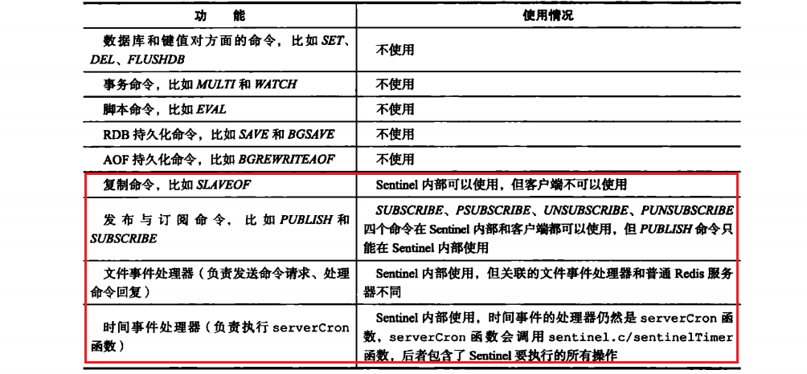

#### 2. 使用Sentinel专用代码

普通redis服务器使用的常量, 替换为Sentilen使用的sentinel.c下的常量. 

服务器命令表使用sentinel.c/sentinelcmds. (这个命令表中没有那些什么set/dbsize等命令, 所以不接受客户端的命令)

#### 3. 初始化Sentinel状态

服务器初始化一个sentinelState结构实例, 存储了服务器中sentinel功能有关的状态, 其他状态还由redisServer实例存储.

```c
struct sentinelState {
    uint64_t current_epoch; // 当前纪元, 用于故障转移
    dict *masters;          // 所有被这个sentinel监视的master, 键是master名字, 值是sentinelRedisInstatnce结构的指针
    int tilt;               // 是否进入TILT模式
    mstime_t tilt_start_time;// 进入TILT模式的时间
    mstime_t previous_time; // 最后一次执行时间处理器的时间    
    int running_scripts;    // 当前执行的脚本数量
    list *scripts_queue;    // 一个FIFO队列, 包含需要执行的用户脚本
}
```

#### 4. 初始化snetinel状态的masters属性

dict *masters;// 所有被这个sentinel监视的master, **键是master名字, 值是sentinelRedisInstatnce结构的指针**, 根据sentinel配置文件

```c
// sentinel.c/sentinelRedisInstance
typedef struct sentinelRedisInstance {
    int flags;			//标识符, 记录实例类型和状态
    char *name;  		//实例的名字
    char *runid; 		//实例id
    uint64_t config_epoch;//配置纪元, 实现故障转移
    sentinelAddr *addr; //实例的地址
    mstime_t down_after_period; //实例无反应多少秒后被判定成下线
    int quorum;         //实例客观下线所需的支持投票数
    int parallel_syncs; //执行故障转移操作时, 可以同时对新的主服务器同步的从服务器数量
    mstime_t failover_timeout; //刷新故障迁移状态的最大时间
} sentinelRedisInstance;
// 地址
typedef struct sentinelAddr {
    char *ip;
    int port;
} sentinelAddr;
```

比如配置文件中, 会创建出一个sentinelRedisInstance实例

```shell
sentinel monitor master1 127.0.0.1 6379 2
sentinel down-after-milliseconds master1 30000
sentinel parallel-syncs master1 1
sentinel failover-timeout master1 900000
```

#### 5. 创建连接master的网络连接

初始化sentinel最后一步就是创建两个master的连接. 

1. 命令链接: 专门向master发送命令, 接受回复
2. 订阅链接: 专门用于订阅主服务器的_sentinel:hello频道, 为了不丢失频道里的消息.


### 二. 获取主服务器的信息

**sentinel默认每10秒向被监视的master发送*INFO*命令**, 来获取master的当前信息

```shell
# 接收到回复例子
# server 
run_id: fjkash9q44851093y5oh45r94731445g1i3o45
# replication
role:master
slave0:ip=127.0.0.1,port=11111,state=online,offset=324,lag=0
slave1:ip=127.0.0.2,port=11111,state=online,offset=324,lag=0
slave2:ip=127.0.0.3,port=11111,state=online,offset=324,lag=0
```

1. master自己的信息, run_id和role等, 更新到sentinelRedisInstance状态.
2. slaves的信息.更新到sentinelRedisInstance里的slaves属性

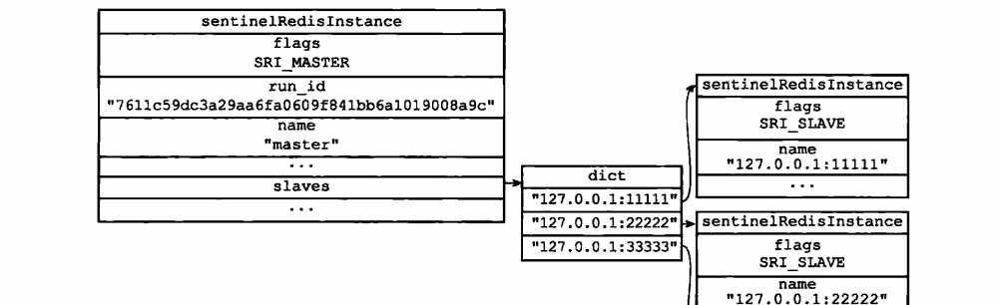

### 三. 获取从服务器的信息

sentinel发现由新的slave出现时, 会为这个slave创建实例添加到sentinelRedisInstance里, 还会**创建连接从服务器的命令连接和订阅链接**

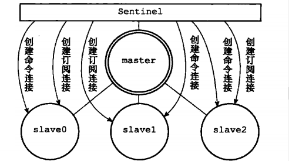

默认每10秒又向slave发送*INFO*命令, 接受回复

```shell
# 接收到回复例子
# server 
run_id: fjkash9q44851093y5oh45r94731445g1i3o45
# replication
role:slave
master_host:127.0.0.1
master_port:11111
master_link_status:up    # 主从服务器连接状态
slave_repl_offset:11887  # 从服务器的复制偏移量
slave_priority:100		 # 从服务器的优先级
```

### 四. 向master和slave发送消息

默认sentinel每2秒向所有slave和master的*_sentinel_:hello*频道里面发送下面的命令

```shell
PUBLISH _sentinel_:hello "<s_ip>,<s_port>,<s_runid>,<s_epoch>,<m_name>,<m_ip>,<m_post>,<m_epoch>"
```

1. **s开头的sentinel信息**

2. **m开头的记录的是当前的master/slave的信息**

   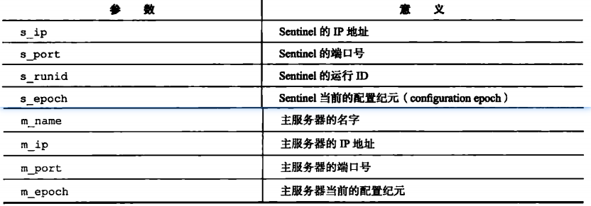

### 五. 接收master和slave的频道信息

sentinel对_sentinel:hell 频道的订阅持续到连接断开. 


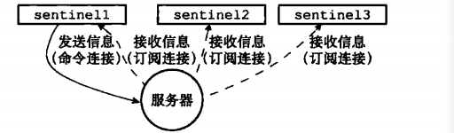

sentinel1向服务器的频道中发送一条信息, 其他的sentinel也接收到.

每个sentinel中的master实例除了保存自己的sentinel信息, 还**保存着其他监视master的sentinel信息**

**sentinel接收到其他sentinel发过来的信息, 那么会提取出sentinel的ip,port,run_id和配置纪元等**. 还有接收的服务器的参数. 

接收到后, 在自己sentinel状态的masters字典中查找到对应的服务器, 然后把发信息的那个sentinel放在master字典值里面的sentinels字典中

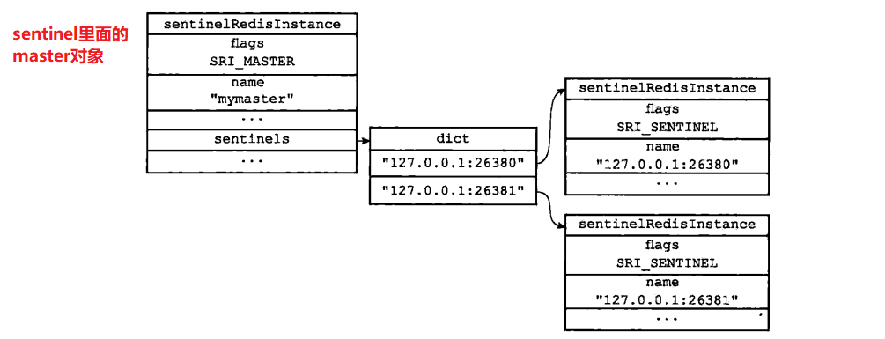

#### 2. 创建连接其他Sentinel 的命令连接


sentinel之间不创建订阅链接, 一位内订阅链接是为了发现其他的未知的sentinel.

### 六. 检测主观下线状态

**sentinel每1s向其他所有的master/slave/sentinel发送*PING*命令**, 判断是否在线.

sentinel配置中的down-after-milliseconds中指定sentinel判断实例下线的时间长度. 如果时间内无有效返回那么会**修改实例结构对应的flags属性, 打开SRI_S_DOWN标识标识实例下线**

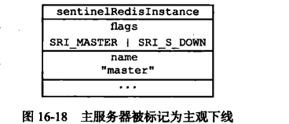

> 主观下线的的down-after-milliseconds会被用于master下面的所有slave

### 七. 检测客观下线状态

sentinel将服务器判断为主观下线后, 会向其他监视该服务器的sentinel询问, 如果**询问判断为下线的sentinel数达到足够数量后就判断为客观下线, 对master执行故障转移.**

#### 1. 发送Sentinel is-master-down-by-addr命令

```shell
SENTINEL is-master-down-by-addr <ip> <port> <current_epoch(sentinel的纪元)> <runid(sentinel的runid)> # 询问其他的sentinel是否同意主服务器已经下线.
```

#### 2. 接收SENTINEL is-master-down-by-addr命令

一个sentinel接收到另一个sentinel(源sentinel)的命令, 目标sentinel会检查主服务器是否下线,然后返回三个参数的Multi Bulk回复.

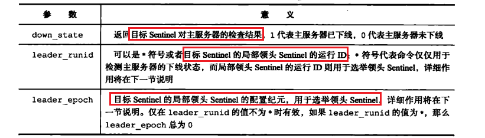

#### 3. 接收SENTINEL is-master-down-by-addr的回复

接收到多个sentinel的回复后, **根据master在本sentinel的客观下线所需数量, 判断是否把flags里面的SRI_O_DOWN标识打开.**

### 八. 选举领头 Sentinel

**当一个master被判断为客观下线后, sentinel们选举出一个领头sentinel, 对master进行故障转移操作**

1. 所有在线的sentinel都有被选为领头的资格

2. 每次选举之后, 所有sentinel的配置纪元(configuration epoch)自增1

3. 每个发现master客观下线的sentinel会要求其他sentinel把自己设置成领头, 在发送sentinel is-master-down-by-addr时候传送的runid里面要求

4. ...

   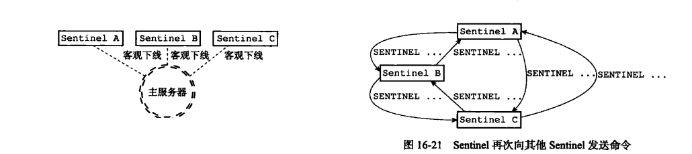

### 九. 故障转移

领头Sentinel对下显得master进行故障转移:

1. 从原master属下的slave们中选出一个新master
2. 将其他的slave们复制新的master
3. 将原master设置成新的master的slave

#### 1. 选出新的master

挑选出一个健壮的slave, 向他发送*SLAVEOF no one*命令, 转成主服务器.

> 挑选新的master:
>
> 领头sentinel将所有的slave保存在列表中, 按照下面规则进行过滤.
>
> 1. 删除下线的slave
> 2. 删除最近5s没有回复过领头sentinel的Info命令的slave
> 3. 删除与原master连接断开超过down-after-milliseconds*10毫秒的slave.
>
> **然后按照slave的优先级排序, 选出最高的slave**, 优先级相同选复制偏移量最大的.


#### 2. 修改slave们的复制目标

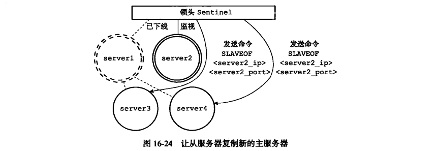

#### 3. 将old slave变成 newMaster的slave

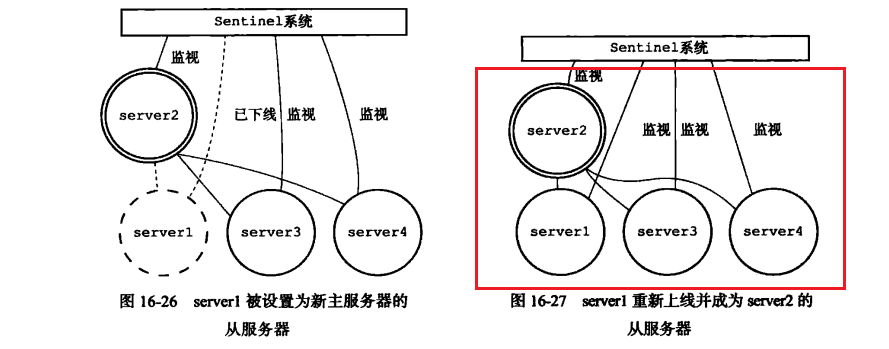


## 第十七章 - 集群

集群式分布式数据库方案, 集群通过分片(sharding) 来进行数据共享, 复制和故障迁移

本章对集群的节点, 槽指派, 命令执行, 转向, 故障转移, 消息等介绍哦

### 一. 节点

一个Redis集群由多个节点(node)组成, 把独立的node连接起来, 构成一个集群. 

```shell
CLUSTER MEET <ip> <port>
```

像一个节点发送CLUSTER MEET命令, **让节点与指定ip和port的节点进行握手**, 握手成功, node就会把指定的节点添加到node所在的集群中. 

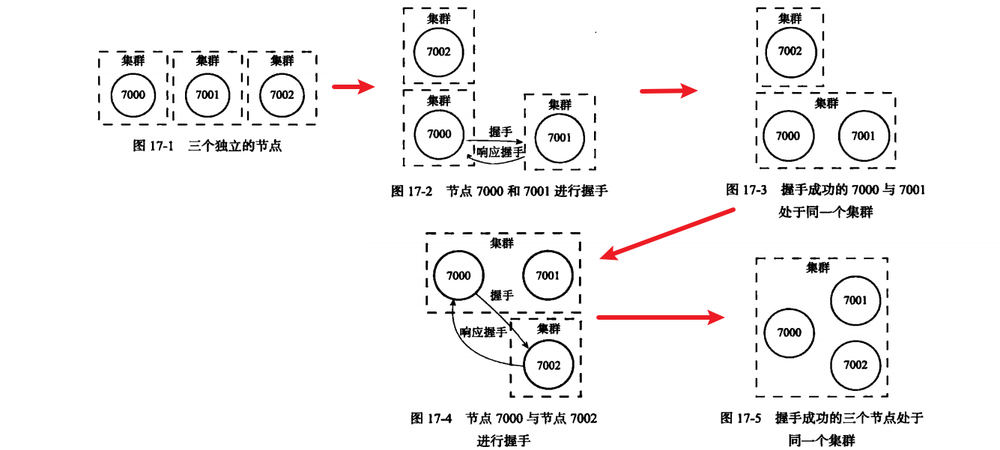

#### 1. 启动节点

节点是redis服务器, 启动时候会根据cluster-enable配置是否为yes来决定是否开启服务器的集群模式


服务器对于集群模式下的数据, 保存到了cluster.h/clusterNode结构, cluster.h/clusterLink结构 和 cluster.h/clusterState结构中

#### 2. 集群数据结构

**cluster.h/clusterNode结构保存节点的当前状态:** 创建时间, 名字, 配置纪元, ip和port.

```c
struct clusterNode {
    mstime_t ctime;                   // 节点创建时间
    char name[REDIS_CLUSTER_NAMELEN]; // 节点的名字
    int flags;						  // 系欸但表示, 节点状态和角色
    uint64_t configEpoch;			  // 节点当前的配置纪元, 故障转移
    char ip[REDIS_IP_STR_LEN];		  // 节点ip
    int port;						  // 节点端口
    clusterLink *link;				  // 保持连接节点所需的有关信息
};
// 连接节点的相关信息
typedef struct clusterLink {
    mstime_t ctime; 				  // 连接的创建时间
    int fd;							  // TCP套接字描述符
    sds sndbuf;						  // 输出缓冲区, 保存发送给其他节点的消息
    sds rcvbuf;						  // 输入缓冲区, 接收其他节点的消息
    struct clusterNode *node;		  // 连接的节点哦
} clusterLink;
```

每个节点还保存一个clusterState结构, 记录当前节点的视角下, 集群的状态.

```c
typedef struct clusterState {
	clusterNode *myself;					// 当前节点的指针
    uint64_t currentEpoch;					// 集群的当前配置纪元
    int state;								// 集群当前的状态, 上下线
    int size;								// 集群中至少处理着一个槽的节点的数量
    dict *nodes;							// 集群中节点名单(包括MySelf)键为节点名字, 值为clusterNode.
}
```

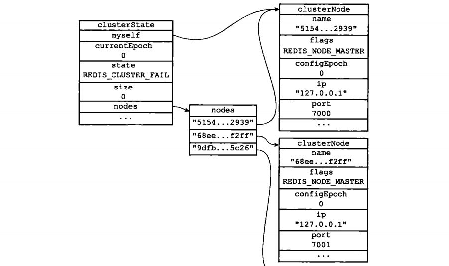

#### 3. CLUSTER MEET 命令的实现

收到命令的节点A与指定的ip,port节点B进行握手(handshake), 确认彼此存在, 为通信打好基础

1. 节点A为B建立一个clusterNode, 放在自己的clusterState.nodes字典里
2. 向B发送一条MEET 消息
3. B收到MEET消息后, 为A创建一个clusterNode结构, 把它添加到自己的clusteState.nodes字典里
4. B返回给A一个PONG消息
5. A接收到PONG, 然后向B返回一个PING消息, 
6. B接收到PONG, 握手成功
7. A把B的信息传播给其他节点, 其它节点也与B握手.


### 二. 槽指派

redis集群通过**分片保存数据库中的键值对**, 集群的整个数据库被分为16384个槽(slot), 数据库中每个键属于16384个槽中一个, 每个节点可以处理0-16384个槽.

如果16384个槽有一个没有被节点处理, 集群就处于下线状态. 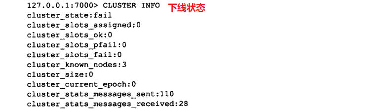

```shell
# 把0-5000的槽分派给本节点
127.0.0.1:7000> CLUSTER ADDSLOTS 0 1 2 3 4 ... 5000
```

**槽分配完毕后, 集群进入上线状态.**

#### 1. 记录节点的槽指派信息

```c
struct clusterNode {
    unsigned char slots[16384/8];	// 二进制位数组对应位上1标识在负责
    int numslots; 					// 处理槽的数量
};
```

#### 2. 传播节点的槽指派信息

将自己处理的槽记录在clusterNode结构里的slots属性和numslots属性,  还会把自己的slots数组发给其他的节点. 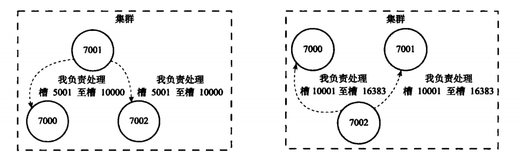

其他节点接收到slots数组后, 放在clusterState.nodes字典里对应的节点的clusterNode结构中.

#### 3. 记录集群中所有槽的指派信息

```c
// clusterState结构
typedef struct clusterState {
    clusterNode *slots[16384]; // 记录了16384个槽的指派信息, 每一项都是指向clusterNode的指针
};
```

#### 4. CLUSTER ADDSLOTS 命令的实现

*CLUSTER ADDSLOTS*命令接收n个槽作为参数

```python
def CLUSTER_ADDSLOTS(*all_input_slots):
    # 遍历所有输入槽, 检查它们是否都是未指派槽
    for i in all_input_slots:
        if clusterState.slots[i] != null:  # 必须为空才是未指派的
            reply_error()
            return;
    # 再次遍历, 把槽分配给当前的节点
    for i in all_input_slots:
        clusterState.slots[i] = clusterState.mysql;
        setSlotBit(clusterState.mysql.slots, i); # 设置到自己的clusterNode里
```

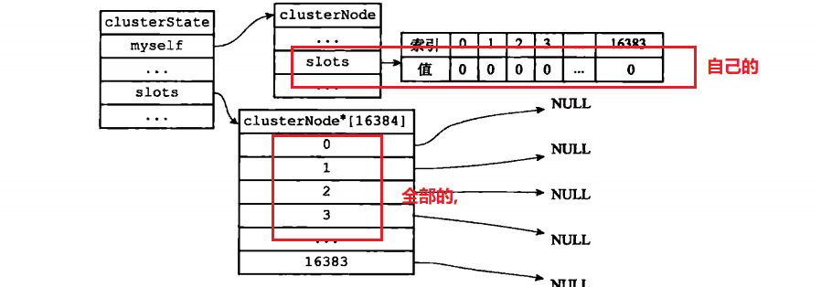

### 三. 在集群中执行命令

所有的槽都指派后, 集群上线. 客户端就可以向集群中的节点发送命令了

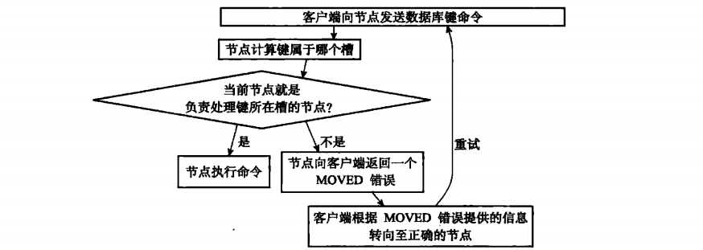

#### 1. 计算键属于哪个槽

```python
def slot_number(key):
    return CRC16(key) & 16383;
# CRC16(key)计算键的CRC-16校验和 然后计算一个0-16383的值.
CLUSTER KEYSLOT <key>   # 可查看一个键所属于的槽
```

#### 2. 判断槽是否有当前节点负责

在自己的clusterState.slots数组中的i项, 判断是否是自己这个节点. 

#### 3. MOVED 错误

节点发现要处理的键在的槽不是自己负责, 向客户端返回MOVED错误, 只因客户端转向槽在的节点

```shell
MOVED <slot> <ip>:<port>  # 返回所在槽, 和处理该槽的节点ip和port
```

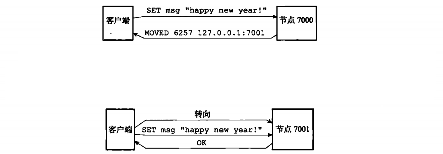

> moved错误被隐藏, 客户端在接收到moved错误时, 一般会自动转向处理槽的节点处理. 不会打印哦~

#### 4. 节点数据库的实现

集群节点保存键值对和键值对过期的方式和单机Redis中一样. **不同是集群节点只是用0号数据库.**

然后系欸但中用clusterState结构中的slots_to_keys跳跃表保存槽与键之间的关系

```c
typedef struct clusterState {
    zskiplist *slots_to_keys;
} clusterState;
```

**slots_to_keys: ** 跳跃表的分值是槽号, 成员是一个数据库键.

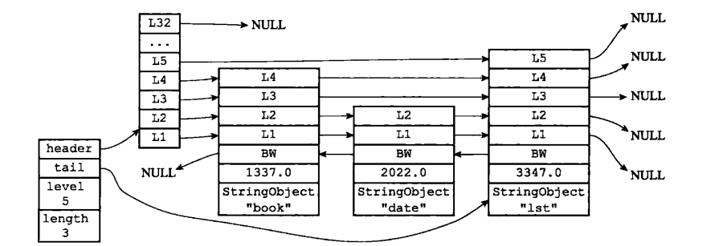

>  ???每个槽只能放一个键???, 不是的,  槽标识的分数可以有多个哦~

### 四. 重新分片

redis集群的**重新分片操作可以把已分派槽指定给其他节点**

#### 1. 重新分片的实现原理

由redis的集群管理软件redis-trib负责执行, redis提供了命令, redis-trib向源节点和目标节点发送命令

**redis-trib重新分派单个槽:**

1. redis-trib向目标节点发送 *CLUSTER SETSLOT <slot> IMPORTING <source_id>* 命令, 让目标节点准备好从源节点导入属于槽slot的键值对

2. redis-trib向源节点发送 *CLUSTER SETSLOT <slot> MIGRATING <target_id>* 让源节点准备好把属于槽slot的键值对迁移(migrate)到目标节点

3. redis-trib向元系欸但发送 *CLUSTER GETKEYSINGLOT <slot> <count>* 从源节点获取count个键值对的**键名**

4. 每个键名, redis-trib向源节点发送 *MIGRATE <target_ip> <target_port> <key_name> 0 <timeout>* , 把键的value原子的迁移到目标节点

5. 重复3,4, 把所有的键值对都迁移

   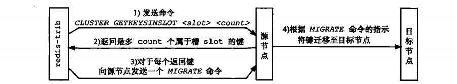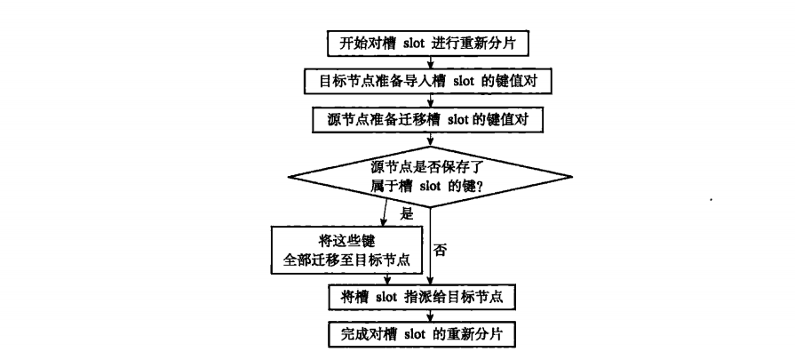

### 五. ASK 错误

重新分片期间, 源节点向目标节点**迁移槽的过程中, 多个键值在两个节点中**

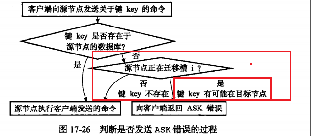

和MOVED错误一样,ASK错误也会被客户端隐藏, 然后转到目标节点.

#### 1. CLUSTER SETSLOT IMPORTING 命令的实现

```c
typedef struct clusterState {
    clusterNode *importing_slots_from[16384]; // 记录当前节点正在从其他节点导入的槽
    // 元素指向的clusterNode就是源节点
}
```

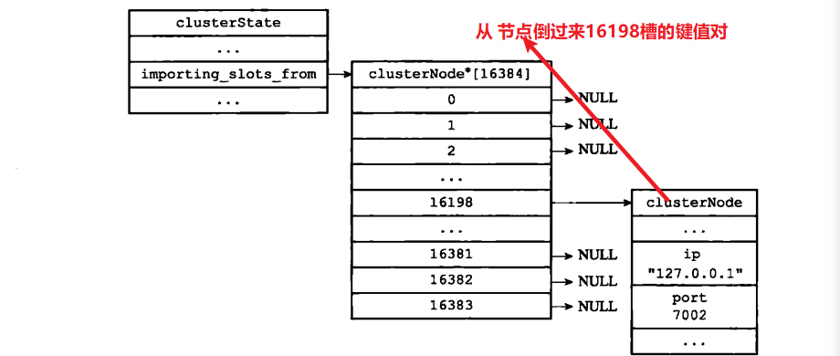

#### 2. CLUSTER SETSLOT MIGRATING 命令的实现

```c
typedef struct clusterState {
    clusterNode *migrating_slots_to[16384]; // 记录当前节点要导出到其他节点的槽
    // 元素指向的clusterNode就是目标节点
}
```

#### 3. ASK 错误

如果节点收到关于key的请求, key在的槽正在分片中, 没有找到key, 那么就返回一个ASK错误, 引导客户端到目标节点去看看. 

#### 4. ASKING 命令

*ASKING*命令可以打开发送该命令的客户端的 REDIS_ASKING 标识

```python
def ASKING():
    client.flags |= REDIS_ASKING; # 打开发送命令的客户端的标识
    # 向客户端返回OK回复
    reply("🆗")
```

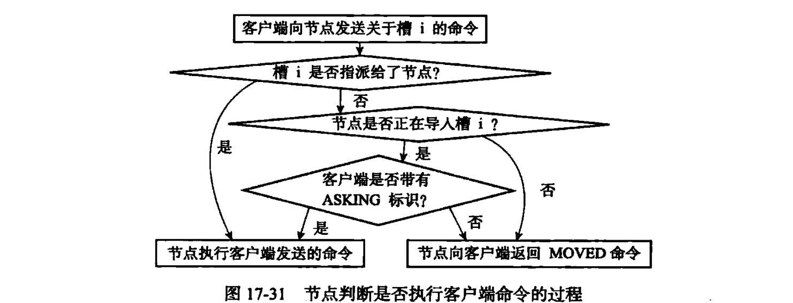

**如果节点正在导入槽i, 且发送命令的客户端带有REDIS_ASKING标识, 那么系欸但就破例执行关于槽i的命令一次**

#### 5. ASK错误和moved错误区别

1. MOVED错误标识槽的负责权不在本节点, 要去MOVED到其他系欸但
2. ASK错误是槽转移过程中临时措施, 接收到ASK错误, 会在**下一次请求槽操作时候发送到ASK返回的节点, 之后的请求仍然到槽的负责节点.**

### 六. 复制和故障迁移

集群中的节点分为主节点和从节点, 主节点用于处理槽, 从节点用于复制某个主节点, 主节点下线后, 编程新的主节点.

>  ??? redis槽处理, 查询key的时候是不是要大家都可以查得到啊?

#### 1. 设置从节点

```c
CLUSTER REPLICATE <node_id>  # 可让接收命令的节点变成node_id节点的从节点, 开始复制node_id节点
struct clusterNode {
	struct clusterNode *slaveof;  // 如果是从节点, 这就指向主节点.
}
```

设置成从节点后, 修改自己的clusterState.mysql.flags的属性, 关闭REDIS_NODE_MASTER标识, 打开REDIS_NODE_SLAVE标识.

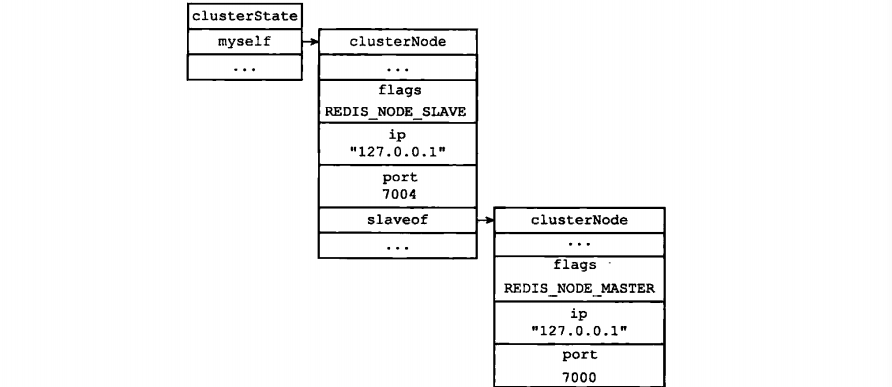

节点变成从节点的信息会通过消息发送给所有的节点, 最终所有的节点里面的代表本节点的clusterNode中的属性都会相应变化.

#### 2. 故障检测

集群中每个节点定期想其他节点发送PING消息检测是否在线, 如果没有回复的节点将被标记成**疑似下线**. 在**clusterNode的flags属性里面打开REDIS_NODE_PFAIL标识**

一个主节点A通过消息得知B认为C进入意思下线状态, 主节点A在自己的clusterState.nodes字典里找到C的clusterNode, 把B关于C的下线报告添加到C的fail_reports链表里

```c
struct clusterNode {
    list *fail_reports; // 记录了其他节点对本节点的下线报告
}
struct clusterNodeFailReport {
    struct clusterNode *node; // 报告目标节点下线的节点
    mstime_t time; 			  // 最后一次从node节点收到下线报告的时间
}
```

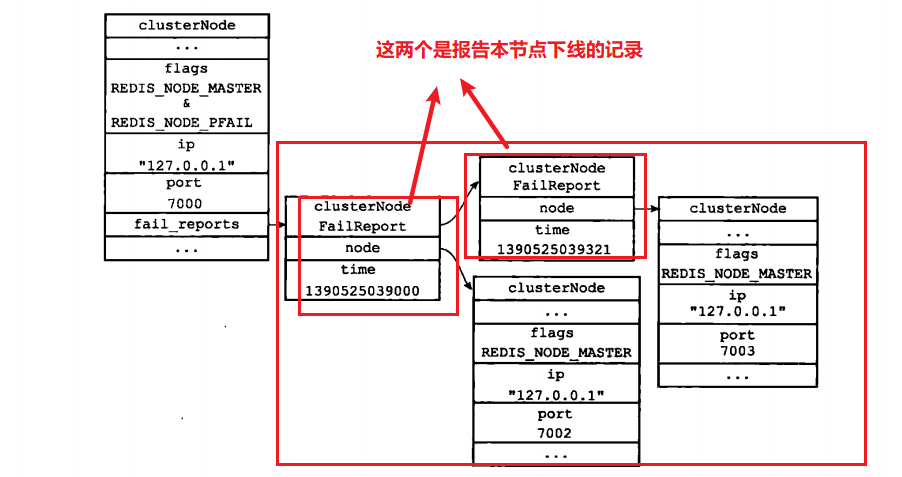

半数节点都报告本节点疑似下线, 那么就正式标记为下线(FAIL). 标记的节点向所有结点广播某个节点下线. 其他节点也标记了.

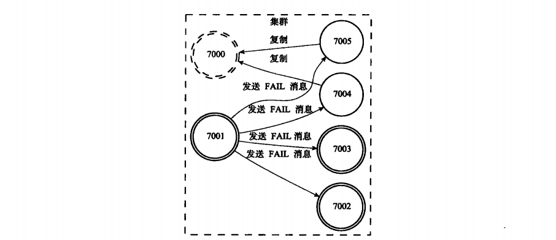

#### 3. 故障转移

从节点发现自己复制的主节点已下线了, **从节点就开始对下线主节点进行故障迁移**.

1. 下线主节点的slave节点们选举出一个新的主节点, 执行slaveof no one
2. 新的主节点把oldMaster的槽指派分配给自己. 
3. new Master向集群广播PONG消息, 告知自己成为新的主节点.
4. new Mster接收自己负责的槽命令. 

#### 4. 选举新的主节点

集群中选举新的主节点:

1. 每次故障转移, 集群中所有的配置纪元+1;
2. 每个负责槽的主节点都有一次投票机会, 第一个接收到的slave请求, 投给它.
3. slave发现自己的master下线, 向集群广播CLUSTERMSG_TYPE_FAILOVER_AUTH_REQUEST消息, 要求其他master给我投票
4. 有投票权的master向第一个要求投票的slave返回CLUSTERMSG_TYPE_FAILOVER_AUTH_ACK消息, 表示支持
5. 所有参与投票的slave统计自己获得的票数.一个节点获得超过一般票数就成为新的主节点
6. 没有slave获得一半多的票, 那么就进入下一个配置纪元, 再他妈选一轮. 
7. 知道选出新的主节点.

### 七. 消息

集群中各个节点通过收发消息来通信. 消息有五种:

1. MEET消息: CLUSTER MEET命令要求对方加入到自己的集群
2. PING消息: 每个节点默认1s就像已知的所有节点中的5个发送PING, 检查是否在线
3. PONG消息: 接收到MEET/PING消息就回复一条PONG, 也可以广播自己的PONG来更新其他节点对自己的看法, 比如成为新的Master之后
4. FAIL消息: 一个master被A节点判断成FAIL状态, 发现FAIL的A节点就像所有节点广播FAIL消息
5. PUBLISH消息: 节点收到PUBLISH命令, 执行, 然后向集群广播PUBLISH消息, 其他接收到消息的节点也会执行PUBLISH命令.

#### 1. 消息头

所有消息都由一个消息头包裹, **消息头包含消息正文, 还有消息发送者自身的信息**. 

```c
typedef struct {
    uint32_t totlen; // 消息的长度(头+正文)
    uint16_t type;   // 消息的类型
    uint16_t count;  // 消息正文包含的节点信息数量(ping,pong,MEET时候使用)
    uint64_t currentEpoch; // 发送者所处的配置纪元
    uint64_t configEpoch;  // 发送者是master这就是发送者的配置纪元, slave就是它的master的配置纪元
    char sender[REDIS_CLUSTER_NAMELEN]; // 发送者的名字
    unsigned char myslots[REDIS_CLUSTER_SLOTS/8]; //发送者当前的槽指派信息
    char slaveof[REDIS_CLUSTER_NAME_LEN]; // 发送者是master就是全是0的字节数组, 是slave就是master的名字
    uint16_t port;    		// 发送者端口号
    uint16_t flags;			// 发送者的标识符
    unsigned char state;	// 发送者所处集群的状态
    union clusterMsgData data; // 消息正文
} clusterMsg; // 消息头
union clusterMsgData {
    struct {
        clusterMsgDataGossip gossip[1]; // 消息包含两个clusterMsgDataGossip结构
    } ping; // MEET,PING,PONG消息正文
    struct {
        clusterMsgDataFail about;
    } fail; // FAIL消息正文
    struct {
        clusterMsgDataPublish msg;
    } publish; // publish消息的正文
    // .. 其他消息的正文
}
```

#### 2. MEET, PING, PONG消息的实现

MEET, PING, PONG消息通过Gossip协议交换. 

接收到三种消息后, 接收者访问消息正文的两个clusterMsgDataGossip结构, 如果D中不包含B和C那么就握手, 包含了就更新clusterNode.


#### 3. FAIL消息的实现

masterA将masterB标记已下线时, A向集群中广播B的FAIL消息.接收到消息的系欸但也把B标记为下线. Gossip协议需要一段时间才能传播到集群, 但是**Fail消息内容只有名字, 可以马上传播.**

```c
typedef struct{
    char nodename[REDIS_CLUSTER_NAMELEN]; // 下线节点的名字
} clusterMsgDataFail;
```

#### 4. PUBLISH 消息的实现

客户端向集群中发送 PUBLISH <channel> <message>; 广播, **接收到广播的命令会向channel中发送消息, 还会向所有的节点中发送一条PUBLISH消息**

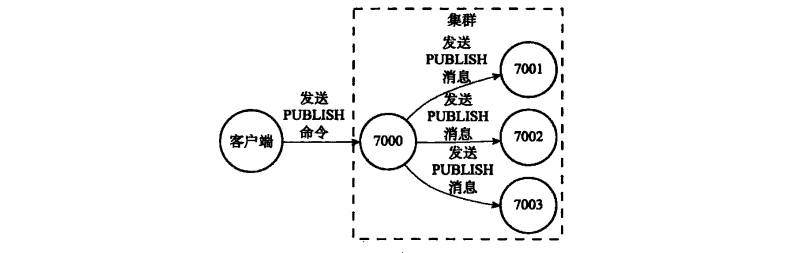

```c
typedef struct {
    uint32_t channel_len;
    uint32_t message_len;
    unsigned char bulk_data[8]; // 定义为8字节为了对齐其它消息结构, 实际长度待定
    // 保存客户端publish发送给
} clusterMsgDataPublish; //消息体
```

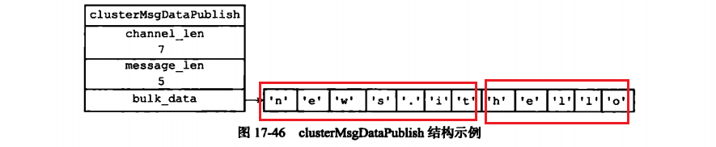

>  为什么向其他节点发送PUBLISH消息, 而**不是广播PUBLISH命令**:
>
> redis集群规则:"各个节点通过发送和接受消息来通信"

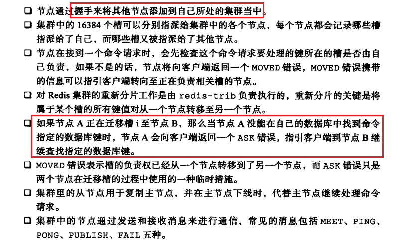


