## 一周

### 2. Java代码是怎么运行起来的

前面步骤:

1. 编译成class二进制文件

2. 打包成`.jar/.war`包

3. 使用Tomcat容器/jar命令,运行jar里面的代码

   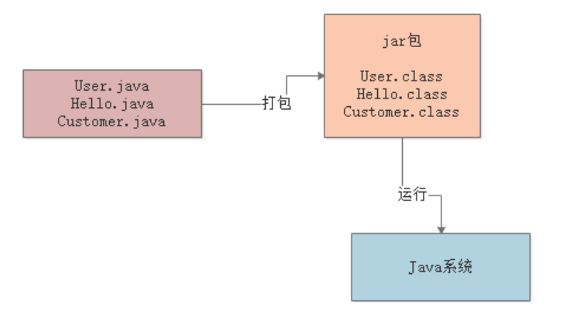

**Java -jar命令会干什么**

1. 启动JVM进程

2. 加载运行`.class`文件

   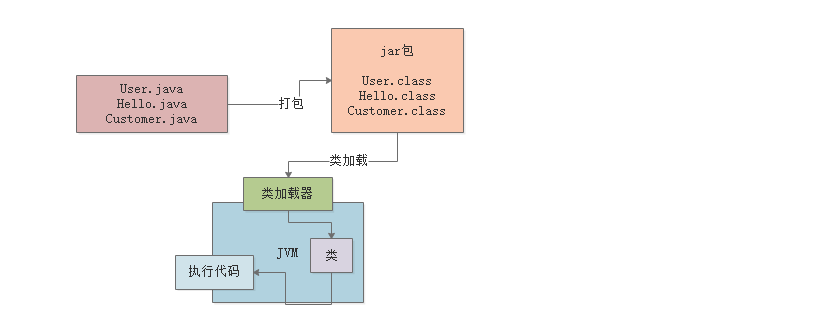

>  问题: 二进制的class文件反编译就被别人拿走了, 公司怎么保护自己写的代码?
>
> `.class`字节码加密，自定义类加载器，加载类后解密成内存里的class类，再执行代码
>
> `-XX:+TraceClassLoading`可以跟踪加载的类.

### 3. JVM类加载机制的各种问题

1. **什么时候会加载一个类?**

   `加载->验证->准备->解析->初始化->使用->卸载`, 在代码中用到这个类的时候. main()方法所在的主类会在JVM启动时候加载. 

   执行代码收遇到了某个类, 就会从对应的`.class`字节码文件对应的类加载到内存

2. **验证, 准备, 解析和初始化**

   1. **验证**

      校验加载的`.class`文件内容是否符合规范.

   2. **准备**

      给类分配一些内存空间, 然后会给类变量(static)分配内存空间, 放一个初始值.

   3. **解析**

      解析就是**把符号引用转换成直接引用的过程**

      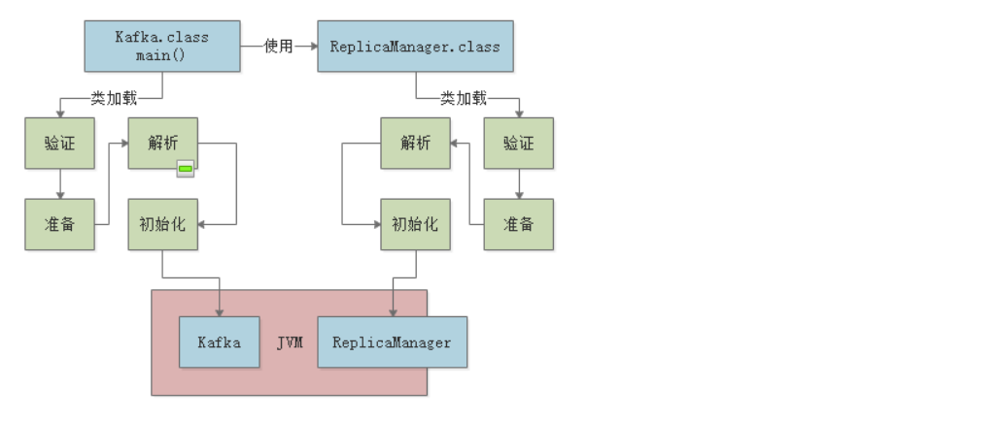

3. **核心阶段: 初始化:**

   准备阶段只会为static类变量开辟内存空间给`0/null`, 赋给它的值, 在初始化阶段才会执行:

   1. state变量赋值, 去初始new的那个类的初始化代码. 
   2. state代码块.

   ```java
   public static int flushInterval = Configuration.getInt("replica.flush.interval");
   ```

   **什么时候初始化一个类:**

   1. new的时候, 会触发类的加载然后到初始化, 就会把一个类class准备好, 还会实例化一个对象出来.

   2. `main()`方法的主类

   3. 一个准备要初始化的类, 先会初始化它的父类.

      比如说遇到一个`new A();`, 会先初始化AFather.class, 然后初始化A.class, 然后实例化(这就不是类加载过程了).
      
   4. ```java
       1.当创建某个类的新实例时（如通过new或者反射，克隆，反序列化等）
       2.当调用某个类的静态方法时
       3.当使用某个类或接口的静态字段时
       4.调用Java API中的某些反射方法时，比如类Class中的方法，或者java.lang.reflect中的类的方法时
       5.当初始化某个子类时
       6.当虚拟机启动某个被标明为启动类的类（即包含main方法的那个类） 
      所以System.ou.println(Test.class)不满足上面6种情况，也就没有做初始化
      ```

   5. 

4. **类加载和双亲委派机制**

   1. **bootstrap classLoader:** 加载jdk lib下面的核心类.

   2. **Extension ClassLoader:** `lib/ext`目录下的支撑系统运行的类.

   3. **Application ClassLoader:** 加载`ClassPath`环境变量指定的路径的类, 就是我们写的类.

   4. **Customized Classloader:** 其实也是applicationClassLoader, 自己去定义加载谁.

   5. **双亲委派机制:** 

      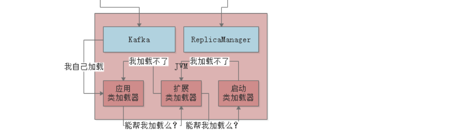

5. 思考题:

   > Tomcat是流行的java实现的web容器, 它自己就是一个JVM. 那么, Tomcat自己的类加载机制应该怎么设计才能把我们动态部署进去的war包中的类, 加载到Tomcat自身运行的JVM中呢?
   >
   > 答案: 
   >
   > 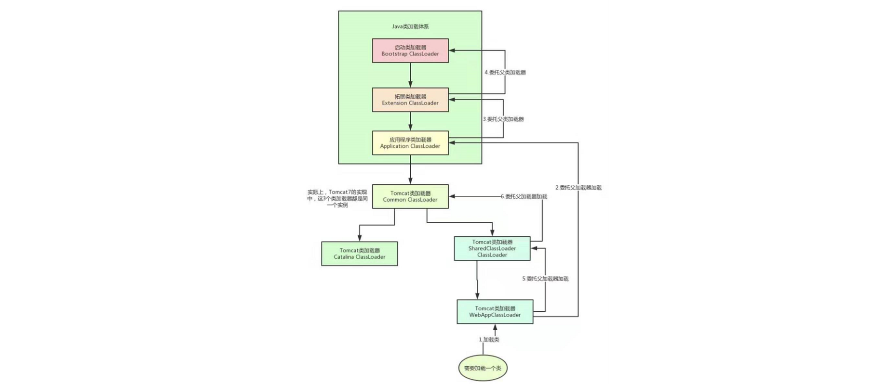
   >
   > Tomcat自定义了很多类加载器, 用来加载Tomcat自己的核心基础类库. 然后每个web应用都有对应的WebAppClassLoader, 负责加载那个webApp的类. 
   >
   > Tomcat打破了双亲委派, webAppClassLoader指挥家在自己对应的webApp的class.不会交给父.


### 4. JVM 的内存区域及其功能

#### 1. JVM的内存区域划分

1. **方法区/Metaspace:** 

   1.8以后, 方法区改名Metaspace. 存放类, 还有一些类似常量池东西. 

2. **程序计数区:** 

   JVM会使用字节码执行引擎, 去把拿到的字节码指令一条一条的执行. 得用程序计数器去记录当前执行到字节码的位置. **按照线程分的**, 

3. **虚拟机栈:** 

   线程执行代码, 线程需要内存存放自己的局部变量啊什么的, 线程调用了方法, 就形成一个**栈帧**放在自己分得的那个内存栈的上面. 

   栈帧里有: 局部变量表, 操作数栈, 动态链接, 方法出口...

   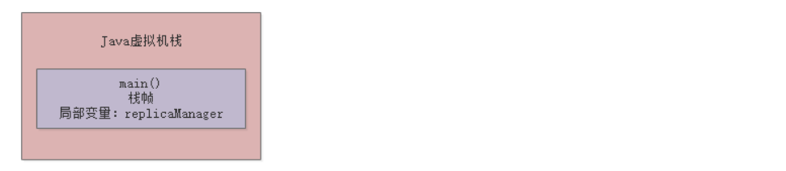

4. **Heap 堆:**

   存放实例对象的地方

5. 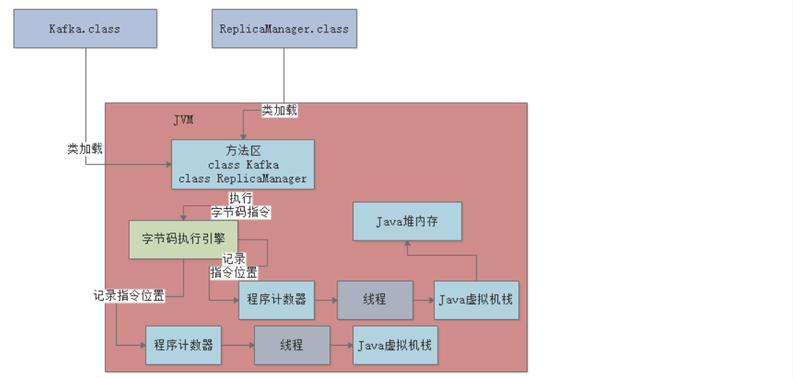

6. 其他内存区域:

   本地方法栈, 还有NIO操作的JVM外部空间.

> 问题: 在JVM Heap里面的对象, 会占用多少内存? 怎么估算一个对象占多大?
>
> 答案: 对象内存占用主要分两块: 1. 对象自己本身的meta, 2. 对象存的数据,
>
> 对象头: 16bytes, int:4bytes, long:8bytes.
>
> Object Header(4字节) + Class Pointer(4字节)+ Fields(看存放类型), 但是jvm内存占用是8的倍数, 所以结果要向上取整到8的倍数


### 5. JVM的GC机制概念

每个JVM进程都有GC后台线程, GCThread会不断检查Heap里的各个实例对象.

实例对象没有引用的时候就会干掉, 从heap里面移除掉.....

> 问题: 方法区的类会被回收掉么?
>
> 方法区里的类会被回收, 有几个条件: 
>
> 1. 首先该类的所有实例对象都已经从Java堆内存里被回收
> 2. 其次加载这个类的ClassLoader已经被回收
> 3. 最后，对该类的Class对象没有任何引用

### 6. 画出JVM整体运行原理

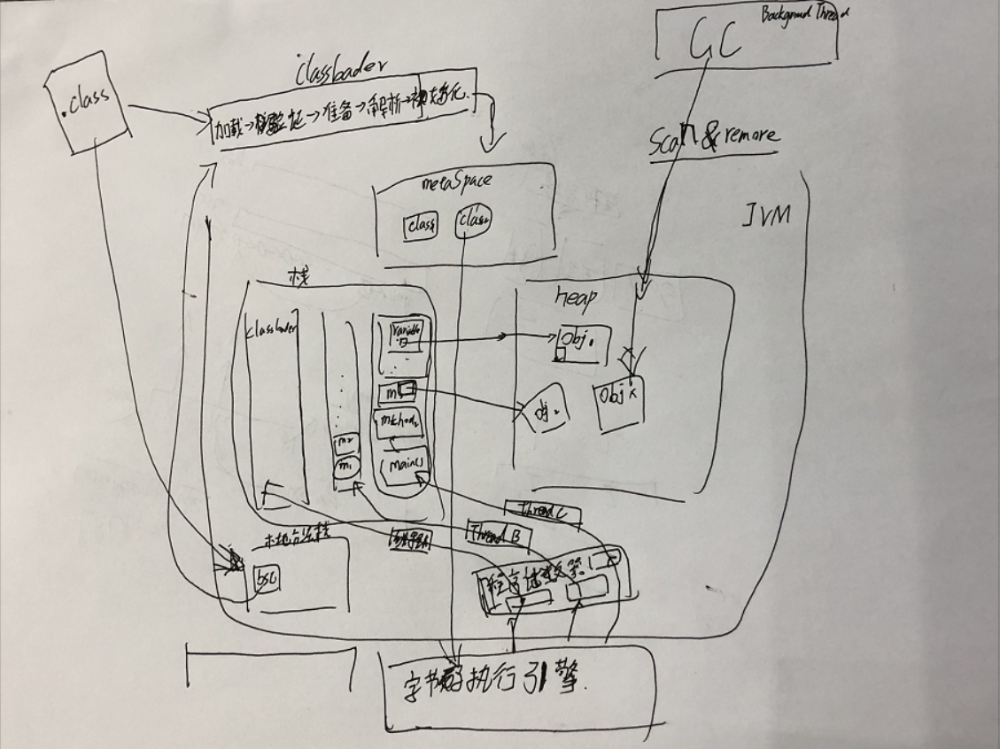


## 二周

### 8. JVM 分代模型: 新生代, 老年代, 永久代

JVM内存的一个分代模型：年轻代、老年代、永久代

#### 1. 大部分对象都是存活周期极短的

出栈入栈, 对象引用就断掉了.

#### 2. 少数对象是长期存活的

静态变量, 长期引用的对象

#### 3. JVM分代模型: 年轻代和老年代


#### 4. 为什么要分成年轻代和老年代

年轻代里的对象创建之后很快就会被回收, 老年代的对象则不同, 适合两种垃圾回收算法. 

#### 5. 永久代(方法区)

方法区的GC现在先不说


#### 6. 思考题

> 每个线程都有Java虚拟机栈，里面也有方法的局部变量等数据, 会GC么?
>
> 会, 方法一旦执行完毕，栈帧出栈，里面的局部变量直接就从内存里清理掉了。


### 9. 对象在JVM内存中如何分配和流动的

#### 1. 大部分正常对象都优先在新生代分配内存


#### 2. **触发新生代的垃圾回收**

如果新生代里 分配着分配着, 内存空间不够了, 就会触发一次新生代内存空间的垃圾回收(**Minor GC**).


#### 3. 长期存活的对象会躲过多次垃圾回收

进入老年代


#### 4. 老年代的垃圾回收

老年代满了就会 **FullGC**


#### 5. 特殊的情况:

- 新生代垃圾回收之后，因为存活对象太多，导致大量对象直接进入老年代
- 特别大的超大对象直接不经过新生代就进入老年代
- 动态对象年龄判断机制
- 空间担保机制

#### 6. 思考题

> 理解了对象内存分配, GC和老年代转移之后, 思考一下, 短生存周期的对象有哪些? 长生存周期的对象有哪些?
>
> 答: 我们的项目是Flink放在Spring容器里的流式处理. 
>
> 1. 长生命周期对象: 
>
>    spring里面的工具/配置/连接对象, Flink的Operator. state.
>
> 2. 短期对象:
>
>    流里面的record
>
> 之前的Spring-Dubbo微服务项目:
>
> 1. 长生命周期对象:
>
>    spring里面的, 配置对象之类的. dubbo/数据库连接池之类的对象
>
> 2. 短期对象:
>
>    用户请求, 请求处理方法里创建出来的对象.


### 10. JVM内存设置

#### 10.1 核心参数:

1. **-Xms**：Java堆内存的大小
2. **-Xmx**：Java堆内存的最大大小
3. **-Xmn**：Java堆内存中的新生代大小，扣除新生代剩下的就是老年代的内存大小了
4. **-XX:PermSize**：永久代大小
5. **-XX:MaxPermSize**：永久代最大大小
6. **-Xss**：每个线程的栈内存大小


#### 10.2 思考题:

> Tomcat、Spring Boot部署启动系统的时候，JVM参数如何设置? 
>
> Spring Boot java命令启动时候就可以加JVM参数, Tomcat在bin目录下的catalina.sh中可以加入JVM参数


### 11. JVM堆内存 设置案例

#### 11.1 背景


#### 11.2 系统压力

多个请求, 每个都会在JVM内存里创建一些对象(用过就放弃的)

- 需要部署多少台机器？
- 每台机器需要多大的内存空间？
- 每个JVM需要分配多大的堆内存空间？

#### 11.3 每秒接收订单? 事务耗时? 每个事务的内存大小? 

1. JVM堆内存大小的合理设置, 首先了解每秒需要接受多少笔订单.

   100个/s

2. 还要计算每个事务处理耗时, 比如2s. 

3. 每个事务内存大小

   TPS* data 就是每秒新增多少内存了. 如果每个对象大概占500byte(对象头16byte, 数据什么的巴拉巴拉), 大概创建大大小小合起来相当于10个对象, 5kb

4. 结果:

   100 个/s * 2s  * 500kb = 1000kb ≈ 1mb;

> 1、支付系统高分期需要处理的请求是是不是应该这么算：100万 / （24 * 3600） ≈ 12，根据28法则，大部分请求发生在中午12点到13点以及晚上的18点到19点，所以 80万请求 / （2 * 3600） ≈ 111，即算出如果单台每秒大概是100多个请求
>
>  2、还有就是在完整的支付系统内存占用需要进行预估中，你提到“可以把之前的计算结果扩大10倍~20倍。也就是说每秒除了内存里创建的支付订单对象还创建数十种对象” 这里如果要计算的话 之前的计算结果是 30 * 500字节 * 20倍 = 300000字节=300KB 是这么算吗?

#### 11.4 系统运行时的系统内存分析评估

>  每秒100个支付请求, 每个请求处理2s, 每个支付请求的对象5kb. 这些对象不断地在JVM里放, 一会就满了.

1. 分机器, 分成3-6个机器, 把内存压力分散开.
2. 例子: 2核4G的机器, JVM进程大概2G, 还得分配给方法区, 栈内存, 堆内存几块区域, 堆内存可能最多就是个1G多的内存空间. 所以新生代也就几百兆, 一两分钟就要MinorGC.... 
3. 适当大内存: 把JVM的内存放到4G, 堆有3G左右, 就可以分配2G的新生代..
4. 例子: 机器采用4核8G, -Xms和-Xmx设置为3G, 给整个堆内存3G内存空间, -Xmn设置为2G, 给新生代2G内存空间
5. 适度扩容: 要考虑业务膨胀, 横向扩展几台, 留着几台备用.

#### 11.5 思考题

> 分析自己的系统: 
>
> 1. 系统压力在哪
> 2. JVM内存压力
> 3. 怎么设置
> 4. TODO 为什么不部署最多的机器?
>
> 5. TODO 程序计数区/虚拟机栈的内存该设置成多大呢?

### 12. JVM栈, 方法区 设置案例

#### 12.1 瞬时访问激增

1. 每秒1mb到10mb以上, 那么几十秒就占1G, 而且系统压力大, 处理速度降低, 会有少数请求卡死(性能抖动, 主要是CPU负载过高请求的处理性能直线下降, 还有网络问题).

2. 填满了新生代之后, MinorGC, 少数卡死请求的数据一直存在, 可能就会到老年代. 老年代的回收更慢了, 要stopTheWorld

   

3. 总结:  

   本文就通过一个支付系统内存设置过小，然后突发巨大的流量压力，突发的性能抖动，最后导致很多对象长期在新生代被人引用，无法被回收，最后持续进入老年代，最后触发老年代内存都频繁占满，然后老年代都频繁被垃圾回收。

#### 12.2 方法区内存设置:

其实一般永久代刚开始上线一个系统，没太多可以参考的规范，但是一般你设置个几百MB，大体上都是够用的

TODO 后面有案例, 什么情况下永久代容易溢出.

#### 12.3 栈内存大小:

其实这个栈内存大小设置, 一般也不会特别的去预估和设置的, 一般默认就是比如512KB到1MB, 就差不多够了。

TODO 后面会讲什么时候溢出

#### 12.4 思考题:

> 如果自己的系统业务激增几十倍, 会发生JVM问题么? 怎么调整机器配置和JVM大小
>
> 会, 我觉得只能多开机器并行度了. JVM感觉就尽量的给堆扩大.


### 13. 作业

> 1. 按照案例里分析的那个过程，把你手头负责的系统的核心业务流程简化、抽象以及梳理出来，看看你们线上的真实负载情况，每秒钟多少请求? 
> 2. 看看每秒钟你负责的系统对内存使用的压力有多大?
> 3. 线上机器是多大的堆内存？新生代多大？老年代多大？
> 4. 如果系统负载扩大100倍呢? 此时对你内存使用压力有多大? 

并发上来了, 压力就会剧增嘛? 哪些方面的压力. 

**答**: 并发上来之后，内存、网络带宽、磁盘IO、数据库，都是系统的瓶颈，比如网络带宽打满，你的请求就会排队卡住，磁盘IO变满，数据库性能下降，都会导致请求处理慢几十倍

1. TODO
2. TODO
3. TODO
4. TODO


## 三周: GC相关

### 15. **对象什么情况会被垃圾回收:**

1. **垃圾回收时间:** 

   堆里面的新生代/老年代快满了之后, 就会触发.

2. **哪些对象被回收:**

   从GCRoot开始做**可达性分析算法**来判断, 如果有引用, 就不回收. 

   ```txt
   GCRoot有: 
   1. 栈内的局部变量
   2. 静态变量
   3. 方法区里面常量引用的对象
   ```

3. Java对象引用类型:

   ```txt
   1. 强引用: 普通直接赋值的引用.
   2. 软引用: 软引用类型对象包装一下, 连接软引用对象和被软引用的对象. 
   	正常GC情况不回收, 在GC后还不够用就回收.
   3. 弱引用: 若引用类型对象包装一下, 连接弱引用对象和被弱引用的对象.
   	只要GC就会回收.
   4. 虚引用: 不是引用的引用. 比弱引用还弱, 虚幻.
   ```

4. finalize()方法作用.

   GC的时候, 没有GCRoot引用不会被马上回收, 还会运行对象的`finalize()`方法, 在方法中如果让某个GCRoot重新引用自己, 就不会被回收了.

5. 思考题: 下面的b引用的`new ReplicaFetcher()` 会被回收么? 

   ```java
   public class Kafka {
       public static ReplicaManager a = new ReplicaManager();
   }
   public class ReplicaManager {
       public ReplicaFetcher b = new ReplicaFetcher();
   }
   ```

   答: 不会, 因为a是静态变量, 引用的`new ReplicaManager()`对象是常量, 常量里面字段b引用的对象不会被回收.

### 16. GC回收

   1. **最初的复制算法:**

      把堆分成两块, 然后每次只用一半, GC的时候就把那一半剩下的都挪到另一半, 然后把那一半干掉. 没有空间碎片. 

      非常快, 但是浪费空间.

   2. **分成Eden区和Survivor区:**

      复制算法只能用一半. 我们根据对象的生命周期, 可以把内存分成Eden区和两个Survivor区. 容易被GC的对象放在eden区(利用率高) , 不容易被GC的本来就少, 用三区做复制算法GC(更省空间,更快)

      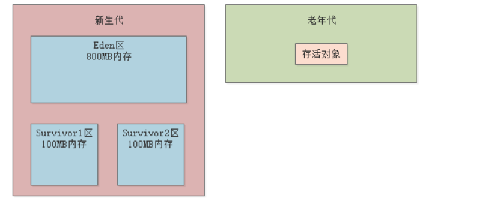

   3. **思考题:**

      之前的系统内存压力估算, 每秒系统会使用多少内存, 多长时间出发GC?

      大概哪些, 多少对象存活下来? 

      答: 每次的state和系统的对象 会存活/更新下来, 其他的都不需要.

### 17. **GC回收算法: Edan区存活者进入Survivor区具体机制:**

> 新生代(新生代分为一个 Eden区和两个Survivor区)的垃圾收集叫做 Minor GC(清除Eden和from, 转到to中)
>
> **Full GC 就是收集整个堆，包括新生代，老年代，永久代**
>
> 

   1. **15次MinorGC之后**

      `-XX:MaxTenuringThreshold` 参数可配置.

   2. **年龄累加之外的规则:**

      **动态对象年龄**: 当前survivor区里, 一部对象的总大小超过一半了, 那么比他们年老的对象可以直接进老年代.

      **大对象直接进去老年代:** `-XXPretenureSizeThreshould` 字节数阈值. 可以避免新生代里出现大对象存活多次会移动好多次.

      **MinorGC之后对想太多没有办法放入Survivor中:**  会把这些对象直接放入老年代.

   3. **老年代空间分配担保规则:**

      每次MinorGC之前也会检查一下老年代是否有够用的空间, 大于新生代所有对象的总大小. 

      如果大于, 肯定够用, 放心去MinorGC.

      如果小于, 不一定够用, 看`-XX:handlePromotionFailure`是否设置, 设置了就会判断老年代的剩余内存是否大于之前MinorGC之后进入老年代的平均大小, 如果大就MinorGC. 

      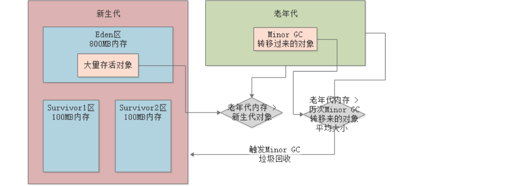

      如果还是小, 说明就不够了, 就进行FullGC.

      **如果进行了MinorGC之后:** 

      1. 如果存活对象, 小于Survivor区, 直接放在survivor.
      2. 如果存活对象, 大于survivor区, 小于老年代, 直接进入老年代.
      3. 如果存活对象, 大于老年代. 那就是handlePromotionFailure了, 就开始_FullGC_.

      **FullGC:**

      如果老年代GC之后还是没有腾出足够空间, 那就*OOM*

   4. **老年代GC:**

      **标记整理(慢, 没碎片).**  超级慢.会 stop the world.

   5. **思考题:**

      整理GC全流程: 

      1. 什么时候尝试出发MinorGC: 新生代空间不足的时候

      2. MinorGC之前会检查老年代大小, 涉及几步: 老年代容量是否大于新生代所有的对象, 不可以的话是否设置了handlePromotionFailure, 然后是否大于平均进入老年代的大小.

      3. 什么时候再MinorGC之前进行FullGC?

         就在上面不符合的时候.

      4. FullGC的算法:??? 分代收集, 老年代是标记整理. 新生代是复制算法.

      5. MinorGC过后对应哪几种情况:

         对应Edan幸存对象正常进入survivor/ 太大不能进入直接进去老年代/ OOM.

      6. 什么情况下MinorGC后的对象进入老年代:

         新生代的survivor装不下, 一半同龄对象以上的对象.????
      
   6. **案例: **

      [疯狂FullGC案例](https://apppukyptrl1086.pc.xiaoe-tech.com/detail/i_5d11de7620c93_t2knadUt/1?from=p_5d0ef9900e896_MyDfcJi8&type=6): 里面讲了一个因为新生代每个块大小分配和系统业务不匹配 而引起的每次minorGC都往老年代写, 最终引起FullGC的案例.

### 18. JVM里各种垃圾回收器

> ??我记得之前看JVM里面写程序有后台程序和前台程序, 后台程序不能容忍stopTheWorld, 前台程序好像可以...????

1. **Serial和Serial Old垃圾回收器:** 分别回收新生代和老年代的垃圾对象. 

   单线程. 会stopTheWorld. 一般不用.

2. **ParNew 和 CMS 垃圾回收器:** ParNew一般用于新生代, CMS用在老年代.

   多线程并发, 性能好.

3. **G1:** 统一收集新生代和老年代, 下下周.

4. **思考题:** 把今天的案例画出来. (我把案例放在了昨天的笔记里, 感觉更合适.)

### 19. **Stop the World** **JVM最大的痛点**

GC工作通过后台GC线程来执行. 

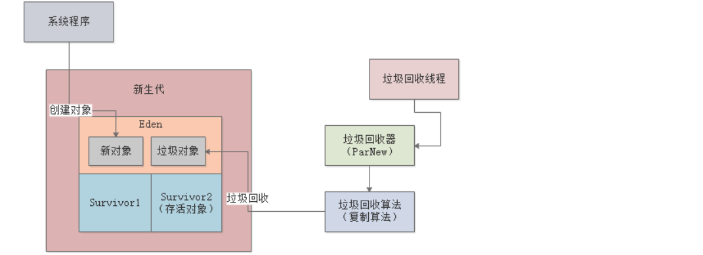

1. **Stop the World**

2. **不同的垃圾回收器的不同影响:** 

   CMS垃圾回收器，专门负责老年代的垃圾回收，他也有自己特殊的一套机制和原理，非常的复杂

   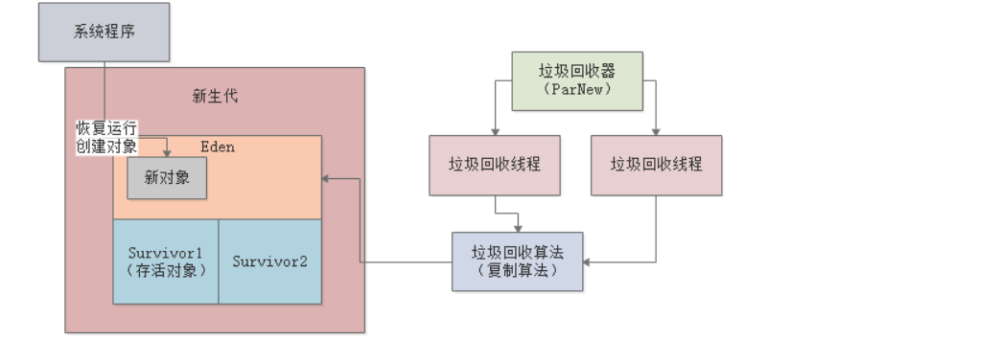

3. **思考题:**

   到底是单线程还是多线程GC好?  在不同的场景下有各自的优缺点吗？

   答: 现在的多核机器,  肯定多线程回收好. 如果可以做到不stopTheWorld的话, 单线程背后默默的回收就好了.
   
   > 系统要区分服务器模式和客户端模式, 启动时指定`-server/-client`. 
   >
   > 大型系统, Linux, 后台多核服务器, 一般是服务器模式. 使用ParNew发挥多核优势.
   >
   > 客户端程序(windowsApp), 很多是单核CPU, 但和效率更高.

### 20. GC作业

- 对象在新生代的分配
- 什么时候会触发Minor GC
- 触发Minor GC之前会如何检查老年代可用内存大小和新生代对象大小
- 如何检查老年代可用内存大小和历次Minor GC之后升入老年代的平均对象大小
- 什么情况下Minor GC之前会提前触发Full GC
- 什么情况下会直接触发Minor GC
- Minor GC之后有哪几种情况对象会进入老年代

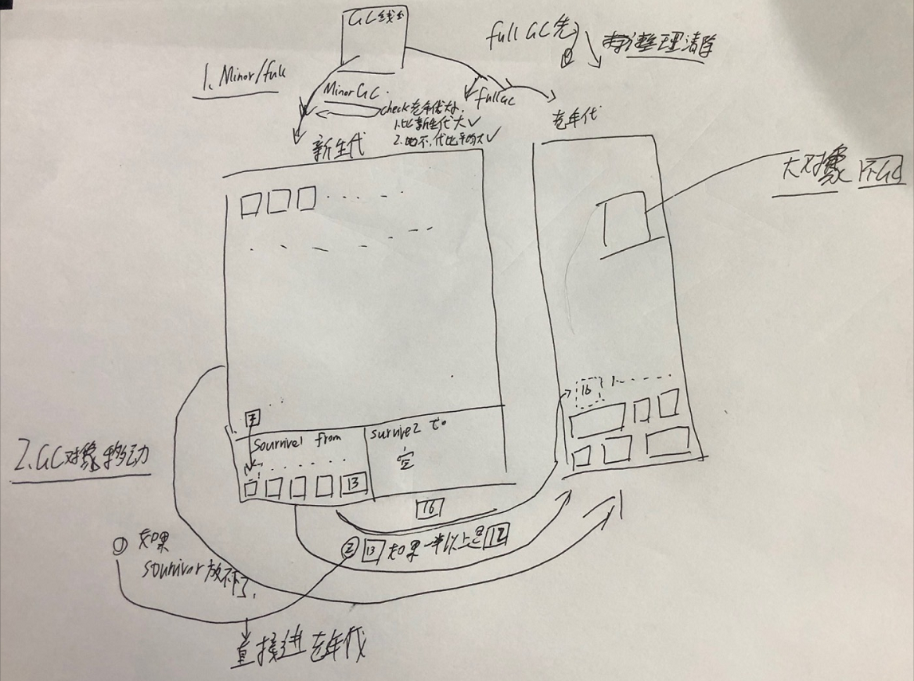

### 21. 相关问题:

1. ParNew+CMS的GC策略组合, 如何保证只做MinorGC:

   1. 夹带分代年龄, 让young里面的对象多过滤.
   2. 增加新生代大小: 由默认的1:2, 改成2:1甚至3:1
   3. 修改edan区和survive区比例, 增大survive区.

   要使用**工具**(?????)来跟踪对象分配, 存活. 看看survivor能不能放下.

2. 为什么老年代不用复制算法, 更快呢?

   老年代存活对象太多, 只移动一下比较好


https://www.tutorialspoint.com/hadoop/index.htm


## 第四周:

### 22. 年轻代GC ParNew

在G1之前都是ParNew垃圾回收新生代. **主打多线程GC**

在执行MinorGC的时候, stop工作线程, 禁止创建新对象, 多线程GC回收, 也是上一章说的复制算法.

1. 指定ParNew GC

   在启动时候配置JVM参数, Tomcat里面的catalina.sh种设置.

   `-XX:+UseParNewGC`, 设置新生代使用ParaNewGC. 

2. 默认使用的线程数量

   默认和我们的CPU核心数一样的线程. 就挺好. `-XXParallelGCThreads`可以指定其他的.

3. **思考:**

   > ParNew + CMS 的GC配置, 如何只有YoungGC的JVM配置:
   >
   > ????


### 23. 老年代GC CMS

1. 回收原理: **标记清除.**  在不能报正MinorGC的运行的时候, 或者MinorGC后存活到老年代的对象太多的时候触发老年代的FullGC.

   **标记清除:** 追踪GC Roots, 没有引用的对象标记出来, 然后清除. 

2. GC线程尽量不影响工作线程:

   工作分为四个阶段:

   ```markdown
   1. 初始标记: STW. 标记出GCRoot直接引用的对象. 方法局部变量和静态变量引用的对象, 而不是间接引用的. 
   2. 并发标记: 不会STW. 尽可能对老年代所有对象进行GCRoot追踪. 看看大家都有没有GCRoot引用. (最耗时).会发现很多垃圾. 
   3. 重新标记: STW. 重新标记第二阶段里创建的对象, 还有一些可能的新垃圾. (支队第二阶段变动的对象标记, 速度快.)
   4. 并发清除: 不会STW, 很耗时, 清除掉之前被标记的对象. 
   ```

   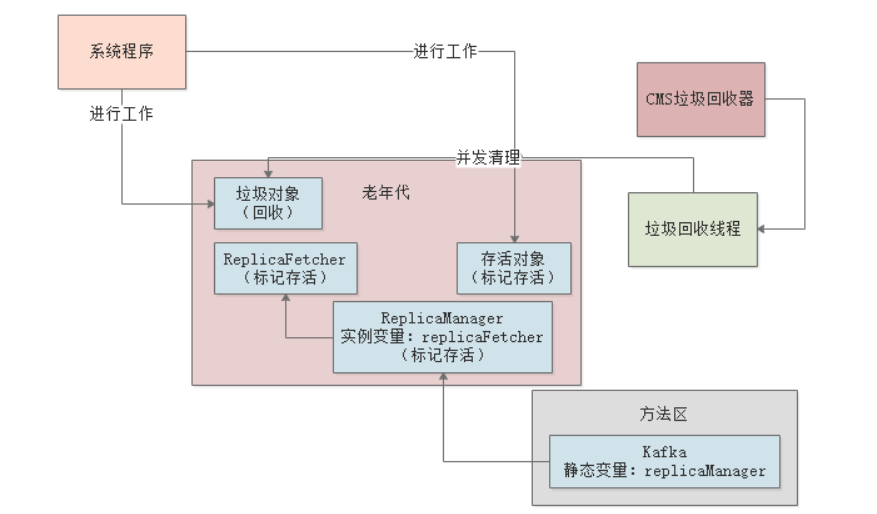

3. 性能分析: 

   最耗时的全部对象GCRoot的并发标记, 不会STW. 然后最后的清除阶段也不会STW. 

   只会在最开始的GCRoot初始标记和重新标记STW 

   **线程数:** 默认(CPU核心+3)/4

4. **思考题**

   > 为什么老年代的垃圾回收速度会比新生代的垃圾回收慢很多? 慢在哪里?
   >
   > 答: 我觉得是需要所有的对象都检查一下, 老年代对象多存活下来的也多, 然后需要多次标记确认, 次数也多. 
   >
   > 新生代: 只要从GCROOT触发判断Edan和From区里哪些对象是活得(很少)就好了, 其他的就放在To里面.
   >
   > 老年代的CMSFullGC: 需要追踪所有存活的对象(很多), 清理时候对象分布不均, 也浪费时间, 然后还要整理碎片(STW). 如果清理期间发生_concurrentModeFailure_还需要重新STW清理.


### 24. 线上JVM设置GC参数

1. 并发回收占用CPU资源:

   CMS运行期间大部分时候和系统同时工作, **占用一部分CPU资源.** 本来进行FullGC时候就有压力, 这个时候又占最少四分之一. 

2. **ConcurrentModeFailure**

   在最后并发清理的时候, 此时老年代新创建的(大对象之类的)对象, 也有可能变成垃圾.这部分垃圾在下一次FullGC前不会被清理了, 叫"**浮动垃圾**". 所以, 为了容忍浮动垃圾, 还要多预留一些老年代空间. 

   `-XX:CMSInitiatingOccupancyFacting`可以配置老年代占用多少比例之后就CMSGC. 1.6里默认92%. 预留出最少8%的新增空间.

   如果在CMS垃圾回收器件, 新放入老年代的对象大于了`8%`, 那么就会发生`ConcurrentModeFailure`,  这个时候就会用`SerialOld`GC来代替CMS, 进行STW的GC. 

3. **内存碎片问题:** 

   CMS的标记清除法会出现很多内存碎片. 如果内存碎片太多太小, 不能找到足够大的空间放对象, 也会触发FullGC. 

   `-XX:UseCMSCompactAtFullCollection`参数默认打开, 表示FullGC之后再次进行`STW`来碎片整理. 

   `-XXCMSFullGCsBeforeCompaction`参数, 执行多少次FullGC之后在执行一次内存碎片整理. 默认是0, 每次都执行嘛.

4. **思考题:**

   > 还记得几个出发老年代GC的时机吗:
   >
   > 1. SenorGC前做判断, 如果老年代不够年轻代的对象存放(小于/小于平均放入的对象)就会.
   > 2. MinorGC进入老年代的对象太多, 不够放就会FullGC.
   > 3. 还有上面的如果老年代对象占用到`-XX:CMSInitiatingOccupacyFacting`的时候就会. 然后如果MinorGC后进入老年代平均对象+老年代现在有的大于这个比例也会.


### 25. 年轻代GC回收参数优化

以订单系统举例. 并发量每秒300个事务. 如果是普通的4CPU+8G, 尽量减少FullGC.

1. 内存模型大概:

   8G机器, JVM一般4G, 然后元数据区(256M)栈内存本地方法栈(xxxM)占1G至少. 堆也就3G. 

   可以老年代1.5G, 新生代1.5G. handlePromotionFailure在1.7以后就默认了.

   

2. 运行时压力:

   每个订单1kb, 然后每个事务大概前后10个订单Obj消耗. 一秒就会有3000KB≈3MB, 除了下单之外还会有其他的查询请求,  扩大十倍 ≈ 30MB~60MB.

   新生代25-50秒就被占满. (还有from-To肯定用不了50S), 如果`-XX:SurvivorRatio`设为8, 那么Eden区1.2G. 那么就20S就占满了. 回收干掉绝大部分的对象, 留下事务内的(2S?)大概120MB, 放在S1(150MB大小)里面.

   下次20S, 又会回收Eden里的, From里面的干掉. 也挺好.

   > -Xms: 3072M -Xmx3072M -Xmn1526M -Xss1M -XX:PermSize=256M -XX:MaxPermSize=256M  -XX:SurvivorRatio=8

3. **优化: Survivor空间够不够**

   如果Eden区的存活对象大于150MB, 那就会直接进入老年代. 然后老年代的有这么几次就FullGC了.  如果Eden区有其他的, 即使放入120MB, 其他的大于这个年龄也会放入老年代. 

   所以:Survivor区域不足. 可以调整新生代和老年代大小. 老年代没必要那么大. 

   可以设置成1GB, 然后每个Eden1.6G, 每个Survivor200MB.  原理就是:"**MinorGC后的Survivor要承担住Eden进来的对象**"这是首要要优化的点

   > -Xms3072M -Xms3072M -Xmn2048M -Xss1M -XX:PermSize=256M -XX:MaxPermSize=256M -XX:SurvivorRatio=8

4. **新生代对象进入老年代的年龄**

   `-XX:MaxTenuringThreshold`默认15次GC, 15*20s肯定够了, 如果躲过了15次基本是长期需要的对象, 而且也不太多, 放在老年代也挺好.

   **反而对于一次性的这种系统, 是可以降低(比如5), 减少新生代的占用和GC消耗.** 

5. **新生代对象进入老年代的大小**

   要看系统中有没有创建大对象, 一般很少有1M的对象. 

   >  -Xms3072M -Xmx3072M -Xmn2048M -Xss1M -XX:PermSize=256M -XX:MaxPermSize=256M -XX:SurvivorRatio=8 -XX:MaxTenuringThreshold=5 -XX:PertenureSizeThreshold=1M

6. **指定垃圾回收器**

   新生代用ParNew, 老年代用CMS

   > -Xms3072M -Xmx3072M -Xmn2048M -Xss1M -XX:PermSize:256M -XX:MaxPermSize=256M -XX:SurvivorRatio=8 -XX:MaxTenuringThreshold=5

7. **思考题:**

   > 上面的例子里面对内存的估算, 对我们系统:
   >
   > 1. 每秒占用多少内存
   > 2. 多少事件触发一次MinorGC, 回收多少对象, 剩余多少
   > 3. Survivor能放得下吗? 会因为Survivor不足进入老年代么?还是因为年龄判断规则?


### 26. 老年代GC回收参数优化

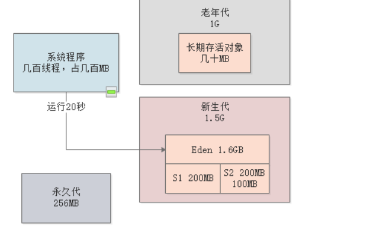

1. 上面案例里, **什么时候对象会进入老年代:**
   1. 大于年龄阈值的对象进入. 一般是@Service之类的通用component.

   2. 还有长期被GCRoot引用的, 不会太多, 一个系统几十MB.

   3. 还有一些大对象(超过1MB之类的)

   4. 如果MinorGC之后survive区放不下, 就会放在老年代.

      > 比如大于200MB, 就会放入老年代. 

2. **高压下多久触发FullGC**

   1. 如果1.6及之前没有打开`-XX:HandlePromotionFailure`选项, 每次MinorGC都会FullGC. 恐怖
   2. MinorGC前检查老年代的空间是否大于之前平均进入大小: 即使上面的比较差的, 也是大概有5次之后才会有200MB左右的对象进入老年代, 所以平均值很小. 基本都能整除MinorGC
   3. MinorGC之后要升入老年代>200MB, 可能会引发FullGC.
   4. 老年代运行着空间不足了之后(或者超过了设定的CMSInitiatingOccupancyFaction比例的时候.就会FullGC.

   系统运行着, 老年代有一些数据, 不断地MinorGC, 之后, 老年代对象慢慢累积, 达到2,3,4之一就FullGC. 但是 感觉除非有大对象直接进入才会让老年代有垃圾. 其他的感觉如果不是JVM停了或者订单卡死进入, 不能达到老年代的封顶.

   老师说的是按照上面的高压, 大概半小时FullGC一下, 高峰过后, 几个小时FullGC一下.

3. **老年代FullGC会发生_ConcurrentModeFailure_么?**

   假设, 老年代1G里面由900多MB达到阈值了开始FullGC了.

   CMS进行清理, 如果这个时候有MinorGC里的survivor不能放了, 就有200+MB对象进入老年代, 这个时候就爆了, 发生SerialOld(单线程的老年代回收)了.

   概率小, 除非系统卡死时候, FullGC和MinorGC同时发生了. 但是没必要为小概率事件特意优化参数

   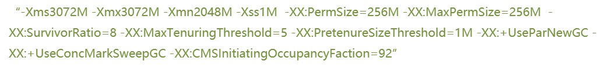

4. **FullGC, CMS什么频率进行碎片整理.**

   默认每次FullGC后都会整理, 没有必要改, 大促期间, FullGC频率最高也会半个小时一次, 碎片整理频率不高.

   **可以看出: FullGC优化前提是MinorGC的优化, 不让该在survivor里的对象进入老年代**

   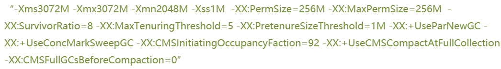

5. **思考题:**

   > 思考我们的系统, 一般多久会塞满老年代触发FullGC? 需要怎么优化参数?


### 27. 作业: 线上系统配置是否合理?

各个内存的区域是什么, 是否合理.(MinorGC之后的对象尽量放在Survivor里面)

画出系统运行模型和内存分配, 全流程图和模型图.


### 28. 问题

1. 一个机器能开多少线程, 取决于什么?

   4Cpu, JVM本身有一些后台线程, 我们的app也会有后台线程, 系统开启线程大概是几十个, 50个就差不多了, 系统所有线程大概100+, CPU基本满负载.

2. TomCat里面部署多个应用, JVM是几个?

   按照TomCat来的, 一个Tomcat就是一个JVM.

   TODO: [*spring*mvc的默认*线程*池连接*数量*是多少](https://www.baidu.com/link?url=UQLaoUIerg_16i77h-2319wi-IxjhPOHSmkRB0F5FeUkVrTVOyDcKtRpi7xLq0ot1m_z9Zn2VlSXMR0i-8jYABradbzCMx9lP1-sqk677QG&wd=&eqid=8ba75c720027d5ee000000035f37d3be)

   提供多线程的不是SpringMVC，而是Servlet容器, 

   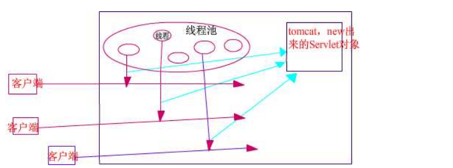

3. FullGC=MajorGC 就是老年代的GC, 一般会带着一次MinorGC=YoungGC.


