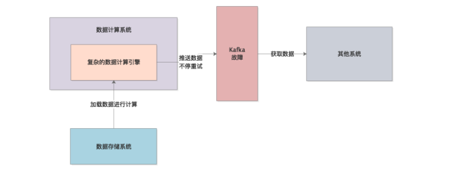
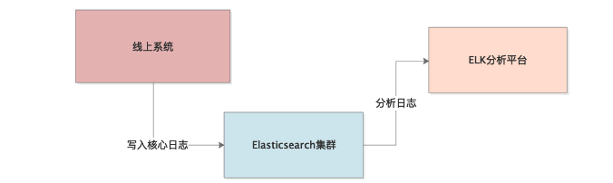
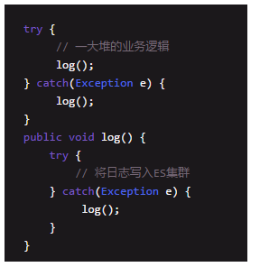

## week12: OOM 实验与案例

### 76. 实验: 模拟 Metaspace OOM

1. MetaspaceOOM原理:

   metaspace就是出现放不下类了也超过了最大空间, 就OOM

2. **动态生成类** 反射生成

   - CGLIB 动态生成

3. **显示Metaspace大小 模拟内存溢出**

   `-XX:MetaspaceSize=10M -XX:MaxMetaspaceSize=10M`, 然后使用动态代理模拟生产.

### 77. 实验: 模拟 Stack OOM

通常每个线程栈内存可以设成1MB, 前后台工作线程有好多, 比如1000个就1G.尽量控制住. 

- 模拟栈OOM:

  递归调用进入死循环就会OOM, 如果有点栈内变量就更快了. 比较少见.

### 78. 实验: 模拟 Heap OOM

... 不断地生成对象, 然后拿着连接不让GC回收就好了

### 79. 案例: 数据系统 OOM

之前的系统, 会把计算结果输出到Kafka中, 但是如果Kafka挂掉了, 要设计一个针对Kafka故障的HA机制, 把数据放在内存里. 

- 无法释放的内存终究会导致OOM, 不能放太多, 可以放在数据库/或者哪里.

### 80. 案例: 代码导致 OOM

链路监控机制, 在核心的链路节点写一些重要日志到ES里面, 事后ELK进行链路日志分析.

**在输出日志时候如果出错就调用自己... 无限循环**

- 解决方法: 严格codeReview和单元测试.

**第二个案例: 没有缓存的动态代理**

**动态代理生成的类可以缓存起来留着下次用**, 但没有, 造成了Metaspace区溢出.

## week13: OOM 监控

### 81. 对线上JVM OOM 监控和报警

1. 公司有监控平台: OOM之后就报警. 同时监控着CPU, IO, 之类的负载情况. 
2. **监控系统建议:**
   - 监控平台可以看机器资源的负载, 各种metrics
   - 关注磁盘剩余空间
   - 内存使用量, JVM, GC监控
   - 网络负载: IO读写数据, 耗时...
3. **JVM OOM被动发现:** 出现问题才能发现OOM, 就是我们现在...

### 82. 如何在OOM 自动dump 快照

>  使用`-XX:HeapDumpOnOutOfMemoryError -XX:HeapDumpPath=/ccc/folder` 

最重要的是: 平时要打印GC日志. 使用jstat分析GC频率和内存变化. 下面会利用MAT分析Metaspace, 栈, 堆的OOM快照.

### 83. 实验: 如何解决 Metaspace区OOM

使用MAT分析内存里的对象, 然后定位到代码, 把动态生成的类缓存起来.

### 84. 实验: 如何解决 Stack OOM

**栈内存溢出之前的GC日志, 快照内存查不出来**,  需要查看**日志里的错误信息, 有栈信息和报错`StackOverflowError`**

### 85. 实验: 如何解决 Heap OOM

使用MAT查看对象, 

- 看到最多的对象
- **看stacktrace, 追踪到OOM error栈帧创建对象的代码**

## week14: OOM案例1

### 86. 低请求 OOM

### 87. NIO 导致 堆外内存 OOM

### 88. RPC 导致 OOM

### 89. 无where条件的SQL 导致 OOM

### 90. 作业

### 91. 问题

## week15: OOM案例2

### 92. 日志分析系统 OOM

### 93. 服务类加载器过多 OOM

### 94. 数据同步系统 频繁 OOM

## 总复习: JVM参数优化, GC 问题定位, OOM 分析解决

- **面试基本上就是三个问题:** 
  1. 生产的JVM参数如何设置的? 为什么这么设置
  2. JVM优化经验?
  3. 有没有OOM?
  4. 干!!!!!!!!!!!

