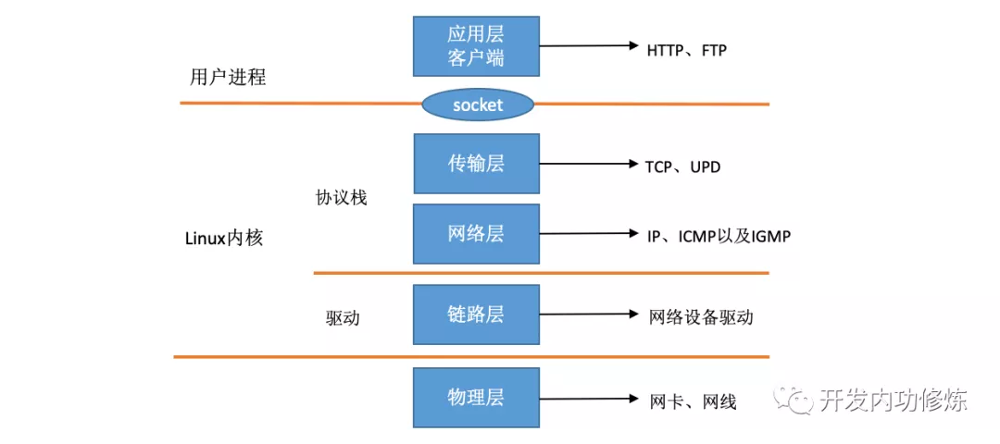
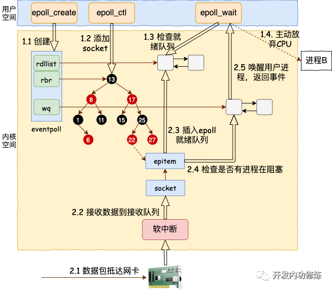

## [开发内功之网络篇](https://mp.weixin.qq.com/mp/appmsgalbum?__biz=MjM5Njg5NDgwNA==&action=getalbum&album_id=1532487451997454337&scene=173&from_msgid=2247484058&from_itemidx=1&count=3#wechat_redirect)

### 1. [Linux网络包接收过程](https://mp.weixin.qq.com/s?__biz=MjM5Njg5NDgwNA==&mid=2247484058&idx=1&sn=a2621bc27c74b313528eefbc81ee8c0f&chksm=a6e303a191948ab7d06e574661a905ddb1fae4a5d9eb1d2be9f1c44491c19a82d95957a0ffb6&scene=178&cur_album_id=1532487451997454337#rd) -> epoll接收socket的接收队列数据

ksoftirqd内核线程全权处理

1. **整体过程**
   - 1. **网卡将数据帧DMA到内存的RingBuffer中，然后向CPU发起中断通知**
   - 2. CPU响应中断请求，调用网卡启动时注册的中断处理函数
   - 3. 中断处理函数几乎没干啥，就发起了软中断请求
   - 4. 内核线程ksoftirqd线程发现有软中断请求到来，先关闭硬中断
   - 5. ksoftirqd线程开始调用驱动的poll函数收包
   - 6. poll函数将收到的包送到协议栈注册的ip_rcv函数中
   - 7. ip_rcv函数再讲包送到udp_rcv函数中(对于tcp包就送到tcp_rcv)

2. **UDP协议层处理:** 根据skb来**找对应的socket，当找到以后将数据包放到socket的缓存队列里。**如果没有找到，则发送一个目标不可达的icmp包

Linux内核对网络包的接收过程大致可以分为接收到RingBuffer、硬中断处理、ksoftirqd软中断处理几个过程。其中在ksoftirqd软中断处理中，**把数据包从RingBuffer中摘下来，送到协议栈的处理，再之后送到用户进程socket的接收队列中(这就是[用户态](用户态和内核态是什么.md))**。

### 2. Linux网络包接收过程的监控与调优

### 3. [聊聊TCP连接耗时的那些事儿](https://mp.weixin.qq.com/s?__biz=MjM5Njg5NDgwNA==&mid=2247484126&idx=1&sn=4c35ea42477ffd5db5f05fe8bc850cdb&chksm=a6e303e591948af3cc31b1db349958c8a879b9eb7100ebd138dc361aaf04ba5878f602a16365&cur_album_id=1532487451997454337&scene=190#rd)

内存消耗: 每个TCP链接需要socket, file之类的, 大概3.3KB.

### 4. Linux服务器能吃成多少个TCP连接?

n个, 只要内存够

### 5. client能建立多少TCP链接?

N个, 每个TCP链接收发包, 在于tcp_rcv函数能不能把ringbuffer取出来的skbuffer找到对应的socket.

1. 内核用hash+链表方式维护socket, **只要socket的hash值不一样就能找到**
2. <ip1,port1, ip2, port2>来定位一个socket.
3. **那么一个client链接一个server的多个port也可以并发.**

### 6. TCP 的内存开销大小

### 9. 图解: 深入理解epoll是如何实现IO多路复用的

>  我的理解: 
>
>  1. socket收到数据到接受queueu里, 然后tcp_v4_rec还会检查socket内的等待队列, 找到socket对应在epoll里的epitem (epoll通过epitem把socket维护在eventpoll里面.
>
>     
>
>  2. 每次接受data, 都通过等待队列里的fun, 把eventpoll"唤醒", epoll把epitem(socket)放在eventPoll的就绪队列里
>
>  **接下来就绪队列的处理就不知道了...**

### *10. 同步阻塞网络 IO BIO

从用户进程创建 socket，到一个网络包抵达网卡到被用户进程接收到的流程图, 这里面9需要详细图解.

**第一次创建socket, 然后进入等待接收队列里:** 

- 第一部分是我们自己代码所在的进程，我们调用的 socket() 函数会进入内核态创建必要内核对象。recv() 函数在进入内核态以后负责查看接收队列，以及在没有数据可处理的时候把当前进程阻塞掉，让出 CPU。
- 第二部分是硬中断、软中断上下文（系统进程 ksoftirqd）。在这些组件中，将包处理完后会放到 socket 的接收队列中。然后再根据 socket 内核对象找到其等待队列中正在因为等待而被阻塞掉的进程，然后把它唤醒。

**BIO切换消耗:**

每次一个进程专门为了等一个 socket 上的数据就得被从 CPU 上拿下来. 然后再换上另一个进程. 等到数据 ready 了, 睡眠的进程又会被唤醒. 总共两次进程上下文切换开销, 根据之前的测试来看, 每一次切换大约是 3-5 us(微秒)左右. 4微秒还是很大的, 不是纳秒.

