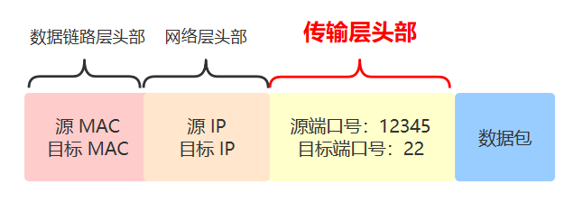
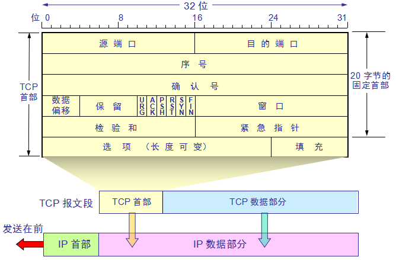

## 传输层

#### 1. 数据包交给目标机器哪个进程

1. **端口实现进程到进程**: 为了把进程区分开, 添加传输层的头, 记录一下source和target的端口号

   

2. 端口之间数据包的简单传输: 数据链路层+网络层+传输层(端口标记) 就是简单的UDP

   (UDP 还包括数据包长度和校验值.

### 2. 数据一致性: 丢包问题

1. 每个数据包需要ACK确认机制: 没收到就重传.

   

### 3. 数据包次序问题

1. 数据包和ACK都带**序号(sequency)**
2. ACK小优化: ACK最后一条sequency的数据包前的都默认ACK了.

### 4. 流量控制问题

1. **每个包里面包含自己能接受的窗口大小: window: 对方能接受的包数量**

### 5. 拥塞问题

- 会设定拥塞窗口
- **拥塞窗口大小是发送方通过算法进行测试计算的**
- **拥塞窗口和流量控制窗口, 共同决定了发包数量**: min(croud_wondow, r_wondow)

### 6. TPC连接状态

传输层的TCP实现的了**有状态链接(虚拟的)**: 

1. 连接双方在自己端口监听着.
2. client发送SYN包
3. server接收, 发送数据包, 包含对client请求的ACK和自己的SYN.
4. Client接收到ack, 然后对server的syn请求发送一个数据包包含ACK.
5. 连接成功了, server的进程才会接收client的请求.
6. 还有四次挥手, 类似.

### 7. TCP数据包: 实现了Port+ACK+Seq+流量&拥塞window+TCP连接状态

