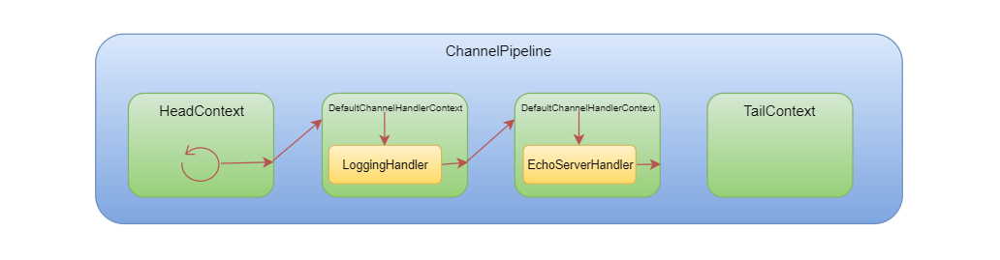
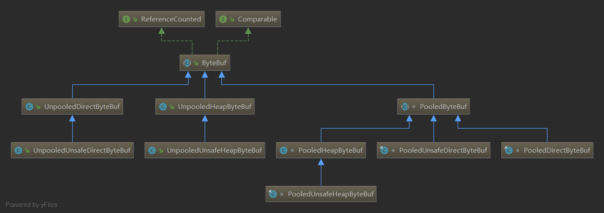

### 12. Netty服务启动

```java
ChannelFuture f = serverBootstrap.bind(PORT).sync();
```

1. Netty 的 Channel 跟 Java 原生的 Channel 是否有某种关系?
2. bind () 是否调用了 Java 底层的 Socket 相关的操作?
3. Netty 服务启动之后 ChannelPipeline 里面长什么样?


### 14. Netty接受新的数据: NioSocketChannel处理数据

- 同一个 Channel 的所有 ChannelHandler 的执行都会放在 EventLoop 中执行，所以它们是线程安全的；

让我们用一个图来表示这个过程：



> > HeadContext，不仅是一个 ChannelHandlerContext，也是一个 ChannelInboundHandler，同时也是一个 ChannelOutboundHandler。
> >
> > TailContext，不仅是一 ChannelHandlerContext，同时也是一个 ChannelInboundHandler。

[14 Netty服务如何接收新的数据-慕课专栏 (imooc.com)](https://www.imooc.com/read/82/article/2173)

最后的疑问: stringEncoder和StringDecoder连着不就相当于没有解码么?





