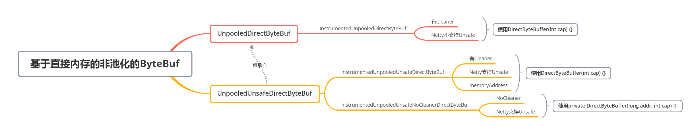

## ByteBuffer


### 17. NIO的ByteBuffer怎么做的


### 18. Netty的ByteBuf如何支持堆内存和非池化 

`UnpooledUnsafeHeapByteBuf`

1. 在创建分配器 UnpooledByteBufAllocator 的时候会查找 DirectByteBuffer 中是否包含 NoCleaner 的构造方法；
2. 在创建 UnpooledDirectByteBuf 的时候默认创建的是其子类 InstrumentedUnpooledUnsafeNoCleanerDirectByteBuf，这个类将不使用 Cleaner 来清理垃圾，同时，它的底层使用的是 Java 原生的 DirectByteBuffer，且包含 Unsafe；
3. 在清理内存的时候需要手动调用 `ReferenceCountUtil.release(byteBuf);` 方法；
4. 最终也是调用 Unsafe 的 freeMemory () 来释放内存；


UnpooledDirectByteBuf 和 UnpooledUnsafeDirectByteBuf 的实现细节，总的来说，它们底层都是使用 Java 原生的 DirectByteBuffer，不同之处在于，默认情况下，Netty 是自己控制直接内存的释放，即使用 DirectByteBuffer 的 NoCleaner 构造方法，且支持使用 Unsafe。

DirectByteBuffer 没有 NoCleaner 方法，则使用包含 Cleaner 的构造方法，同时也支持使用 Unsafe。如果显式地说明了不支持使用 Unsafe 的话，那么最后只能交给 JDK 自己来处理了。




### 20 jemalloc内存分配器是什么 TODO


### 23. FastThreadLocal-> 全新一套ThreadLocal - 由线性探测法实现的ThreadLocalMap的哈希表到分配index的FastThreadLocalMap

**全新的FastThreadLocalThread(继承Thread), FastThreadLocalMap 存储FastThreadLocal和value. 把Map放在FastThreadLocalThread里面.**

1. FastThreadLocal 有哪些使用的姿势？

   FastThreadLocal 正常来说是跟 FastThreadLocalThread 联合使用的，但是，Netty 为了兼容性，也可以跟普通的 Thread 一起使用，只是会使用一种 slow 的方式来运行，这个 slow () 主要体现在 InternalThreadLocalMap 的存储上，使用 FastThreadLocalThread 时，它是存储在 FastThreadLocalThread 中的，使用普通的 Thread 时，它是存储在 Java 原生的 ThreadLocal 中的。

2. FastThreadLocal 一定比 ThreadLocal 快吗？

   不一定，当 FastThreadLocal 与普通 Thread 一起使用的时候，可能会比直接使用 ThreadLocal 还慢，这得根据 ThreadLocal 值的多少和 InternalThreadLocalMap 中值的多少来判断，比如，ThreadLocal 只存储了 InternalThreadLocalMap 一个值而 InternalThreadLocalMap 中存储了 100 个值 和 ThreadLocal 存储了 100 个值而 InternalThreadLocalMap 中只存储了一个值，这两种场景的结果肯定不一样。

3. FastThreadLocal 除了快还有什么优势？

   FastThreadLocal 除了快还能帮助我们自动清理相关资源，这是通过包装 Runnable 来实现的。


## Netty的队列

### 24. 


## Netty的Future

### 25. Future

java的Future

```java
// 四个方法来暴露出一个未来的结果
public interface Future<V> {
    boolean cancel(boolean mayInterruptIfRunning);
    boolean isCancelled();
    boolean isDone();
    V get() throws InterruptedException, ExecutionException;
    V get(long timeout, TimeUnit unit)
        throws InterruptedException, ExecutionException, TimeoutException;
}
```

**Java的FutureTask包装普通的Callable和Runnable的线程任务**, 线程池里都是把普通的Callable和Runnable包装成FutureTask才扔进去的

```java
public class FutureTask<V> implements RunnableFuture<V> {
    // 状态
    private volatile int state;
    private static final int NEW          = 0;
    private static final int COMPLETING   = 1;
    private static final int NORMAL       = 2;
    private static final int EXCEPTIONAL  = 3;
    private static final int CANCELLED    = 4;
    private static final int INTERRUPTING = 5;
    private static final int INTERRUPTED  = 6;

    // 任务
    private Callable<V> callable;
    // 返回值（正常的返回值或者异常）
    private Object outcome;
    // 运行任务的线程（防止多个线程同时运行了这个任务）
    private volatile Thread runner;
    // 等待队列，即调用者，多个调用者组成队列
    private volatile WaitNode waiters;
}
```

**Java的CompletableFuture, 可以函数式编程流转结果, 使用taskPeerThreadExecutor来异步执行**

1. CompletableFuture 是 Java8 新加入的类， 对于早期的 Netty 无法吃到这个福利；
2. CompletableFuture 的实现过于复杂，且强耦合于 ForkJoinPool，这不是良好的设计，所以，Netty 并不打算使用它；

#### Netty 的 Future 叫做Promise


## Netty的线程池

### 就是n个(线程+队列)的形式.  和n个线程+1个任务队列不太一样


