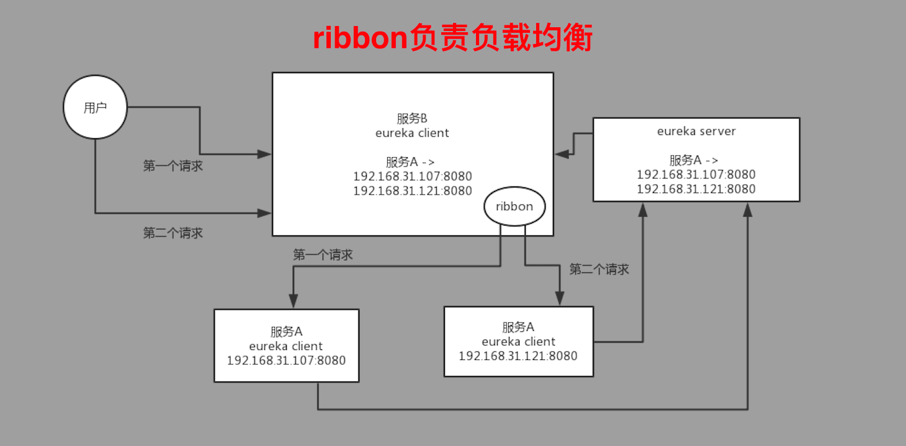
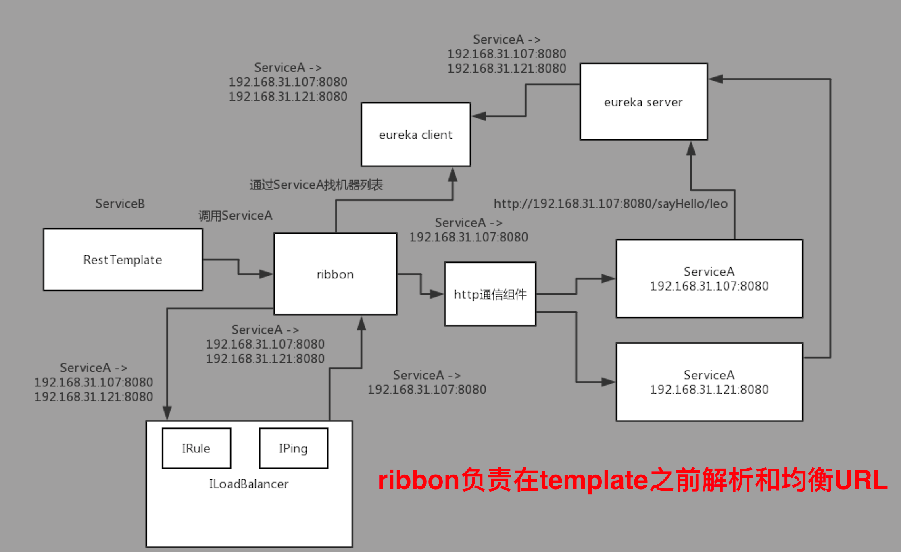
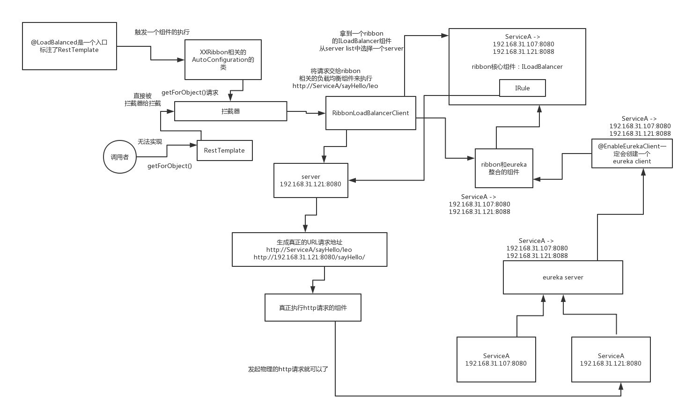

#### 分布式 ∈ 微服务: 微服务一定是分布式的, 分布式组成生态叫做微服务.

- 分布式: 更倾向于不同的机器之间的RPC调用
- 微服务: 不同的有机服务. 


## ribbon 大体介绍

### 041. 分布式系统中的负载均衡作用

ribbon是Netflix公司的, 用于调用时的负载均衡. load balance.




### 042. ribbon实现负载均衡demo

1. 弄两个接口
2. 调用, 查看负载均衡效果


### 043. ribbon 原生接口 和 内置规则

1. ILoadBalancer: 维护一个server list
2. IRule: 根据balancer的list, 选择一个url.

- 默认的负载均衡: roundRobinRule 轮询, AvaliabilityFilterRule: 考察服务器可用性的, 越失败连接间隔越长. WeightedResponseTimeRule: 带权重的服务器. BestAvailableRule: 尽量连接并发低的服务器. 


### 044. IPing定时ping服务器判断是否存活

```java
balancer.setPing(new PingUrl());
balancer.setPingInterval(1);
// IPing接口负责定时ping服务器, 判断是否存活.
public interface IPing {
    /**
     * 暴露isAlive接口
     */
    public boolean isAlive(Server server);
}
```


ribbon重要组件: RestClient, ILoadBalancer、IRule、IPing


### 045. Spring-cloud中ribbon的使用, 图解工作原理


```java
// 融入ribbon到RestTemplate里面. 
@LoadBalance
@Bean
public RestTemplate getRestTemplate() {
  return new RestTemplate();
}
// 2. 使用restTemplate访问, 就是HTTP请求组件
//		restTemplate从ribbon哪里拿到服务地址.
```




### 046. ribbon大体流程图




## ribbon 源码初探


### 047. @LoadBalanced作为入口

1. 找到`@LoadBalanced`的包, 然后看一下自动装配的其他东西
2. 找到`LoadBalancerAutoConfiguration` 和`AsyncLoadBalancerAutoConfiguration` 


### 048. 查看LoadBalancerInterceptor拦截内容


1. 把httpRequest包装成LoadBalancerRequest:
    这个loadBalancerRequest是一个匿名内部类,
    apply方法: 主要就是把httpRequest包装一下, 然后执行tranformer, 最后调用execution.execute.
2. 使用loadBalancerClient.execute(loadBalancerRequest)开始执行啦.


### 049. 真正的请求入口LoadBalancerClient

1. **先找真正的loadBalancerClient的自动配置类:**

   

   ```java
   1. 之前看的@LoadBalanced依赖包是2里的commons包需要LoadBalancerClient;
   2. 在3依赖里找到RibbonAutoConfiguration, 注入一个LoadBalancerCLient:RibbonLoadBalancerClient
   ```

   


### 050. 调试Ribbon源码核心流程

1. 写&启动eureka+ribbon的项目
2. 追踪restTemplate的执行和ribbon的interceptor怎么接入的


### 051. 追踪ILoadBalancer, 发现Ribbon整合Spring的细节

```
051. Ribbon整合Spring-找到ILoadBalancer.png
1. 前面interceptor包装restTemplate的httpRequest成LoadBalancerRequest了, 里面盛着一些serverName啊, 还有什么乱七八糟的.
2. RibbonLoadBalancerClient负责execute这个httpRequest, 先要从server对应的SpringContext里面拿到ILoadBlancer.
```


### 052. ribbon与eureka整合 获取服务注册列表


### 053. LoadBalancer的eureka注册表更新


### 054. loadBalancerClient使用IRule选择一个server


### 055. loadBalancerReuqest执行发送逻辑时候通过回调loadBalancerClient的getURI方法拿到地址


### 057. 默认的ribbon依赖于Eureka异常感知可能会4分钟, 各种30s.


