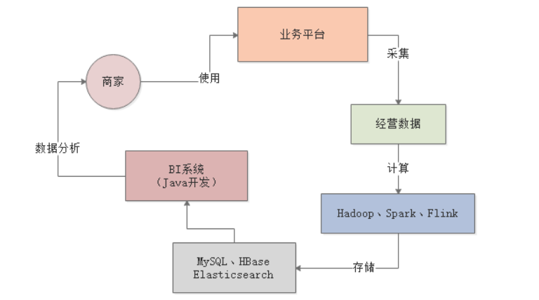
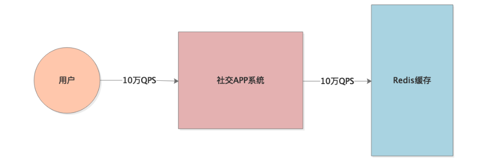
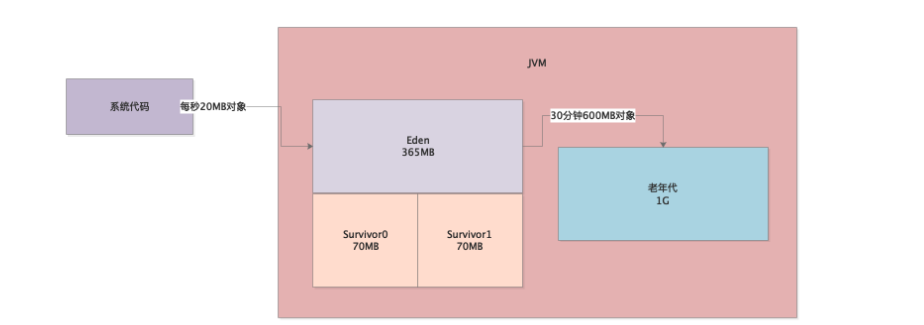
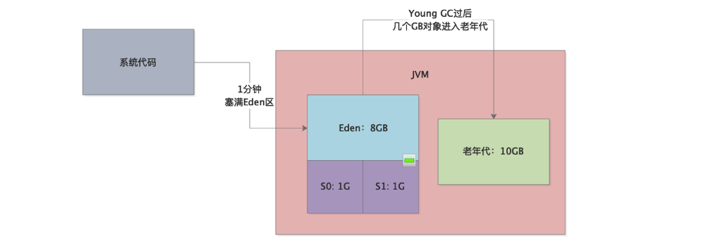
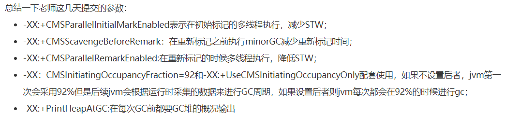

## Week8: 

### 50. 实验: `jstat`摸清JVM运行状况

1. `jstat -gc PID` 看到JVM的内存和GC情况

   ```shell
   $ jstat -gc 17512
    S0C    S1C    S0U    S1U      EC       EU        OC         OU       MC     MU    CCSC   CCSU   YGC     YGCT    FGC    FGCT    CGC    CGCT     GCT
   9216.0 15360.0  0.0    0.0   240640.0 27393.4   139776.0   13881.2   35456.0 32814.4 4992.0 4498.3      6    0.102   2      0.262   -          -    0.364
   # 列名:
   S0C: from survivor 区大小 capacity
   S1C: to survivor 区大小
   S0U: use的大小
   S1U: 
   EC: eden区的capacity
   EU: Eden区的used大小
   OC: Old 区
   OU
   MC: Metaspace capacity
   MU:
   CCSC: compressed class space capacity: 压缩类空间(就是那个压缩klass那个知识点).
   CCSU: 
   YGC: yongGC的次数
   YGCT: yongGC消耗的时间
   FGC: fullGC的次数
   FGCT: 时间
   CGC: Number of STW of Concurrent GC: 并发GC的stw次数
   CGCT:    STW of Concurrent GC time: 并发收集STW的时间
   GCT: 总共GC时间.
   ```

   

2. 其它`jstat`命令

   ```shell
   jstat -gccapacity PID: 堆内存
   jstat -gcnew PID: 新生代GC
   jstat -gcnewcapacity PID: 新生代内存分析
   jstat -gcold PID: 老年代GC分析
   jstat -gcoldcapacity PID: 老年代内存分析
   jstat -gcmetacapacity PID: metaspace区内存分析
   ```

3. 如何使用`jstat`工具

   jstat分析: **新生代对象增长速率, YoungGC频率, YongGC 耗时, 每次YongGC后存活多少对象, 每次YongGC过后多少对象进入老年代, 老年代对象增长速率, FullGC触发频率, FullGC耗时.** 

4. **新生代对象增长速率**

   `jstat -gc PID 1000 10` 运行jstat 1000ms一次, 进行10次.  耶✌

5. **YongGC频率和平均耗时**

   就用上个命令就好

6. **每次YongGC后进入老年代大小**

   如果说, 每隔个3分钟yongGC一次, 那就可以Jstat每3分钟来一次, 看看多少对象就i纳入了存活了. 

7. **FullGC触发的时间和耗时**

   看看每次老年代增长的速度, 对比YongGC, 看看什么时候触发FullGC.

8. 总结: 利用jstat, 监控上面几个参数. 

9. **思考题:**

   要把JVM上面几个运行情况全都摸出来

   ```text
   1. 新生代对象增长速率
   2. YongGC 频率, 耗时
   3. YongGC 后存活对象, 进入老年代对象
   4. 老年代对象增长速率
   5. FullGC触发频率, 耗时
   ```

   


### 51. 使用`Jmap`和`jhat`监控对象分布


1. `jmap`了解运行内存区域

   通常jstat监控了jvm运行情况就够了.  如果出现OOM之类的, 还会监控运行时内存区域的对象占用情况. 

   `jmap -heap PID`  # 11不能用了. Use jhsdb jmap instead 需要连接... 我还不知道.

   打出, 内存各个区域的情况; 总容量和使用的容量... 所以这个用jstat就好了.

2. `jmap`了解运行时对象分布

   `jmap -histo 17512` 可以打出来每个对象有多少个, 占多大地方.

3. **使用jmap生成堆内存转储快照**

   `jmap -dump:live,format=b,file=dump.hprof PID` 会生成一个二进制的dump文件.

4. 使用Jhat查看dump文件

   jhat可以分析Heap的Dump. 内置了web浏览器, 可以放在浏览器看

   `jhat dump.hprof -port 8080`

5. 思考题: 

   >  使用一下jmap搭配jhat查看Heap快照. 


### 52. 从测试到上线, 如何分析JVM运行合理优化

结合上面介绍的 `jstat`和`jmap+jhat`, 做实际开发的JVM优化梳理

1. 开发好系统之后的`预估性优化`

   需要评估每秒请求量, 创建对象大小, 新生代内存大小, YongGC触发频率, 对象进入老年代速率, 老年代大小, FullGC频率.
   
   **然后就配置JVM参数: 尽量然每次YongGC后存活对象小于Survivor的50%, 不要让对象进入老年代, 减少FullGC频率.**
   
2. **系统压测的JVM优化**

   使用jstat监控JVMGC. 新生代对象增长速率, 新生代进入Survivor大小, YongGC频率时长, YongGC后进入老年代大小, FullGC频率和时间.

3. **线上系统JVM监控**

   每天在高峰中使用 `jstat`和`jmap+jhat`监控. 或者专门的监控系统, `Prometheus`之类的

4. **思考题:** 

   a. 公司系统开发环节里有压力测试么? 

   ​	有, 在UAT跑, 压力很大的. 不过我们自己没有专门的

   b. 有没有JVM监控方案

   ​	没有, 只用了FLink暴露出来的metrics做了图形化. 


### 53. 案例: BI系统定位解决YoungGC问题



上面一个BI系统, 计算好了之后放在数据原理, 前端从数据源里加载数据, 进行筛选和分析, 返回给商家. 

1. **系统瓶颈:** 实时自动刷新报表 + 每个报表数据量大

   

2. **无压力的频繁YongGC:** 

   如果压力很大, 每秒几十MB新对象生成, 几十秒就一次YongGC, 每次几十ms就结束, 影响不太大. 

   

3. **可以模拟每秒50MB新对象的程序, 然后启动起来.** 

   

4. 使用jstat监控系统.

   最重要的七八个参数: 新生代对象增长速率, YoungGC的频率和耗时, YongGC后对象进入Survivor, 进入老年代. 老年代对象增长速率, FullGC频率和耗时.

   ```text
   $ jstat -gc 14864 1000 100
    S0C    S1C    S0U    S1U      EC       EU        OC         OU       MC     MU    CCSC   CCSU   YGC     YGCT    FGC    FGCT    CGC    CGCT     GCT
   104832.0 104832.0  0.0   1427.3 838912.0 600555.8 1048576.0     0.0     4864.0 3722.2 512.0  409.1       3    0.010   0      0.000   -          -    0.010
   ```

5. 思考题: 

   > 系统运行期间, 观察每次YongGC之后Eden, Survivor, Old区的内存变化.
   >
   > 我觉得都很规律, 一次又一次地循环. 压力大的时候, 就像快进了一样, 但是阈值还是那样的, 也就是高度不变.

### 54. 案例: 实时分析引擎: 定位解决频繁FullGC问题


1. 系统压力: 

   每分钟100次计算任务, 每个计算任务1W条10s. 每个计算任务10MB. 那么每分钟100次基本上就塞满了Eden区了.

   **老年代压力:** 因为处理时间要10S, 所以每次每次YoungGC的时候都有10s内存活的100/6个批次的数据. 

   大概有15个批次, 150MB的数据存活下来. 这个时候新生代里默认的Survivor区就不够用了. 就直接放入老年代了. 大概有个五六次, 老年代就满了, 平均5分钟就FullGC一次.

2. 优化: 

   增大Survivor, 话使用jstat进行观察.


### 55. 作业

> 结合你们系统的业务来分析, 遇到频繁GC该怎么处理. 
>
> 我觉得我们的系统和上面BI系统类似, 没有计算批处理那种很长停留的对象. 每次YongGC基本上就干掉了.  无压力的频繁YongGC, 我觉得就用大Eden区就好了. 系统几十毫秒停顿没啥影响, 因为不是客户端程序. 

### 56. 问题

没有台指导性的问题


## Week9: 案例+

### 57. 案例: 高QPS的社交项目 JVM

1. 项目背景: 

   每次主页之列的查询数据量很大, 大概5MB. 峰值10W QPS.

   

2. 项目瓶颈: 

   高并发和高数据量, 使对象进入老年代. 造成FUllGC

3. **优化参数:**

   `-XX:+UseCMSCompactAtFullCollection -XX:CMSFullGCsBeforeCompaction=5` 使用CMS做FullGC, 然后5次清理后再做整理. 

   这个参数在频繁FUllGC的情况下设为0, 每次都要清理一下. 可延长FullGC间隔.

4. **思考题:**

   >  使用CMS回收, 压缩整理这块怎么设置的
   >
   > ```shell
   > java -XX:+PrintCommandLineFlags -version # 输出默认, 1.8 默认的就是 UseParallelGC, 所以我们默认的是标记整理算法, 每次都会整理.
   > $ ./java.exe -XX:+PrintCommandLineFlags -version
   > -XX:InitialHeapSize=300982976 -XX:MaxHeapSize=4815727616 -XX:+PrintCommandLineFlags -XX:+UseCompressedClassPointers -XX:+UseCompressedOops -XX:-UseLargePagesIndividualAllocation -XX:+UseParallelGC
   > java version "1.8.0_211"
   > Java(TM) SE Runtime Environment (build 1.8.0_211-b12)
   > Java HotSpot(TM) 64-Bit Server VM (build 25.211-b12, mixed mode)
   > ```
   >
   > 


### 58. 案例: 电商后台系统FullGC优化

> 默认的JVM参数绝对是系统负载逐渐增高的时候一个最大的问题
>
> 设置公司的JVM参数模板: 
>
> -Xms4096M -Xmx4096M -Xmn3072M -Xss1M  -XX:PermSize=256M -XX:MaxPermSize=256M -XX:+UseParNewGC -XX:+UseConcMarkSweepGC -XX:CMSInitiatingOccupancyFaction=92 -XX:+UseCMSCompactAtFullCollection -XX:CMSFullGCsBeforeCompaction=0
>
> 4Gheap, 3G新生代, 元数据区256M, ParNew+CMS回收, 到达92%fullGC, CMS 每次都压缩.

1. 优化FullGC: 

   `-XX:+CMSParallelInitialMarkEnabled`: 初始标记开启多线程并发标记.

   `-XX:+CMSScavengeBeforeRemark`: 重新标记阶段之前, **尽量YoungGC一次. 这样,CMS重新标记就会少一些对象.** ??? 

   > 因为: 初始标记和重新标记都会扫描整个Heap的对象，要找gc roots

2. **思考题:**

   > - 你们公司有没有类似这里讲的JVM参数模板？ 没有
   >
   > - 假如你是公司的架构师，结合你们公司的大部分业务系统的实际情况，会如何定制一套JVM参数模板？ 我觉得, 就指定一个新生代比较大的就好了.
   >
   > - 是否你们公司有各种不同配置的机器？
   >
   >   有, VM机器和实体机. 
   >
   > - 针对不同配置的机器如何定制JVM参数模板？
   >
   >   流出多少的元数据和栈和本地方法内存, 然后预留一些, 就都给堆就好了. 
   >
   > - 你们公司有没有那种特例的系统，比如并发量特别高或者数据量非常大？
   >
   >   有啊, 并发大就是这种流式处理的比较大.
   >
   > - 对特例系统该如何进行优化?
   >
   >   尽量少的让对象进入老年代. 


### 59. 案例: 错误JVM参数导致FullGC频繁

1. 问题:

   添加了JVM参数, 不断触发[FullGC (Metadata GC THreshold)]

   

2. 寻找问题:

   添加: `-XX:TraceClassLoading -XX:TraceClassUnloading` 两个参数, 追踪类加载和写在过程. 会打印在日志里面. 

   发现加载了很多奇怪的类. 基本上是JVM创建出来用来反射的. 

3. **JVM创建的奇怪类有什么特点**

   这些Class对象是SoftReference 软引用. 

   软引用在GC的时候要不要回收的判断: `clock-timestamp <= freespace*SoftRefLRUPolicyMSPerMB` 对象没有被访问的时间 < JVM空闲内存空间*每1MB空闲内存空间允许SoftReference存活时间.

   所以, 一般不是快发生OOM了, 软引用也不会回收. 

4. **原因**

   `-XX:SoftRefLRUPolicyMSPerMB`这个设置成0了, 所以不允许有软引用, 那么就会疯狂FullGC干掉软引用. 

5. **解决**

   把参数调大一点. 


### 60. 案例: 多次FullGC卡死

>  团队开发完一个新系统上线之后发现一天的Full GC次数多大数十次

1. JVM问题: 

   - 机器配置：2核4G, Heap:2G
   - 6天内: YongGC 2.6W次 1400秒, FullGC 250次 70秒.

   ```shell
   # JVM参数, 新生代512M, Eden区:S1:S2 = 5:1:1, 老年代68%的时候就FullGC.
   -Xms1536M -Xmx1536M -Xmn512M -Xss256K -XX:SurvivorRatio=5 -XX:+UseParNewGC -XX:+UseConcMarkSweepGC -XX:CMSInitiatingOccupancyFraction=68 -XX:+CMSParallelRemarkEnabled -XX:+UseCMSInitiatingOccupancyOnly -XX:+PrintGCDetails -XX:+PrintGCTimeStamps -XX:+PrintHeapAtGC
   ```

2. 根据GCLog 倒推运行时内存模型

   每分钟3次YoungGC: 20s Eden就占满. 

   30分钟1次FullGC: 说明30分钟Old区就增长到680M左右了.

   

   老年代有太多对象 不一定是Survivor太小, 也可能是长时间存活对象太多. 老年代小了

3. **原因:**

   jstat查看监控, 每次YoungGC后存活到Old的对象不多, 但是有大对象直接进入Old. 

   通过Jmap查看对象占用情况, 原来是数据库里查出来的.  发现了大SQL

4. **优化:**

   避免大SQL, 然后增加Survivor, 不让对象进入Old, 增加新生代.  极爱能少一点老年代. 


### 61. 案例: 高峰时期FullGC卡死

> 系统卡死无法处理, 重启也无法回复. 每秒都会执行FullGC

1. **追踪问题:** 

   使用Jstat, 新生代增长不快, 老年代占用10%内存.  **发现代码里有`System.gc()`**


### 62. 作业+问题

> 复习, 总结这几个生产案例. 原因, 问题定位过程, 解决思路.


## Week10


### 64. 案例: 内存泄漏和Full GC优化

大促活动, N倍访问量. CPU占用率飙升, 系统卡死, 重启之后, 过一小会就又卡死. 

1. **排查CPU过载原因**

   CPU过载一般有两个: **创建大量线程**, **频繁FullGC**

   通过jstat看是不是FullGC频繁, 不然就是线程太多, 要工作的内容太多了. 

   本案例是FullGC频繁, 几乎每分种一次. 

2. **FullGC频繁原因**

   FullGC频繁的原因一般有: **JVM内存分配不合理**, **内存泄漏**, **Metaspace类太多**, 手动调用.

   使用jstat分析之后, 发现内存分配挺好, 不会有很多对象进入老年代.  但是Old里面有很多长期驻留对象, 稍有对象进入老年代就会FullGC. 

3. **MAT分析内存泄漏**

   `jmap -dump:...`生成dump之后, 可以用jhat分析, 但是功能不太强. MAT是更强大的内存快照分析工具.

   发现创建对象过多, 占老年代一大半内存空间. 这就是内存泄露了, 内存都给不用的对象占据了. 

   查找到对象和存对象的地方就好了.


### 65. 案例: 数据误处理导致频繁FullGC

> 版本升级, 半个小时后CPU过载甚至宕机. 

1. **排查CPU过载原因**

   通过jstat发现是FullGC太频繁, 不是线程太多. 

   每2分钟FullGC一次, 每次2s.

2. **FullGC频繁原因**

   用jstat监控, 发现JVM因为是数据处理的, 然后Heap超级大20G, 新生代10G, 老年代10G.

   超级大的Eden(8G), 但是1分钟就会塞满. YoungGC后几个G对象进入老年代. 

   **说明:** 业务代码处理数据极慢, 对象要进入老年代的时长才处理完.

3. **优化:** 

   之前的优化是增大Survivor, 让对象处理完不进入老年代. 

   这个案例是, 处理过慢, Survivor区打满也会进入老年代的. 这个**需要代码的优化了, 避免过多数据加载到内存区.**

4. **MAT分析哪些对象太多**

   然后去定位到代码里, 还可以做**内存泄漏分析**, 发现单线程里过多的内存对象. 

   **追踪对象的线程, 找到问题代码** 

5. **Sting.split()** 造成对象泄露

   1.6里面, 进行split一个字符串, 是基于一个字符数组记录的. 1.7之后会把每个切分出来的字符串创建一个新数组. 每个字符串会被切分成N个小字符串, 使得内存Double.造成GC频率暴增.

   优化掉String.split(), 使用别的方式取值.

6. **思考题:**

   > dump一个Heap的snapshot出来, 使用MAT
   >
   > 答: ...


### 66. 阶段性复习: JVM执行原理和GC原理

JVM内存分布, Heap内存分区, 然后对象生命周期, 如何进入老年代, YoungGC和FullGC条件. 

- 运行正常的系统:

  固定频率的YoungGC, 耗时几十毫秒左右, FullGC几乎没有. 


### 67. 阶段性复习: JVM性能优化到底该怎么做

1. 新系统如何设置JVM参数:
   - 请求压力, 和 性能评估
   - 然后分配内存

2. 压测之后合理调整JVM参数

   jstat观察: Eden区对象增长速率, YongGC频率和时长, 进入Survivor区大小, YongGC后进入Old区的对象大小, FullGC频率和时长.

3. 线上系统监控和优化:

   使用Prometheus监控, 然后预警. 不让对象进入老年代, 减少FullGC频率. 

4. 频繁FullGC表现:

   CPU过载, FullGC频繁, 系统不接受新请求了. 

   1. 高并发数据量过大, YoungGC后存活对象太大, Survivor太小
   2. 系统一次加载大数据, 直接进入老年代
   3. 内存泄漏, 大对象不用也不会回收. 
   4. Metaspace因为类加载过多发生FullGC
   5. 手动调用gc.

5. 统一的JVM参数模板很必要. 不要使用默认的.


### 68. 准备面试里的JVM优化案例

工作中的JVM优化一般是很难得问题. 

1. **JVM生产优化问题:**

   课程里讲的优化点, 总结成方法论. 再加上自己系统里面的JVM优化实例.

2. **如果系统压力暴增10倍:**

   自己系统的JVM优化, 先思考我们的系统数据量暴增, 一定会遇到FullGC情况, 然后就在有限的机器资源下, 去解决. 

   结合上面的频繁FullGC到我们的JVM, 会不会可能出线, 怎么解决.

3. **JVM优化注意点**

   JVM优化就是**内存分配+垃圾回收器选择+垃圾回收器常见参数设置**, 还有就是**代码里的优化**.

   不要乱设参数. 

后面有很多OOM的, JVM问题里频繁GC和OOM是两大点. 


### 69. 关于作业的说明

.... 取消了作业

### 70. 问题




## Week11

### 71. OOM

代码往JVM放入太多对象, JVM装不下了就会OOM. JVM进程崩溃退出. 

很多工程师都不知道如何处理OOM, 本周分析可能发生OOM的情况.

之后一周: 模拟OOM.

最后两周: 监控定位排查OOM问题.

干, 还有四周. 今天最后一周, 明天消耗3周....


### 72. 什么是内存溢出? 发生在哪个区域?

1. 运行一个Java系统就是运行一个**JVM进程**

   JVM进程从我们的main方法开始执行代码

2. **执行哪些代码? : 加载类 放在Metaspace**

   JVM的类加载器和加载机制, 把class加载成对象到JVM的Metaspace区域, 

   Metaspace就可能OOM

3. **线程执行方法的内存?: Java虚拟机栈**

   Jvm进程默认有main线程, 执行main()方法. 

   局部变量之类的就放在栈内存里面. 

   虚拟机栈就可能OOM

4. **存放对象的内存?: 堆内存**

   堆内存就可能OOM

5. **总结:** 

   我们的**代码运行涉及到了Metaspace, 栈内存, 堆. 本周接下来三天就分析这三个什么情况下会发生OOM,** 程序计数区和本地方法栈是JVM引擎的, 我们一般没干预.


### 73. Metaspace 因为类太多 OOM

1. **Metaspace如何触发内存溢出**

   jvm配置Metaspace区域大小参数: `-XX:MetaspaceSize=256M -XX:MaxMetaspaceSize=256M`

   - 不断加载类, **metaspace满了, 会触发FullGC, 会带着回收Old和Young**

     

2. **什么样的类才能被回收?**

   回收条件很苛刻, 包括但不限于: **被回收类的classloader要先被回收, 被回收类的实例要都被回收**

3. **什么情况发生MetaspaceOOM?**

   - **使用默认metaspace的jvm参数配置:** 只有几十MB, 很有可能不够. 这个时候会FullGC不会OOM

     但是! jdk1.8默认初始20MB, 最大4GB, 还有BootClassloader的[内存chuck](https://blog.csdn.net/csdnxingyuntian/article/details/73028565)大小. JDK11就都很大了

     设置一下就好.

   - **cglib动态生成类:** 很容易塞满OOM, 下周会演示.


### 74. 栈内存 迭代调用嵌套 OOM

JVM加载类到metaspace之后, 就通过线程执行方法. 

1. **一个线程调用多个方法的出入栈帧**

   

   栈内存大小是固定的(设置的1MB), **每调用一个方法就压入一个栈帧.栈帧都是要占用内存的**

3. **什么情况下栈内存溢出?** 

   不断调用方法, 栈帧入栈就会超过1MB的栈内存. 

4. **如何避免:** 一般只要注意不出现无限递归就可以. 


### 75. 堆内存 对象太多 OOM

最容易发生内存溢出的, 就是Heap

> 新对象进入Eden区, YoungGC后存活的进入Survivor, S放不下就放入Old. Old到达阈值就会FullGC. 如果还是没有足够的空间让给对象, 就会OOM

1. **什么时候发生堆OOM?**

   **堆里面有过多的对象,且大都是活着的.** 

   - 高并发时候
   - 内存泄漏的时候


