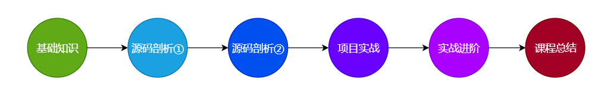

### 02. Netty是如何发迹的

1. **02年jdk1.4 发布的java-NIO时代**

   APi难用, buffer指针, 不可靠自己控制网络异常, 空轮询Bug

2. **04年-Netty2**

   Trustin Lee开发, Java社区中第一个基于事件驱动的网络应用框架.

3. **04年-Grizzly**

   包装了java-NIO, 提供高性能API. 但是文档少更新慢.

4. **06年-Tomcat6.0**

   支持NIO, 但是冗杂.

5. **05年-MINA**

   由netty2开发者和Alex开发, apache开源.

6. **08年-Netty3**

   Trustin Lee加入JBoss后发布, 借鉴MINA. 

7. **12年-Netty4**

   Trustin Lee单干后发布. **io.netty**

8. **13年-Netty5-Alpha版本**

   加入了JDK新特性, 但是性能没有很好提升, 复杂性增加, 被废弃.

- Netty时代: netty统一了java的网络通讯:
  - 框架: Dubbo, gRPC, cloudGateway
  - 大数据: spark, hadoop, flink
  - MQ, ES, ZK...

### 03. IO的五种模式

1. **用户空间和内核空间**

   用户进程不能直接操作内核, 所以OS把内存空间划分成: 用户空间和内核空间.

   TCP发送数据时候, 数据流向: **用户空间->内核空间--内核操作-->网卡发送**

   接收网络数据的时候: **网卡->内核空间->用户空间**

   

2. **一次IO读/写:** 内核空间数据准备, 内核空间拷贝到用户空间.

   Unix把数据读写的两个阶段分成五种IO(Input/Output)模型

   - 阻塞式IO: BIO

     用户进程请求数据时候, 从内核空间到用户空间的拷贝要一直等着.

   - 非阻塞式IO: NIO

     用户可以不断的询问内核, 数据有没有准备好.

   - IO多路复用:

     多个IO操作公用一个selector, 负责定期询问哪个IO的数据准备好了, 然后再通知IO你的数据好了, 开始从内核空间拷贝到用户空间开始用.

   - 信号驱动IO:

     用户进程请求数据前注册一个信号, 自己需要xx. 内核数据准备好了, 通过信号通知用户进程, 用户进程再去拷贝过来.

   - 异步IO:

     用户发起IO请求后马上返回, 等数据完全拷贝到用户空间后再通知用户使用. 两个阶段完全不阻塞.

3. **阻塞/非阻塞, 同步/异步**

   阻塞是线程被挂起, 非阻塞不被挂起.

   同步是调用结果需要在请求之后返回, 异步是请求会稍后返回结果.

4. **异步IO不成熟**, 大多数框架不支持异步IO.

### 04. Java中如何使用BIO、NIO、AIO

