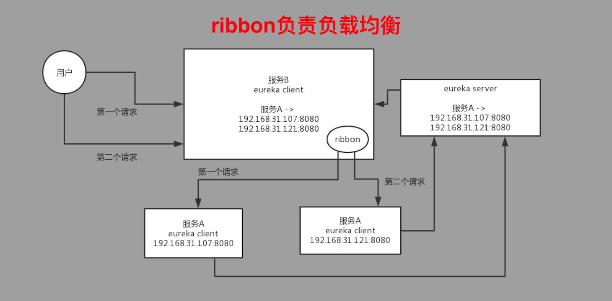

#### 分布式 ∈ 微服务: 微服务一定是分布式的, 分布式组成生态叫做微服务.

- 分布式: 更倾向于不同的机器之间的RPC调用
- 微服务: 不同的有机服务. 

### 041. 分布式系统中的负载均衡作用

ribbon是Netflix公司的, 用于调用时的负载均衡. load balance.

### 042. ribbon实现负载均衡demo

1. 弄两个接口
2. 调用, 查看负载均衡效果

### 043. ribbon 原生接口 和 内置规则

