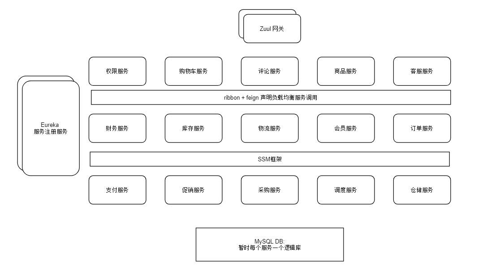

### 147. 阶段二的思路

微服务架构一点一点拆, 中间用微服务+分布式服务过度.

1. **spring-cloud微服务组件 + 阶段一单体项目 => (微服务+分布式架构)项目**
2. 添加一些 分布式系统组织架构: 分布式事务, 锁, 会话, 单点登录....
3. 高可用架构: Hystrix熔断, 考虑N复杂的业务场景
4. DevOps持续集成: CICD
5. 容器
6. 运维平台
7. 微服务支撑平台: 日志中心(ELK), 监控中心(metrics), 配置中心(config)
8. 敏捷开发项目管理
9. 微服务治理平台: 大众点评CAT
10. 生产演练: 容灾.


### 148. 单体eShop的系统

权限中心(这个是面向后台的权限中心), 购物车中心, 评论中心, 商品中心, 基础模块(工具包), 客服中心, 财务中心, 库存中心, 物流中心, 会员中心, 订单中心, 支付中心,促销中心,采购中心,调度中心,仓储中心.

1. **每个都拆成一个服务. 不用想太多太复杂的, 更细的, 或者有需要合并的, 拆完再说.**
2. 微服务主要解决多人开发复杂系统的效率问题.


### 149. 微服务改造整体进行方案: 如何把单块系统改造微服务

**阶段二里的第一步:** spring-cloud微服务组件 + 阶段一单体项目 => (微服务+分布式架构)项目

- Eureka(服务注册与发现), ribbon + feign(负载均衡+注解调用), Zuul(整合ribbon和Hystrix). 

- Hystrix(暂时不用做服务之间的调用当中, 作为以后的高可用架构升级改造)

- 步骤: 上面技术方案好了, 先研究技术, 然后在设计项目结构.


### 150. 微服务改造-概要设计

**文档说明:** 

1. **微服务网管层:** zuul 双机部署(最起码2台).

2. **业务服务层**: 拆分15个服务
3. DB层: MySQL
4. 服务注册中心: eureka-server
5. 服务调用: ribbon+feign负载均衡和声明式调用.

**概要设计图:** 




### 151. 微服务改造- 详细设计的整体思路


### 152. spring-cloud下服务注册的时效(ms)

服务一启动, 就回去eureka-server的addInstance接口注册. 毫秒级的


### 153. eureka服务发现的时效(1-minute)

1. 0s: serverA心跳, 续约.
2. 0s: ServerA拉取全量, 接着serverB注册到eureka, 更新readWriteCacheMap
3. 30s: serverA心跳续约, 拉取增量注册表(无), readWriteCacheMap定时更新到readOnlyMap里
4. **60s: serverA心跳续约, 拉取增量注册表*serverB.**


### 154. 服务心跳间隔

心跳续约30s一次, `eureka.client.leaseRenewalIntervalInSeconds = 30`


### 155. 完善-详细设计架构图


### 156. 服务下线感知时效(3-6.5分钟)

1. **eureka-server的下线定时任务: 60s检查一次, 90s*2没有心跳下线.** 
2. **server每30s去心跳(续租)一次**

0s: serverA心跳, 再没有心跳了

180s-0.01s: eureka检查下线, 没有人下线. **最快3分钟下线**

360s: eureka检查下线, serverA下线, 更新双层缓存. **6分钟正式下线**

390s: 其他服务心跳拉取注册表, 知道serverA下线了. **6.5分钟告知所有人下线**

- eureka检查下线最多15%的服务下线, 那么可能要390 + 60 =450s-7.5分钟

- 服务下线到被感知的3-6.5分钟内, 是配置了timeout和重试的重要性.


### 157. 服务正常下线感知时效(1 minute)

和服务注册的感知时效一样.

1. 0s: serverA心跳, 续约.
2. 0s: ServerA拉取全量, 接着serverB请求eureka下线, 更新readWriteCacheMap
3. 30s: serverA心跳续约, 拉取增量注册表(无), readWriteCacheMap定时更新到readOnlyMap里
4. **60s: serverA心跳续约, 拉取增量注册表里下线续约的serverB.**


### 158. eureka自我保护机制的稳定性和可用性

使用metrics工具, 统计每分钟的心跳次数, 然后根据注册的server数量计算期望心跳数, 如果上一分钟的心跳没满足期望, 就会进入自我保护机制.

- 自我保护代码不太好, 硬编码规定一分钟2次心跳的期待值, 经常进入自我保护模式, 而且可能影响运维操作. **不启用自我保护机制**


### 159. eureka集群-服务如何访问集群

1. eureka集群之间互相注册.
2. server向eureka注册/心跳, 每次都优先走配置的第一台eureka, 挂掉的话走第二台. 每次都坚持使用一台, 除非挂掉, 然后换一台. 

.png)

### 160. eureka server进行集群同步的时效性(1s内)

每个server往eureka里面注册, 接口里面会直接把数据同步给peer: 把数据放在queue里面, 然后500ms内请求打成batch, 发送给peer.

.png)


### 161. feign + ribbon + eureka 的服务发现与故障感知的时效性

ribbon从 ZoneAwareLoadBalancer里面的EurekaClient那里拿到server, 实际上也是eureka的服务发现和故障感知时效性:

发现: 1-1.5minute, 下线感知: 3-6.5minutes.


### 163. spring-cloud下的ribbon负载均衡算法

zoneAwareLoadBalancer, 首先统计方有先访问, 然后是round-bobin轮询算法


### 164. zuul如何使用

网关作用就是对前端屏蔽后台服务, 做最基础的请求转发, 减轻前端辨识度就好了.


### 165. zuul内的ribbon预加载-解决第一次网关访问超时

zuul会结合ribbon, ribbon在初始化服务的spring整套东西的时候, 会出现第一次请求超时的情况.可配置`zuul.ribbon.eager-load: true`


### 166. zuul+ribbon+eureka的服务发现与故障感知的时效性

zuul是使用ribbon中的zoneAwareLoadbalancer来感知服务上线的, 那么也是服务注册和双重缓存更新的1minute, 心跳拿到更新的30s, 最多1.5分钟.

同样,服务宕机之后也是最快3分钟-6.5分钟感知到.


### 167. zuul在服务故障未感知到的时间会发生什么

Zuul依赖Hystrix感知异常, 进行error逻辑. 然后依靠error链响应.

hystrix依靠ribbon+eureka的那一套, 那么故障时间大概也会在3-6.5分钟.

hystrix没有做异常的重试逻辑, 直接返回error的json. 这样没有重试机制.

```json
{
    "timestamp": 1532067539032,
    "status": 500,
    "error": "Internal Server Error",
    "exception": "com.netflix.zuul.exception.ZuulException",
    "message": "GENERAL"
}
```


### 168. zuul配置请求超时和重试

hystrix包装了ribbon, 所以hystrix的超时要大于ribbon超时时长. 

超时和重试以ribbon为主.

hystrix的超时时间: 

`(ribbon.ConnectTimeout + ribbon.ReadTimeout) * (ribbon.MaxAutoRetries + 1) * (ribbon.MaxAutoRetriesNextServer + 1)`

```yml
zuul: # 等ribbon重试失败后, 这个会进行网管层级的重试, 也不用担心hystrix了.
  retryable: true

ribbon:
  ReadTimeout:1000
  ConnectTimeout:1000
  MaxAutoRetries:1   # 最多重试一次
  MaxAutoRetriesNextServer:1 # 重试一次就换下个server.

hystrix:
  command:
    default:
      execution:
        isolation:
          thread: # 必须要比ribbon的要大.
            timeoutInMilliseconds: 10000
```


