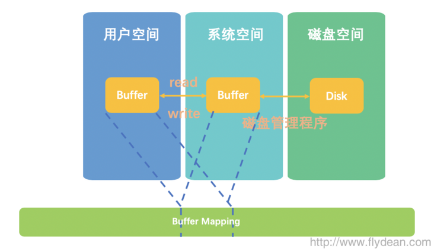
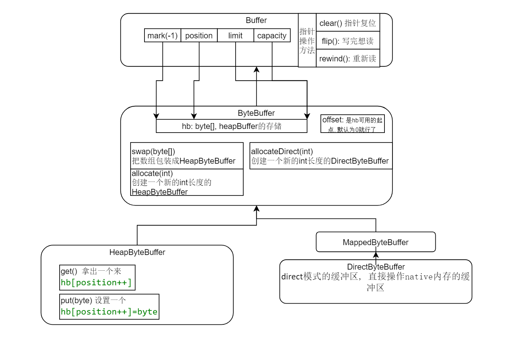
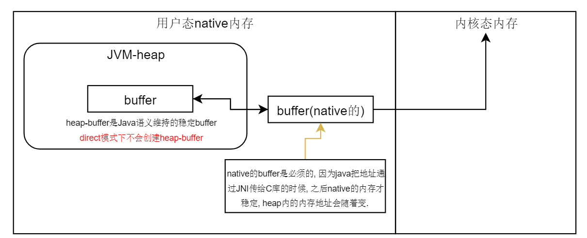
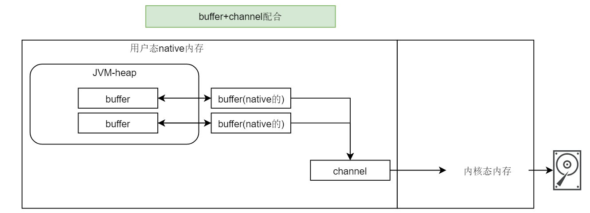

## 疑问: select/poll 是什么, JavaNIO怎么对接上linux的???


## NIO, BIO, AIO各是什么

### 1. 了解NIO基本概念

- 同步(synchronous) IO和异步(asynchronous) IO

  同步: 要自己去检查数据有没有准备好, 异步: 数据准备好了会告知自己.

- 阻塞(blocking) IO和非阻塞(non-blocking)IO

  阻塞: 数据好了自己要去拿, 非阻塞: 数据好了会到自己指定的地方.


1. 同步阻塞(blocking-IO): **线程要等着IO就绪.**
2. 同步非阻塞(non-blocking-IO): 线程可以干别的, **有轮询的线程管理多个IO.**
3. 异步非阻塞(synchronous-non-blocking-IO)简称AIO: **IO就绪好之后会通知线程.**

 

>  NIO -> 网络编程，TCP，连接，到底是在干什么，HTTP
>
> AIO是NIO2.0, 以后看懂了再说.


### 2. NIO学习切入点: 基本概念-demo-编程-源码




将系统空间的buffer和用户空间的buffer同时映射到虚拟地址空间的同一个地方。这样就省略了从系统空间拷贝到用户空间的步骤。


## Buffer

### 3. NIO核心概念: Buffer

- 通过四个指针和一个数组实现一个buffer.
- `mark <= position <= limit <= capacity`



```java
// 这里可以重用, 但是写完之后要flip重置一下position指针, 不然channel读不到!!
nioBuffer.clear();
nioBuffer.put(bytesBuffer.toByteArray());
nioBuffer.flip();
try (
    RandomAccessFile file = new RandomAccessFile(generateLogFileName(), "rw"); // 读写模式，数据写入缓冲区中
    FileChannel channel = file.getChannel();
) {
    channel.write(nioBuffer);
    channel.force(true);
}
```


### 4. Direct缓冲区和allocate创建的缓冲区有什么区别

**direct模式的缓冲区比普通模式创建的缓冲区性能稍微高一些. 因为省去了heap-buffer的创建和维持, 直接操作direct内存的buffer.**



### buffer操作

```java
// 6. bufferAPI: 使用buffer/复用buffer
public void bufferClearFlipRewind() {
    ByteBuffer byteBuffer = ByteBuffer.allocate(100);
    // 重新用byteBuffer
    byteBuffer.clear();
    // 写完想读取: position放到起始点, limit放到position, 丢弃mark.
    byteBuffer.flip();
    // 想从头读一遍: position放到起点.
    byteBuffer.rewind();
}

// 5. buffer的读写
public void bufferOperate() {
    ByteBuffer byteBuffer = ByteBuffer.allocate(100);
    // 拿到position处的byte, position++
    byte b = byteBuffer.get();
    // 把byte设置到position处, position++
    byteBuffer.put("c".getBytes(StandardCharsets.UTF_8));
}

// 4. directory模式的buffer和heap模式的buffer有什么不同
public void directModeBuffer() {
    // 创建一个heap模式的buffer: 线程 --> [heap Java 数组] --> [native 内存 数组] -->
    ByteBuffer allocate = ByteBuffer.allocate(5);

    // 创建一个directory模式的buffer: 线程 --> [native 内存 数组] -->
    ByteBuffer allocateDirect = ByteBuffer.allocateDirect(5);
}

// 3. 学习简单API: 简单 把byte数组包装一个byteBuffer（heapByteBuffer)
public void swapAByteBuffer() {
    // 把byte[]包装成一个ByteBuffer了, wrap是包装成一个HeapByteBuffer. 然后初始化几个参数.
    // buffer范围就是[0,10)
    ByteBuffer byteBuffer = ByteBuffer.wrap(new byte[10]);

    System.out.println(byteBuffer.capacity());
    System.out.println(byteBuffer.position());
    System.out.println(byteBuffer.mark());
    System.out.println(byteBuffer.limit());
    System.out.println(byteBuffer.remaining());
}
```


## Channel

### 7. Channel是什么

channel是数据通道. I/O操作的纽带.





### 10. fileChannel是线程安全的

```java
// 11. channel从文件中读取数据
public void channelReadFromFile() throws IOException {
    FileInputStream fileInputStream = new FileInputStream("I:\\work\\stone_fir\\阶段五-复杂业务场景下的系统设计\\4. NIO\\001~022资料\\011_从磁盘文件中读取数据到Buffer缓冲区里\\ff.txt");
    FileChannel channel = fileInputStream.getChannel();


    ByteBuffer byteBuffer = ByteBuffer.allocate(200);
    channel.read(byteBuffer);
    byte[] data = new byte[8];
    byteBuffer.flip(); // 写完想读, 把position = 0，limit = 原来的position
    byteBuffer.get(data);
    System.out.println(new String(data));

    channel.close();
    fileInputStream.close();
}

// 9. 选择channel的位置: select position in channel
public void selectPositionInChannel() throws IOException {
    // ======================== 选择位置写入
    // 其次如果你要基于FileChannel随机写，可以调整FileChannel的position
    FileOutputStream fileOutputStream = new FileOutputStream(".\\xx.txt");
    FileChannel channel = fileOutputStream.getChannel();


    ByteBuffer byteBuffer = ByteBuffer.wrap(new byte[]{52, 2, 13, 42, 43});
    channel.write(byteBuffer);

    byteBuffer.rewind();
    // channel也是有index的概念的
    channel.position(5);
    channel.write(byteBuffer);

    channel.close();
    fileOutputStream.close();
}


// 8. 基本使用: 把buffer通过channel输出到文件.
public void basicUse() throws IOException {
    FileOutputStream fileOutputStream = new FileOutputStream(".\\xx.txt");
    FileChannel channel = fileOutputStream.getChannel();


    ByteBuffer byteBuffer = ByteBuffer.wrap(new byte[]{52, 2, 13, 42, 43});
    channel.write(byteBuffer);
    channel.close();
    fileOutputStream.close();
}
```


### 12. FileChannel.lock() 共享&独占锁 文件锁

共享锁, 只可读.

独占锁, 只可自己用.

### 13-15. FileChannel先刷数据到OS=Cache, 然后到磁盘. force()强制刷盘

kafka、elasticsearch，写数据到磁盘的时候，都是先写入os cache的，后面的操作系统自己不定时的会决定把os cache里的数据写入到磁盘上去.


```java
/**
 * 强制把channel里面所有文件更新刷到存储设备上去
 * channel创建开始的所有更新都会保证刷到磁盘上. 如果file不在本地文件, 那么没有保证.
 */
public abstract void force(boolean metaData) throws IOException;
```


## 源码-结合注释了解

### 16. FileChannel的初始化

```java
// 在File和Stream里面创建channel都是: 
synchronized(this) {
	FileChannel channel = FileChannelImpl.open(fd, path, false, true, append, this);
}
```


### 17. FileChannel写数据到磁盘: write(buffer): synchronized保证并发安全

```java
public int write(ByteBuffer src) throws IOException {
    ensureOpen(); // 校验一下, 当前channel必须oppen
    if (!writable)// 检查一下当前的channel必须是可写的.
        throw new NonWritableChannelException();
    // 1. 加上一个position的锁
    synchronized (positionLock) {
        int n = 0;
        int ti = -1;
        try {
            // 标记IO操作的开始, 在final里有end, 设置了什么security之类的
            begin();
            // 把当前的nativeThread添加到一个set里
            ti = threads.add();
            if (!isOpen())
                return 0;
            do {
                n = IOUtil.write(fd, src, -1, nd);
            } while ((n == IOStatus.INTERRUPTED) && isOpen());
            return IOStatus.normalize(n);
        } finally {
            threads.remove(ti);
            end(n > 0);
            assert IOStatus.check(n);
        }
    }
}
```

### 18. read() 类似write()-synchronized同步.

FileChannel底层有一个非常关键以及核心的概念：position

```java
// channel里面指定position读取会在file流中寻找指定的position:
p = nd.seek(fd, newPosition);

```

### 19. 多线程并发读写磁盘文件的同步: 底层的多线程写串行

底层一定是做了多线程同步的，只有一个线程可以写磁盘文件


### 20. Channel的文件锁原理: 

```
// 底层是
FileDispatcher.lock(fd, true, position, size, shared) ;
// 这个fileDispatcher时调用底层的native读写方法的. 支持更细粒度的锁.
```


