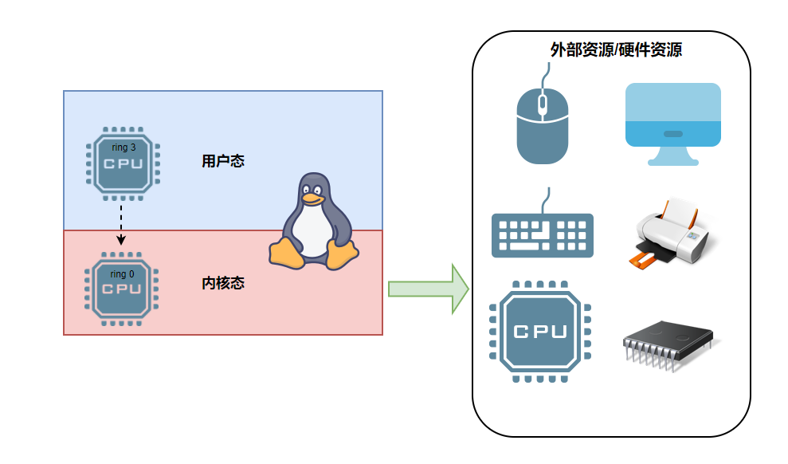
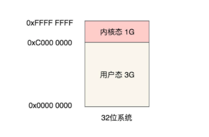

**用户态与内核态只是不同权限的资源范围**, 用户态与内核态的概念就是CPU 指令集权限的区别. 

以 Inter C P U 为例，Inter把 `C P U 指令集` 操作的权限由高到低划为4级：

- ring 0
- ring 1
- ring 2
- ring 3

其中 ring 0 权限最高，可以使用所有 `C P U 指令集`，ring 3 权限最低，仅能使用常规 `C P U 指令集`，不能使用操作硬件资源的 `C P U 指令集`，比如 `I O` 读写、网卡访问、申请内存都不行，Linux系统仅采用ring 0 和 ring 3 这2个权限。

进程中要读写 `IO`, 需要ring0的指令集, 操作系统把CPU切换指令集操作权限为ring0, CPU指令对应的权限的指令. 

### **用户空间和内核态空间**

- 用户态：只能操作 `0-3G` 范围的低位虚拟空间地址
- 内核态：`0-4G` 范围的虚拟空间地址都可以操作，尤其是对 `3-4G` 范围的高位虚拟空间地址必须由内核态去操作
- 补充：`3G-4G` 部分大家是共享的（指所有进程的内核态逻辑地址是共享同一块内存地址），是内核态的地址空间，这里存放在整个内核的代码和所有的内核模块，以及内核所维护的数据

### **用户态和内核态的切换**

**用户态->内核态切换的三种情况:**

1. 系统调用
2. 异常
3. 中断

**过程**

- 保留用户态现场（上下文、寄存器、用户栈等）
- 复制用户态参数，用户栈切到内核栈，进入内核态
- 额外的检查（因为内核代码对用户不信任）
- 执行内核态代码
- 复制内核态代码执行结果，回到用户态
- 恢复用户态现场（上下文、寄存器、用户栈等）

