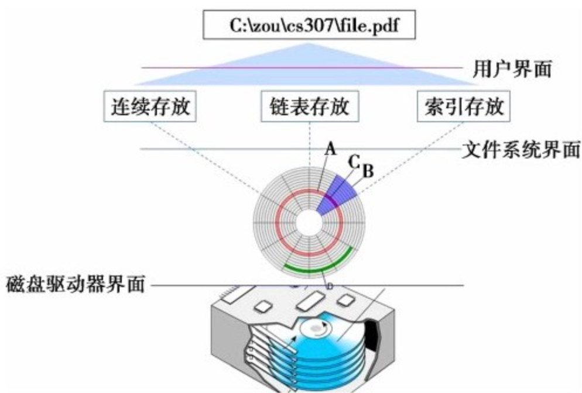

文件系统从根本上说是操作系统对磁盘进行的抽象和装扮

操作系统为磁盘提供的抽象就是：文件及文件系统。

操作系统在对磁盘进行管理时通常以磁盘块作为最小单位。而定位一个磁盘块则通过磁盘块地址进行。

影响磁盘读写时间的因素有3个：寻道时间, 旋转延迟. 数据传输时间.

**为了提高磁盘的读写效率**，最需要降低磁盘的寻道时间，实现的手段则是磁盘调度。

先来先服务FCFS（First Come,First Serve）短任务优先STF（Shortest Task First）短寻道优先SSF（Shortest Seek First）电梯调度ES（Elevator Scheduling）提前查看电梯调度ESLA（Elevator Scheduling with Look Ahead）单向电梯调度OWES（One Way Elevator Scheduling）