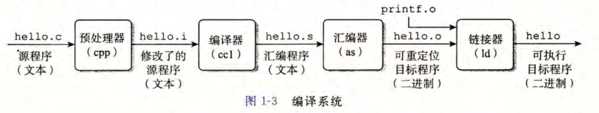
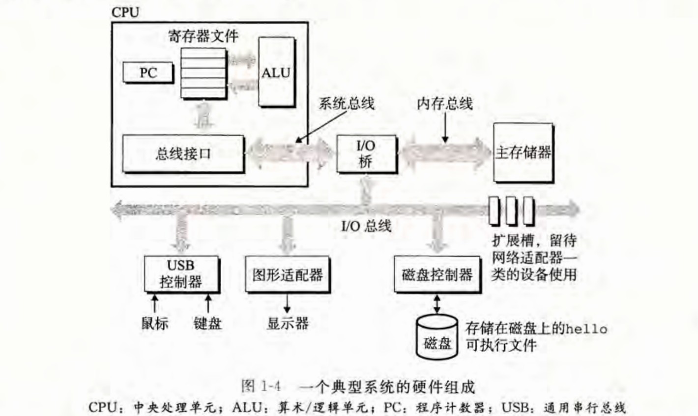
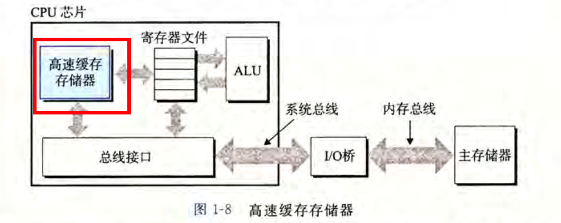
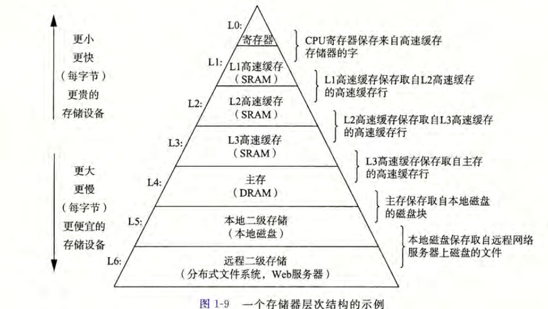
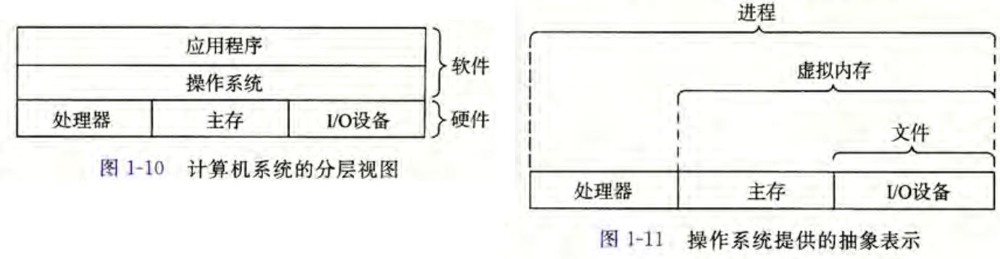
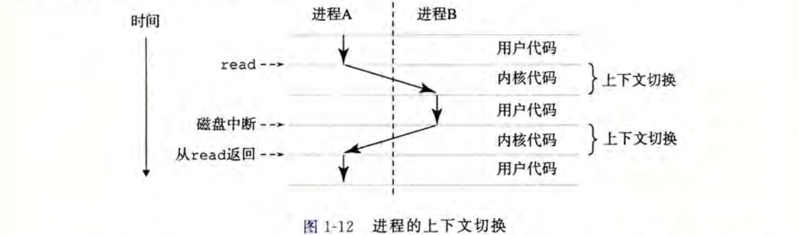
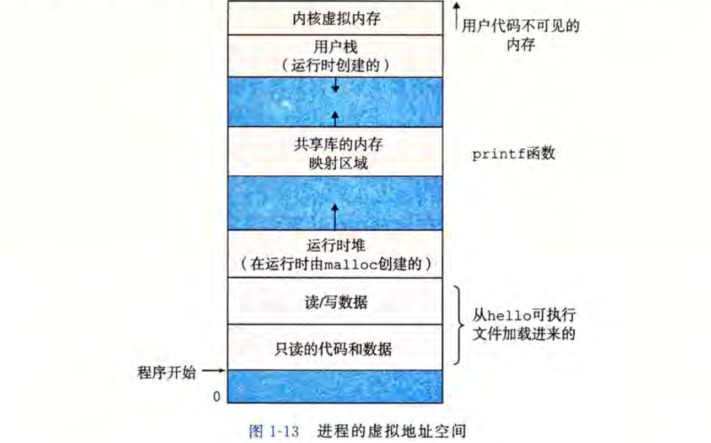
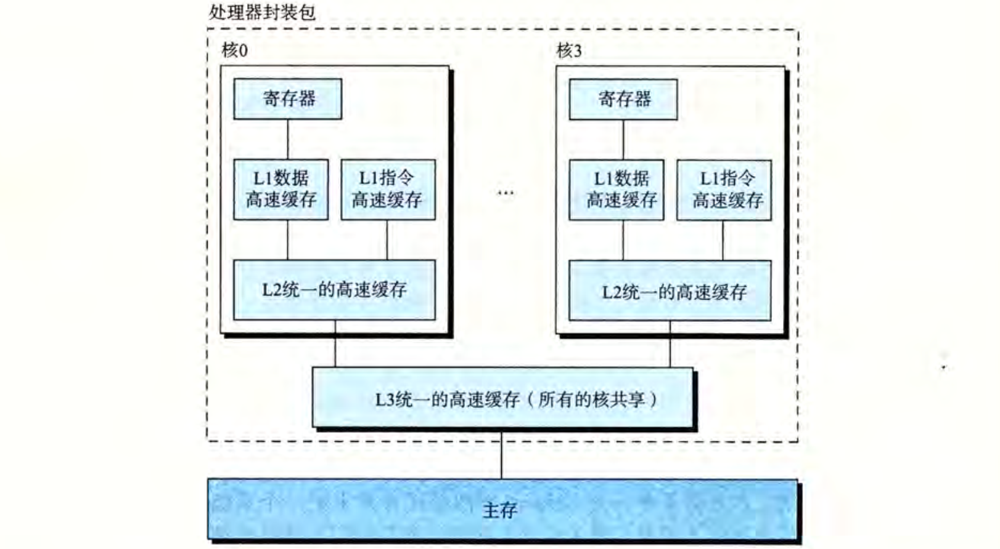
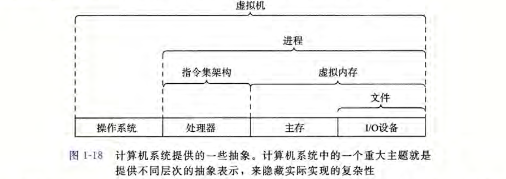

## 计算机系统漫游

所有计算机系统都有相似的硬件和软件组件, 执行着相似的功能.

本书的目的就是要帮助你了解当你在系统上执行 hello 程序时，系统发生了什么以及为什么会这样。

#### 1. 信息就是 位bit+上下文context

**程序是 01组成的位(bit)序列,  不同的上下文(位置/环境)中, 字符序列有不同的语义.**

> 旁注: C编程语言的起源
>
> 1. C是与Unix操作系统密切相关的: 设计出C为了写Unix
> 2. C语言小二简单
> 3. C是为了实践设计的

#### 2. 程序被其他程序翻译成不同格式: 翻译成机器语言->按照一定格式打包成二进制的可执行文件

程序代码里的每条 C 语句都必须被其他程序转化为一系列的低级机器语言指令。按照可执行目标程序的格式打好包，并以二进制磁盘文件的形式存放起来. **这就是可执行文件**.

`linux> gcc -o hello hello.c`: 会把hello.c文件经过一定流程, 翻译成二进制的可执行文件hello

#### 3. 编译系统很重要

1. 优化程序性能
2. 理解链接时候出现的错误
3. 避免安全漏洞

#### 4. 处理器读取, 解释存储在内存中的指令

`linux> ./可执行文件的地址` 这样shell就加载并运行可执行文件. shell会等待程序结束.

#### 5. 高速缓存很重要

如果直接从主内存读写数据, CPU的速度会被内存的速度拖慢. 所以使用高速缓存来做个中介.

> 处理器从寄存器文件中读数据比从 主存中读取几乎要快 100 倍。 更麻烦的是，随着这些年半导体技术的进步，这种处理 器与主存之间的差距还在持续增大。加快处理器的运行速度比加快主存的运行速度要容易和便宜得多。针对这种处理器与主存之间的差异，系统设计者采用了更小更快的存储设备，称为高速缓存存储器（cache memory, 简称为 cache 或高速缓存）， 作为暂时的集结区域， 存放处理器近期可能会需要的信息。

#### 6. 存储设备形成层次结构

从上至下，设备的访问速度越来越慢、 容量越来越大，并且每字节的造价也越来越便宜。

#### 7. 操作系统管理硬件: 提供三个抽象: 文件-虚拟内存-进程

操作系统有 **两个基本功能**： 

（1)防止硬件被失控的应用程序滥用: 在硬件之上的一层软件

（2)向应用程序提供简单一致的机制来控制复杂而又通常大不相同的低级硬件设备。

操作系统通过 **"进程/虚拟内存/文件**" 几个抽象来实现基本功能.

1. **进程:** 程序独占计算机的假象. 并发的运行.

   操作系统保持跟踪进程运行所需的所有状态信息。这种状态，也就是上下文， 包括许多信息，比如 PC 和寄存器文件的当前值，以及主存的内容。在任何一个时刻，单处理器系统都只能执行一个进程的代码。

   - 进程并发: 已有shell进程, 当我们让它运行 hello 程序时,  shell 通过调用一个专门的函数，即系统调用，来执行我们的请求，系统调用会将控制权传递给操作系统。 操作系统保存 shell 进程的上下文，创建一个新的 hello 进程及其上下文， 然后将控制权传给新的 hello 进程。 hello 进程终止后， 操作系统恢复 shell 进程的上下文，并将控制权传回给它， shell 进程会继续等待下一个命令行输人。

     

2. **线程:**

   每个线程都运行在进程的上下文中， 并共享同样的代码和全局数据。

   多线程之间比多进程之间更容易共享数据, 更高效.

3. **虚拟内存:**

   

4. **文件:**

   文件就是字节序列，仅此而已。

   文件就是字节序列，仅此而已。每个 I/O 设备，包括磁盘、键盘、显示器， 甚至网络，都可以看成是文件。系统中的所有输人输出都是通过使用一小组称为 Unix I/O 的系统函数调用读写文件来实现的。

   文件向应用程序提供了一个统一的视图.

#### 8. 系统间通过网络通讯

#### 9. 重要主题

##### 9.1 Amdahl定律

当我们对系统的某个部分加速时，其对系统整体性能的影响取决于该部分的重要
性和加速程度。

##### 9.2 并发和并行

1. 线程并发

**超线程**，有时称为同时 多线程（simultaneous multi-threading), 是一项允许一个 CPU
执行多个控制流的技术。 它涉及 CPU 某些硬件有多个备份，比如程序计数器和寄存器文
件， 而其他的硬件部分只有一份，比如执行浮点算术运算的单元。常规的处理器需要大约
20 000 个时钟周期做不同线程间的转换， 而超线程的处理器可以在单个周期的基础上决定
要执行哪一个线程。 这使得 CPU 能够更好地利用它的处理资源。比如，假设一个线程必
须等到某些数据被装载到高速缓存中，那 CPU 就可以继续去执行另一个线程。举例来说，
Intel Core i7 处理器可以让每个核执行两个线程，所以一个 4 核的系统实际上可以并行地
执行 8 个线程。

2. **指令级并行**

现代处理器可以同时执行多条指令的属性称为指令级并行. 

早期处理器需要用多个时钟周期来执行一条指令, 现在CPU可以在一个时钟周期执行2-4条指令的并发执行.

3. **单指令, 多数据并行**

允许一条指令产生多个可以并行执行的操作，这种方式称为单 指令、 多数据，即 SIMD 并行

##### 9.5 计算机系统中的抽象很重要

