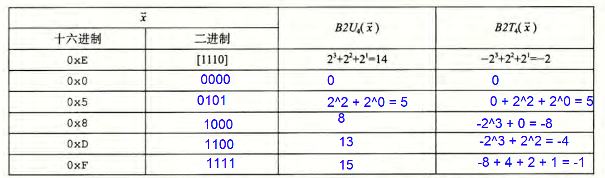

# 程序结构和执行

## 信息的表示和处理

### 1. 信息存储

大多数计算机使用 8 位的块，或者字节（byte), 作为最小的可寻址的内存单位，而不是访问内存中单独的位。

机器级程序将内存视为一个非常大的字节数组， 称为**虚拟内存**(virtual memory)

内存的每个 字节都由一个唯一的数字来 标识， 称为它的**地址（address)**

所有可能地址的集合就称为**虚拟地址空间（virtual address space)**

1. **16进制表示法**

0x开头的数字是16进制, 2个数字表示一个Byte. 2进制和16进制比较方便转换.

2. **字长(word size):** 指针数据的标准大小.

   虚拟地址是一个字长的数据来编码的. 字长w位, 那么虚拟地址最多2^w个Byte.

   32位字长限制虚拟空间4GB.

   64位机器可以运行32位机器编译的程序.

   **字长和存储粒度没有关系,** 即使字长位64, C中的char也是一个字节(8位)来存储. 但是int的话, 在64位中就用8个Byte来存(正好一个字长).

   **指针的大小和字长有关:** 指针的长度就是字长. 如果在32位机器上用int_32存储, 那么在64位机器就会有问题.

3. **寻址和字节顺序:**

   一个大于1Byte的对象存储, 要确定: 

   - 对象地址是什么:

   - 内存中如何摆放数据: 

     - 大端:最高有效字节在最前面的方式
     - 小端:最低有效字节在最前面的方式: IOS和Android都是小端

     对于应用程序员来说, 机器使用的字节顺序是完全不可见的. 只有在网络传输的时候.

4. **表示字符串:**

   C中字符串编码成一个字符数组, null(0)结尾.

5. **表示代码:**

   同样的源代码, 在不同的机器上编译, 生成不同的机器代码. 

   因为指令和编码方式都是按照机器来的, 从机器的角度看, 程序只是字节序列.

6. **布尔代数简介:**

   ~: 取反 not

   &: and

   |: or

   ^: exclusive-or

7. **C语言中的位级运算**

   x. ~x. 之类的.

8. **C语言中的逻辑运算:** ||, && 和!

   所有非0的都为True, 只有0为false.

9. **C语言中的位移运算:**

   << 左移: 往左移动, 丢弃高位, 低位补0.

   `>>`右移: 

   - 逻辑右移: 左边补充0
   - 算数右移: 左边补充k个最高有效位(1)

   Java>>算数右移, >>>是逻辑右移.

### 2 整数表示

> **有符号数:** 都用补码(最高位为nagetive-weight 负权)表示
>
> 可以用反码(最高位也是负权, 只是是-2(w-1) + 1), 原码(浮点数有使用)表示
>
> **无符号数:** 就用二进制表示就行.

1. **整型数据类型:** 表示有限范围的整数

   C中支持多种: [signed] char, unsigned char, short, int, unsigned int...

   Java只支持有符号数.

2. **无符号数的编码:**

3. **补码编码:** 

   |Tmin| = |Tmax| + 1

   B to unsigned 4bit , B to Two's-complement 4位补码计算.

   

 4. 有符号数和无符号数之间的转换

     **强制类型转换的结果保持位值不变，只是改变了解释这些位的方式**

 5. C语言中的有符号数和无符号数

    默认都是补码表示的有符号数, 无符号数用16进制表示用u结尾:` 0x0011u`

6. 扩展一个数的位表示

   不同字长的整数之间转换, 又要保持数值不变.

   无符号数转成更大的数据类型, 只需要开头添加0.

   补码扩展的话, 要 TODO

7. **截断数字**: 变成 字长少的整数表示

8. **有符号数与无符号数的建议:**

   

