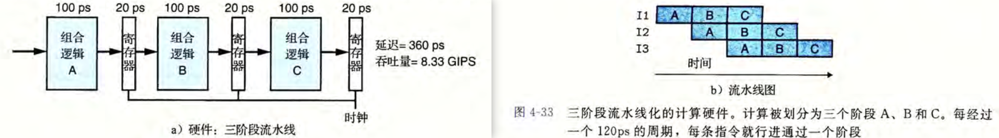
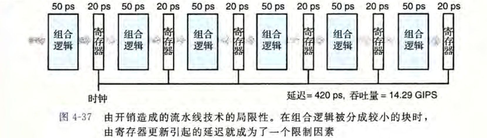

## 四. 处理器体系架构


### 1. 指令集体系结构: CISC, RISC


**程序员可见状态： 指的是程序（指令）能够读或写的存储器，包括寄存器，内存，PC，程序状态，条件码(Z,O,S)**


程序状态： 代表程序牵涉到的各种存储内容。


### 2. 逻辑设计和硬件控制语言HCL

### 2.1 逻辑门


### 2.2 组合电路, HCL布尔表达式


### 2.3 字级的组合电路, HCL表达式


### 2.4 集合关系


### 2. 5 存储器和时钟: - 还不太理解, 还要看一遍.

**组合电路:**不存储任何信息, 只是简单的响应输入的信号, 产生输出.

**时序电路:** 有状态, 且在状态的基础上进行运算.

**时序电路 = 组合电路 + 存储器**

**存储设备:**

1. **时钟寄存器:** 存储单个位/字, 时钟信号控制寄存器加载输入值.

   > **寄存器是电路中不同部分的组合逻辑之间的屏障, 只有当时钟上升时, 值从寄存器的输入到输出**
   >
   > 
   >

2. **存储器-寄存器文件:** 寄存器的标识作为地址.

   - **时钟寄存器:** 存储单个word

   

   **写入:** 

   - **'destW' + 'valW':** 写入的寄存器文件的地址,value.

     时钟上升的时候, 这个值会被写入到具体的寄存器里面.

     **读取:** 

     - **'srcA' + 'valA':** 读取寄存器的地址, 读到的value.

       时钟上升时候, 地址的值会读到value输出出来.

2. **存储器-随机访问存储器:** 存储多个字, 用地址来选择读写某个字.

   - 处理器的虚拟内存系统. 硬件和系统结合起来的一个统一API.

   

   - **写入:** `地址输入` + `数据输入` 
   - **读取:** `地址输入` + 把数据输入的控制信号设置为0
   - **读写信号:** 指示操作是读取还是写入.

   等一个时钟之后, 操作就好了. 如果地址不合法, error信号会变成1.


### 3. Y86-64的顺序实现

sequential SEQ顺序的处理器. **1个时钟周期, SQL执行处理一条完整指令的所有步骤**

### 3.1 把指令的处理分阶段

- **取指(fetch):** 从内存读取指令字节. icode(指令代码)和ifun(指令功能)
- **decode 译码:** 从寄存器文件读入最多两个操作数.
- **execute 执行:** 算术/逻辑单元(ALU) 要么执行指令的操作ifun, 要么增加减少栈指针. 得到valE, 可能设置条件吗.
- **memory 访问内存:** 访存阶段向内存读取或写入数据, valM.
- **write back 写回:** 最多写两个结果到寄存器
- **PC update:** 更新下一条指针的地址.


### 3.2 SEQ的硬件结构 TODO


### 3.3 SEO的时序 TODO

一个时钟的变化, 会引起一个经过组合逻辑的流, 来执行整个指令

组合逻辑 + 两种存储器设备.

**存储器设备:**

1. 时钟寄存器: 
   1. 程序计数器
   2. 条件码寄存器
2. 随机访问存储器: 
   1. 寄存器文件
   2. 内存: 
      1. 指令内存:
      2. 数据内存: 

**组合逻辑:**  组合逻辑就是电路, 不需要时序控制, 只要输入变就会通过逻辑门光速传播.

1. PC指针: 


### 3.4 SEQ每个阶段的具体实现: TODO

> 没看太懂, 从上面SEQ的分阶段就没看懂
>
> SEQ唯一的问题是太慢了.


### 4. 流水线的通用原理

流水线化提高了系统的throughput, 但是会稍微提升latency.

### 4.1 设计流水线

在现代逻辑设计中，电路延迟以微微秒10^-12秒为单位来计算.

##### A: **SEQ的处理时序吞吐量**


**吞吐量: 1/320ps = 3.12 GIPS 每秒30多亿条指令.**


##### B: **流水线化的设计:** 组合逻辑拆分, 然后并行.



**吞吐量: 1/(360ps) * 3 = 8.33GIPS, latency增加了, 但是吞吐量也增加了**


同一个A需要的硬件(比如存储数据寄存器), 在同一时刻, 都只有一个命令在用. 如果时钟运行太快, 会有灾难性的后果.

**随着时钟周而复始地上升和下降，不同的指令就会通过流水线的各个阶段 ，不会相互干扰。**


#### 4.3 流水线的局限性: 

>  必须互相独立!, 但是是下一节反馈里讲的

1. **不一致的划分:** 需要硬件设计者, 将系统计算集划分成一组具有相同延迟的阶段.

   如果组合逻辑拆分不成多个等量的时候:

   

2. **流水线过深, 收益下降:** 寄存器延迟太多了

   


#### 4.4 带反馈的流水线系统

程序的前后指令很可能是相关的! 

```assembly
// 1. 数据相关 data dependency
	irmovq $50, %rax  
	addq 	 %rax, %rbx // 这个%rax就依赖上面一个命令.
// 2. 指令控制流造成的顺序相关 control dependency.
loop:
	subq %rdx, %rbx
	jne targ					// 这个要跳到哪里完全依赖控制流
	irmovq $10, %rdx
	jmp loop
targ:
	halt
```

- **原来的每条都带反馈:**

  

- 流水线化之后, 必须正确处理反馈的影响.

  


### 5. Y86-64的流水线实现

#### 5.1 SEQ+: 重新安排计算阶段

1. 先调整Sequential五个阶段的顺序, 把更新PC从时钟结束时挪到开始时.

   我理解是把**pc由上个周期的计算结果决定(所以不需要硬件寄存器了), 而不是这个周期的计算结果.**

   

#### 5.2 插入流水线寄存器


#### 5.3 对信号进行重排序和标号


#### 5.4 预测下一个PC


#### 5.5 流水线冒险

要带着相邻指令会相关的问题:

1. 数据相关
2. 控制相关.

出现问题就是冒险(hazard). 分为data hazard和control hazard


##### a. 用暂停stalling来避免数据冒险

避免冒险的常用技术, 处理器停止流水线中n条指令, 直到冒险条件不满足.

插入气泡bubble

##### b. 用转发来避免数据冒险


##### c. 加载/使用数据冒险

将暂停和转发结合起来，避免加载/使用数据冒险。


##### d. 避免控制冒险


#### 5.6. 异常处理

指令集中包括三种异常:

1. Halt指令: 
2. 非法指令和功能码组成的指令: 
3. 非法地址访问: 

处理器设计还要处理外部异常, 比如网络IO, 用户输入.


#### 5.7 PIPE各阶段的实现:

六个阶段, 我这个完全看不懂了


#### 5.8 流水线控制逻辑

控制逻辑必须考虑到四种控制情况, 在数据转发和分支预测不能处理的:

1. 加载/使用冒险: 从内存读取一个值的指令, 和使用这个值的指令之间, 必须暂停一个周期.
2. 处理res: 流水线必须暂停直到ret指令到达写回阶段
3. 预测错误的分支: 
4. 异常: 一条指令发生异常, 禁止后面的指令更新程序员可见的状态.


### 6. 总结:

指令集(ISA)在处理器行为和如何实现处理器之间提供了一层抽象.

定义了Y86-64指令集.

设计了SEQ处理器, 没一个时钟周期执行一条指令. 

通 过重新调整 SEQ 各个部分的顺序，引人流水线，我们得到 SEQ+, 接着添加流水线寄
存器， 创建出 PIPE— 流水线。然后，添加了转发逻辑，加速了将结果从一条指令发送到另一条指令 ，从而提高了流水线的性能。 有几种特殊情况需要额外的流水线控制逻辑来暂停或取消一些流水线阶段。


