> 我是看了<编码>那本书再看的这本书, 感觉编码那本书容易听懂, 从简单的电路 -> 莫斯电码 ->电报 -> 继电器 -> 逻辑门 -> 各种门 -> 电路 -> 运算 -> 存储.... 更好.
>
> 这本书刚开始虽然也很简单的说话, 但是从概念入手的不好懂

## 计算机三大原则

编码是什么: 把有用的信息转化成数字, 在进行数字处理.

1. 计算机是执行输入、运算、输出的机器:

   基础硬件单元是 IC(integrated circuit(巡回, 电路))集成电路. 

   触角输入 -> 电路(电子管)运算 -> 触角输出

2. 程序是指令和数据的集合

   指令集合组成函数

   数据有: 输入的数据, 指令执行结果再当做新的数据.

3. 计算机的处理方式有时与人们的思维习惯不同

   用数字表示所有信息

举例:

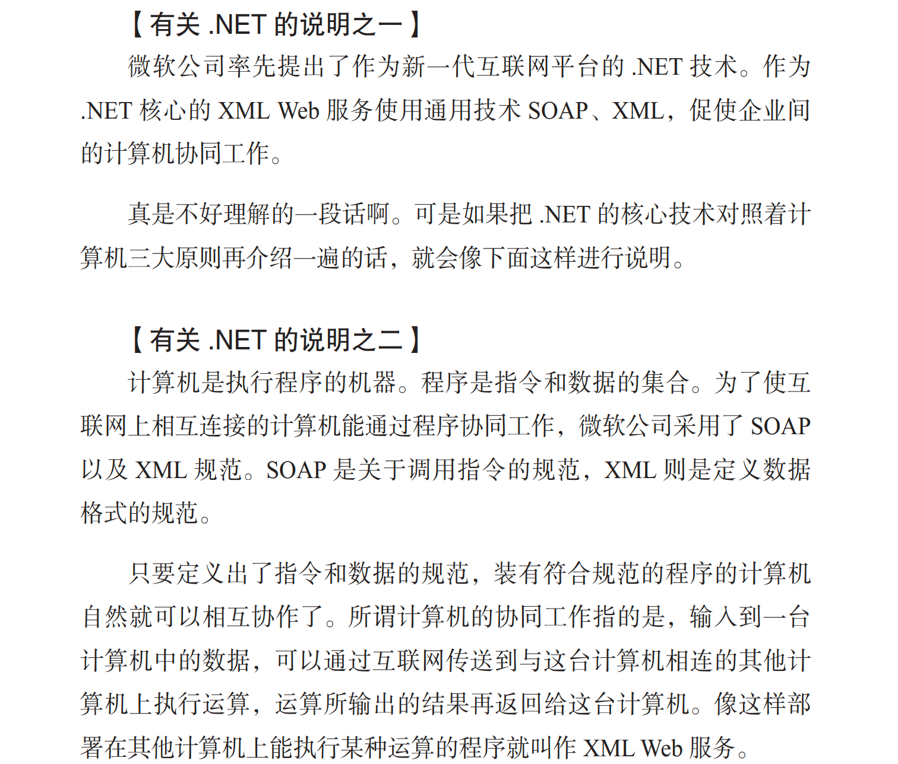

## 二. 自制计算机

> **IC 家族当中有功能各异的各种 IC,  诸位记住的只有三种: CPU(处理器),  内存以及 I/O**
>
> 用电路把 CPU, 内存以及 I/O 上的引脚相互连接起来, 为每块 IC 提供电源, 再为 CPU 提供时钟信号. 计算机就运行起来了.
>
> 在单片机广泛应用的今天， CPU、 I/O、 内存都被集成到了一块 IC 上。 可话又说回来， 即便只是在纸上体验制作微型计算机的过程， 也还是非常有益的。 

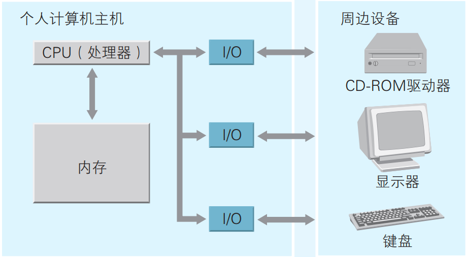

- CPU 上数据总线的条数， 或者 CPU 内部参与运算的寄存器的容量， 都可以作为衡量 CPU 性能的比特数。 

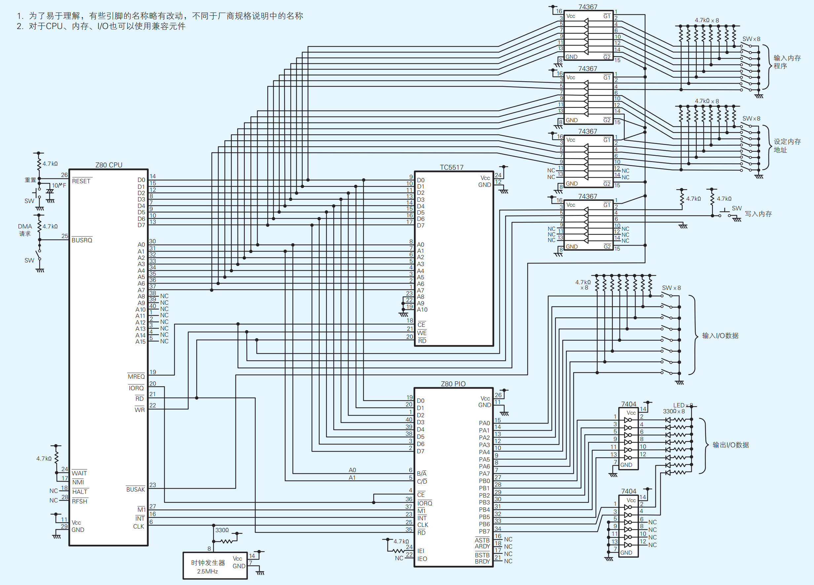

1. 时钟: 驱动 CPU(电路) 运转
2. CPU:
3. RAM:
4. I/O:

### 1. 先把每个 IC 的两个触角接到电源

> 用的 IC 是数字 IC, 只有01. 还有模拟 IC, 信号是连续的: 比如温度, 频率...

1.  Voltage Common Collector:  电压共同集电极 5v
2.  GND: ground接地 0v

### 2. CPU, RAM的引脚和功能

**总线:** 连接到 CPU 中数据引脚, 地址引脚, 控制引脚上的电路的统称.

**Z80 CPU** 

1. **地址引脚:** D0 - D15, 16个. 可以确定2^16=64k地址, 每个地址1Byte, 所以就是64KB 的寻址空间.

2. **数据引脚:** 出入输出的数据引脚8个, 一次性输入输出8bit, 1Byte

3. **\_MREQ触角**: 因为地址引脚的前两个连接了 TC5517(RAM), 和 I/O的寻址触角
4. **\_IORQ触角:** 0代表 CPU 的地址触角和 IO 连着的, 1代表断开.
5. **_RD 触角:** 是否为读取的地址
6. **_WR 触角:** 表示地址引脚是否为写出的地址
7. **CLK 触角**

**其他引脚: ** 统称为控制引脚

- **_M1引脚:** machine cycle1 机器周期1

- **_INT引脚:** interrupt 中断. 接收 PIO 发出的中断请求的引脚, 会中断 CPU 的处理.

- **_RESET触角:** 重置触角, 信号为0的话 CPU 会被重置, 然后还原成1.

  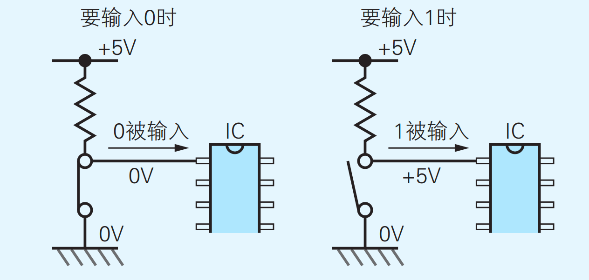

  **_RESET 上的电容**, 在电源接通时候, 缓慢升到5V, 因为从0->5V 的话, CPU 会被重置. 这相当于自动重置了一次 CPU

- **_BUSRQ 引脚:** Bus Request 总线请求: 如果设置0V, CPU 从电路中隔离, 处于隔离状态, 可以不通过 CPU, 手动(从 IO)向 RAM中写入程序. 这个叫 DMA(Direct Memory Access), 硬盘等读写内存, 就是 DMA.

- **_BUSAK引脚:** Bus Ack 响应总线请求. _BUSREQ=0时, _BUSACK 也变成0. 在 DMA 之前, 要把 _BUSREQ置为0, 把 CPU 隔离开, 还要确认 _BUSACK变成了0, 才能确认被隔离.

  CPU 被隔离之后的确认触角

- _WAIT 引脚, _NMI 引脚, **pull-up 起来**(连到5V 上. 加入电阻, 方便以后加入元件)

  NMI: Network Management Interface, 和网络有关的.

- _HALT引脚, _ASTB 引脚 什么都不连.

**TC5517 RAM**

1. 地址引脚: A0-A10, 11个. 可以寻址2^11=2K 个地址, 每个地址1B, 可以存储2KB 的内存空间.
2. 数据引脚: D0-D7, 8个.
3. **_CE 触角**: chip enable 芯片开通.连接_MREQ 触角, 0的时候代表 CPU 地址和 RAM 地址相关
4. **_RE 和 _WR 触角:** 对应 CPU 的两个触角

### 4. 连接 I/O

1. **四个1B 的寄存器:**

2. **寻址触角:** 两个引脚, 代表2bit 位子, 寻址4个寄存器  B/_A, C/__D. 名字有横线, 说明0v 为接通, 正常5v 接通.

0V 接通 A, 5V 接通 B

3. **_CE 触角**: chip enable 芯片开通.连接_MREQ 触角, 0的时候代表 CPU 地址和 RAM 地址相关
4. **_RE触角:** 对应 CPU 的_RE 触角, 如果是0的话就是读, 如果是1的就是写输出
5. **CLK 触角:**

**其他引脚: ** 统称为控制引脚

- **_M1引脚:** machine cycle1 机器周期1
- **_INT引脚:** 对应 CPU 的_INT 引脚. 向 CPU发出的中断请求. 中断 CPU 的处理.
- **PA0 ~ PA7 引脚:** port A 接口 a 的8个输入引脚. 同理, **PB0-7是 portB 的8个输入引脚.**
- IEI 引脚: pull-up, 不用
- 什么都不连接:  IEO 引脚, _ASTB 引脚, ARDY 引脚, _BSTB 引脚, BRDY 引脚

### 5. CLK 触角连接时钟 clock 

时钟驱动 CPU 和 IO 输入, 不需要驱动 RAM, RAM 有一个状态, 通电就能维护.

### 6. 计算机原理: 时钟信号驱动CPU, IO.  计算, 存储

### 7. 连接上DMA(输入内存)的设备

>  **(三个指拨开关+总线缓冲器[确认 CPU 断开])**

**三个指拨开关:** 

1. 指定 内存 address 的: 连接到 RAM 的 A0-A7引脚(因为只用2^8个位的空间).
2. 8位值的指拨开关: 连接到 RAM 的 D0-D8 引脚(一次输出8个 bit).

3. 表示 write 的指拨开关: 连接到 RAM 的 _WE 引脚. 输出0表示对 RAM 写东西.
4. ... 就是把 RAM 的_RD 引脚 pull-up 起来, 输出5v, 表示非read. _CE 连0v, 表示是对 RAM 的 IORQ 操作.

**三态总线缓冲器:** 

三个指拨开关如果随便输入, 会对电路造成影响. 所以有总线缓冲器:

**G0, G1两个触角:** 同时为0, 接入电路. 同时为1, 断开电路:

 **G1G0连接 CPU 的 _BUSACK 触角**. 在 CPU 断开总线并确认后, 内存输入设备才接入电路

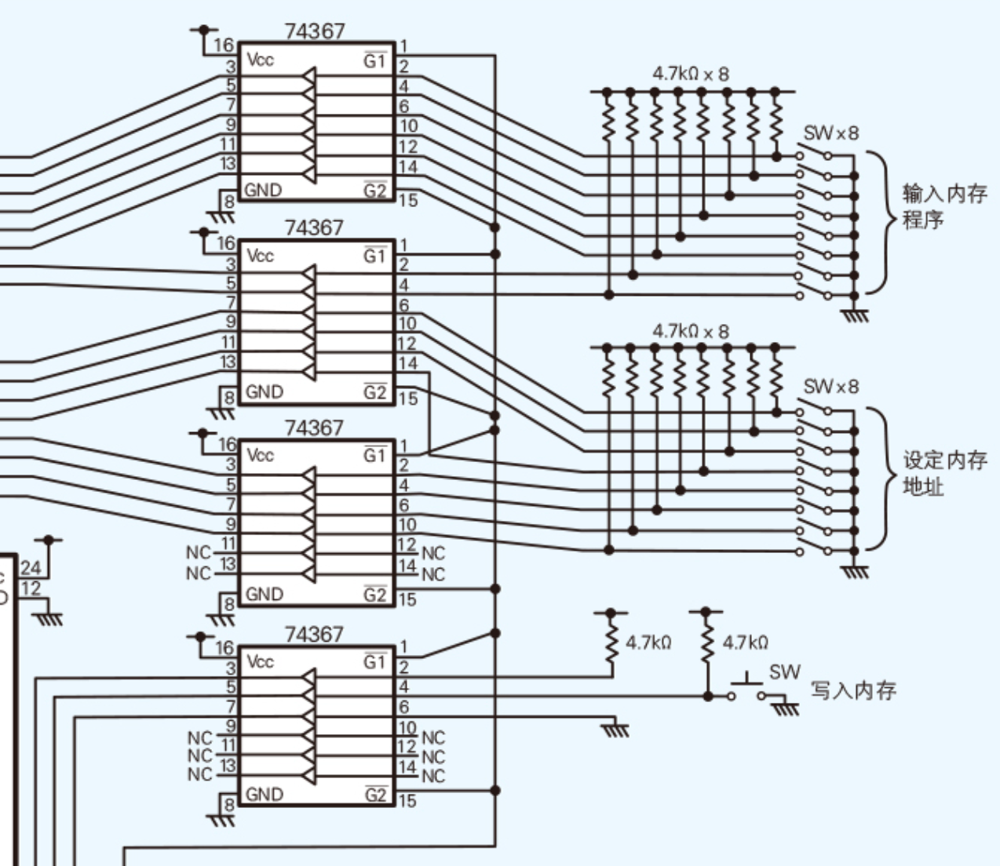

### 8. 连接 IO(输入输出) 设备

**把 PIO 上面的 portA 连接8个 bit 的输入设备.**

**PortB 连接8个小 LED 电灯泡输出.**

### 9. 输入程序, 调试

- 接通电源, 按下 CPU 的 DMA 请求, 我们要给 RAM 输入程序.
- 先设置内存地址0x00, 然后波动输入程序的 data 数据开关. 最后按下向内存写入的开关(就是第三个指拨开关, 一下子写入).
- 重复上面的三个步骤(指定 address, 搞好命令的 data, 输入), 把我们的机器码写进去.
- **按下重置 CPU 的按键开关(_RESET 触角), 程序就开始跑起来了!**

- 实例程序的功能: 波动指拨开关控制 LED 等的的亮灭.

## 三. 体验手工汇编

**机器语言:** CPU 可以直接解释, 执行的程序, 由二进制数字写出来的.

**CPU 中的 Flags Register 寄存器:** 存储指令执行后的一些状态. CPU 执行了算术运算, 逻辑运算, 比较运算...指令后, flag 寄存器不存储运算结果, 而是存储运算后的状态, 比如结果是否为0, 是否为负, 是否 overflow?

????? 这些指令结果的状态有哪些? 在寄存器里怎么存储编码的? 有什么用?

**手工汇编(hand assemble):** 使用汇编语言编写程序, 然后再把编好的程序通过手工作业转换成 CPU 可以直接执行的机器语言. 

### 1. 从程序员视角看计算机硬件

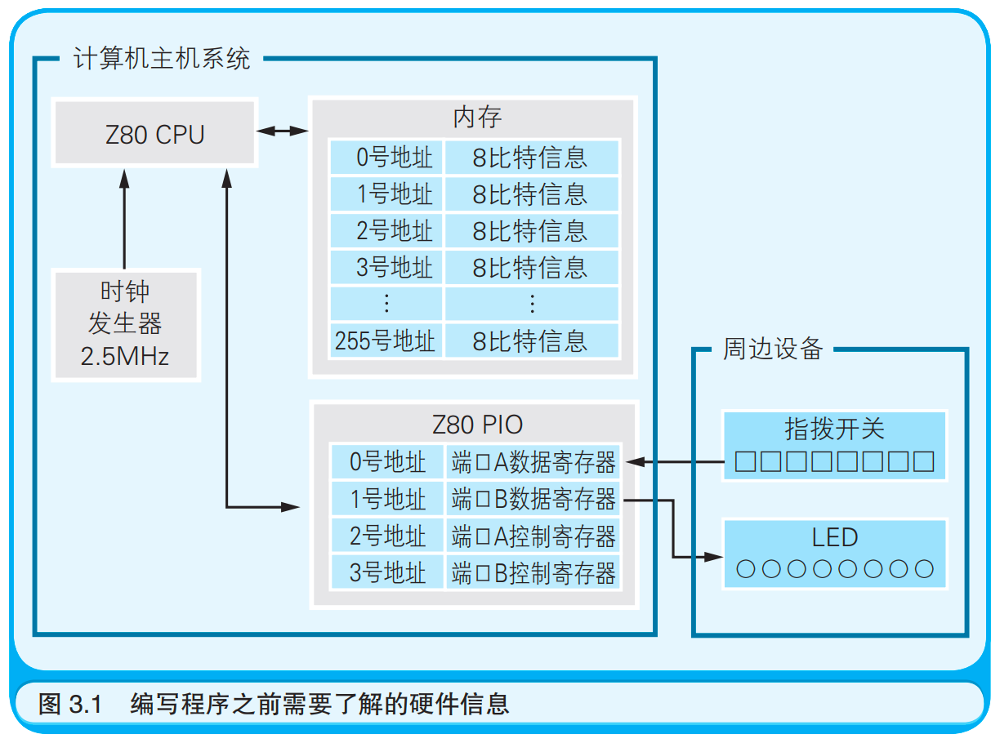

时钟周期: 最最基本的执行时间单位. 每个指令都是 N 个周期完成

内存中， 每个地址的功能都一样， 既可用于存储指令又可用于存储数据。 而 I/O 则不同， 地址编号不同（ 即寄存器的类型不同）， 功能也就不同。 这相当于有一层规定(编码), 省了指令地址了.

### 2. 汇编语言和机器语言

**汇编语言:** 用助记符表示的机器语言.

语法非常简单: 我感觉是因为 CPU 的电路就是这么一些套路.

1. **标签:** 为该行代码对应的内存地址起一个名字. 就是代码所在的一块有了名字的内存地址.

2. **操作码:** 指令, 比如: LD, OUT, IN, ADD.... **总体来说可以分为: 运算, 内存IO, I/O 三类操作码.**

3. **操作数:** 指令的对象, 比如 CPU 的寄存器, 内存地址, I/O 的地址, 或者直接给的数字, .... 

   如果一个操作码需要多个操作数, 操作数之间要用逗号隔开.

   也有不需要用操作数的操作码.比如 halt.

### 3. Z80 CPU 的寄存器结构: 寄存器是 CPU 的基本单位啊!!!(计算+存储)

CPU内部也有存储数据的电路小结构, 叫**寄存器**. 和 I/O 寄存器不同, CPU 的寄存器既能存储数据的, 还能对数据进行运算. 

不同的 CPU 会设计自己的寄存器.  Z80CPU 的寄存器有好多个, 都有自己的名字, 可以在汇编语言里当做操作数(一个对象).

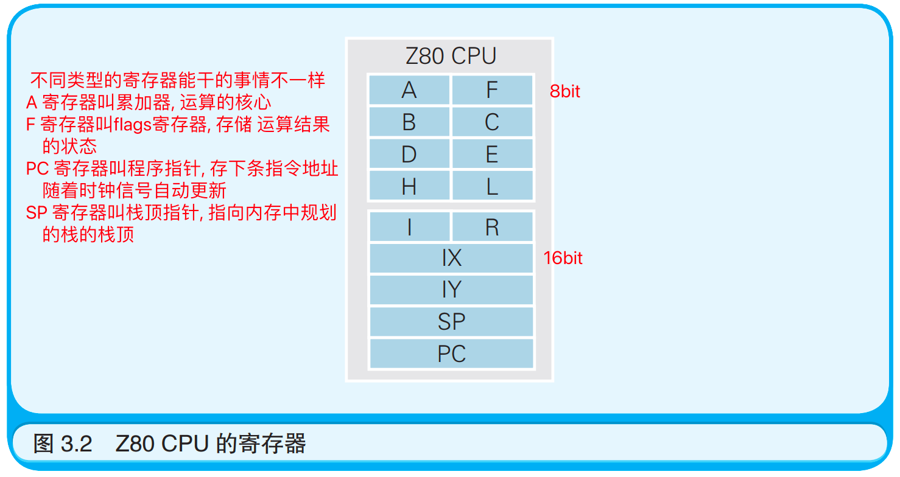

操作数是对象, 对象必须是写在寄存器的, 所以用寄存器的名字表示数据/对象. 

 所以: `OUT (2), A` 表示, Out 输出到 I/O 设备的 (2) 寄存器里面, 输出什么呢? 就是 CPU_A 寄存器里面的数据

因为PIO 这个 I/O 设备的(2)寄存器存储的是端口 A 的控制, 那么 PIO就根据数字(207, 205), 来切换 Port A 的输入输出模式

再比如: `IN A, (0)`, IN 是从 I/O 设备中输入的指令, 输入到 CPU_A 寄存器里面, 从哪里输入呢? 就从 PIO 的(0)号寄存器读取过来.

在再比如一个循环结构: `JP LOOP` JP 是一个 jump 指令, 代表下一行的指令操作,调到哪里呢? 接受一个地址标签, 就是 LOOP 这个我们已经设定好的标签, 这样我们就不用写一个具体的地址了.

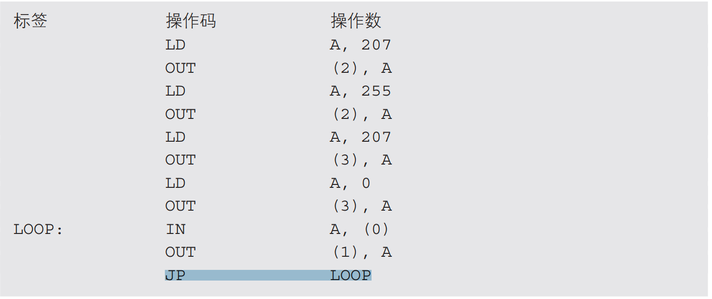

### 4. 追踪程序的运行过程- 就是看着汇编代码在脑中 debug 一下流程

汇编语言中的操作码(指令)有的对应一个字节的机器码, 有的对应多个. (我猜可能是因为电路设计吧, 一个字节表示的话电路太复杂?)

### 5. 手工汇编

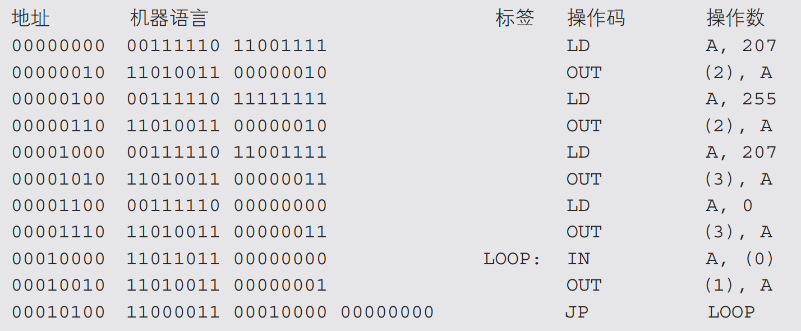

CPU 有多个计算的模式, 对应着不同的机器代码, 助记符到机器语言有很多个映射, **对照着映射把汇编语言改成机器语言就是手工汇编**

比如 `LD A, 207 `匹配上`LD A, num` 这个模式, 然后这个模式对应的机器码是: `0011110 num` 这两个 bit

地址标签忽略掉, 用真实的地址.

### 6. 尝试估算程序的执行时间

**每条汇编语言都对应着一个机器码, 这个机器码的电路实现是确定的, 需要 N 次的时钟周期也是确定的. 这样就可以把汇编语言的 CPU 时间算出来.**

使用汇编语言编程时， 因为要事无巨细地列出计算机的行为， 所以程序会变得冗长繁复。体验一下即可.

## 四. 程序像水一样流动: 程序的流程: 顺序, 条件分支和循环

> 标题的 `:` 冒号有点像解释说明的意思, 冒号前的比冒号后面的更抽象.

**Flow Chat 流程图:** 

**河流流动的三种方式:** 向一个方向流淌, 分支流淌, 漩涡循环流淌. 

​			**对应程序里面的: 顺序执行, 条件分支, 循环**

**事件驱动是什么:** 用户操作 -> 事件信号 -> 程序按照事件的分支开始执行.

### 1. 程序流程分三种: 顺序, 条件分支, 循环

程序流程, 主要靠对 PC 寄存器的操作! 因为里面存着下个指令的内存地址.

**在顺序执行的过程中,** PC 寄存器就是增加 gap(指令长度) 的递增数. 

**在条件分支和循环的过程中,** 

### 2. 用流程图表示程序的流程!!! 

圆框表示程序开始结束, 长方形就是顺序执行, 菱形◇表示条件分支, 循环就是箭头的线来表示.

**不同的语言像是对同一个程序流程图的不同方言的表示**

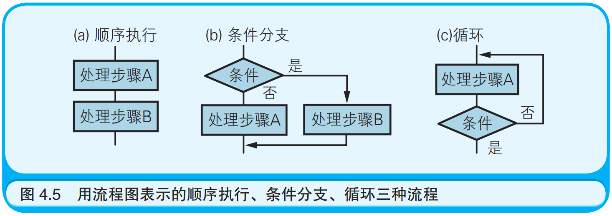

### 3. 表示循环代码块的帽子和短裤(就是在高级语言里如何表示循环)

循环: 在 CPU 执行时候, 是一个 JP 跳转命令. 在高级语言编写过程中, 用循环代码块来形象表示

### 4. 代码块 -> 结构化程序设计(只用三种程序流程的编程风格)

**结构化程序设计:** 一种编程风格: 把程序编写的具有结构性, 只用三种程序流程. **不要随便跳转JP**, 不用 GoTo

戴克斯特拉(风格提出者) 想表达的是“既然好不容易使用上了高级语言， 就别再使用相当于跳转指令的语句了。 即使不使用跳转语句，程序的所有流程仍然可以表述出来”

### 5. 画流程图来思考算法

思考算法: 先整体流程分块, 再思考各部分细节

> 我的想法: 以后看源码, 画的流程图, 也要分块. 弄成基本的单位.
>
> 程序设计是多个算法单位组合拼装起来的.

### 6. 特殊的程序流程: 中断处理(interrupt, 一种特殊的条件分支, 我们不需要写, 主板中写好了), 事件驱动(event driven)

中断处理是指计算机使程序的流程突然跳转到程序中的特定地方.

中断: CPU 中有_INT(interrupt) 和 _NMI 两个中断触角.

**中断触角连接着 I/O 设备, 中断信号之后, CPU 就知道有人输入了, 然后就跳转到中断处理程序里, 去 I/O 设备中读取数据**

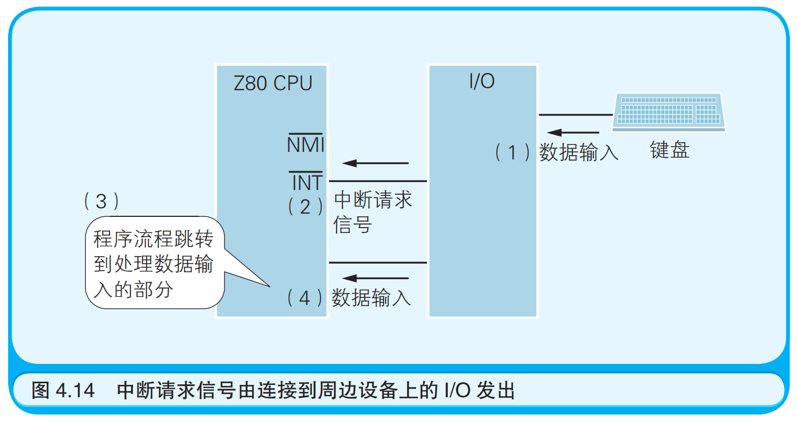

**中断(interrupt)我们不需要处理, 计算机具有硬件上处理中断的能力, 中断处理写在了 CPU 的基因(电路)里**

### 7. 特殊的程序流程: 事件驱动(event driven)

在 GUI(graphical user interface)用户界面里, 经常用事件驱动来编程. 

我感觉也是一种特殊的条件分支.

> **程序的流程还是只有顺序执行、 条件分支和循环这三种， 这**
> **一点是没有改变的。 **
>
> **顺序执行是最基本的程序流程， 这是因为CPU 中的 PC 寄存器的值会自动更新。**
>
> **条件分支和循环， 在高级语言中用程序块表示， 在机器语言和汇编语言中用跳转指令表示， 在硬件上是通过把 PC 寄存器的值设为要跳转到的目的地的内存地址来实现。**

## 五. 算法

### 1. 算法 是 程序设计的 "熟语"

仅仅囫囵吞枣地把关键词和语法记下来， 是无法流利地和计算机对话的， 可是一旦了解了算法就能将自己的想法完整地传达给计算机了。 因为算法就相当于是程序设计中的熟语.

我理解为什么要刷题了, 自己学语言, 其实没有应用, 不会有真实的项目来联系语言的使用. **算法就补上了练习使用这一个, 实际的项目就是多个算法如何构建成一个工程.**

### 要点一: 算发中解决问题的步骤, "明确"且"有限"的解决问题的步骤.

求12和42的最大公约数, 需要除2, 除3试试. 这个做法里面不叫算法, 因为不明确, 充斥着人类的"直觉".

### 要点二: 计算机不靠直觉, 而是机械的解决问题

辗转相除法, 很机械, 有终点. 这个是算法

### 4. 学会典型的算法

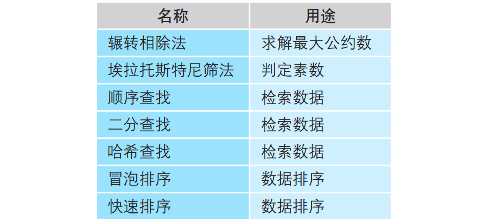

### 5. 要点四: 利用计算机的处理速度

计算机很快的, 判定 91 是否是素数， 用 91 除以 2～90这 89 个数的操作一瞬间就可以完成。 在思考算法时不防时刻记着， 解决问题时是可以利用计算机的处理速度的.

### 6. 要点五: 使用编程技巧提升程序执行速度, 减少算法的复杂度

- 举了一个哨兵的例子. 这个哨兵有点像一个 flag, 空间换时间.

### 7. 要点六: 找出数字间的规律

### 8. 要点七: 先在纸上思考算法: 画个流程图什么的

## 六. 数据结构: 是对算法的编程知识补充

程序中的变量: 是数据的容器

栈和队列的区别: 出入规则不一样, LIFO, FIFO

**数据结构:** 结合计算机的特性, 用程序表示现实中的数据结构

### 1. 变量和内存的关系

程序员不知道变量存储到内存的哪个地址上, 操作系统来组织的. 

**变量是程序中数据存储的最小单位, 每个变量都对应这一块物理内存**

### 2. 数组: 作为数据结构的基础, 反应了内存物理结构

### 4. 掌握典型数据结构的类型和概念

栈 stack: 数组实现

队列 queue: 数组实现

链表 link: 结构体实现

二叉树 tree: 结构体实现, 因为有指针了.

### 6. 掌握C 中 结构体: 把多个数据项打包, 起个名字

结构体的内存空间应该是对应的一块. 结构体数组呢就又是一大块.

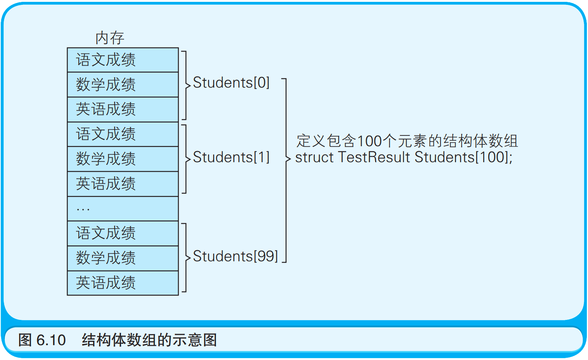

